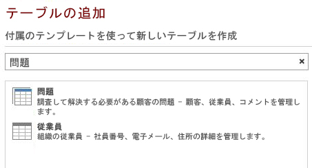
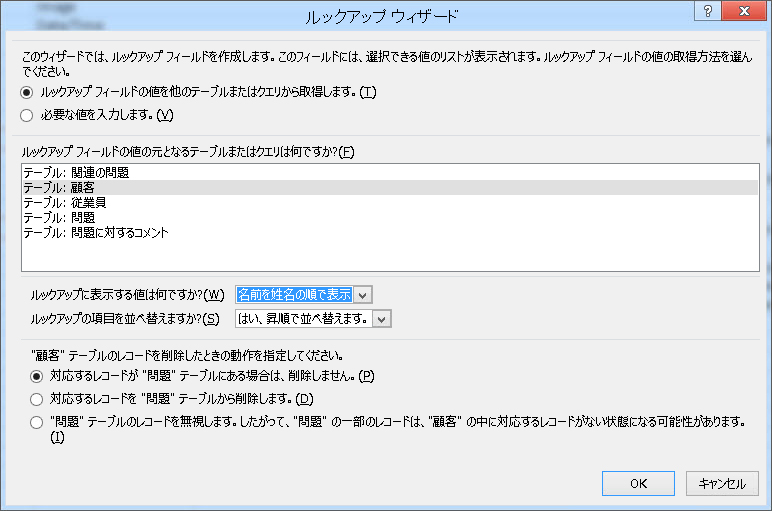
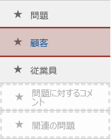
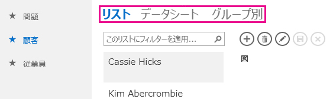
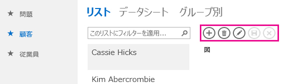
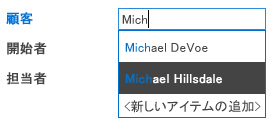
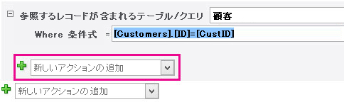
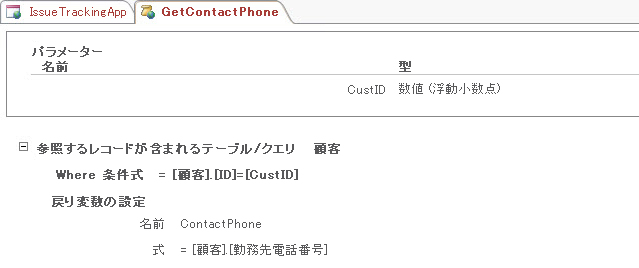
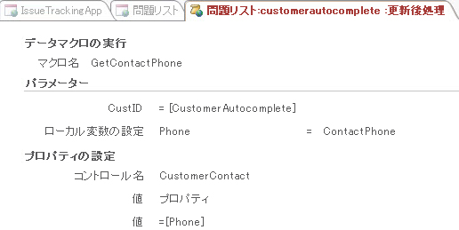
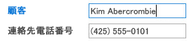

# Access で Web アプリを作成してカスタマイズする

> [!IMPORTANT]
> 現在 Microsoft では、SharePoint での Access Web アプリの作成や使用は推奨していません。代替策として、[Microsoft PowerApps](https://powerapps.microsoft.com/en-us/) を使用して、Web およびモバイル デバイス用の、コーディングが不要なビジネス ソリューションを構築することを検討してください。 
  
Access 2013を特徴付けるものとして、新しいアプリケーション モデルがあります。これにより、領域の専門家は Web ベース アプリケーションをすばやく作成できます。Access に含まれる一連のテンプレートを使用してアプリケーションの作成にすぐに着手できます。

## Access 2013 でアプリを構築するための前提条件

この例の手順に従うには、以下のものが必要です。
  
- Access
    
- SharePoint 開発環境
    
SharePoint 開発環境の設定に関する詳細については、 [SharePoint の全般的な開発環境のセットアップ](https://docs.microsoft.com/sharepoint/dev/general-development/set-up-a-general-development-environment-for-sharepoint)を参照してください。 
  
Access と SharePoint の入手方法の詳細については、「[ダウンロード](https://msdn.microsoft.com/office/apps/fp123627)」を参照してください。

## アプリを作成する

たとえば、ビジネスの問題を追跡する Access アプリを作成するとします。テーブルとビューの作成をゼロから始める前に、ニーズを満たすスキーマ テンプレートがないかどうかを探す必要があります。
  
### 問題追跡アプリを作成するには

1. Access を開いて、[ **カスタム Web アプリ**] を選択します。
    
2. アプリの名前と、Web 上のアプリの場所を入力します。[ **場所**] リストから場所を選択し、[ **作成**] を選択することもできます。
    
3. [ **検索するデータを指定してください。**] ボックスに「 **問題** 」と入力し、Enter キーを押します。 
    
   問題を追跡するのに役立つ場合があるテンプレートのリストが図 1 に示されています。
    
   **図 1。問題に関する検索に一致するテンプレート**

   
  
4. [ **問題**] を選択します。
    
Access は、一連のテーブルとビューを作成します。
  
## アプリを探索する

スキーマとビューがニーズを満たしているかどうかを確認するには、それらを調べる必要があります。
  
[問題] スキーマを選択することで作成されたテーブルがタイル ウィンドウに表示されます。[問題]、[顧客]、および [従業員] テーブルがこのアプリの中心です。[問題] テーブルには各問題の情報が格納されます。各問題は、顧客に代わって従業員によって開かれ、従業員に割り当てられます。[関連の問題] と [問題に対するコメント] テーブルは、アプリの中でサポートの役割を果たします。[関連の問題] テーブルを使用して、問題同士をリンクできます。[問題に対するコメント] テーブルには、1 つの問題に関する複数のコメントが格納されます。
  
Access デスクトップ (.accdb) データベースでは、テーブル間のリレーションシップが [ **リレーションシップ**] ウィンドウで管理されます。Access 2013 アプリでは、 **Lookup** データ型に設定されたフィールドを使用して、リレーションシップを管理します。[ **問題**] タイルを右クリックし、[ **テーブルの編集**] を選択して、[問題] テーブルのリレーションシップを調べてみましょう。
  
[ **顧客** ] フィールドは [ **顧客** ] テーブルに関連付けられています。リレーションシップを調べるには、[ **顧客** ] フィールドを選択し、[ **ルックアップ**] を選択します。図 2 のように、 **ルックアップ ウィザード**が表示されます。 
  
**図 2。[顧客] テーブルへのリレーションシップを表示するルックアップ ウィザード**

  
[ルックアップ ウィザード] ダイアログ ボックスでは、[ **顧客** ] フィールドが [ **顧客** ] テーブルにリンクされており、[ **名前を名姓の順で表示** ] フィールドが [ **顧客** ] テーブルから返されることが示されています。 
  
[ **開始者** ]、[ **担当者** ]、および [ **変更者** ] フィールドは、[ **従業員** ] テーブルに関連します。他のいくつかのフィールドも **Lookup** データ型に設定されています。この場合は、Lookup データ型を使用して、フィールド内で許容される特定の値が指定されています。 
  
[ **問題** ] テーブルを閉じて、タイル ウィンドウを調べます。図 3 のように、上の 3 つのタイル ([ **問題** ]、[ **顧客** ]、および [ **従業員** ] テーブル用のタイル) は、下の 2 つのタイル ([ **関連の問題** ] および [ **問題に対するコメント** ] テーブル用のタイル) と異なって表示されています。 
  
**図 3。[問題] スキーマのタイル ウィンドウ**

  
[ **関連の問題** ] と [ **問題に対するコメント** ] テーブルは、Web ブラウザー上で非表示とするために淡色表示になっています。 
  
このアプリを使用していくつかの問題を追跡してみましょう。これを行うには、[ **アプリの起動**] をクリックし、Web ブラウザーでアプリを開きます。 
  
アプリは、[問題] テーブルの [ **問題リスト** ] ビューを開きます。問題を開く前に、いくつかの顧客と従業員を追加することをお勧めします。[ **顧客** ] タイルをクリックし、顧客の追加を開始します。 
  
図 4 に示されているように、ビュー セレクターを使用して、[ **顧客** ] テーブルで使用可能な 3 つのビューのうちの 1 つを選択します。[ **リスト**]、[ **データシート**]、[ **グループ**] とラベル付けされているビューです。 
  
**図 4。ビュー セレクター**

  
[ **リスト**] を選択すると、[詳細を一覧表示] ビューである [ **顧客リスト** ] ビューが起動されます。[詳細を一覧表示] は、テーブルを作成するときに Access によって自動的に生成されるビューの 1 つです。[詳細を一覧表示] ビューを区別する主な機能は、ビューの左側に表示されるリスト ウィンドウです。リスト ウィンドウを使用して、ビューに含まれるレコードのフィルター処理とナビゲーションを行います。Access デスクトップ データベースで、検索可能なリスト ビューを実装するには、ユーザー設定コードを記述する必要があります。 
  
[ **データシート**] を選択すると、[ **顧客データシート** ] ビューが開きます。[データシート] は、テーブルを作成するときに Access によって自動的に生成される別の種類のビューです。[データシート] ビューは、データをスプレッドシートのような方法で簡単に入力、並べ替え、フィルター処理ができるユーザーにとって便利なビューです。 
  
[グループ] を選択すると、[概要] ビューが開きます。[概要] ビューを使用して、フィールドに基づいてレコードをグループ化できます。また、オプションで、合計や平均を計算することもできます。
  
顧客を追加する場合は、操作バーを使用して、レコードの追加、レコードの編集、レコードの保存、レコードの削除、編集の取り消しを行います。操作バーはカスタマイズ可能なツールバーであり、図 5 のように、各ビューの上部に表示されます。
  
**図 5。操作バー**

  
顧客と従業員の追加が終了した後、[問題リスト] ビューを開いて、問題の追加を開始します。顧客の名前を [顧客] ボックスに入力すると、図 6 のように、1 つ以上の顧客名が表示されます。
  
**図 6。オートコンプリート コントロール**

  
[顧客] ボックスは、オートコンプリート コントロールです。オートコンプリート コントロールでは、ボックスに入力されている内容に一致するレコードのリストが表示されます。これにより、データ入力の正確性が確保されます。
  
## アプリをカスタマイズする

ここまで、アプリについて紹介してきましたが、[問題リスト] ビューに顧客の連絡先情報が含まれていません。ここで、問題を作成するときに顧客の勤務先電話番号を [問題] テーブルに追加するように、アプリをカスタマイズしてみましょう。
  
### [問題] テーブルにフィールドを追加するには

1. Access でアプリを開きます。
    
2. [ **問題**] タイル、[ **設定/アクション**] アイコン、[ **テーブルの編集**] の順に選択します。
    
3. [ **フィールド名**] 列の最初の空白セルに「 **連絡先番号** 」と入力します。 
    
4. [ **データ型**] 列で [ **短いテキスト**] を選択します。 
    
5. [ **上書き保存**] を選択します。
    
6. [問題] テーブルを閉じます。
    
電話番号を格納するフィールドが作成されました。ここで、連絡先情報を参照するためのデータ マクロを作成しましょう。
  
### 連絡先情報を参照するためのデータ マクロを作成するには

1. [ **作成**] グループで、[ **詳細設定**]、[ **データ マクロ**] の順に選択します。
    
2. [ **パラメーターの作成**] を選択します。
    
3. [ **名前**] ボックスに「 **CustID** 」と入力します。[ **型**] ドロップダウンで、[ **数値 (浮動小数点)**] を選択します。
    
4. [ **新しいアクションの追加**] ドロップダウンから [ **レコードの参照** ] を選択します。 
    
5. [ **参照するレコードが含まれるテーブル/クエリ**] ドロップダウンで、[ **顧客** ] を選択します。 
    
6. [ **条件式**] ボックスに「 **[顧客].[ID]=[CustID]** 」と入力します。 
    
7. [ **新しいアクションの追加**] ドロップダウンから [ **戻り変数の設定** ] を選択します。 
    
    > [!NOTE]
    > [!メモ] 2 つの [ **新しいアクションの追加**] ドロップダウンが表示されます。1 つは [ **レコードの参照** ] ブロックの内側にあり、もう 1 つは [ **レコードの参照** ] ブロックの外側にあります。図 7 に示されているように、[ **レコードの参照** ] ブロックの内側にある [ **新しいアクションの追加**] ドロップダウンを選択する必要があります。 
  
   **図 7。[新しいアクションの追加] ドロップダウン**

   
  
8. [ **名前**] ボックスに「 **連絡先電話番号** 」と入力します。 
    
9. [ **式**] ボックスに「 **[顧客].[勤務先電話番号]** 」と入力します。 
    
10. [ **上書き保存**] を選択します。[ **マクロ名**] ボックスに「 **GetContactPhone** 」と入力し、[ **OK**] を選択します。
    
    マクロは、図 8 のようになります。
    
    **図 8。GetContactPhone データ マクロ**

    
  
11. マクロのデザイン ビューを閉じます。
    
これで、[ **連絡先番号** ] フィールドを [問題リスト] フォームに追加する準備ができました。 
  
### [連絡先番号] フィールドを [問題リスト] フォームに追加するには

1. [ **問題** ] テーブルを選択します。これにより、[問題リスト] フォームが選択されます。 
    
2. ビュー セレクターで [ **リスト** ] を選択し、[ **設定/アクション**] アイコン、[ **編集**] の順に選択します。
    
3. [ **フィールド リスト**] ウィンドウからフォーム上の連絡先番号の表示場所まで [ **連絡先番号** ] フィールドをドラッグします。 
    
4. [ **連絡先番号**] テキスト ボックスを選択し、[ **データ**] をクリックします。 
    
5. [ **コントロール名**] ボックスに「 **CustomerContact** 」と入力し、[ **データ**] ポップアップを閉じます。 
    
6. [ **上書き保存**] を選択します。
    
ここで、[ **勤務先電話番号** ] フィールドを [ **顧客** ] テーブルから [ **問題** ] テーブルの [ **連絡先電話番号** ] フィールドにコピーするユーザー インターフェイス (UI) マクロを記述する必要があります。マクロの記述場所として、 **CustomerAutocomplete** コントロールの **更新後処理** イベントが適しています。 
  
### AfterUpdate マクロを作成するには

1. [ **CustomerAutocomplete** ] コントロール、[ **アクション**] ボタン、[ **更新後処理**] の順に選択します。 
    
    マクロのデザイン ビューに空白のマクロが開かれます。
    
2. [ **新しいアクションの追加**] ドロップダウンから [ **データマクロの実行** ] を選択します。 
    
3. [ **マクロ名**] ドロップダウンで、[ **GetContactPhone** ] を選択します。 
    
4. [ **CustID**] ボックスに「 **[CustomerAutocomplete]** 」と入力します。 
    
5. [ **ローカル変数の設定**] ボックスに「 **電話番号** 」と入力します。 
    
    以前に作成された GetContactPhone データ マクロを選択した場合、Access によってパラメーター名が自動的に設定され、マクロの変数が返されます。
    
    顧客の電話番号は、"電話番号" という名前の変数に格納されます。
    
6. [ **新しいアクションの追加**] ドロップダウンから [ **プロパティの設定** ] を選択します。 
    
7. [ **コントロール名**] ボックスに「 **CustomerContact** 」と入力します。 
    
8. [ **プロパティ**] ドロップダウンで、[ **値** ] を選択します。 
    
9. [ **値**] ボックスに「 **=[Phone]** 」と入力します。 
    
10. [ **上書き保存**] を選択します。
    
    マクロは、図 9 のようになります。
    
    **図 9。更新後処理マクロ**

    
  
11. マクロのデザイン ビューを閉じます。
    
12. [問題リスト] ビューを閉じます。変更内容の保存を求めるプロンプトが表示された場合、[ **はい**] を選択します。 
    
カスタマイズをテストする準備ができました。 [ **アプリの起動**] をクリックして、Web ブラウザーでアプリを開いて、新しい問題を追加します。 **連絡先番号**] ボックスは、図 10 に示すように、顧客名を入力した後に自動的を更新します。 
  
**図 10。電話番号が更新された [問題] ビュー**

  
## 終わりに

Access Web アプリの作成にすぐに着手するには、 に含まれるスキーマ テンプレートの 1 つを使用することをお勧めします。自動的に作成されるビューには、Access デーストップ データベースへの実装にユーザー設定コードが必要とされる高度な機能が含まれています。 
  
## 関連項目

- [開発者へのアクセスの新機能](https://msdn.microsoft.com/library/df778f51-d65e-4c30-b618-65003ceb39b3%28Office.15%29.aspx) 
- [Access カスタム Web アプリ リファレンス](access-custom-web-app-reference.md)
  

