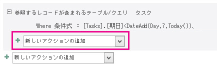
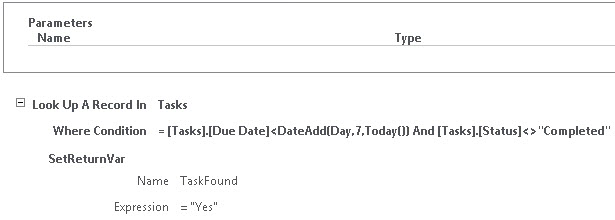
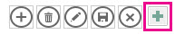
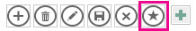
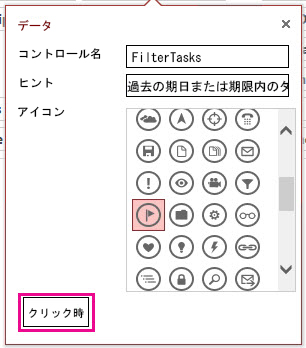
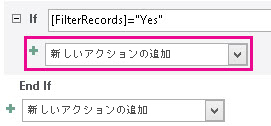
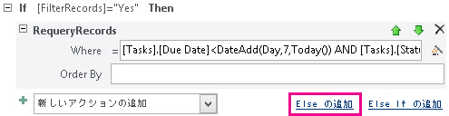
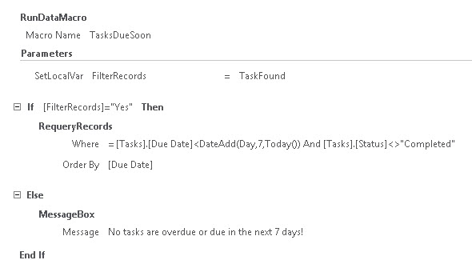

# <a name="filter-a-view-by-using-a-macro-in-an-access-app"></a><span data-ttu-id="c6402-103">Access アプリでマクロを使用してビューをフィルター処理する</span><span class="sxs-lookup"><span data-stu-id="c6402-103">Filter a view by using a macro in an Access app</span></span>

<span data-ttu-id="c6402-104">RequeryRecords マクロ アクションおよびデータ マクロを使用して Access アプリでビューをフィルター処理する方法について説明します。</span><span class="sxs-lookup"><span data-stu-id="c6402-104">Learn how to filter a view in an Access app by using the RequeryRecords macro action and a data macro.</span></span>
  
> [!IMPORTANT]
> <span data-ttu-id="c6402-p101">マイクロソフトを作成して、sharepoint web アプリケーションのアクセスを使用して不要になったをお勧めします。代わりに、web およびモバイル デバイス用のコードのないビジネス ソリューションを構築する[マイクロソフトの PowerApps](https://powerapps.microsoft.com/en-us/)を使用して検討してください。</span><span class="sxs-lookup"><span data-stu-id="c6402-p101">Microsoft no longer recommends creating and using Access web apps in SharePoint. As an alternative, consider using [Microsoft PowerApps](https://powerapps.microsoft.com/en-us/) to build no-code business solutions for the web and mobile devices.</span></span> 

<span data-ttu-id="c6402-p102">Access アプリの既定のリスト ビューを使用すると、フィールドに含まれている値の問題をフィルター処理できます。値の一致ではなく、一連の条件に基づいてビューをフィルターする状況も考えられます。そのためには、マクロを作成する必要があります。この記事では、ビューをフィルター処理して、期限を過ぎているタスク、または次の 7 日以内が期限のタスクをフィルター処理するマクロを作成する方法を示します。</span><span class="sxs-lookup"><span data-stu-id="c6402-p102">The default list view in an Access app enables you to filter the issues on values that are contained in the fields. There may be instances where you'd like to filter a view based on a set of conditions instead of by matching a value. To do that you must create a macro. This article shows you how to create a macro that filter a view to display tasks that are past due or due in the next 7 days.</span></span>
  
## <a name="prerequisites-for-building-an-app-with-access"></a><span data-ttu-id="c6402-111">Access でアプリを構築するための前提条件</span><span class="sxs-lookup"><span data-stu-id="c6402-111">Prerequisites for building an app with Access</span></span>
<span data-ttu-id="c6402-112"><a name="Access2013FilterViewByUsingMacro_Prerequisites"> </a></span><span class="sxs-lookup"><span data-stu-id="c6402-112"></span></span>

<span data-ttu-id="c6402-113">この例の手順を実行するには、次のものが必要です。</span><span class="sxs-lookup"><span data-stu-id="c6402-113">To follow the steps in this example, you need:</span></span>
  
- <span data-ttu-id="c6402-114">Access 2013</span><span class="sxs-lookup"><span data-stu-id="c6402-114">Access 2013</span></span>
- <span data-ttu-id="c6402-115">SharePoint 2013 開発環境</span><span class="sxs-lookup"><span data-stu-id="c6402-115">A SharePoint 2013 development environment</span></span>
    
> [!NOTE]
> <span data-ttu-id="c6402-p103">[!メモ]  SharePoint 開発環境のセットアップの詳細については、「 [SharePoint 2013 の一般的な開発環境の設定](http://msdn.microsoft.com/library/08e4e4e1-d960-43fa-85df-f3c279ed6927%28Office.15%29.aspx)」を参照してください。 >  Access 2013および SharePoint 2013の取得方法の詳細については、「 [ダウンロード](http://msdn.microsoft.com/en-US/office/apps/fp123627)」を参照してください</span><span class="sxs-lookup"><span data-stu-id="c6402-p103">For more information about setting up your SharePoint development environment, see [Set up a general development environment for SharePoint 2013](http://msdn.microsoft.com/library/08e4e4e1-d960-43fa-85df-f3c279ed6927%28Office.15%29.aspx). >  For more information about obtaining Access 2013 and SharePoint 2013, see [Downloads](http://msdn.microsoft.com/en-US/office/apps/fp123627).</span></span> 
  
## <a name="create-the-app"></a><span data-ttu-id="c6402-118">アプリを作成する</span><span class="sxs-lookup"><span data-stu-id="c6402-118">Create the app</span></span>
<span data-ttu-id="c6402-119"><a name="Access2013FilterViewByUsingMacro_CreateApp"> </a></span><span class="sxs-lookup"><span data-stu-id="c6402-119"></span></span>

<span data-ttu-id="c6402-p104">たとえば、ビジネスのタスクを追跡する Access アプリを作成するとします。テーブルとビューの作成を始める前に、スキーマ テンプレートがないかどうかを探す必要があります。</span><span class="sxs-lookup"><span data-stu-id="c6402-p104">Suppose you want to create an Access app that tracks tasks for your business. Before you start creating the tables and view, you should search for a schema template.</span></span>
  
### <a name="to-create-the-task-tracking-app"></a><span data-ttu-id="c6402-122">タスク追跡アプリを作成するには</span><span class="sxs-lookup"><span data-stu-id="c6402-122">To create the task tracking app</span></span>

1. <span data-ttu-id="c6402-123">Access を開いて、[ **カスタム Web アプリ**] を選択します。</span><span class="sxs-lookup"><span data-stu-id="c6402-123">Open Access and choose **Custom web app**.</span></span>
    
2. <span data-ttu-id="c6402-p105">アプリの名前と、Web 上のアプリの場所を入力します。[ **場所**] リストから場所を選択し、[ **作成**] を選択することもできます。</span><span class="sxs-lookup"><span data-stu-id="c6402-p105">Enter a name and the web location for your app. You can also choose a location from the **Locations** list and choose **Create**.</span></span>
    
3. <span data-ttu-id="c6402-126">[ **検索**] ボックスに「 **タスク** 」と入力し、Enter キーを押します。</span><span class="sxs-lookup"><span data-stu-id="c6402-126">Type **tasks** into the **Search** box and then press ENTER.</span></span> 
    
    <span data-ttu-id="c6402-127">タスクを追跡するのに役立つ可能性があるテンプレートのリストが図 1 に示されています。</span><span class="sxs-lookup"><span data-stu-id="c6402-127">A list of templates that might be useful for tracking tasks is displayed in Figure 1.</span></span>
    
   <span data-ttu-id="c6402-128">**図 1. タスクに関する検索に一致するテンプレート**</span><span class="sxs-lookup"><span data-stu-id="c6402-128">**Figure 1. Templates that match the search for tasks**</span></span>

   <span data-ttu-id="c6402-129"></span><span class="sxs-lookup"><span data-stu-id="c6402-129"></span></span>
  
4. <span data-ttu-id="c6402-130">[ **タスク**] を選択します。</span><span class="sxs-lookup"><span data-stu-id="c6402-130">Choose **Tasks**.</span></span>
    
<span data-ttu-id="c6402-131">Access は、一連のテーブルとビューを作成します。</span><span class="sxs-lookup"><span data-stu-id="c6402-131">Access creates a set of tables and views.</span></span>
  
<span data-ttu-id="c6402-p106">アプリに、いくつかのサンプル タスクと社員を入力します。そのためには、[ **アプリの起動**] を選択して、Web ブラウザーでアプリを開きます。各タスクの [ **期限** ] フィールドに値を入力します。完了したら、Access に戻ります。</span><span class="sxs-lookup"><span data-stu-id="c6402-p106">Enter several sample tasks and employees in your app. To do this, choose **Launch App** to open the app in your web browser. Enter a value in the **Due Date** field for each task. Return to Access when you're done.</span></span> 
  
## <a name="plan-the-customizations"></a><span data-ttu-id="c6402-136">カスタマイズを計画する</span><span class="sxs-lookup"><span data-stu-id="c6402-136">Plan the customizations</span></span>
<span data-ttu-id="c6402-137"><a name="Access2013FilterViewByUsingMacro_PlanCustomizations"> </a></span><span class="sxs-lookup"><span data-stu-id="c6402-137"></span></span>

<span data-ttu-id="c6402-p107">これで、アプリにはいくつかのタスクが含まれました。既定のビューでは、ビューに表示されているフィールドに格納されている項目を使用してタスクを検索できます。たとえば、優先度の高い問題や、進行中の問題を検索できます。来週が期限のアクティブな問題を表示して、作業の優先度を設定するとします。そのためには、ユーザー インターフェイス (UI) マクロを作成する必要があります。</span><span class="sxs-lookup"><span data-stu-id="c6402-p107">You now have an app that contains several tasks. The default view enables you to search for any tasks using items that are stored in the fields displayed in the view. For example, you can search for high-priority issues or issues in progress. Suppose you want to prioritize your work by displaying active issues that are due in the coming week. To do this, you should create a user interface (UI) macro.</span></span>
  
<span data-ttu-id="c6402-143">ビューをフィルター処理に使用できる UI マクロ コマンドは、 [RequeryRecords マクロのアクション (カスタム web アプリケーションのアクセス)](requeryrecords-macro-action-access-custom-web-app.md)です。</span><span class="sxs-lookup"><span data-stu-id="c6402-143">The UI macro command that you can use to filter the view is the [RequeryRecords Macro Action (Access custom web app)](requeryrecords-macro-action-access-custom-web-app.md).</span></span> <span data-ttu-id="c6402-144">**RequeryRecords** マクロ アクションは、SQL WHERE 句の形式で用意されている  *Where*  引数に基づいてビューをフィルター処理します。</span><span class="sxs-lookup"><span data-stu-id="c6402-144">The **RequeryRecords** macro action filters the view based on the  *Where*  argument, which is provided in the form of a SQL WHERE clause.</span></span> <span data-ttu-id="c6402-145">ビューをフィルター処理するには、特定の形式で複数の情報を指定する必要があります。</span><span class="sxs-lookup"><span data-stu-id="c6402-145">To filter the view, you must supply several facts in a specific format to filter the view.</span></span> 
  
<span data-ttu-id="c6402-146">関連のある情報は次のとおりです。</span><span class="sxs-lookup"><span data-stu-id="c6402-146">The relevant facts are:</span></span>
  
- <span data-ttu-id="c6402-147">比較する 1 つ以上のフィールド</span><span class="sxs-lookup"><span data-stu-id="c6402-147">The field or fields to compare</span></span>
    
- <span data-ttu-id="c6402-148">今日の日付を参照する方法</span><span class="sxs-lookup"><span data-stu-id="c6402-148">How to refer to today's date</span></span>
    
- <span data-ttu-id="c6402-149">今日の日付に関連する特定の日付を参照する方法</span><span class="sxs-lookup"><span data-stu-id="c6402-149">How to refer to a particular day relative to today's date</span></span>
    
- <span data-ttu-id="c6402-150">進行中のタスクを確認する方法</span><span class="sxs-lookup"><span data-stu-id="c6402-150">How to determine which on tasks are in progress</span></span>
    
<span data-ttu-id="c6402-151">[ **期限** ] フィールドは、タスクの期限に関する情報を提供します。</span><span class="sxs-lookup"><span data-stu-id="c6402-151">The **Due Date** field provides information about when a task is due.</span></span> <span data-ttu-id="c6402-152">[ **ステータス** ] フィールドは、各タスクに関するステータス情報を提供します。</span><span class="sxs-lookup"><span data-stu-id="c6402-152">The **Status** field provides status information about each task.</span></span> <span data-ttu-id="c6402-153">マクロ内のフィールドを参照するには、 **[*テーブル名*] の形式を使用します [。*フィールド名*]**。</span><span class="sxs-lookup"><span data-stu-id="c6402-153">To refer to a field in a macro, use the format **[*TableName*].[*FieldName*]**.</span></span> <span data-ttu-id="c6402-154">**[タスク] を使用します [。期日]** の**期限**] フィールドと [タスク] の**を参照します [。状態]** に **[ステータス**] フィールドを参照してください。</span><span class="sxs-lookup"><span data-stu-id="c6402-154">Use **[Tasks].[Due Date]** to refer to the **Due Date** field and **[Tasks].[Status]** to refer to the **Status** field.</span></span> 
  
<span data-ttu-id="c6402-155">[Today 関数 (カスタム web アプリケーションのアクセス)](today-function-access-custom-web-app.md)の関数では、今日の日付を返します。</span><span class="sxs-lookup"><span data-stu-id="c6402-155">The [Today Function (Access custom web app)](today-function-access-custom-web-app.md) function returns today's date.</span></span> <span data-ttu-id="c6402-156">[DateAdd 関数 (カスタム web アプリケーションのアクセス)](dateadd-function-access-custom-web-app.md)関数は、指定の日数を指定した日付以降後の日付の計算に使用できます。</span><span class="sxs-lookup"><span data-stu-id="c6402-156">The [DateAdd Function (Access custom web app)](dateadd-function-access-custom-web-app.md) function can be used to calculate a date that's a certain number of days after a specified date.</span></span> 
  
<span data-ttu-id="c6402-p111">[ **ステータス** ] フィールドには、いくつかの可能な日が含まれます。値 **Completed** は、タスクがアクティブでなくなったことを示します。</span><span class="sxs-lookup"><span data-stu-id="c6402-p111">The **Status** field contains several possible values. A value of **Completed** indicates that the task is no longer active.</span></span> 
  
<span data-ttu-id="c6402-159">これらの情報は、次の SQL の WHERE 句に組み合わせることができます。</span><span class="sxs-lookup"><span data-stu-id="c6402-159">These facts can be combined into the following SQL WHERE clause.</span></span>
  
```sql
[Tasks].[Due Date]<DateAdd(Day,7,Today()) AND [Tasks].[Status]<>"Completed"
```

<span data-ttu-id="c6402-160">この SQL WHERE 句はマクロで使用し、ビューをフィルター処理して、次の 7 日以内が期限のアクティブな問題、または期限が過ぎているアクティブな問題を表示できます。</span><span class="sxs-lookup"><span data-stu-id="c6402-160">This SQL WHERE clause is used in the macro to filter the view to display active issues that are due in the next 7 days or are past due.</span></span>
  
<span data-ttu-id="c6402-p112">UI マクロを実行するには、ビューで発生する項目またはイベントにそのマクロが割り当てられている必要があります。 **操作バー** は、ビューにカスタム コマンドを追加するための便利な場所です。 **操作バー** はカスタマイズ可能なツールバーで、各ビューの上部に表示されます。既定では、 **操作バー** には追加、編集、保存、削除、および編集の取り消しを行うためのボタンが含まれます。ビューのフィルター処理など、カスタム アクションを実行するボタンを追加できます。</span><span class="sxs-lookup"><span data-stu-id="c6402-p112">To run the UI macro, it must be attached to an item or an event that occurs in the view. The **Action Bar** is a convenient place to add a custom command to the view. The **Action Bar** is a customizable toolbar that appears at the top of each view. By default, the **Action Bar** contains buttons to add, edit, save, delete, and cancel edits. You can add buttons that perform custom actions, such as filtering the view.</span></span> 
  
<span data-ttu-id="c6402-p113">指定された条件を満たすレコードがビューに含まれている場合、 **RequeryRecords** はビューをフィルター処理します。ただし、条件を満たすレコードがビューに含まれていない場合、新しい空のレコードが表示されます。次の週が期限であるタスクがない場合に空のレコードを表示しない場合は、 **RequeryRecords** マクロ アクションを呼び出す前にタスクを確認するメソッドを見つける必要があります。そのためには、条件を満たすレコードを確認するデータ マクロを作成します。</span><span class="sxs-lookup"><span data-stu-id="c6402-p113">If the view contains records that meet the specified criteria, then **RequeryRecords** filters the view. However, if the view doesn't contain any records that meet the criteria, than a new, blank record is displayed. If you don't want a blank record to be displayed if no tasks are due in the next week, then you must find a method to check the tasks before you call the **RequeryRecords** macro action. To do this, create a data macro to check for records that meet the criteria.</span></span> 
  
<span data-ttu-id="c6402-p114">UI マクロは、次の週が期限であるタスクの検索を試みるデータ マクロを呼び出します。データ マクロは、タスクを見つけるとアプリをカスタマイズします。</span><span class="sxs-lookup"><span data-stu-id="c6402-p114">The UI macro will call the data macro, which will try to find a task that's due in the next week. If the data macro finds the task then customize the app.</span></span>
  
## <a name="customize-the-app"></a><span data-ttu-id="c6402-172">アプリをカスタマイズする</span><span class="sxs-lookup"><span data-stu-id="c6402-172">Customize the app</span></span>
<span data-ttu-id="c6402-173"><a name="Access2013FilterViewByUsingMacro_CustomizeApp"> </a></span><span class="sxs-lookup"><span data-stu-id="c6402-173"></span></span>

<span data-ttu-id="c6402-p115">これでカスタマイズを決定したので、それらを実装します。最初にデータ マクロを作成します。一部のデータ マクロはテーブルに直接割り当てられます。ただし、このデータ マクロはスタンドアロンのデータ マクロです。</span><span class="sxs-lookup"><span data-stu-id="c6402-p115">Now that you've determined the customizations, implement them. The data macro should be created first. Some data macros are attached directly to tables. However, this data macro is a stand-alone data macro.</span></span>
  
### <a name="to-create-the-data-macro"></a><span data-ttu-id="c6402-178">データ マクロを作成するには</span><span class="sxs-lookup"><span data-stu-id="c6402-178">To create the data macro</span></span>

1. <span data-ttu-id="c6402-179">Access でアプリを開きます。</span><span class="sxs-lookup"><span data-stu-id="c6402-179">Open the app in Access.</span></span>
    
2. <span data-ttu-id="c6402-180">[ **作成**] グループで、[ **詳細設定**]、[ **データ マクロ**] の順に選択します。</span><span class="sxs-lookup"><span data-stu-id="c6402-180">In the **Create** group, choose **Advanced**, and then choose **Data Macro**.</span></span>
    
    <span data-ttu-id="c6402-181">マクロのデザイン ビューに空白のデータ マクロが開かれます。</span><span class="sxs-lookup"><span data-stu-id="c6402-181">A blank data macro is opened in macro Design View.</span></span>
    
3. <span data-ttu-id="c6402-182">[ **新しいアクションの追加**] リスト ボックスから [ **レコードの参照**] を選択します。</span><span class="sxs-lookup"><span data-stu-id="c6402-182">From the **Add New Action** list box, choose **LookupRecord**.</span></span>
    
4. <span data-ttu-id="c6402-183">[ **参照するレコードが含まれるテーブル/クエリ**] リスト ボックスで、[ **タスク**] を選択します。</span><span class="sxs-lookup"><span data-stu-id="c6402-183">In the **Look Up A Record In** list box, choose **Tasks**.</span></span>
    
5. <span data-ttu-id="c6402-184">[ **条件式**] ボックスに「 **[タスク].[期限]\<DateAdd(Day,7,Today()) AND [タスク].[ステータス]\<\>"Completed"** 」と入力します。</span><span class="sxs-lookup"><span data-stu-id="c6402-184">In the **Where Condition** box, enter **[Tasks].[Due Date]\<DateAdd(Day,7,Today()) AND [Tasks].[Status]\<\>"Completed"**.</span></span> 
    
6. <span data-ttu-id="c6402-185">[ **新しいアクションの追加**] リスト ボックスから [ **戻り変数の設定**] を選択します。</span><span class="sxs-lookup"><span data-stu-id="c6402-185">Choose **SetReturnVar** from the **Add New Action** list box.</span></span> 
    
    > [!NOTE]
    > <span data-ttu-id="c6402-p116">[!メモ] 2 つの [ **新しいアクションの追加**] リスト ボックスが表示されます。1 つは [ **レコードの参照** ] ブロックの内側にあり、もう 1 つは [ **レコードの参照** ] ブロックの外側にあります。図 1 に示されているように、[ **レコードの参照** ] ブロックの内側にある [ **新しいアクションの追加**] リスト ボックスを選択する必要があります。</span><span class="sxs-lookup"><span data-stu-id="c6402-p116">You'll see two **Add New Action** list boxes, one within the **LookupRecord** block, and another outside the **LookupRecord** block. You should choose the **Add New Action** list box within the **LookupRecord** block, as shown in Figure 1.</span></span> 
  
   <span data-ttu-id="c6402-188">**図 1. [新しいアクションの追加] リスト ボックス**</span><span class="sxs-lookup"><span data-stu-id="c6402-188">**Figure 1. Add New Action list box**</span></span>

   <span data-ttu-id="c6402-189"></span><span class="sxs-lookup"><span data-stu-id="c6402-189"></span></span>
  
7. <span data-ttu-id="c6402-190">[ **名前**] ボックスに「 **TaskFound** 」と入力します。</span><span class="sxs-lookup"><span data-stu-id="c6402-190">In the **Name** box, enter **TaskFound**.</span></span> 
    
8. <span data-ttu-id="c6402-191">[ **式**] ボックスに「 **はい** 」と入力します。</span><span class="sxs-lookup"><span data-stu-id="c6402-191">In the **Expression** box, enter **"Yes"**.</span></span> 
    
9. <span data-ttu-id="c6402-p117">[ **上書き保存**] を選択します。[ **マクロ名**] ボックスに「 **TaskDueSoon** 」と入力し、[ **OK**] を選択します。</span><span class="sxs-lookup"><span data-stu-id="c6402-p117">Choose **Save**. Enter **TasksDueSoon** in the **Macro Name** box and then choose **OK**.</span></span>
    
    <span data-ttu-id="c6402-194">マクロは、図 2 のようになります。</span><span class="sxs-lookup"><span data-stu-id="c6402-194">The macro should resemble the macro shown in Figure 2.</span></span>
    
   <span data-ttu-id="c6402-195">**図 2. TaskDueSoon データ マクロ**</span><span class="sxs-lookup"><span data-stu-id="c6402-195">**Figure 2. TasksDueSoon data macro**</span></span>

   <span data-ttu-id="c6402-196"></span><span class="sxs-lookup"><span data-stu-id="c6402-196"></span></span>
  
10. <span data-ttu-id="c6402-197">マクロのデザイン ビューを閉じます。</span><span class="sxs-lookup"><span data-stu-id="c6402-197">Close macro Design View.</span></span>
    
<span data-ttu-id="c6402-198">これで、操作バーにカスタム ボタンを追加する準備ができました。</span><span class="sxs-lookup"><span data-stu-id="c6402-198">Now, we're ready to add a custom button to the Action Bar.</span></span>
  
### <a name="to-add-a-custom-button-to-the-action-bar"></a><span data-ttu-id="c6402-199">操作バーにカスタム ボタンを追加するには</span><span class="sxs-lookup"><span data-stu-id="c6402-199">To add a custom button to the Action Bar</span></span>

1. <span data-ttu-id="c6402-p118">[ **タスク** ] テーブルを選択します。これにより、[タスク リスト] フォームが選択されます。</span><span class="sxs-lookup"><span data-stu-id="c6402-p118">Choose the **Tasks** table. This chooses the Tasks List form.</span></span> 
    
2. <span data-ttu-id="c6402-202">ビュー セレクターで [ **リスト** ] を選択し、[ **設定/アクション**] アイコン、[ **編集**] の順に選択します。</span><span class="sxs-lookup"><span data-stu-id="c6402-202">In the View selector, choose **List**, choose the **Settings/Action** icon, and then choose **Edit**.</span></span>
    
    <span data-ttu-id="c6402-203">ビューは、デザイン ビューで開かれます。</span><span class="sxs-lookup"><span data-stu-id="c6402-203">The view is opened in Design View.</span></span>
    
3. <span data-ttu-id="c6402-p119">これで、操作バーにカスタム ボタンを追加する準備ができました。そのためには、図 3 に示すように [ **ユーザー設定操作の追加**] を選択します。</span><span class="sxs-lookup"><span data-stu-id="c6402-p119">Now, we're ready to add a custom button to the Action Bar. To do this, choose **Add custom action** as shown in Figure 3.</span></span> 
    
   <span data-ttu-id="c6402-206">**図 3. [ユーザー設定操作の追加] ボタン**</span><span class="sxs-lookup"><span data-stu-id="c6402-206">**Figure 3. Add custom action button**</span></span>

   <span data-ttu-id="c6402-207"></span><span class="sxs-lookup"><span data-stu-id="c6402-207"></span></span>
  
    <span data-ttu-id="c6402-208">図 4 に示すように、新しい操作が、星型のアイコンが付いたボタンとして表示されます。</span><span class="sxs-lookup"><span data-stu-id="c6402-208">The new action is displayed as a button with a star icon as shown in Figure 4.</span></span>
    
   <span data-ttu-id="c6402-209">**図 4. 新しい操作バー ボタン**</span><span class="sxs-lookup"><span data-stu-id="c6402-209">**Figure 4. New Action Bar button**</span></span>

   <span data-ttu-id="c6402-210"></span><span class="sxs-lookup"><span data-stu-id="c6402-210"></span></span>
  
4. <span data-ttu-id="c6402-211">カスタムの操作バー ボタンを選択し、[ **データ**] アイコンを選択します。</span><span class="sxs-lookup"><span data-stu-id="c6402-211">Choose the custom Action Bar Button, and then choose the **Data** icon.</span></span> 
    
    <span data-ttu-id="c6402-212">[ **データ**] ダイアログ ボックスが表示されます。</span><span class="sxs-lookup"><span data-stu-id="c6402-212">The **Data** dialog box appears.</span></span> 
    
5. <span data-ttu-id="c6402-213">[ **コントロール名**] ボックスに「 **FilterTasks** 」と入力します。</span><span class="sxs-lookup"><span data-stu-id="c6402-213">In the **Control Name** box, enter **FilterTasks**.</span></span> 
    
6. <span data-ttu-id="c6402-214">[ **ツールヒント**] ボックスに、「 **期限が過ぎたタスクまたは次の週が期限のタスクを表示します** 」と入力します。</span><span class="sxs-lookup"><span data-stu-id="c6402-214">In the **Tooltip** box, enter **Display tasks past due or due in the next week**.</span></span> 
    
<span data-ttu-id="c6402-215">これで、ビューをフィルター処理する UI マクロを作成する準備ができました。</span><span class="sxs-lookup"><span data-stu-id="c6402-215">Now, we're ready to create the UI macro that will filter the view.</span></span>
  
### <a name="to-create-the-ui-macro-to-filter-the-view"></a><span data-ttu-id="c6402-216">ビューをフィルター処理する UI マクロを作成するには</span><span class="sxs-lookup"><span data-stu-id="c6402-216">To create the UI macro to filter the view</span></span>

1. <span data-ttu-id="c6402-217">[ **データ**] ダイアログ ボックスで、図 5 に示すように [ **クリック時**] を選択します。</span><span class="sxs-lookup"><span data-stu-id="c6402-217">In the **Data** dialog box, choose **On Click** as shown in Figure 5.</span></span> 
    
   <span data-ttu-id="c6402-218">**図 5. [データ] ダイアログ ボックス**</span><span class="sxs-lookup"><span data-stu-id="c6402-218">**Figure 5. Data dialog box**</span></span>

   <span data-ttu-id="c6402-219">![データ] ダイアログ ボックス](media/odc_Access2013_FilterFormByUsingMacro_Figure05.jpg "データ] ダイアログ ボックス")</span><span class="sxs-lookup"><span data-stu-id="c6402-219"></span></span>
  
    <span data-ttu-id="c6402-220">マクロのデザイン ビューに空白の UI マクロが開かれます。</span><span class="sxs-lookup"><span data-stu-id="c6402-220">A blank UI macro is opened in macro Design View.</span></span>
    
2. <span data-ttu-id="c6402-221">[ **新しいアクションの追加**] リスト ボックスから [ **データマクロの実行** ] を選択します。</span><span class="sxs-lookup"><span data-stu-id="c6402-221">From the **Add New Action** list box, choose **RunDataMacro**.</span></span> 
    
3. <span data-ttu-id="c6402-222">[マクロ名] ボックスに「 **TasksDueSoon** 」と入力します。</span><span class="sxs-lookup"><span data-stu-id="c6402-222">In the Macro Name box, enter **TasksDueSoon**.</span></span> 
    
    <span data-ttu-id="c6402-223">[ **ローカル変数の設定**] ボックスに「 **FilterRecords** 」と入力します。</span><span class="sxs-lookup"><span data-stu-id="c6402-223">In the **SetLocalVar** box, enter **FilterRecords**.</span></span> 
    
    <span data-ttu-id="c6402-224">**データマクロの実行** アクションは、以前に作成した **TasksDueSoon** データ マクロを呼び出し、その結果を **FilterRecords** という名前の変数に格納します。</span><span class="sxs-lookup"><span data-stu-id="c6402-224">The **RunDataMacro** action calls the **TasksDueSoon** data macro we created earlier and stores its result in a variable named **FilterRecords**.</span></span> 
    
4. <span data-ttu-id="c6402-225">[ **新しいアクションの追加**] リスト ボックスから [ **If** ] を選択します。</span><span class="sxs-lookup"><span data-stu-id="c6402-225">From the **Add New Action** list box, choose **If**.</span></span> 
    
5. <span data-ttu-id="c6402-226">[ **条件**] ボックスに、「 **[FilterRecords]="Yes"** 」と入力します。</span><span class="sxs-lookup"><span data-stu-id="c6402-226">In the **If** box, enter **[FilterRecords]="Yes"**.</span></span> 
    
6. <span data-ttu-id="c6402-227">[ **新しいアクションの追加**] リスト ボックスから [ **レコードの再クエリ** ] を選択します。</span><span class="sxs-lookup"><span data-stu-id="c6402-227">From the **Add New Action** list box, choose **RequeryRecords**.</span></span> 
    
    > [!NOTE]
    > <span data-ttu-id="c6402-p120">[!メモ] 2 つの [ **新しいアクションの追加**] リスト ボックスが表示されます。1 つは [ **If** ] ブロックの内側にあり、もう 1 つは [ **If** ] ブロックの外側にあります。図 6 に示されているように、[ **If** ] ブロックの内側にある [ **新しいアクションの追加**] リスト ボックスを選択する必要があります。</span><span class="sxs-lookup"><span data-stu-id="c6402-p120">You'll see two **Add New Action** list boxes, one within the **If** block, and another outside the **If** block. You should choose the **Add New Action** list box within the **If** block, as shown in Figure 6.</span></span> 
  
   <span data-ttu-id="c6402-230">**図 6. [新しいアクションの追加] リスト ボックス**</span><span class="sxs-lookup"><span data-stu-id="c6402-230">**Figure 6. Add New Action list box**</span></span>

   <span data-ttu-id="c6402-231"></span><span class="sxs-lookup"><span data-stu-id="c6402-231"></span></span>
  
7. <span data-ttu-id="c6402-232">[ **Where**] ボックスに「 **[タスク].[期限]\<DateAdd(Day,7,Today()) AND [タスク].[ステータス]\<\>"Completed"** 」と入力します。</span><span class="sxs-lookup"><span data-stu-id="c6402-232">In the **Where** box, enter **[Tasks].[Due Date]\<DateAdd(Day,7,Today()) AND [Tasks].[Status]\<\>"Completed"**.</span></span> 
    
8. <span data-ttu-id="c6402-233">[ **Order By**] ボックスに「 **[期限]** 」と入力します。</span><span class="sxs-lookup"><span data-stu-id="c6402-233">In the **Order By** box, enter **[Due Date]**.</span></span> 
    
9. <span data-ttu-id="c6402-234">図 7 に示すように、[ **新しいアクションの追加**] ボックスの右に表示される [ **その他を追加**] リンクを選択します。</span><span class="sxs-lookup"><span data-stu-id="c6402-234">Choose the **Add Else** link that appears to the right side of the **Add New Action** box as shown in Figure 7.</span></span> 
    
   <span data-ttu-id="c6402-235">**図 7. [その他を追加] リンク**</span><span class="sxs-lookup"><span data-stu-id="c6402-235">**Figure 7. Add Else link**</span></span>

   <span data-ttu-id="c6402-236"></span><span class="sxs-lookup"><span data-stu-id="c6402-236"></span></span>
  
    <span data-ttu-id="c6402-237">Else 句が If ブロックに追加されます。</span><span class="sxs-lookup"><span data-stu-id="c6402-237">An Else clause is added to the If block.</span></span>
    
10. <span data-ttu-id="c6402-238">[ **新しいアクションの追加**] リスト ボックスから [ **メッセージボックス** ] を選択します。</span><span class="sxs-lookup"><span data-stu-id="c6402-238">From the **Add New Action** list box, choose **MessageBox**.</span></span> 
    
11. <span data-ttu-id="c6402-239">[ **メッセージ**] ボックスに「 **期限を過ぎているタスクや、次の 7 日以内が期限のタスクはありません** 」と入力します。</span><span class="sxs-lookup"><span data-stu-id="c6402-239">In the **Message** box, enter **No tasks are overdue or due in the next 7 days!**.</span></span> 
    
12. <span data-ttu-id="c6402-240">[ **保存**] を選択します。</span><span class="sxs-lookup"><span data-stu-id="c6402-240">Choose **Save**.</span></span>
    
    <span data-ttu-id="c6402-241">マクロは、図 8 のようになります。</span><span class="sxs-lookup"><span data-stu-id="c6402-241">The macro should resemble the macro shown in Figure 8.</span></span>
    
    <span data-ttu-id="c6402-242">**図 8. ビューをフィルターする UI マクロ**</span><span class="sxs-lookup"><span data-stu-id="c6402-242">**Figure 8. UI macro to filter the view**</span></span>

    <span data-ttu-id="c6402-243"></span><span class="sxs-lookup"><span data-stu-id="c6402-243"></span></span>
  
13. <span data-ttu-id="c6402-244">マクロのデザイン ビューを閉じます。</span><span class="sxs-lookup"><span data-stu-id="c6402-244">Close macro Design View.</span></span>
    
<span data-ttu-id="c6402-p121">この時点で、タスク リスト ビューをフィルター処理して緊急のタスクを表示する UI マクロを作成しました。フィルターを削除するメソッドを提供せずに、ビューをフィルター処理された状態のままにしておくことはお勧めしません。そのためには、別の操作バー ボタンと UI マクロを追加します。</span><span class="sxs-lookup"><span data-stu-id="c6402-p121">At this point, we've created the UI macro that filters the Tasks List view to display the urgent tasks. It wouldn't be polite to leave the view in a filtered state without providing a method to remove the filter. To do this, add another Action Bar button and UI Macro.</span></span>
  
### <a name="to-add-an-action-bar-button-to-remove-the-filter"></a><span data-ttu-id="c6402-248">フィルターを削除する操作バー ボタンを追加するには</span><span class="sxs-lookup"><span data-stu-id="c6402-248">To add an Action Bar Button to remove the filter</span></span>

1. <span data-ttu-id="c6402-249">[ **ユーザー設定操作の追加**] を選択します。</span><span class="sxs-lookup"><span data-stu-id="c6402-249">Choose **Add custom action**.</span></span>
    
    <span data-ttu-id="c6402-250">新しいアクションが、星型のアイコンが付いたボタンとして表示されます。</span><span class="sxs-lookup"><span data-stu-id="c6402-250">The new action is displayed as a button with a star icon</span></span>
    
2. <span data-ttu-id="c6402-251">カスタムの操作バー ボタンを選択し、[ **データ**] アイコンを選択します。</span><span class="sxs-lookup"><span data-stu-id="c6402-251">Choose the custom Action Bar button, and then choose the **Data** icon.</span></span> 
    
    <span data-ttu-id="c6402-252">[ **データ**] ダイアログ ボックスが表示されます。</span><span class="sxs-lookup"><span data-stu-id="c6402-252">The **Data** dialog box appears.</span></span> 
    
3. <span data-ttu-id="c6402-253">[ **コントロール名**] ボックスに「 **RemoveFilter** 」と入力します。</span><span class="sxs-lookup"><span data-stu-id="c6402-253">In the **Control Name** box, enter **RemoveFilter**.</span></span> 
    
4. <span data-ttu-id="c6402-254">[ **ツールヒント**] ボックスに、「 **ビューに適用されたすべてのフィルターを削除します** 」と入力します。</span><span class="sxs-lookup"><span data-stu-id="c6402-254">In the **Tooltip** box, enter **Remove all filter applied to the view**.</span></span> 
    
<span data-ttu-id="c6402-255">これで、ビューからフィルターを削除する UI マクロを作成する準備ができました。</span><span class="sxs-lookup"><span data-stu-id="c6402-255">Now, we're ready to create the UI macro that will remove the filter form the view.</span></span>
  
### <a name="to-create-the-ui-macro-to-remove-the-filter-from-the-view"></a><span data-ttu-id="c6402-256">ビューからフィルターを削除する UI マクロを作成するには</span><span class="sxs-lookup"><span data-stu-id="c6402-256">To create the UI macro to remove the filter from the view</span></span>

1. <span data-ttu-id="c6402-257">[ **データ**] ダイアログ ボックスで、[ **クリック時**] をクリックします。</span><span class="sxs-lookup"><span data-stu-id="c6402-257">In the **Data** dialog box, choose **On Click**.</span></span>
    
    <span data-ttu-id="c6402-258">マクロのデザイン ビューに空白の UI マクロが開かれます。</span><span class="sxs-lookup"><span data-stu-id="c6402-258">A blank UI macro is opened in macro Design View.</span></span>
    
2. <span data-ttu-id="c6402-259">[ **新しいアクションの追加**] リスト ボックスから [ **レコードの再クエリ** ] を選択します。</span><span class="sxs-lookup"><span data-stu-id="c6402-259">From the **Add New Action** list box, choose **RequeryRecords**.</span></span> 
    
    <span data-ttu-id="c6402-p122">今回は、[ **If**] ボックスと [ **Order By**] ボックスを空にします。次に、 **RequeryRecords** アクションがパラメーターなしで呼び出され、すべてのフィルターがビューから削除されます。</span><span class="sxs-lookup"><span data-stu-id="c6402-p122">This time, we'll leave the **Where** and **Order By** boxes empty. Then the **RequeryRecords** action is called without any parameters, all filters are removed from the view.</span></span> 
    
3. <span data-ttu-id="c6402-262">[ **保存**] を選択します。</span><span class="sxs-lookup"><span data-stu-id="c6402-262">Choose **Save**.</span></span>
    
4. <span data-ttu-id="c6402-263">マクロのデザイン ビューを閉じます。</span><span class="sxs-lookup"><span data-stu-id="c6402-263">Close macro Design View.</span></span>
    
5. <span data-ttu-id="c6402-p123">[タスク] ビューを閉じます。変更内容の保存を求めるプロンプトが表示された場合、[ **はい**] を選択します。</span><span class="sxs-lookup"><span data-stu-id="c6402-p123">Close the Tasks List view. Choose **Yes** when you are prompted to save your changes.</span></span> 
    
<span data-ttu-id="c6402-p124">カスタマイズをテストする準備ができました。[ **アプリの起動**] を選択して Web ブラウザーでアプリを開き、カスタムの FilterTasks 操作バー ボタンを選択します。期限が過ぎているタスク、または次の 7 日以内が期限のタスクが表示されます。アプリに緊急のタスクが含まれていない場合は、メッセージが表示されます。</span><span class="sxs-lookup"><span data-stu-id="c6402-p124">Now, we're ready to text the customization. Choose **Launch App** to open the app in your web browser and then choose the custom FilterTasks Action Bar button. Any tasks past due or due in the next 7 days are displayed. A message is displayed if the app contains no urgent tasks.</span></span> 
  
## <a name="conclusion"></a><span data-ttu-id="c6402-270">まとめ</span><span class="sxs-lookup"><span data-stu-id="c6402-270">Conclusion</span></span>

<span data-ttu-id="c6402-p125">UI マクロで **RequeryRecords** マクロ アクションを使用し、選択する条件に基づいてビューをフィルター処理できます。目的の動作に応じてデータ マクロを作成して、レコードが条件を満たすことを確認してから、 **RequeryRecords** マクロ アクションを使用できます。</span><span class="sxs-lookup"><span data-stu-id="c6402-p125">You can use the **RequeryRecords** macro action in a UI macro to filter the view based on the criteria that you choose. Depending on the behavior that you want, you may want to create a data macro to verify that a record meets the criteria before you use the **RequeryRecords** macro action.</span></span> 
  
## <a name="see-also"></a><span data-ttu-id="c6402-273">関連項目</span><span class="sxs-lookup"><span data-stu-id="c6402-273">See also</span></span>

- [<span data-ttu-id="c6402-274">開発者へのアクセスの新機能</span><span class="sxs-lookup"><span data-stu-id="c6402-274">What's new for Access 2013 developers</span></span>](http://msdn.microsoft.com/library/df778f51-d65e-4c30-b618-65003ceb39b3%28Office.15%29.aspx)
    

