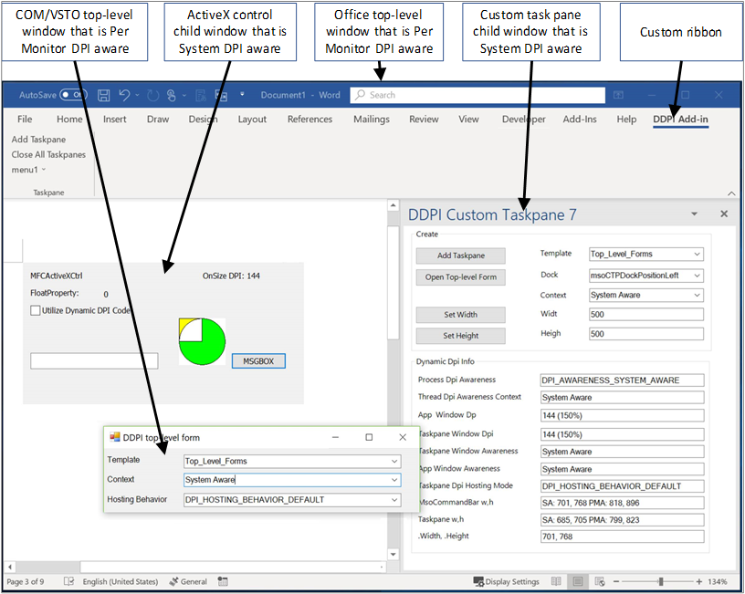
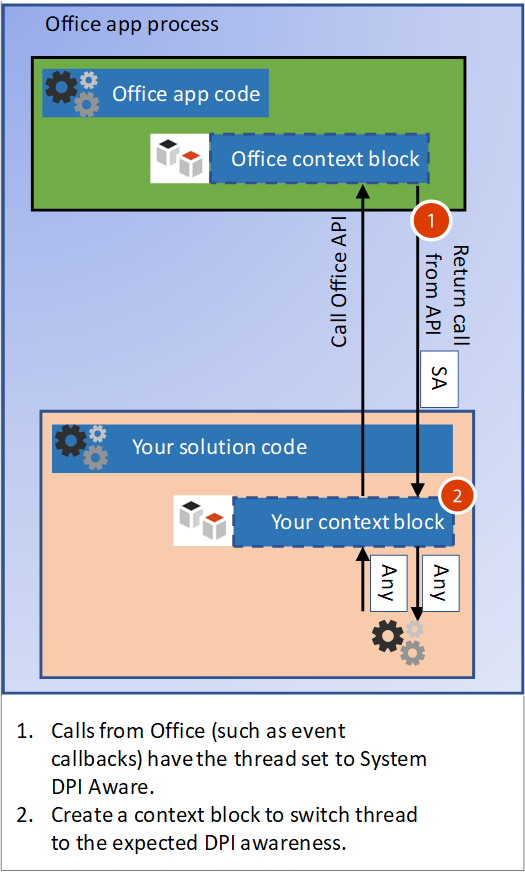
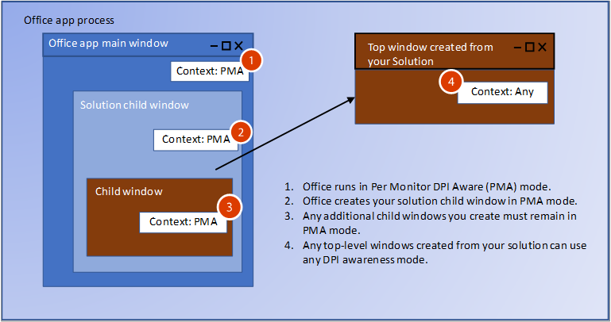

# <a name="handle-high-dpi-and-dpi-scaling-in-your-office-solution"></a>Office ソリューションでの高 DPI と DPI スケーリングの処理

今では多くのコンピューターとディスプレイの構成が高 DPI (1 インチあたりのドット数) の解像度に対応しており、サイズやピクセル密度の異なる複数のモニターを接続することができます。 ここでは、ユーザーがアプリを異なる DPI のモニターに移動したとき、またはズーム レベルを変更したときに、アプリケーションを調整する必要があります。 DPI スケーリングをサポートしていないアプリケーションは、低 DPI のモニターでは正常に見えるかもしれませんが、高 DPI のモニター上に表示すると、伸縮され、ぼやけて見えます。 

Word や Excel などの Office 2016 アプリケーションは、倍率の変更に応答できるように更新されました。 ただし、DPI が変更されたときに正しく表示するには、ご自身の Office ソリューションも変更に応答する必要があります。 この記事では、Office での動的 DPI サポートのしくみと、ご自身の Office 機能拡張ソリューションで、DPI スケーリングを処理して最適な表示エクスペリエンスを実現するために実行できる手順について説明します。 

## <a name="dpi-scaling-symptoms-in-your-solution"></a>DPI スケーリングによってソリューションに生じる現象

Windows では、アプリケーションが 1 つのディスプレイから DPI の異なる別のディスプレイに移動されたときに、DPI スケーリングが適用されます。 これは、アプリケーションを別のモニターにドラッグした場合や、ノート PC をドッキングした場合などに発生します。 Office ソリューションが DPI スケーリングによって悪影響を受けた場合は、次の 1 つまたは複数の現象が見られます。

- ウィンドウが間違った位置に表示される、または間違った大きさで表示される。
- ボタンやラベルなどの要素がソリューションのウィンドウの間違った位置に表示される。
- フォントと画像が小さすぎる、大きすぎる、または間違った位置に表示される。

次の種類の Office ソリューションは、DPI スケーリングの影響を受ける可能性があります。

- VSTO アドイン
- カスタム作業ウィンドウ
- COM アドイン
- ActiveX コントロール
- リボンの拡張機能
- OLE サーバー
- Office Web アドイン

## <a name="windows-dpi-awareness-modes"></a>Windows DPI 対応モード

この記事全体を通して、Windows でサポートされている DPI 対応モードを記載しています。 次の表に示すように、DPI 対応モードによってサポートされる機能が異なります。 これは、Office ソリューションでそれらのモードがどのようにサポートされているかを示すための、モードに関する簡略化した説明です。 DPI 対応モードの詳細については、「[High DPI Desktop Application Development on Windows](https://docs.microsoft.com/windows/desktop/hidpi/high-dpi-desktop-application-development-on-windows)」 (Windows での高 DPI デスクトップ アプリケーション開発) を参照してください。

|モード  |説明  |DPI が変更されたとき  |
|---------|---------|---------|
|DPI 非対応 |  常に、DPI 値 96 のディスプレイ上に表示すると仮定してアプリケーションを表示します。 |  プライマリ ディスプレイとセカンダリ ディスプレイ上で想定されているサイズまでアプリケーションをビットマップ伸縮します。    |
|システム DPI 対応 |  Windows へのログイン時に、接続されているプライマリ モニターの DPI をアプリケーションで検出しますが、DPI の変更に応答することはできません。 詳細については、この記事の「Windows を使用して、[ぼやけたアプリを修正するための構成](#configure-windows-to-fix-blurry-apps)」を参照してください。  | DPI の異なる新しいディスプレイに移動したときにアプリケーションをビットマップ伸縮します。    |
|モニターごとの DPI 対応 |  DPI が変更されたときにアプリケーションを正しく再表示できます。  |   Windows からアプリケーションのトップレベル ウィンドウに DPI 通知が送信され、DPI が変更されたときにアプリケーションを再表示できます。     |
|モニターごと (v2) |  DPI が変更されたときにアプリケーションを正しく再表示できます。  |   Windows からトップレベル ウィンドウと子ウィンドウの両方に DPI 通知が送信され、DPI が変更されたときにアプリケーションを再表示できます。 |

## <a name="how-office-supports-dpi-scaling"></a>Office で DPI スケーリングがサポートされるしくみ

ご自身の Office ソリューションが DPI スケーリングをどのように処理できるかを判断する際に最も重要な考慮事項は、ソリューションがトップレベル ウィンドウであるか、子ウィンドウであるかということです。 次の図は、トップレベル ウィンドウまたは子ウィンドウとして実行されている Office ソリューションのいくつかの例と、それらのソリューションによって Windows April 2018 Update (1803) 以降で使用される DPI 対応モードを示しています。



この画像では:
- COM/VSTO のトップレベル ウィンドウは、モニターごとの DPI に対応します。
- ActiveX コントロールの子ウィンドウはシステム DPI に対応します。
- Office のトップレベル ウィンドウはモニターごとの DPI に対応します。
- カスタム作業ウィンドウの子ウィンドウはシステム DPI に対応します。

## <a name="managing-thread-dpi-context"></a>スレッド DPI コンテキストの管理

ホスト Office アプリが開始されると、メイン スレッドはモニターごとの DPI 対応のコンテキストで実行されます。 ご自身のソリューション コードでスレッドを作成する場合、または Office からの呼び出しを受け取る場合は、スレッド DPI コンテキストを管理する必要があります。

### <a name="creating-new-threads-with-the-correct-dpi-context"></a>正しい DPI コンテキストを使用して新しいスレッドを作成する

ご自身のソリューションで追加のスレッドを作成する場合、Office によってスレッドは強制的にモニターごとの DPI 対応になります。 ご自身のコードで異なるコンテキストが想定される場合は、[SetThreadDpiAwarenessContext](https://docs.microsoft.com/windows/desktop/api/winuser/nf-winuser-setthreaddpiawarenesscontext) 関数を使用して想定されているスレッド DPI 対応を設定する必要があります。 

### <a name="build-a-context-block-for-incoming-thread-calls"></a>着信スレッド呼び出し用のコンテキスト ブロックの作成



ご自身のソリューションと、ホストである Office アプリとの通信が行われ、Office からソリューションへの着信呼び出し (イベント コールバックなど) が行われます。 Office からソリューションが呼び出されるとき、それにはコンテキスト ブロックが含まれており、スレッド コンテキストは強制的にシステム DPI 対応コンテキストになります。 スレッドのコンテキストを、ウィンドウの DPI 対応に合わせて変更する必要があります。 着信呼び出しでのスレッドのコンテキストを切り替えるために、同様のコンテキスト ブロックを実装できます。 ウィンドウのコンテキストに合わせてコンテキストを変更するには、[SetThreadDpiAwarenessContext](https://docs.microsoft.com/windows/desktop/api/winuser/nf-winuser-setthreaddpiawarenesscontext) 関数を使用します。 

> [!NOTE]
> ソリューション コードの範囲外にある他のコンポーネントを呼び出す前に、コンテキスト ブロックに元の DPI スレッド コンテキストを復元する必要があります。

#### <a name="managed-code-context-block"></a>マネージド コードのコンテキスト ブロック

次のコード例は、独自のコンテキスト ブロックを作成する方法を示しています。

```csharp
public struct DPI_AWARENESS_CONTEXT
        {
            private IntPtr value;

            private DPI_AWARENESS_CONTEXT(IntPtr value)
            {
                this.value = value;
            }

            public static implicit operator DPI_AWARENESS_CONTEXT(IntPtr value)
            {
                return new DPI_AWARENESS_CONTEXT(value);
            }

            public static implicit operator IntPtr(DPI_AWARENESS_CONTEXT context)
            {
                return context.value;
            }

            public static bool operator ==(IntPtr context1, DPI_AWARENESS_CONTEXT context2)
            {
                return AreDpiAwarenessContextsEqual(context1, context2);
            }

            public static bool operator !=(IntPtr context1, DPI_AWARENESS_CONTEXT context2)
            {
                return !AreDpiAwarenessContextsEqual(context1, context2);
            }

            public override bool Equals(object obj)
            {
                return base.Equals(obj);
            }

            public override int GetHashCode()
            {
                return base.GetHashCode();
            }
        }

        private static DPI_AWARENESS_CONTEXT DPI_AWARENESS_CONTEXT_HANDLE = IntPtr.Zero;

        public static readonly DPI_AWARENESS_CONTEXT DPI_AWARENESS_CONTEXT_INVALID = IntPtr.Zero;
        public static readonly DPI_AWARENESS_CONTEXT DPI_AWARENESS_CONTEXT_UNAWARE = new IntPtr(-1);
        public static readonly DPI_AWARENESS_CONTEXT DPI_AWARENESS_CONTEXT_SYSTEM_AWARE = new IntPtr(-2);
        public static readonly DPI_AWARENESS_CONTEXT DPI_AWARENESS_CONTEXT_PER_MONITOR_AWARE = new IntPtr(-3);
        public static readonly DPI_AWARENESS_CONTEXT DPI_AWARENESS_CONTEXT_PER_MONITOR_AWARE_V2 = new IntPtr(-4);

        public static DPI_AWARENESS_CONTEXT[] DpiAwarenessContexts =
        {
            DPI_AWARENESS_CONTEXT_UNAWARE,
            DPI_AWARENESS_CONTEXT_SYSTEM_AWARE,
            DPI_AWARENESS_CONTEXT_PER_MONITOR_AWARE,
            DPI_AWARENESS_CONTEXT_PER_MONITOR_AWARE_V2
        };

class DPIContextBlock : IDisposable
    {
        private DPI_AWARENESS_CONTEXT resetContext;
        private bool disposed = false;

        public DPIContextBlock(DPI_AWARENESS_CONTEXT contextSwitchTo)
        {
            resetContext = SetThreadDpiAwarenessContext(contextSwitchTo);
         }

        public void Dispose()
        {
            Dispose(true);
            GC.SuppressFinalize(this);
        }

        protected virtual void Dispose(bool disposing)
        {
            if (!disposed)
            {
                if (disposing)
                {
                    SetThreadDpiAwarenessContext(resetContext);
                }
            }
            disposed = true;
        }
    }
```

#### <a name="native-code-context-block"></a>ネイティブ コードのコンテキスト ブロック

```cpp
#include <winuser.h>
/* DpiAwarenessContextBlock can be used to simplify setting and resetting the DPI_AWARENESS_CONTEXT of
the current thread.  When the object is constructed, the DPI_AWARENESS_CONTEXT is set, and when the object is
destructed, the DPI awareness context is reverted to the previous awareness context at construct time.

This object allows us to write code such as:

// Thread state is currently DPI_AWARENESS_SYSTEM_AWARE
if (condition)
{
DpiAwarenessContextBlock perMonitorAware(DPI_AWARENESS_PER_MONITOR_AWARE);
... // Create a top-level hwnd with the current thread state, DPI_AWARENESS_PER_MONITOR_AWARE
}
// Thread state automatically returns to DPI_AWARENESS_SYSTEM_AWARE

*/
class DpiAwarenessContextBlock
{
public:
      DpiAwarenessContextBlock(DPI_AWARENESS_CONTEXT dpiContext) noexcept;
      ~DpiAwarenessContextBlock();

      // Copy and move are not to be used with these context objects
      DpiAwarenessContextBlock(const DpiAwarenessContextBlock&) = delete;
      DpiAwarenessContextBlock(DpiAwarenessContextBlock&&) = delete;

private:
      DPI_AWARENESS_CONTEXT m_contextReversalType;
      bool m_doContextSwitch;
};

inline DpiAwarenessContextBlock::DpiAwarenessContextBlock(DPI_AWARENESS_CONTEXT dpiContext) noexcept
{
      m_contextReversalType = SetThreadDpiAwarenessContext(dpiContext);
}

inline DpiAwarenessContextBlock::~DpiAwarenessContextBlock()
{
      SetThreadDpiAwarenessContext(m_contextReversalType);
}
```

<h2 id="top-level-window-management">トップレベル ウィンドウ管理</h2>

Office アプリケーションの開始時に、DPI_AWARENESS_CONTEXT_PER_MONITOR_AWARE として [SetThreadDpiAwarenessContext](https://docs.microsoft.com/windows/desktop/api/winuser/nf-winuser-setthreaddpiawarenesscontext) への呼び出しが行われます。 このコンテキストでは、DPI の変更が、モニターごとの DPI 対応として実行されているトップレベル ウィンドウの HWND に送信されます。 トップレベル ウィンドウとは、Office アプリケーション ウィンドウと、ご自身のソリューションによって作成される追加のトップレベル ウィンドウのことです。 Office アプリケーションは、新しいディスプレイに移動されると通知を受け取ります。これにより、動的に拡大縮小して新しいディスプレイの DPI で正しく表示できるようになります。 ご自身の Office ソリューションでは、任意の DPI 対応モードのトップレベル ウィンドウを作成できます。 変更に関する Windows メッセージをリッスンすることによって、トップレベル ウィンドウでも DPI の変更に応答することができます。

トップレベル ウィンドウを親とする子ウィンドウを作成した場合、子ウィンドウを任意の DPI 対応モードに設定できます。 ただし、モニターごとの DPI 対応モードを使用する場合、子ウィンドウは DPI 変更通知を受け取りません。  Windows DPI 対応モードの詳細については、「[High DPI Desktop Application Development on Windows](https://docs.microsoft.com/windows/desktop/hidpi/high-dpi-desktop-application-development-on-windows)」 (Windows での高 DPI デスクトップ アプリケーション開発) を参照してください。

## <a name="child-window-management"></a>子ウィンドウ管理

ActiveX コントロールとカスタム作業ウィンドウを使用していると、Office によってご自身のソリューションの子ウィンドウが作成されます。 追加の子ウィンドウを作成できますが、親ウィンドウの DPI 対応について知っておく必要があります。 Office はモニターごとの DPI 対応モードで実行されます。つまり、ご自身のソリューションのどの子ウィンドウも、DPI 変更通知を受け取りません。 DPI 変更の子ウィンドウへの送信をサポートしているのは、モニターごと (v2) モードのみです (Office はモニターごと (v2) をサポートしていません)。 ただし、ActiveX コントロールについては、回避策があります。 詳細については、このトピックで後述する「[ActiveX コントロール](#activex-controls)」セクションを参照してください。

> [!NOTE]
> 子ウィンドウでトップレベル ウィンドウを作成する場合、新しいトップレベル ウィンドウには任意の DPI 対応モードを使用できます。 トップレベル ウィンドウの管理の詳細については、この記事の「[トップレベル ウィンドウ管理](#top-level-window-management)」セクションを参照してください。

実行されている Windows 10 の Office のバージョンに応じて、子ウィンドウの表示に 2 つの異なる DPI モードが適用されます。

### <a name="office-dpi-behavior-on-windows-fall-creators-update-1709"></a>Windows Fall Creators Update (1709) での Office DPI の動作

Office アプリではモニターごとの対応モードが使用されるため、ご自身のソリューションの子ウィンドウも、モニターごとの DPI 対応モードで作成されます。 つまり、Windows では、新しい DPI で表示するときに、ソリューションを更新する必要があります。  ウィンドウは DPI 変更通知を受け取ることができないため、ソリューションの UI は正しくなくなる可能性があります。 



### <a name="office-dpi-behavior-on-windows-april-2018-update-1803"></a>Windows April 2018 Update (1803) での Office の DPI 動作

Windows April 2018 (1803) Update 以降では、一部のシナリオについて、Office DPI ホスティング動作に混在モードの DPI スケーリングが使用されます。 これにより、Office ウィンドウを親とするシステム DPI 対応ウィンドウは、モニターごとの DPI 対応に設定されます。 これは、ウィンドウがビットマップ伸縮されたときに DPI が変更される場合の互換性向上に役立ちます。 それでもウィンドウはビットマップ伸縮によってぼやける可能性があります。


新しい子ウィンドウを作成するときは、親ウィンドウの DPI 対応と一致していることを確認してください。 [GetWindowdpiAwarenessContext](https://docs.microsoft.com/windows/desktop/api/winuser/nf-winuser-getwindowdpiawarenesscontext) 関数を使用して、親ウィンドウの DPI 対応を取得できます。 DPI 対応の一貫性の詳細については、「[High DPI Desktop Application Development on Windows](https://docs.microsoft.com/windows/desktop/hidpi/high-dpi-desktop-application-development-on-windows#related-topics)」 (Windows での高 DPI デスクトップ アプリケーション開発) の「Forced reset of process-wide DPI awareness」 (プロセス全体で DPI 対応を強制的に再設定する) セクションを参照してください。

> [!NOTE]
> プロセスの DPI 対応は、アプリケーションのメイン スレッドの DPI 対応コンテキストが [DPI_AWARENESS_CONTEXT_PER_MONITOR_AWARE](https://docs.microsoft.com/windows/desktop/hidpi/dpi-awareness-context) であったとしても [PROCESS_SYSTEM_DPI_AWARE](https://docs.microsoft.com/windows/desktop/api/shellscalingapi/ne-shellscalingapi-process_dpi_awareness) を返す可能性があるため、プロセスの DPI 対応を利用することはできません。 スレッドの DPI 対応コンテキストを取得するには、[GetThreadDpiAwarenessContext](https://docs.microsoft.com/windows/desktop/api/winuser/nf-winuser-getthreaddpiawarenesscontext) 関数を使用します。

## <a name="office-and-windows-dpi-compatibility-settings"></a>Office と Windows の DPI の互換性設定

アドインまたはソリューションが正しく表示されない場合、いくつかの互換性設定が問題の修正に役立つことがあります。

<h3 id="office-compatibility">互換性を最適化するための Office の構成</h3>

Office には、異なる画面上の異なる DPI スケールに移動したときの互換性を最適化する設定があります。 互換モードでは、DPI スケーリングを無効にすることで、異なる DPI スケーリングを使用しているディスプレイに移動したときに、Office のあらゆる内容がビットマップ伸縮されるようになります。 

互換モードでは、Office を強制的にシステム DPI 対応モードで実行します。 これにより、アプリケーション ウィンドウがビットマップ伸縮され、表示がぼやけるという影響が出ることがあります。 この設定はユーザーが選択するため、ご自身の Office ソリューションではこの設定を制御できません。 ディスプレイの互換モードを使用すると、ほとんどの表示の問題が解決されます。 詳細については、「[Office による高解像度ディスプレイのサポート](https://support.office.com/en-us/article/office-support-for-high-definition-displays-6720ca0e-be59-41f6-b629-1369f549279d)」を参照してください。 

### <a name="configure-windows-to-fix-blurry-apps"></a>ぼやけた状態のアプリを修正するための Windows の構成

Windows 10 (Version 1803) 以降には、アプリのぼやけた状態を修正する設定があります。 これは、ご自身のソリューションが正しく表示されない場合に試すもう 1 つの設定です。 この設定はユーザーが選択するため、ご自身の Office ソリューションではこの設定を制御できません。 詳細については、「[Windows 10 でぼやけて表示されるアプリを修正する](https://support.microsoft.com/en-us/help/4091364/windows-10-fix-blurry-apps)」を参照してください。

## <a name="how-to-support-dpi-scaling-in-your-solution"></a>ソリューションで DPI スケーリングをサポートする方法

一部のソリューションでは、DPI の変更情報を受け取り、応答することができます。 一部には、通知を受け取ることができない場合の回避策があります。 次の表は、各ソリューションの種類の詳細を示しています。

<table>
    <thead>
        <tr>
            <th>ソリューションの種類</th>
            <th>ウィンドウの種類</th>
            <th>DPI スケーリングに応答できる</th>
            <th>詳細情報</th>
        </tr>
    </thead>
<tbody>
    <tr>
        <td rowspan="2"><a href="#vsto-add-ins">VSTO アドイン</a></td>
        <td>トップとその子孫</td>
        <td>はい</td>
        <td>「<a href="#vsto-add-ins">VSTO アドインのガイダンス</a>」を参照してください。</td>
    </tr>
<tr>
        <td>Office ウィンドウを親とする子</td>
        <td>いいえ</td>
        <td>「<a href="#office-compatibility">互換性を最適化するための Office の構成</a>」を参照してください。</td>
</tr>
    <tr>
        <td rowspan="2"><a href="#custom-task-panes">カスタム作業ウィンドウ</a></td>
        <td>トップとその子孫</td>
        <td>はい</td>
        <td>「<a href="#top-level-window-management">トップレベル ウィンドウのガイダンス</a>」を参照してください。</td>
    </tr>
<tr>
        <td>Office ウィンドウを親とする子</td>
        <td>いいえ</td>
        <td>「<a href="#office-compatibility">互換性を最適化するための Office の構成</a>」を参照してください。</td>
</tr>
    <tr>
        <td rowspan="2"><a href="#com-add-ins">COM アドイン</a></td>
        <td>トップとその子孫</td>
        <td>はい</td>
        <td>「<a href="#com-add-ins">COM アドインのガイダンス</a>」を参照してください。</td>
    </tr>
<tr>
        <td>Office ウィンドウを親とする子</td>
        <td>いいえ</td>
        <td>「<a href="#office-compatibility">互換性を最適化するための Office の構成</a>」を参照してください。</td>
</tr>
    <tr>
        <td rowspan="2"><a href="#activex-controls">ActiveX コントロール</a></td>
        <td>トップとその子孫</td>
        <td>はい</td>
        <td>「<a href="#activex-controls">ActiveX コントロールのガイダンス</a>」を参照してください。</td>
    </tr>
    <tr>
        <td>Office ウィンドウを親とする子</td>
        <td>はい</td>
    </tr>
    <tr>
        <td><a href="#web-add-ins">Web アドイン</a></td>
        <td>該当なし</td>
        <td>はい</td>
        <td>「<a href="#web-add-ins">Office Web アドインのガイダンス</a>」を参照してください。</td>
    </tr>
    <tr>
        <td><a href="#ribbon-extensibility">リボンの拡張機能</a></td>
        <td>該当なし</td>
        <td>該当なし</td>
        <td>「<a href="#ribbon-extensibility">リボンの拡張機能のガイダンス</a>」を参照してください。</td>
    </tr>
    <tr>
        <td><a href="#ole">OLE サーバーまたはクライアント</a></td>
        <td>該当なし</td>
        <td>該当なし</td>
        <td>「<a href="#ole">OLE サーバー/クライアントのガイダンス</a>」を参照してください。</td>
    </tr>
</tbody>
</table>

<h3 id="vsto-add-ins">VSTO アドイン</h3>

ご自身の VSTO アドインで Office ウィンドウを親とする子ウィンドウを作成する場合、親ウィンドウの DPI 対応と一致していることを確認してください。 [GetWindowdpiAwarenessContext](https://docs.microsoft.com/windows/desktop/api/winuser/nf-winuser-getwindowdpiawarenesscontext) 関数を使用して、親ウィンドウの DPI 対応を取得できます。 子ウィンドウは DPI 変更通知を受け取りません。 ソリューションが正しく表示されない場合、ユーザーが Office を互換モードにする必要があります。

ご自身の VSTO アドインで作成するすべてのトップレベル ウィンドウについて、任意の DPI 対応モードを設定できます。 次のサンプル コードでは、目的の DPI 対応を設定する方法と、DPI の変更に応答する方法を示しています。 「[Windows フォームでの高 DPI サポート](https://docs.microsoft.com/dotnet/framework/winforms/high-dpi-support-in-windows-forms)」の記事にある説明に従って、使用する app.config を調整することも必要です。 

```csharp
using System;
using System.Diagnostics;
using System.Drawing;
using System.Runtime.InteropServices;
using System.Windows.Forms;

namespace SharedModule
{
    // DpiAwareWindowsForm
    // For any top level winform you create, derive from the DpiWindowsForm class
    // if you are creating Windows Forms with the Dpi Awareness Context set to 
    // DPI_AWARENESS_CONTEXT_PER_MONITOR_AWARE or DPI_AWARENESS_CONTEXT_PER_MONITOR_AWARE_V2
    //
    // For example, if you Window form class is defined as:
    //    public partial class TopLevelWinForm : Form
    //
    // update to:
    //    public partial class TopLevelWinForm : DpiAwareWindowsForm
    //
    // When showing the form, call SetThreadDpiAwarenessContext() or use a context block to
    // to set the desired Dpi Awareness Context.
    //
    // For example, here is code to show a Windows Form using a context block as Per Monitor Aware v2.
    //
    //    DPIContextBlock context = new DPIContextBlock(DPI_AWARENESS_CONTEXT_PER_MONITOR_AWARE_V2);
    //    TopLevelWinForm frm = new TopLevelWinForm();
    //    frm.Show();
    //
    public partial class DpiAwareWindowsForm : Form
    {
        private SizeF m_newDpi = SizeF.Empty;
        private SizeF m_oldDpi = SizeF.Empty;

        public DpiAwareWindowsForm()
        {
            this.HandleCreated += new EventHandler((sender, args) =>
            {
                m_oldDpi = m_newDpi = DPIHelper.GetDpiForWindowSizeF(this.Handle);
            });
        }

        public void OnDpiChangedEvent(RECT newRect)
        {
            this.SuspendLayout();

            // Resize form
            this.Width = newRect.Width;
            this.Height = newRect.Height;

            // Resize controls and set font sizes
            ScaleAllChildControls(this.Controls, m_oldDpi.Width, m_newDpi.Width);
            this.ResumeLayout(true);
        }

        // Additional changes may be needed for controls that set Anchor or Dock properties 
        private void ScaleAllChildControls(Control.ControlCollection controls, float oldDpi, float newDpi)
        {
            float scaleFactorChange = newDpi / oldDpi;

            foreach (Control control in controls)
            {
                control.Top = (int)(control.Top * scaleFactorChange);
                control.Left = (int)(control.Left * scaleFactorChange);
                control.Width = (int)(control.Width * scaleFactorChange);
                control.Height = (int)(control.Height * scaleFactorChange);
                control.Font = ScaleFont(control.Font, oldDpi, newDpi);
            }
        }

        private Font ScaleFont(Font font, float oldDpi, float newDpi)
        {
            float fontSizePx = 0.0f;
            float fontSizePt = 0.0f;

            fontSizePx = font.SizeInPoints / 72 * oldDpi;
            fontSizePt = fontSizePx * (newDpi / oldDpi) * 72 / oldDpi;

            return new Font(font.Name, fontSizePt, font.Style, GraphicsUnit.Point);
        }

        protected override void WndProc(ref Message m)
        {
            switch ((DPIHelper.WinMessages)m.Msg)
            {
                case DPIHelper.WinMessages.WM_DPICHANGED:
                    // Marshal the value in the lParam into a Rect.
                    RECT newDisplayRect = (RECT)Marshal.PtrToStructure(m.LParam, typeof(RECT));

                    // Remember current DPI and calculate current from WParam.
                    // Both X and Y are the same on Windows for Dpi.
                    m_oldDpi = m_newDpi;

                    m_newDpi.Width = (float)(m.WParam.ToInt32() >> 16);
                    m_newDpi.Height = (float)(m.WParam.ToInt32() & 0x0000FFFF);

                    // DPI should be the same for both width and height on Windows devices.
                    Debug.Assert(m_newDpi.Height == m_newDpi.Width);

                    if (m_oldDpi.Width != m_newDpi.Width)
                    {
                        OnDpiChangedEvent(newDisplayRect);
                    }
                    base.DefWndProc(ref m);
                    break;
                default:
                    base.WndProc(ref m);
                    break;
            }
        }
    }
}
```

<h3 id="custom-task-panes">カスタム作業ウィンドウ</h3>

カスタム作業ウィンドウは、Office によって子ウィンドウとして作成されます。 Windows Fall Creators Update (1709) で実行する場合、カスタム作業ウィンドウは、Office と同じ DPI 対応モードを使用して実行されます。 Windows April 2018 Update (1803) 以降で実行する場合、カスタム作業ウィンドウはシステム DPI 対応モードを使用して実行されます。 

カスタム作業ウィンドウは子ウィンドウであるため、DPI 通知を受け取ることはできません。 それらの表示が正しく行われない場合、ユーザーは [Office DPI 互換モード](https://support.office.com/en-us/article/office-support-for-high-definition-displays-6720ca0e-be59-41f6-b629-1369f549279d)を使用する必要があります。
ご自身のカスタム作業ウィンドウでトップレベル ウィンドウを作成した場合、それらのウィンドウはどの DPI 対応モードでも実行でき、DPI 変更通知を受け取ることがことができます。 詳細については、この記事の「[トップレベル ウィンドウ管理](#top-level-window-management)」セクションを参照してください。

<h3 id="com-add-ins">COM アドイン</h3>

トップレベル ウィンドウを作成する COM アドインは、DPI 通知を受け取ることができます。 ウィンドウに必要な DPI 対応をスレッドに対して設定するには、[コンテキスト ブロック](#build-a-context-block-for-incoming-thread-calls)を作成してから、ウィンドウを作成する必要があります。 DPI 通知を正しく処理するには多くの知識が必要であるため、詳細については、「[High DPI Desktop Application Development on Windows](https://docs.microsoft.com/windows/desktop/hidpi/high-dpi-desktop-application-development-on-windows#related-topics)」 (Windows での高 DPI デスクトップ アプリケーション開発) を参照してください。

ウィンドウの DPI が変更されると、[WM_DPICHANGED](https://docs.microsoft.com/windows/desktop/hidpi/wm-dpichanged) というメッセージが送信されます。  アンマネージド コードでは、このメッセージは HWND の[ウィンドウ プロシージャ](https://docs.microsoft.com/windows/desktop/winmsg/using-window-procedures)によって処理されます。  WM_DPICHANGED の記事に DPI 変更ハンドラー コードのサンプルがあります。 

Office 内のウィンドウを親とする子ウィンドウを表示する COM アドインは、DPI 通知を受け取ることはできません。 それらの表示が正しく行われない場合、ユーザーは [Office DPI 互換モード](https://support.office.com/article/office-support-for-high-definition-displays-6720ca0e-be59-41f6-b629-1369f549279d)を使用する必要があります。

<h3 id="activex-controls">ActiveX コントロール</h3>

ActiveX コントロールにおいて DPI スケーリングをサポートする方法は、そのコントロールがウィンドウ付きかウィンドウなしかによって異なります。

#### <a name="windowed-activex-controls"></a>ウィンドウ付きの ActiveX コントロール

ウィンドウ付きの ActiveX コントロールは、コントロールのサイズが変更されるたびに WM_SIZE メッセージを受け取ります。  このイベントがトリガーされたら、イベント ハンドラー コードからコントロールの HWND を使って [GetDpiForWindow](https://docs.microsoft.com/windows/desktop/api/winuser/nf-winuser-getdpiforwindow) 関数を呼び出して DPI を取得し、倍率の違いを計算して、必要に応じて調整することができます。 

次の例では、**OnSize** イベントに応答する MFC ベースの ActiveX コントロールを有効にしています。 

```cpp
void ChangeWindowFontDPI(HWND hWnd, UINT dpi) 
{ 
LOGFONT fontInfo1 = { 0 }; 
// Calculate the font height based on the DPI. 
fontInfo1.lfHeight = -MulDiv(DESIRED_HEIGHT, dpi, 72); 
fontInfo1.lfQuality = CLEARTYPE_QUALITY; 
wcscpy_s(fontInfo1.lfFaceName, DESIRED_FONT_NAME); 
 
::SendMessage(hWnd, WM_SETFONT, (WPARAM)::CreateFontIndirectW(&fontInfo1), TRUE); 
} 
 
BOOL CALLBACK CMainDialog::EnumChildProc(HWND hWnd, LPARAM lParam) 
{ 
CMainDialog* _this = (CMainDialog*) lParam; 
if (_this != nullptr) 
{ 
// Calculate the scale factor difference between the old and new DPI changes. 
double scale = (((double) _this->m_newDPI) /  
   (((double) _this->m_currentDPI) / 100.0)) / 100; 
 
RECT rect = {}; 
::GetWindowRect(hWnd, &rect); 
 
POINT pt = { rect.left, rect.top }; 
::ScreenToClient(::GetParent(hWnd), &pt); 
 
// Adjust the window based on the scale changes. 
::MoveWindow(hWnd, 
pt.x * scale, 
pt.y * scale, 
(rect.right - rect.left) * scale, 
(rect.bottom - rect.top) * scale, 
TRUE); 
 
ChangeWindowFontDPI(hWnd, _this->m_newDPI); 
return TRUE; 
} 
return FALSE; 
} 
 
void CMainDialog::OnSize(UINT nType, int cx, int cy) 
{ 
CDialog::OnSize(nType, cx, cy); 
 
// Get the new DPI and enumerate the child windows that will use that value. 
m_currentDPI = ::GetDpiForWindow(this->GetSafeHwnd()); 
::EnumChildWindows(this->GetSafeHwnd(), EnumChildProc, (LPARAM)this); 
} 
```

#### <a name="windowless-activex-controls"></a>ウィンドウなしの ActiveX コントロール

ウィンドウなしの ActiveX コントロールには、HWND があるとは限りません。  ActiveX コントロールは、ドキュメント キャンバスに挿入されるとデザイン モードになります。  Office アプリケーションでは、コントロールがデザイン モードのとき、::OnDraw イベントでの DC->GetWindow() の呼び出しに対してホスティング コンテナーから 0 が返されます。  この場合、信頼性の高い DPI を取得することはできません。 

ただし、コントロールがランタイム モードのときは、コントロールを表示する位置の HWND が Office から返されます。  この場合、コントロールの開発者は [GetDpiForWindow](https://docs.microsoft.com/windows/desktop/api/winuser/nf-winuser-getdpiforwindow) を呼び出して現在の DPI を取得し、フォントやコントロールなどを拡大縮小することができます。 

<h3 id="ribbon-extensibility">カスタム リボンの機能拡張</h3>

カスタム リボン コントロールに対する Office からのコールバックは、システム DPI 対応の DPI スレッド対応になります。  ご自身のソリューションで異なる DPI スレッド対応が必要な場合は、正常なスレッド対応を設定するように、コンテキスト ブロックを実装する必要があります。 詳細については、「[コンテキスト ブロックの作成](#build-a-context-block-for-incoming-thread-calls)」を参照してください。

<h3 id="ole">OLE クライアントとサーバー</h3>

OLE サーバーが OLE クライアント コンテナー内でホストされている場合、現時点では、現在の DPI 情報またはサポートされている DPI 情報を提供することはできません。 これを行うと、問題が発生する可能性があります。親と子のウィンドウ混在モードの一部の組み合わせは、現在の Windows アーキテクチャでサポートされていないことが原因です。 Word または Excel では、DPI の異なるモニターが複数検出された場合、インプレース アクティブ化はサポートされません。 使用する OLE サーバーは所定の場所以外でアクティブ化されます。 OLE サーバー間の対話に問題がある場合、ユーザーは [Office DPI 互換モード](https://support.office.com/article/office-support-for-high-definition-displays-6720ca0e-be59-41f6-b629-1369f549279d)を使用する必要があります。

<h3 id="web-add-ins">Office Web アドイン</h3>

Office JavaScript API を使用して作成された Office アドインは、ブラウザー コントロールの内部で実行されます。 Web アプリ デザインで使用するのと同じ方法を使って、DPI スケーリングを処理できます。 高解像度の画面向けの Web ページをデザインする際に役立つ多くのオンライン リソースを利用できます。

## <a name="verify-that-your-solution-supports-dpi-scaling"></a>ソリューションが DPI スケーリングをサポートしていることの確認

DPI スケーリングをサポートするようにアプリケーションを更新した後、DPI 混在環境で変更を検証する必要があります。 ご自身のソリューションのウィンドウを、あるディスプレイから DPI 値が異なる別のディスプレイに移動したときに、DPI の変更に対して UI コードが正しく応答することを検証します。 DPI スケーリングのテスト方法の詳細については、「[High DPI Desktop Application Development on Windows](https://docs.microsoft.com/windows/desktop/hidpi/high-dpi-desktop-application-development-on-windows#related-topics)」 (Windows での高 DPI デスクトップ アプリケーション開発) を参照してください。

次に示すその他の方法も役に立つことがあります。

- ノート PC では、プライマリ モニターを外部モニターに設定してから、ノート PC のドッキングを解除できます。 これで、プライマリ モニターが強制的にノート PC のディスプレイに変更されます。
- デバッグに役立つオープン ソースの [WinSpy++ ツール](https://github.com/BissetJ/winspy/releases)を使用します。 これを使用して、任意のウィンドウの DPI 対応の設定を確認できます。
- リモート デスクトップを使用して、リモート コンピューターの複数のモニターをテストすることができます。そうするには、次のスクリーンショットに示すように、[画面] タブで [リモート セッションですべてのモニターを使用する] をオンにします。

![[リモート セッションですべてのモニターを使用する] をオンにした [画面] タブを表示したリモート デスクトップ接続アプリ。](./media/remote-desktop-use-all-monitors.png)

## <a name="see-also"></a>関連項目

### <a name="articles"></a>記事

- [モニターごとの DPI 対応 WPF アプリケーションの開発](https://docs.microsoft.com/windows/desktop/hidpi/declaring-managed-apps-dpi-aware)には、Win32 デスクトップアプリケーションを作成するための一般的な概要とガイドが用意されています。 この記事で説明されているのと同じ方法の多くは、Office 機能拡張ソリューションにも適用されます。
- 「[Mixed-Mode DPI Scaling and DPI-aware APIs](https://docs.microsoft.com/windows/desktop/hidpi/high-dpi-improvements-for-desktop-applications)」 (混在モードの DPI スケーリングと DPI 対応 API) には、DPI に関連した API の一覧が記載されています。
- 「[Developer Guide - Per Monitor DPI - WPF Preview](https://github.com/Microsoft/WPF-Samples/blob/master/PerMonitorDPI/Developer%20Guide%20-%20Per%20Monitor%20DPI%20-%20WPF%20Preview.docx)」 (開発者ガイド - モニターごとの DPI - WPF プレビュー) は、DPI 対応 WPF アプリを作成するための WPF アプリ開発ガイドです。
- 「[Office による高解像度ディスプレイのサポート](https://support.office.com/article/Office-support-for-high-definition-displays-6720ca0e-be59-41f6-b629-1369f549279d)」では、DPI が変更されたときに Office ソリューションが適切にサポートされない場合に、ユーザーが互換性を最適化するように Office を設定する方法に関する情報を提供します。
- 「[Display Scaling changes for the Windows 10 Anniversary Update](https://blogs.technet.microsoft.com/askcore/2016/08/16/display-scaling-changes-for-the-windows-10-anniversary-update/)」 (Windows 10 Anniversary Update でのディスプレイのスケーリングの変更) では、Windows 10 Anniversary Update で導入された変更について解説したブログ記事です。 
- 「[DPI_AWARENESS_CONTEXT handle](https://docs.microsoft.com/windows/desktop/hidpi/dpi-awareness-context)」 (DPI_AWARENESS_CONTEXT ハンドル) には、DPI_AWARENESS_CONTEXT の値と定義に関するプログラミングの詳細が記載されています。
- 「[High DPI Desktop Application Development on Windows](https://docs.microsoft.com/windows/desktop/hidpi/high-dpi-desktop-application-development-on-windows#testing-your-changes)」 (Windows での高 DPI デスクトップ アプリケーション開発) の「Testing Your Changes」 (変更のテスト) セクションには、テストに関する情報が記載されています。

### <a name="code-samples"></a>コード サンプル

- [ウィンドウごとの DPI 対応のサンプル](https://github.com/Microsoft/Windows-classic-samples/tree/master/Samples/DPIAwarenessPerWindow)
- [動的 DPI のサンプル](https://github.com/Microsoft/Windows-classic-samples/tree/master/Samples/DynamicDPI)
- [モニターごとの対応の WPF のサンプル](https://github.com/Microsoft/Windows-classic-samples/tree/master/Samples/PerMonitorDPIAware)
