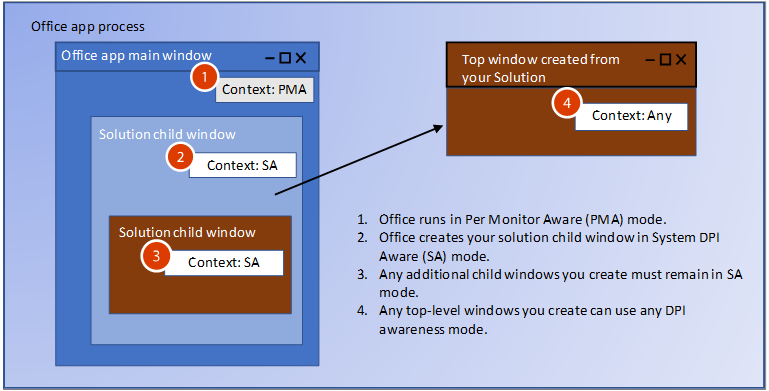

# <a name="handle-high-dpi-and-dpi-scaling-in-your-office-solution"></a><span data-ttu-id="5f57d-103">Office ソリューションでの高 DPI と DPI スケーリングの処理</span><span class="sxs-lookup"><span data-stu-id="5f57d-103">Handle high DPI and DPI scaling in your Office solution</span></span>

<span data-ttu-id="5f57d-104">今では多くのコンピューターとディスプレイの構成が高 DPI (1 インチあたりのドット数) の解像度に対応しており、サイズやピクセル密度の異なる複数のモニターを接続することができます。</span><span class="sxs-lookup"><span data-stu-id="5f57d-104">Many computer and display configurations now support high DPI (dots-per-inch) resolutions, and can connect multiple monitors with different sizes and pixel densities.</span></span> <span data-ttu-id="5f57d-105">ここでは、ユーザーがアプリを異なる DPI のモニターに移動したとき、またはズーム レベルを変更したときに、アプリケーションを調整する必要があります。</span><span class="sxs-lookup"><span data-stu-id="5f57d-105">This requires applications to adjust when the user moves the app to a monitor with a different DPI, or changes the zoom level.</span></span> <span data-ttu-id="5f57d-106">DPI スケーリングをサポートしていないアプリケーションは、低 DPI のモニターでは正常に見えるかもしれませんが、高 DPI のモニター上に表示すると、伸縮され、ぼやけて見えます。</span><span class="sxs-lookup"><span data-stu-id="5f57d-106">Applications that don’t support DPI scaling might look fine on low DPI monitors, but will look stretched and blurry when shown on a high DPI monitor.</span></span> 

<span data-ttu-id="5f57d-107">Word や Excel などの Office 2016 アプリケーションは、倍率の変更に応答できるように更新されました。</span><span class="sxs-lookup"><span data-stu-id="5f57d-107">Office 2016 applications, such as Word and Excel, have been updated to respond to changes in scale factor.</span></span> <span data-ttu-id="5f57d-108">ただし、DPI が変更されたときに正しく表示するには、ご自身の Office ソリューションも変更に応答する必要があります。</span><span class="sxs-lookup"><span data-stu-id="5f57d-108">However, your Office solution must also respond to changes to draw correctly when the DPI changes.</span></span> <span data-ttu-id="5f57d-109">この記事では、Office での動的 DPI サポートのしくみと、ご自身の Office 機能拡張ソリューションで、DPI スケーリングを処理して最適な表示エクスペリエンスを実現するために実行できる手順について説明します。</span><span class="sxs-lookup"><span data-stu-id="5f57d-109">This article describes how Office supports dynamic DPI, and what steps you can take to ensure the best viewing experience for your Office extensibility solution to handle DPI scaling.</span></span> 

## <a name="dpi-scaling-symptoms-in-your-solution"></a><span data-ttu-id="5f57d-110">DPI スケーリングによってソリューションに生じる現象</span><span class="sxs-lookup"><span data-stu-id="5f57d-110">DPI scaling symptoms in your solution</span></span>

<span data-ttu-id="5f57d-111">Windows では、アプリケーションが 1 つのディスプレイから DPI の異なる別のディスプレイに移動されたときに、DPI スケーリングが適用されます。</span><span class="sxs-lookup"><span data-stu-id="5f57d-111">Windows applies DPI scaling when an application is moved from one display to another display with a different DPI.</span></span> <span data-ttu-id="5f57d-112">これは、アプリケーションを別のモニターにドラッグした場合や、ノート PC をドッキングした場合などに発生します。</span><span class="sxs-lookup"><span data-stu-id="5f57d-112">This happens in scenarios such as dragging an application to a different monitor or docking your laptop.</span></span> <span data-ttu-id="5f57d-113">Office ソリューションが DPI スケーリングによって悪影響を受けた場合は、次の 1 つまたは複数の現象が見られます。</span><span class="sxs-lookup"><span data-stu-id="5f57d-113">If your Office solution is adversely affected by DPI scaling, you will see one or more of the following symptoms:</span></span>

- <span data-ttu-id="5f57d-114">ウィンドウが間違った位置に表示される、または間違った大きさで表示される。</span><span class="sxs-lookup"><span data-stu-id="5f57d-114">The windows draw in the wrong location or have incorrect sizing.</span></span>
- <span data-ttu-id="5f57d-115">ボタンやラベルなどの要素がソリューションのウィンドウの間違った位置に表示される。</span><span class="sxs-lookup"><span data-stu-id="5f57d-115">Elements such as buttons and labels appear in the wrong location in your solution’s window.</span></span>
- <span data-ttu-id="5f57d-116">フォントと画像が小さすぎる、大きすぎる、または間違った位置に表示される。</span><span class="sxs-lookup"><span data-stu-id="5f57d-116">Fonts and images appear too small, too large or in the wrong location.</span></span>

<span data-ttu-id="5f57d-117">次の種類の Office ソリューションは、DPI スケーリングの影響を受ける可能性があります。</span><span class="sxs-lookup"><span data-stu-id="5f57d-117">The following types of Office solutions can be affected by DPI scaling:</span></span>

- <span data-ttu-id="5f57d-118">VSTO アドイン</span><span class="sxs-lookup"><span data-stu-id="5f57d-118">VSTO Add-ins</span></span>
- <span data-ttu-id="5f57d-119">カスタム作業ウィンドウ</span><span class="sxs-lookup"><span data-stu-id="5f57d-119">Custom task panes</span></span>
- <span data-ttu-id="5f57d-120">COM アドイン</span><span class="sxs-lookup"><span data-stu-id="5f57d-120">COM Add-ins</span></span>
- <span data-ttu-id="5f57d-121">ActiveX コントロール</span><span class="sxs-lookup"><span data-stu-id="5f57d-121">ActiveX controls</span></span>
- <span data-ttu-id="5f57d-122">リボンの拡張機能</span><span class="sxs-lookup"><span data-stu-id="5f57d-122">Ribbon extensions</span></span>
- <span data-ttu-id="5f57d-123">OLE サーバー</span><span class="sxs-lookup"><span data-stu-id="5f57d-123">Ole servers</span></span>
- <span data-ttu-id="5f57d-124">Office Web アドイン</span><span class="sxs-lookup"><span data-stu-id="5f57d-124">Office web add-ins</span></span>

## <a name="windows-dpi-awareness-modes"></a><span data-ttu-id="5f57d-125">Windows DPI 対応モード</span><span class="sxs-lookup"><span data-stu-id="5f57d-125">Windows DPI awareness modes</span></span>

<span data-ttu-id="5f57d-126">この記事全体を通して、Windows でサポートされている DPI 対応モードを記載しています。</span><span class="sxs-lookup"><span data-stu-id="5f57d-126">Throughout this article we’ll refer to the DPI awareness modes that Windows supports.</span></span> <span data-ttu-id="5f57d-127">次の表に示すように、DPI 対応モードによってサポートされる機能が異なります。</span><span class="sxs-lookup"><span data-stu-id="5f57d-127">Each DPI awareness mode supports different capabilities, as described in the following table.</span></span> <span data-ttu-id="5f57d-128">これは、Office ソリューションでそれらのモードがどのようにサポートされているかを示すための、モードに関する簡略化した説明です。</span><span class="sxs-lookup"><span data-stu-id="5f57d-128">This is a simplified description of the modes to explain how Office solutions support them.</span></span> <span data-ttu-id="5f57d-129">DPI 対応モードの詳細については、「[High DPI Desktop Application Development on Windows](https://docs.microsoft.com/windows/desktop/hidpi/high-dpi-desktop-application-development-on-windows)」 (Windows での高 DPI デスクトップ アプリケーション開発) を参照してください。</span><span class="sxs-lookup"><span data-stu-id="5f57d-129">For more information about the DPI awareness modes, see [High DPI Desktop Application Development on Windows](https://docs.microsoft.com/windows/desktop/hidpi/high-dpi-desktop-application-development-on-windows).</span></span>

|<span data-ttu-id="5f57d-130">モード</span><span class="sxs-lookup"><span data-stu-id="5f57d-130">Mode</span></span>  |<span data-ttu-id="5f57d-131">説明</span><span class="sxs-lookup"><span data-stu-id="5f57d-131">Description</span></span>  |<span data-ttu-id="5f57d-132">DPI が変更されたとき</span><span class="sxs-lookup"><span data-stu-id="5f57d-132">When DPI changes</span></span>  |
|---------|---------|---------|
|<span data-ttu-id="5f57d-133">DPI 非対応</span><span class="sxs-lookup"><span data-stu-id="5f57d-133">DPI unaware</span></span> |  <span data-ttu-id="5f57d-134">常に、DPI 値 96 のディスプレイ上に表示すると仮定してアプリケーションを表示します。</span><span class="sxs-lookup"><span data-stu-id="5f57d-134">Application always renders as if it is on a display with a DPI value of 96.</span></span> |  <span data-ttu-id="5f57d-135">プライマリ ディスプレイとセカンダリ ディスプレイ上で想定されているサイズまでアプリケーションをビットマップ伸縮します。</span><span class="sxs-lookup"><span data-stu-id="5f57d-135">Application is bitmap stretched to expected size on primary and secondary displays.</span></span>    |
|<span data-ttu-id="5f57d-136">システム DPI 対応</span><span class="sxs-lookup"><span data-stu-id="5f57d-136">System DPI aware</span></span> |  <span data-ttu-id="5f57d-137">Windows へのログイン時に、接続されているプライマリ モニターの DPI をアプリケーションで検出しますが、DPI の変更に応答することはできません。</span><span class="sxs-lookup"><span data-stu-id="5f57d-137">Application detects the DPI of the primary connected monitor at Windows login but cannot respond to DPI changes.</span></span> <span data-ttu-id="5f57d-138">詳細については、この記事の[「ぼやけたアプリを修正Windowsを構成する](#configure-windows-to-fix-blurry-apps)」セクションを参照してください。</span><span class="sxs-lookup"><span data-stu-id="5f57d-138">For more information, see the [Configure Windows to fix blurry apps](#configure-windows-to-fix-blurry-apps) section in this article.</span></span>  | <span data-ttu-id="5f57d-139">DPI の異なる新しいディスプレイに移動したときにアプリケーションをビットマップ伸縮します。</span><span class="sxs-lookup"><span data-stu-id="5f57d-139">Application is bitmap stretched when moved to a new display with a different DPI.</span></span>    |
|<span data-ttu-id="5f57d-140">モニターごとの DPI 対応</span><span class="sxs-lookup"><span data-stu-id="5f57d-140">Per Monitor DPI aware</span></span> |  <span data-ttu-id="5f57d-141">DPI が変更されたときにアプリケーションを正しく再表示できます。</span><span class="sxs-lookup"><span data-stu-id="5f57d-141">Application is capable of redrawing itself correctly when the DPI changes.</span></span>  |   <span data-ttu-id="5f57d-142">Windows からアプリケーションのトップレベル ウィンドウに DPI 通知が送信され、DPI が変更されたときにアプリケーションを再表示できます。</span><span class="sxs-lookup"><span data-stu-id="5f57d-142">Windows will send DPI notifications to top-level windows in the application so that it can redraw when the DPI changes.</span></span>     |
|<span data-ttu-id="5f57d-143">モニターごと (v2)</span><span class="sxs-lookup"><span data-stu-id="5f57d-143">Per Monitor v2</span></span> |  <span data-ttu-id="5f57d-144">DPI が変更されたときにアプリケーションを正しく再表示できます。</span><span class="sxs-lookup"><span data-stu-id="5f57d-144">Application is capable of redrawing itself correctly when the DPI changes.</span></span>  |   <span data-ttu-id="5f57d-145">Windows からトップレベル ウィンドウと子ウィンドウの両方に DPI 通知が送信され、DPI が変更されたときにアプリケーションを再表示できます。</span><span class="sxs-lookup"><span data-stu-id="5f57d-145">Windows will send DPI notifications to both top-level and child windows so that the application can redraw when the DPI changes.</span></span> |

## <a name="how-office-supports-dpi-scaling"></a><span data-ttu-id="5f57d-146">Office で DPI スケーリングがサポートされるしくみ</span><span class="sxs-lookup"><span data-stu-id="5f57d-146">How Office supports DPI scaling</span></span>

<span data-ttu-id="5f57d-147">ご自身の Office ソリューションが DPI スケーリングをどのように処理できるかを判断する際に最も重要な考慮事項は、ソリューションがトップレベル ウィンドウであるか、子ウィンドウであるかということです。</span><span class="sxs-lookup"><span data-stu-id="5f57d-147">The most significant factor in determining how your Office solution can handle DPI scaling is whether your solution is a top-level window, or a child window.</span></span> <span data-ttu-id="5f57d-148">次の図は、トップレベル ウィンドウまたは子ウィンドウとして実行されている Office ソリューションのいくつかの例と、それらのソリューションによって Windows April 2018 Update (1803) 以降で使用される DPI 対応モードを示しています。</span><span class="sxs-lookup"><span data-stu-id="5f57d-148">The following picture shows a few examples of Office solutions running as top-level or child windows, and which DPI awareness mode they will use on Windows April 2018 Update (1803) and later.</span></span>


<span data-ttu-id="5f57d-152">この画像では:</span><span class="sxs-lookup"><span data-stu-id="5f57d-152">In this image:</span></span>
- <span data-ttu-id="5f57d-153">COM/VSTO のトップレベル ウィンドウは、モニターごとの DPI に対応します。</span><span class="sxs-lookup"><span data-stu-id="5f57d-153">The COM/VSTO top-level window is Per Monitor DPI aware.</span></span>
- <span data-ttu-id="5f57d-154">ActiveX コントロールの子ウィンドウはシステム DPI に対応します。</span><span class="sxs-lookup"><span data-stu-id="5f57d-154">The ActiveX control child window is System DPI aware.</span></span>
- <span data-ttu-id="5f57d-155">Office のトップレベル ウィンドウはモニターごとの DPI に対応します。</span><span class="sxs-lookup"><span data-stu-id="5f57d-155">The Office top-level window is Per Monitor DPI aware.</span></span>
- <span data-ttu-id="5f57d-156">カスタム作業ウィンドウの子ウィンドウはシステム DPI に対応します。</span><span class="sxs-lookup"><span data-stu-id="5f57d-156">The custom task pane child window is System DPI aware.</span></span>

## <a name="managing-thread-dpi-context"></a><span data-ttu-id="5f57d-157">スレッド DPI コンテキストの管理</span><span class="sxs-lookup"><span data-stu-id="5f57d-157">Managing thread DPI context</span></span>

<span data-ttu-id="5f57d-158">ホスト Office アプリが開始されると、メイン スレッドはモニターごとの DPI 対応のコンテキストで実行されます。</span><span class="sxs-lookup"><span data-stu-id="5f57d-158">When the host Office app starts, its main thread runs in Per Monitor DPI aware context.</span></span> <span data-ttu-id="5f57d-159">ご自身のソリューション コードでスレッドを作成する場合、または Office からの呼び出しを受け取る場合は、スレッド DPI コンテキストを管理する必要があります。</span><span class="sxs-lookup"><span data-stu-id="5f57d-159">When your solution code creates threads, or receives calls from Office, you need to manage the thread DPI context.</span></span>

### <a name="creating-new-threads-with-the-correct-dpi-context"></a><span data-ttu-id="5f57d-160">正しい DPI コンテキストを使用して新しいスレッドを作成する</span><span class="sxs-lookup"><span data-stu-id="5f57d-160">Creating new threads with the correct DPI context</span></span>

<span data-ttu-id="5f57d-161">ご自身のソリューションで追加のスレッドを作成する場合、Office によってスレッドは強制的にモニターごとの DPI 対応になります。</span><span class="sxs-lookup"><span data-stu-id="5f57d-161">If your solution creates additional threads, Office will force the threads into Per Monitor DPI aware context.</span></span> <span data-ttu-id="5f57d-162">ご自身のコードで異なるコンテキストが想定される場合は、[SetThreadDpiAwarenessContext](https://docs.microsoft.com/windows/desktop/api/winuser/nf-winuser-setthreaddpiawarenesscontext) 関数を使用して想定されているスレッド DPI 対応を設定する必要があります。</span><span class="sxs-lookup"><span data-stu-id="5f57d-162">If your code expects a different context, you need to use the [SetThreadDpiAwarenessContext](https://docs.microsoft.com/windows/desktop/api/winuser/nf-winuser-setthreaddpiawarenesscontext) function to set the expected thread DPI awareness.</span></span> 

### <a name="build-a-context-block-for-incoming-thread-calls"></a><span data-ttu-id="5f57d-163">着信スレッド呼び出し用のコンテキスト ブロックの作成</span><span class="sxs-lookup"><span data-stu-id="5f57d-163">Build a context block for incoming thread calls</span></span>


<span data-ttu-id="5f57d-165">ご自身のソリューションと、ホストである Office アプリとの通信が行われ、Office からソリューションへの着信呼び出し (イベント コールバックなど) が行われます。</span><span class="sxs-lookup"><span data-stu-id="5f57d-165">Your solution will interact with its host Office app, so you will have incoming calls to your solution from Office such as event callbacks.</span></span> <span data-ttu-id="5f57d-166">Office からソリューションが呼び出されるとき、それにはコンテキスト ブロックが含まれており、スレッド コンテキストは強制的にシステム DPI 対応コンテキストになります。</span><span class="sxs-lookup"><span data-stu-id="5f57d-166">When Office calls your solution, it has a context block that forces the thread context to be in System DPI Aware context.</span></span> <span data-ttu-id="5f57d-167">スレッドのコンテキストを、ウィンドウの DPI 対応に合わせて変更する必要があります。</span><span class="sxs-lookup"><span data-stu-id="5f57d-167">You must change the thread context to match the DPI awareness of your window.</span></span> <span data-ttu-id="5f57d-168">着信呼び出しでのスレッドのコンテキストを切り替えるために、同様のコンテキスト ブロックを実装できます。</span><span class="sxs-lookup"><span data-stu-id="5f57d-168">You can implement a similar context block to switch the thread context on incoming calls.</span></span> <span data-ttu-id="5f57d-169">ウィンドウのコンテキストに合わせてコンテキストを変更するには、[SetThreadDpiAwarenessContext](https://docs.microsoft.com/windows/desktop/api/winuser/nf-winuser-setthreaddpiawarenesscontext) 関数を使用します。</span><span class="sxs-lookup"><span data-stu-id="5f57d-169">Use the [SetThreadDpiAwarenessContext](https://docs.microsoft.com/windows/desktop/api/winuser/nf-winuser-setthreaddpiawarenesscontext) function to change the context to match your window context.</span></span> 

> [!NOTE]
> <span data-ttu-id="5f57d-170">ソリューション コードの範囲外にある他のコンポーネントを呼び出す前に、コンテキスト ブロックに元の DPI スレッド コンテキストを復元する必要があります。</span><span class="sxs-lookup"><span data-stu-id="5f57d-170">Your context block should restore the original DPI thread context before calling other components outside of your solution code.</span></span>

#### <a name="managed-code-context-block"></a><span data-ttu-id="5f57d-171">マネージド コードのコンテキスト ブロック</span><span class="sxs-lookup"><span data-stu-id="5f57d-171">Managed code context block</span></span>

<span data-ttu-id="5f57d-172">次のコード例は、独自のコンテキスト ブロックを作成する方法を示しています。</span><span class="sxs-lookup"><span data-stu-id="5f57d-172">The following example code shows how to construct your own context block.</span></span>

```csharp
public struct DPI_AWARENESS_CONTEXT
        {
            private IntPtr value;

            private DPI_AWARENESS_CONTEXT(IntPtr value)
            {
                this.value = value;
            }

            public static implicit operator DPI_AWARENESS_CONTEXT(IntPtr value)
            {
                return new DPI_AWARENESS_CONTEXT(value);
            }

            public static implicit operator IntPtr(DPI_AWARENESS_CONTEXT context)
            {
                return context.value;
            }

            public static bool operator ==(IntPtr context1, DPI_AWARENESS_CONTEXT context2)
            {
                return AreDpiAwarenessContextsEqual(context1, context2);
            }

            public static bool operator !=(IntPtr context1, DPI_AWARENESS_CONTEXT context2)
            {
                return !AreDpiAwarenessContextsEqual(context1, context2);
            }

            public override bool Equals(object obj)
            {
                return base.Equals(obj);
            }

            public override int GetHashCode()
            {
                return base.GetHashCode();
            }
        }

        private static DPI_AWARENESS_CONTEXT DPI_AWARENESS_CONTEXT_HANDLE = IntPtr.Zero;

        public static readonly DPI_AWARENESS_CONTEXT DPI_AWARENESS_CONTEXT_INVALID = IntPtr.Zero;
        public static readonly DPI_AWARENESS_CONTEXT DPI_AWARENESS_CONTEXT_UNAWARE = new IntPtr(-1);
        public static readonly DPI_AWARENESS_CONTEXT DPI_AWARENESS_CONTEXT_SYSTEM_AWARE = new IntPtr(-2);
        public static readonly DPI_AWARENESS_CONTEXT DPI_AWARENESS_CONTEXT_PER_MONITOR_AWARE = new IntPtr(-3);
        public static readonly DPI_AWARENESS_CONTEXT DPI_AWARENESS_CONTEXT_PER_MONITOR_AWARE_V2 = new IntPtr(-4);

        public static DPI_AWARENESS_CONTEXT[] DpiAwarenessContexts =
        {
            DPI_AWARENESS_CONTEXT_UNAWARE,
            DPI_AWARENESS_CONTEXT_SYSTEM_AWARE,
            DPI_AWARENESS_CONTEXT_PER_MONITOR_AWARE,
            DPI_AWARENESS_CONTEXT_PER_MONITOR_AWARE_V2
        };

class DPIContextBlock : IDisposable
    {
        private DPI_AWARENESS_CONTEXT resetContext;
        private bool disposed = false;

        public DPIContextBlock(DPI_AWARENESS_CONTEXT contextSwitchTo)
        {
            resetContext = SetThreadDpiAwarenessContext(contextSwitchTo);
         }

        public void Dispose()
        {
            Dispose(true);
            GC.SuppressFinalize(this);
        }

        protected virtual void Dispose(bool disposing)
        {
            if (!disposed)
            {
                if (disposing)
                {
                    SetThreadDpiAwarenessContext(resetContext);
                }
            }
            disposed = true;
        }
    }
```

#### <a name="native-code-context-block"></a><span data-ttu-id="5f57d-173">ネイティブ コードのコンテキスト ブロック</span><span class="sxs-lookup"><span data-stu-id="5f57d-173">Native code context block</span></span>

```cpp
#include <winuser.h>
/* DpiAwarenessContextBlock can be used to simplify setting and resetting the DPI_AWARENESS_CONTEXT of
the current thread.  When the object is constructed, the DPI_AWARENESS_CONTEXT is set, and when the object is
destructed, the DPI awareness context is reverted to the previous awareness context at construct time.

This object allows us to write code such as:

// Thread state is currently DPI_AWARENESS_SYSTEM_AWARE
if (condition)
{
DpiAwarenessContextBlock perMonitorAware(DPI_AWARENESS_PER_MONITOR_AWARE);
... // Create a top-level hwnd with the current thread state, DPI_AWARENESS_PER_MONITOR_AWARE
}
// Thread state automatically returns to DPI_AWARENESS_SYSTEM_AWARE

*/
class DpiAwarenessContextBlock
{
public:
      DpiAwarenessContextBlock(DPI_AWARENESS_CONTEXT dpiContext) noexcept;
      ~DpiAwarenessContextBlock();

      // Copy and move are not to be used with these context objects
      DpiAwarenessContextBlock(const DpiAwarenessContextBlock&) = delete;
      DpiAwarenessContextBlock(DpiAwarenessContextBlock&&) = delete;

private:
      DPI_AWARENESS_CONTEXT m_contextReversalType;
      bool m_doContextSwitch;
};

inline DpiAwarenessContextBlock::DpiAwarenessContextBlock(DPI_AWARENESS_CONTEXT dpiContext) noexcept
{
      m_contextReversalType = SetThreadDpiAwarenessContext(dpiContext);
}

inline DpiAwarenessContextBlock::~DpiAwarenessContextBlock()
{
      SetThreadDpiAwarenessContext(m_contextReversalType);
}
```

<h2 id="top-level-window-management"><span data-ttu-id="5f57d-174">トップレベル ウィンドウ管理</span><span class="sxs-lookup"><span data-stu-id="5f57d-174">Top-level window management</span></span></h2>

<span data-ttu-id="5f57d-175">Office アプリケーションの開始時に、DPI_AWARENESS_CONTEXT_PER_MONITOR_AWARE として [SetThreadDpiAwarenessContext](https://docs.microsoft.com/windows/desktop/api/winuser/nf-winuser-setthreaddpiawarenesscontext) への呼び出しが行われます。</span><span class="sxs-lookup"><span data-stu-id="5f57d-175">When Office applications start, a call is made to [SetThreadDpiAwarenessContext](https://docs.microsoft.com/windows/desktop/api/winuser/nf-winuser-setthreaddpiawarenesscontext) as DPI_AWARENESS_CONTEXT_PER_MONITOR_AWARE.</span></span> <span data-ttu-id="5f57d-176">このコンテキストでは、DPI の変更が、モニターごとの DPI 対応として実行されているトップレベル ウィンドウの HWND に送信されます。</span><span class="sxs-lookup"><span data-stu-id="5f57d-176">In this context, DPI changes are sent to the HWND of any top-level windows in the process that are running as Per Monitor DPI aware.</span></span> <span data-ttu-id="5f57d-177">トップレベル ウィンドウとは、Office アプリケーション ウィンドウと、ご自身のソリューションによって作成される追加のトップレベル ウィンドウのことです。</span><span class="sxs-lookup"><span data-stu-id="5f57d-177">Top-level windows are the Office application window, and any additional top-level windows created by your solution.</span></span> <span data-ttu-id="5f57d-178">Office アプリケーションは、新しいディスプレイに移動されると通知を受け取ります。これにより、動的に拡大縮小して新しいディスプレイの DPI で正しく表示できるようになります。</span><span class="sxs-lookup"><span data-stu-id="5f57d-178">When an Office application is moved to a new display, it gets notified so that it can dynamically scale and draw correctly in the DPI of the new display.</span></span> <span data-ttu-id="5f57d-179">ご自身の Office ソリューションでは、任意の DPI 対応モードのトップレベル ウィンドウを作成できます。</span><span class="sxs-lookup"><span data-stu-id="5f57d-179">Your Office solution can create top-level windows that are in any DPI awareness mode.</span></span> <span data-ttu-id="5f57d-180">変更に関する Windows メッセージをリッスンすることによって、トップレベル ウィンドウでも DPI の変更に応答することができます。</span><span class="sxs-lookup"><span data-stu-id="5f57d-180">Your top-level windows can also respond to DPI changes by listening to Windows messages for the changes.</span></span>

<span data-ttu-id="5f57d-181">トップレベル ウィンドウを親とする子ウィンドウを作成した場合、子ウィンドウを任意の DPI 対応モードに設定できます。</span><span class="sxs-lookup"><span data-stu-id="5f57d-181">If you create child windows that are parented to your top-level window, you can also set them to any DPI awareness mode.</span></span> <span data-ttu-id="5f57d-182">ただし、モニターごとの DPI 対応モードを使用する場合、子ウィンドウは DPI 変更通知を受け取りません。</span><span class="sxs-lookup"><span data-stu-id="5f57d-182">However, if you use Per Monitor DPI aware mode, your child windows will not receive DPI change notifications.</span></span>  <span data-ttu-id="5f57d-183">Windows DPI 対応モードの詳細については、「[High DPI Desktop Application Development on Windows](https://docs.microsoft.com/windows/desktop/hidpi/high-dpi-desktop-application-development-on-windows)」 (Windows での高 DPI デスクトップ アプリケーション開発) を参照してください。</span><span class="sxs-lookup"><span data-stu-id="5f57d-183">For more information about Windows DPI awareness modes, see [High DPI Desktop Application Development on Windows](https://docs.microsoft.com/windows/desktop/hidpi/high-dpi-desktop-application-development-on-windows).</span></span>

## <a name="child-window-management"></a><span data-ttu-id="5f57d-184">子ウィンドウ管理</span><span class="sxs-lookup"><span data-stu-id="5f57d-184">Child window management</span></span>

<span data-ttu-id="5f57d-185">ActiveX コントロールとカスタム作業ウィンドウを使用していると、Office によってご自身のソリューションの子ウィンドウが作成されます。</span><span class="sxs-lookup"><span data-stu-id="5f57d-185">When working with ActiveX controls and custom task panes, Office creates the child window for your solution.</span></span> <span data-ttu-id="5f57d-186">追加の子ウィンドウを作成できますが、親ウィンドウの DPI 対応について知っておく必要があります。</span><span class="sxs-lookup"><span data-stu-id="5f57d-186">You can create additional child windows, but you have to be aware of the parent window DPI awareness.</span></span> <span data-ttu-id="5f57d-187">Office はモニターごとの DPI 対応モードで実行されます。つまり、ご自身のソリューションのどの子ウィンドウも、DPI 変更通知を受け取りません。</span><span class="sxs-lookup"><span data-stu-id="5f57d-187">Office runs in Per Monitor DPI awareness mode, which means any child windows in your solution will not get DPI change notifications.</span></span> <span data-ttu-id="5f57d-188">DPI 変更の子ウィンドウへの送信をサポートしているのは、モニターごと (v2) モードのみです (Office はモニターごと (v2) をサポートしていません)。</span><span class="sxs-lookup"><span data-stu-id="5f57d-188">Only Per Monitor v2 mode supports sending DPI changes to child windows (Office does not support Per Monitor v2).</span></span> <span data-ttu-id="5f57d-189">ただし、ActiveX コントロールについては、回避策があります。</span><span class="sxs-lookup"><span data-stu-id="5f57d-189">However, for ActiveX controls, there is a workaround.</span></span> <span data-ttu-id="5f57d-190">詳細については、このトピックで後述する「[ActiveX コントロール](#activex-controls)」セクションを参照してください。</span><span class="sxs-lookup"><span data-stu-id="5f57d-190">For more information, see the [ActiveX controls](#activex-controls) section later in this article.</span></span>

> [!NOTE]
> <span data-ttu-id="5f57d-191">子ウィンドウでトップレベル ウィンドウを作成する場合、新しいトップレベル ウィンドウには任意の DPI 対応モードを使用できます。</span><span class="sxs-lookup"><span data-stu-id="5f57d-191">If your child window creates a top-level window, you can use any DPI awareness mode for the new top-level window.</span></span> <span data-ttu-id="5f57d-192">トップレベル ウィンドウの管理の詳細については、この記事の「[トップレベル ウィンドウ管理](#top-level-window-management)」セクションを参照してください。</span><span class="sxs-lookup"><span data-stu-id="5f57d-192">For more information about managing top-level windows, see the [Top-level window management](#top-level-window-management) section in this article.</span></span>

<span data-ttu-id="5f57d-193">実行されている Windows 10 の Office のバージョンに応じて、子ウィンドウの表示に 2 つの異なる DPI モードが適用されます。</span><span class="sxs-lookup"><span data-stu-id="5f57d-193">You will see two different DPI modes applied to your child window, depending on which version of Windows 10 Office is running on.</span></span>

### <a name="office-dpi-behavior-on-windows-fall-creators-update-1709"></a><span data-ttu-id="5f57d-194">Windows Fall Creators Update (1709) での Office DPI の動作</span><span class="sxs-lookup"><span data-stu-id="5f57d-194">Office DPI behavior on Windows Fall Creators Update (1709)</span></span>

<span data-ttu-id="5f57d-195">Office アプリではモニターごとの対応モードが使用されるため、ご自身のソリューションの子ウィンドウも、モニターごとの DPI 対応モードで作成されます。</span><span class="sxs-lookup"><span data-stu-id="5f57d-195">Because Office apps use Per Monitor awareness mode, your solution’s child windows will also be created in Per Monitor DPI awareness mode.</span></span> <span data-ttu-id="5f57d-196">つまり、Windows では、新しい DPI で表示するときに、ソリューションを更新する必要があります。</span><span class="sxs-lookup"><span data-stu-id="5f57d-196">This means Windows expects your solution to update when drawing in a new DPI.</span></span>  <span data-ttu-id="5f57d-197">ウィンドウは DPI 変更通知を受け取ることができないため、ソリューションの UI は正しくなくなる可能性があります。</span><span class="sxs-lookup"><span data-stu-id="5f57d-197">Because your window cannot get DPI change notifications, your solution’s UI might be incorrect.</span></span> 


### <a name="office-dpi-behavior-on-windows-april-2018-update-1803"></a><span data-ttu-id="5f57d-199">Windows April 2018 Update (1803) での Office の DPI 動作</span><span class="sxs-lookup"><span data-stu-id="5f57d-199">Office DPI behavior on Windows April 2018 Update (1803)</span></span>

<span data-ttu-id="5f57d-200">Windows April 2018 (1803) Update 以降では、一部のシナリオについて、Office DPI ホスティング動作に混在モードの DPI スケーリングが使用されます。</span><span class="sxs-lookup"><span data-stu-id="5f57d-200">With Windows April 2018 (1803) update and later, The Office DPI hosting behavior uses mixed-mode DPI scaling for some scenarios.</span></span> <span data-ttu-id="5f57d-201">これにより、Office ウィンドウを親とするシステム DPI 対応ウィンドウは、モニターごとの DPI 対応に設定されます。</span><span class="sxs-lookup"><span data-stu-id="5f57d-201">This allows System DPI Aware windows to be parented to Office windows set to Per Monitor DPI aware.</span></span> <span data-ttu-id="5f57d-202">これは、ウィンドウがビットマップ伸縮されたときに DPI が変更される場合の互換性向上に役立ちます。</span><span class="sxs-lookup"><span data-stu-id="5f57d-202">This helps to ensure improved compatibility when the DPI changes when the windows are bitmap stretched.</span></span> <span data-ttu-id="5f57d-203">それでもウィンドウはビットマップ伸縮によってぼやける可能性があります。</span><span class="sxs-lookup"><span data-stu-id="5f57d-203">The windows might still be blurry from the bitmap stretching.</span></span>



<span data-ttu-id="5f57d-205">新しい子ウィンドウを作成するときは、親ウィンドウの DPI 対応と一致していることを確認してください。</span><span class="sxs-lookup"><span data-stu-id="5f57d-205">When you create new child windows, be sure they match the DPI awareness of their parent window.</span></span> <span data-ttu-id="5f57d-206">[GetWindowDpiAwarenessContext](https://docs.microsoft.com/windows/desktop/api/winuser/nf-winuser-getwindowdpiawarenesscontext)関数を使用すると、親ウィンドウの DPI 認識を取得できます。</span><span class="sxs-lookup"><span data-stu-id="5f57d-206">You can use the [GetWindowDpiAwarenessContext](https://docs.microsoft.com/windows/desktop/api/winuser/nf-winuser-getwindowdpiawarenesscontext) function to get the DPI awareness of the parent window.</span></span> <span data-ttu-id="5f57d-207">DPI 対応の一貫性の詳細については、「[High DPI Desktop Application Development on Windows](https://docs.microsoft.com/windows/desktop/hidpi/high-dpi-desktop-application-development-on-windows#related-topics)」 (Windows での高 DPI デスクトップ アプリケーション開発) の「Forced reset of process-wide DPI awareness」 (プロセス全体で DPI 対応を強制的に再設定する) セクションを参照してください。</span><span class="sxs-lookup"><span data-stu-id="5f57d-207">For more information about DPI awareness consistency, see the “Forced reset of process-wide DPI awareness” section in [High DPI Desktop Application Development on Windows](https://docs.microsoft.com/windows/desktop/hidpi/high-dpi-desktop-application-development-on-windows#related-topics).</span></span>

> [!NOTE]
> <span data-ttu-id="5f57d-208">プロセスの DPI 対応は、アプリケーションのメイン スレッドの DPI 対応コンテキストが [DPI_AWARENESS_CONTEXT_PER_MONITOR_AWARE](https://docs.microsoft.com/windows/desktop/hidpi/dpi-awareness-context) であったとしても [PROCESS_SYSTEM_DPI_AWARE](https://docs.microsoft.com/windows/desktop/api/shellscalingapi/ne-shellscalingapi-process_dpi_awareness) を返す可能性があるため、プロセスの DPI 対応を利用することはできません。</span><span class="sxs-lookup"><span data-stu-id="5f57d-208">You can’t rely on the Process DPI Awareness as it might return [PROCESS_SYSTEM_DPI_AWARE](https://docs.microsoft.com/windows/desktop/api/shellscalingapi/ne-shellscalingapi-process_dpi_awareness) even when the application main thread DPI awareness context is [DPI_AWARENESS_CONTEXT_PER_MONITOR_AWARE](https://docs.microsoft.com/windows/desktop/hidpi/dpi-awareness-context).</span></span> <span data-ttu-id="5f57d-209">スレッドの DPI 対応コンテキストを取得するには、[GetThreadDpiAwarenessContext](https://docs.microsoft.com/windows/desktop/api/winuser/nf-winuser-getthreaddpiawarenesscontext) 関数を使用します。</span><span class="sxs-lookup"><span data-stu-id="5f57d-209">Use the [GetThreadDpiAwarenessContext](https://docs.microsoft.com/windows/desktop/api/winuser/nf-winuser-getthreaddpiawarenesscontext) function to get the thread DPI awareness context.</span></span>

## <a name="office-and-windows-dpi-compatibility-settings"></a><span data-ttu-id="5f57d-210">Office と Windows の DPI の互換性設定</span><span class="sxs-lookup"><span data-stu-id="5f57d-210">Office and Windows DPI compatibility settings</span></span>

<span data-ttu-id="5f57d-211">アドインまたはソリューションが正しく表示されない場合、いくつかの互換性設定が問題の修正に役立つことがあります。</span><span class="sxs-lookup"><span data-stu-id="5f57d-211">When users encounter add-ins or solutions that are not rendering correctly, some compatibility settings can help correct the problem.</span></span>

<h3 id="office-compatibility"><span data-ttu-id="5f57d-212">互換性を最適化するための Office の構成</span><span class="sxs-lookup"><span data-stu-id="5f57d-212">Configure Office to optimize for compatibility</span></span></h3>

<span data-ttu-id="5f57d-213">Office には、異なる画面上の異なる DPI スケールに移動したときの互換性を最適化する設定があります。</span><span class="sxs-lookup"><span data-stu-id="5f57d-213">Office has a setting to optimize for compatibility when moving to different DPI scales on different screens.</span></span> <span data-ttu-id="5f57d-214">互換モードでは、DPI スケーリングを無効にすることで、異なる DPI スケーリングを使用しているディスプレイに移動したときに、Office のあらゆる内容がビットマップ伸縮されるようになります。</span><span class="sxs-lookup"><span data-stu-id="5f57d-214">The compatibility mode disables DPI scaling so that everything in Office is bitmap stretched when moved to a display using different DPI scaling.</span></span> 

<span data-ttu-id="5f57d-215">互換モードでは、Office を強制的にシステム DPI 対応モードで実行します。</span><span class="sxs-lookup"><span data-stu-id="5f57d-215">The compatibility mode forces Office to run in System DPI aware mode.</span></span> <span data-ttu-id="5f57d-216">これにより、アプリケーション ウィンドウがビットマップ伸縮され、表示がぼやけるという影響が出ることがあります。</span><span class="sxs-lookup"><span data-stu-id="5f57d-216">This causes application windows to bitmap stretch and can have a side effect of a blurry appearance.</span></span> <span data-ttu-id="5f57d-217">この設定はユーザーが選択するため、ご自身の Office ソリューションではこの設定を制御できません。</span><span class="sxs-lookup"><span data-stu-id="5f57d-217">Your Office solution cannot control this setting because the user chooses it.</span></span> <span data-ttu-id="5f57d-218">ディスプレイの互換モードを使用すると、ほとんどの表示の問題が解決されます。</span><span class="sxs-lookup"><span data-stu-id="5f57d-218">Using the display compatibility mode solves most drawing problems.</span></span> <span data-ttu-id="5f57d-219">詳細については、「[Office による高解像度ディスプレイのサポート](https://support.office.com/en-us/article/office-support-for-high-definition-displays-6720ca0e-be59-41f6-b629-1369f549279d)」を参照してください。</span><span class="sxs-lookup"><span data-stu-id="5f57d-219">For more information, see [Office support for high definition displays](https://support.office.com/en-us/article/office-support-for-high-definition-displays-6720ca0e-be59-41f6-b629-1369f549279d).</span></span> 

### <a name="configure-windows-to-fix-blurry-apps"></a><span data-ttu-id="5f57d-220">ぼやけた状態のアプリを修正するための Windows の構成</span><span class="sxs-lookup"><span data-stu-id="5f57d-220">Configure Windows to fix blurry apps</span></span>

<span data-ttu-id="5f57d-221">Windows 10 (Version 1803) 以降には、アプリのぼやけた状態を修正する設定があります。</span><span class="sxs-lookup"><span data-stu-id="5f57d-221">Windows 10 (Version 1803) and later has a setting to fix apps so they’re not blurry.</span></span> <span data-ttu-id="5f57d-222">これは、ご自身のソリューションが正しく表示されない場合に試すもう 1 つの設定です。</span><span class="sxs-lookup"><span data-stu-id="5f57d-222">This is another setting to try if your solution is not rendering correctly.</span></span> <span data-ttu-id="5f57d-223">この設定はユーザーが選択するため、ご自身の Office ソリューションではこの設定を制御できません。</span><span class="sxs-lookup"><span data-stu-id="5f57d-223">Your Office solution cannot control this setting because the user chooses it.</span></span> <span data-ttu-id="5f57d-224">詳細については、「[Windows 10 でぼやけて表示されるアプリを修正する](https://support.microsoft.com/en-us/help/4091364/windows-10-fix-blurry-apps)」を参照してください。</span><span class="sxs-lookup"><span data-stu-id="5f57d-224">For more information, see [Fix apps that appear blurry in Windows 10](https://support.microsoft.com/en-us/help/4091364/windows-10-fix-blurry-apps).</span></span>

## <a name="how-to-support-dpi-scaling-in-your-solution"></a><span data-ttu-id="5f57d-225">ソリューションで DPI スケーリングをサポートする方法</span><span class="sxs-lookup"><span data-stu-id="5f57d-225">How to support DPI scaling in your solution</span></span>

<span data-ttu-id="5f57d-226">一部のソリューションでは、DPI の変更情報を受け取り、応答することができます。</span><span class="sxs-lookup"><span data-stu-id="5f57d-226">Some solutions can receive and respond to DPI changes.</span></span> <span data-ttu-id="5f57d-227">一部には、通知を受け取ることができない場合の回避策があります。</span><span class="sxs-lookup"><span data-stu-id="5f57d-227">Some have a workaround if they cannot receive notifications.</span></span> <span data-ttu-id="5f57d-228">次の表は、各ソリューションの種類の詳細を示しています。</span><span class="sxs-lookup"><span data-stu-id="5f57d-228">The following table lists the details for each solution type.</span></span>

<table>
    <thead>
        <tr>
            <th><span data-ttu-id="5f57d-229">ソリューションの種類</span><span class="sxs-lookup"><span data-stu-id="5f57d-229">Solution Type</span></span></th>
            <th><span data-ttu-id="5f57d-230">ウィンドウの種類</span><span class="sxs-lookup"><span data-stu-id="5f57d-230">Window type</span></span></th>
            <th><span data-ttu-id="5f57d-231">DPI スケーリングに応答できる</span><span class="sxs-lookup"><span data-stu-id="5f57d-231">Can respond to DPI scaling</span></span></th>
            <th><span data-ttu-id="5f57d-232">詳細情報</span><span class="sxs-lookup"><span data-stu-id="5f57d-232">More details</span></span></th>
        </tr>
    </thead>
<tbody>
    <tr>
        <td rowspan="2"><span data-ttu-id="5f57d-233"><a href="#vsto-add-ins">VSTO アドイン</a></span><span class="sxs-lookup"><span data-stu-id="5f57d-233"><a href="#vsto-add-ins">VSTO Add-in</a></span></span></td>
        <td><span data-ttu-id="5f57d-234">トップとその子孫</span><span class="sxs-lookup"><span data-stu-id="5f57d-234">Top and its descendants</span></span></td>
        <td><span data-ttu-id="5f57d-235">はい</span><span class="sxs-lookup"><span data-stu-id="5f57d-235">Yes</span></span></td>
        <td><span data-ttu-id="5f57d-236">「<a href="#vsto-add-ins">VSTO アドインのガイダンス</a>」を参照してください。</span><span class="sxs-lookup"><span data-stu-id="5f57d-236">See <a href="#vsto-add-ins">VSTO add-in guidance</a>.</span></span></td>
    </tr>
<tr>
        <td><span data-ttu-id="5f57d-237">Office ウィンドウを親とする子</span><span class="sxs-lookup"><span data-stu-id="5f57d-237">Child parented to Office window</span></span></td>
        <td><span data-ttu-id="5f57d-238">いいえ</span><span class="sxs-lookup"><span data-stu-id="5f57d-238">No</span></span></td>
        <td><span data-ttu-id="5f57d-239">「<a href="#office-compatibility">互換性を最適化するための Office の構成</a>」を参照してください。</span><span class="sxs-lookup"><span data-stu-id="5f57d-239">See <a href="#office-compatibility">Configure Office to optimize for compatibility</a>.</span></span></td>
</tr>
    <tr>
        <td rowspan="2"><span data-ttu-id="5f57d-240"><a href="#custom-task-panes">カスタム作業ウィンドウ</a></span><span class="sxs-lookup"><span data-stu-id="5f57d-240"><a href="#custom-task-panes">Custom task pane</a></span></span></td>
        <td><span data-ttu-id="5f57d-241">トップとその子孫</span><span class="sxs-lookup"><span data-stu-id="5f57d-241">Top and its descendants</span></span></td>
        <td><span data-ttu-id="5f57d-242">はい</span><span class="sxs-lookup"><span data-stu-id="5f57d-242">Yes</span></span></td>
        <td><span data-ttu-id="5f57d-243">「<a href="#top-level-window-management">トップレベル ウィンドウのガイダンス</a>」を参照してください。</span><span class="sxs-lookup"><span data-stu-id="5f57d-243">See <a href="#top-level-window-management">top-level window guidance</a>.</span></span></td>
    </tr>
<tr>
        <td><span data-ttu-id="5f57d-244">Office ウィンドウを親とする子</span><span class="sxs-lookup"><span data-stu-id="5f57d-244">Child parented to Office window</span></span></td>
        <td><span data-ttu-id="5f57d-245">いいえ</span><span class="sxs-lookup"><span data-stu-id="5f57d-245">No</span></span></td>
        <td><span data-ttu-id="5f57d-246">「<a href="#office-compatibility">互換性を最適化するための Office の構成</a>」を参照してください。</span><span class="sxs-lookup"><span data-stu-id="5f57d-246">See <a href="#office-compatibility">Configure Office to optimize for compatibility</a>.</span></span></td>
</tr>
    <tr>
        <td rowspan="2"><span data-ttu-id="5f57d-247"><a href="#com-add-ins">COM アドイン</a></span><span class="sxs-lookup"><span data-stu-id="5f57d-247"><a href="#com-add-ins">COM Add-in</a></span></span></td>
        <td><span data-ttu-id="5f57d-248">トップとその子孫</span><span class="sxs-lookup"><span data-stu-id="5f57d-248">Top and its descendants</span></span></td>
        <td><span data-ttu-id="5f57d-249">はい</span><span class="sxs-lookup"><span data-stu-id="5f57d-249">Yes</span></span></td>
        <td><span data-ttu-id="5f57d-250">「<a href="#com-add-ins">COM アドインのガイダンス</a>」を参照してください。</span><span class="sxs-lookup"><span data-stu-id="5f57d-250">See <a href="#com-add-ins">COM Add-in guidance</a>.</span></span></td>
    </tr>
<tr>
        <td><span data-ttu-id="5f57d-251">Office ウィンドウを親とする子</span><span class="sxs-lookup"><span data-stu-id="5f57d-251">Child parented to Office window</span></span></td>
        <td><span data-ttu-id="5f57d-252">いいえ</span><span class="sxs-lookup"><span data-stu-id="5f57d-252">No</span></span></td>
        <td><span data-ttu-id="5f57d-253">「<a href="#office-compatibility">互換性を最適化するための Office の構成</a>」を参照してください。</span><span class="sxs-lookup"><span data-stu-id="5f57d-253">See <a href="#office-compatibility">Configure Office to optimize for compatibility</a>.</span></span></td>
</tr>
    <tr>
        <td rowspan="2"><span data-ttu-id="5f57d-254"><a href="#activex-controls">ActiveX コントロール</a></span><span class="sxs-lookup"><span data-stu-id="5f57d-254"><a href="#activex-controls">ActiveX control</a></span></span></td>
        <td><span data-ttu-id="5f57d-255">トップとその子孫</span><span class="sxs-lookup"><span data-stu-id="5f57d-255">Top and its descendants</span></span></td>
        <td><span data-ttu-id="5f57d-256">はい</span><span class="sxs-lookup"><span data-stu-id="5f57d-256">Yes</span></span></td>
        <td><span data-ttu-id="5f57d-257">「<a href="#activex-controls">ActiveX コントロールのガイダンス</a>」を参照してください。</span><span class="sxs-lookup"><span data-stu-id="5f57d-257">See <a href="#activex-controls">ActiveX control guidance</a>.</span></span></td>
    </tr>
    <tr>
        <td><span data-ttu-id="5f57d-258">Office ウィンドウを親とする子</span><span class="sxs-lookup"><span data-stu-id="5f57d-258">Child parented to Office window</span></span></td>
        <td><span data-ttu-id="5f57d-259">はい</span><span class="sxs-lookup"><span data-stu-id="5f57d-259">Yes</span></span></td>
    </tr>
    <tr>
        <td><span data-ttu-id="5f57d-260"><a href="#web-add-ins">Web アドイン</a></span><span class="sxs-lookup"><span data-stu-id="5f57d-260"><a href="#web-add-ins">Web Add-in</a></span></span></td>
        <td><span data-ttu-id="5f57d-261">該当なし</span><span class="sxs-lookup"><span data-stu-id="5f57d-261">NA</span></span></td>
        <td><span data-ttu-id="5f57d-262">はい</span><span class="sxs-lookup"><span data-stu-id="5f57d-262">Yes</span></span></td>
        <td><span data-ttu-id="5f57d-263">「<a href="#web-add-ins">Office Web アドインのガイダンス</a>」を参照してください。</span><span class="sxs-lookup"><span data-stu-id="5f57d-263">See <a href="#web-add-ins">Office web add-in guidance</a>.</span></span></td>
    </tr>
    <tr>
        <td><span data-ttu-id="5f57d-264"><a href="#ribbon-extensibility">リボンの拡張機能</a></span><span class="sxs-lookup"><span data-stu-id="5f57d-264"><a href="#ribbon-extensibility">Ribbon extension</a></span></span></td>
        <td><span data-ttu-id="5f57d-265">該当なし</span><span class="sxs-lookup"><span data-stu-id="5f57d-265">NA</span></span></td>
        <td><span data-ttu-id="5f57d-266">該当なし</span><span class="sxs-lookup"><span data-stu-id="5f57d-266">NA</span></span></td>
        <td><span data-ttu-id="5f57d-267">「<a href="#ribbon-extensibility">リボンの拡張機能のガイダンス</a>」を参照してください。</span><span class="sxs-lookup"><span data-stu-id="5f57d-267">See <a href="#ribbon-extensibility">Ribbon extension guidance</a>.</span></span></td>
    </tr>
    <tr>
        <td><span data-ttu-id="5f57d-268"><a href="#ole">OLE サーバーまたはクライアント</a></span><span class="sxs-lookup"><span data-stu-id="5f57d-268"><a href="#ole">OLE server or client</a></span></span></td>
        <td><span data-ttu-id="5f57d-269">該当なし</span><span class="sxs-lookup"><span data-stu-id="5f57d-269">NA</span></span></td>
        <td><span data-ttu-id="5f57d-270">該当なし</span><span class="sxs-lookup"><span data-stu-id="5f57d-270">NA</span></span></td>
        <td><span data-ttu-id="5f57d-271">「<a href="#ole">OLE サーバー/クライアントのガイダンス</a>」を参照してください。</span><span class="sxs-lookup"><span data-stu-id="5f57d-271">See <a href="#ole">OLE server/client guidance</a>.</span></span></td>
    </tr>
</tbody>
</table>

<h3 id="vsto-add-ins"><span data-ttu-id="5f57d-272">VSTO アドイン</span><span class="sxs-lookup"><span data-stu-id="5f57d-272">VSTO add-in</span></span></h3>

<span data-ttu-id="5f57d-273">ご自身の VSTO アドインで Office ウィンドウを親とする子ウィンドウを作成する場合、親ウィンドウの DPI 対応と一致していることを確認してください。</span><span class="sxs-lookup"><span data-stu-id="5f57d-273">If your VSTO add-in creates child windows that are parented to any Office windows, be sure they match the DPI awareness of their parent window.</span></span> <span data-ttu-id="5f57d-274">[GetWindowdpiAwarenessContext](https://docs.microsoft.com/windows/desktop/api/winuser/nf-winuser-getwindowdpiawarenesscontext) 関数を使用して、親ウィンドウの DPI 対応を取得できます。</span><span class="sxs-lookup"><span data-stu-id="5f57d-274">You can use the [GetWindowdpiAwarenessContext](https://docs.microsoft.com/windows/desktop/api/winuser/nf-winuser-getwindowdpiawarenesscontext) function to get the DPI awareness of the parent window.</span></span> <span data-ttu-id="5f57d-275">子ウィンドウは DPI 変更通知を受け取りません。</span><span class="sxs-lookup"><span data-stu-id="5f57d-275">Your child windows will not get any DPI change notifications.</span></span> <span data-ttu-id="5f57d-276">ソリューションが正しく表示されない場合、ユーザーが Office を互換モードにする必要があります。</span><span class="sxs-lookup"><span data-stu-id="5f57d-276">If your solution is not rendering correctly, users will need to put Office into compatibility mode.</span></span>

<span data-ttu-id="5f57d-277">ご自身の VSTO アドインで作成するすべてのトップレベル ウィンドウについて、任意の DPI 対応モードを設定できます。</span><span class="sxs-lookup"><span data-stu-id="5f57d-277">For any top-level windows your VSTO add-in creates, you can set them to any DPI awareness mode.</span></span> <span data-ttu-id="5f57d-278">次のサンプル コードでは、目的の DPI 対応を設定する方法と、DPI の変更に応答する方法を示しています。</span><span class="sxs-lookup"><span data-stu-id="5f57d-278">The following sample code shows how to set up the desired DPI awareness, and how to respond to DPI changes.</span></span> <span data-ttu-id="5f57d-279">「[Windows フォームでの高 DPI サポート](https://docs.microsoft.com/dotnet/framework/winforms/high-dpi-support-in-windows-forms)」の記事にある説明に従って、使用する app.config を調整することも必要です。</span><span class="sxs-lookup"><span data-stu-id="5f57d-279">You will also need to adjust your app.config, as described in the [High DPI support in Windows Forms](https://docs.microsoft.com/dotnet/framework/winforms/high-dpi-support-in-windows-forms) article.</span></span> 

```csharp
using System;
using System.Diagnostics;
using System.Drawing;
using System.Runtime.InteropServices;
using System.Windows.Forms;

namespace SharedModule
{
    // DpiAwareWindowsForm
    // For any top level winform you create, derive from the DpiWindowsForm class
    // if you are creating Windows Forms with the Dpi Awareness Context set to 
    // DPI_AWARENESS_CONTEXT_PER_MONITOR_AWARE or DPI_AWARENESS_CONTEXT_PER_MONITOR_AWARE_V2
    //
    // For example, if you Window form class is defined as:
    //    public partial class TopLevelWinForm : Form
    //
    // update to:
    //    public partial class TopLevelWinForm : DpiAwareWindowsForm
    //
    // When showing the form, call SetThreadDpiAwarenessContext() or use a context block to
    // to set the desired Dpi Awareness Context.
    //
    // For example, here is code to show a Windows Form using a context block as Per Monitor Aware v2.
    //
    //    DPIContextBlock context = new DPIContextBlock(DPI_AWARENESS_CONTEXT_PER_MONITOR_AWARE_V2);
    //    TopLevelWinForm frm = new TopLevelWinForm();
    //    frm.Show();
    //
    public partial class DpiAwareWindowsForm : Form
    {
        private SizeF m_newDpi = SizeF.Empty;
        private SizeF m_oldDpi = SizeF.Empty;

        public DpiAwareWindowsForm()
        {
            this.HandleCreated += new EventHandler((sender, args) =>
            {
                m_oldDpi = m_newDpi = DPIHelper.GetDpiForWindowSizeF(this.Handle);
            });
        }

        public void OnDpiChangedEvent(RECT newRect)
        {
            this.SuspendLayout();

            // Resize form
            this.Width = newRect.Width;
            this.Height = newRect.Height;

            // Resize controls and set font sizes
            ScaleAllChildControls(this.Controls, m_oldDpi.Width, m_newDpi.Width);
            this.ResumeLayout(true);
        }

        // Additional changes may be needed for controls that set Anchor or Dock properties 
        private void ScaleAllChildControls(Control.ControlCollection controls, float oldDpi, float newDpi)
        {
            float scaleFactorChange = newDpi / oldDpi;

            foreach (Control control in controls)
            {
                control.Top = (int)(control.Top * scaleFactorChange);
                control.Left = (int)(control.Left * scaleFactorChange);
                control.Width = (int)(control.Width * scaleFactorChange);
                control.Height = (int)(control.Height * scaleFactorChange);
                control.Font = ScaleFont(control.Font, oldDpi, newDpi);
            }
        }

        private Font ScaleFont(Font font, float oldDpi, float newDpi)
        {
            float fontSizePx = 0.0f;
            float fontSizePt = 0.0f;

            fontSizePx = font.SizeInPoints / 72 * oldDpi;
            fontSizePt = fontSizePx * (newDpi / oldDpi) * 72 / oldDpi;

            return new Font(font.Name, fontSizePt, font.Style, GraphicsUnit.Point);
        }

        protected override void WndProc(ref Message m)
        {
            switch ((DPIHelper.WinMessages)m.Msg)
            {
                case DPIHelper.WinMessages.WM_DPICHANGED:
                    // Marshal the value in the lParam into a Rect.
                    RECT newDisplayRect = (RECT)Marshal.PtrToStructure(m.LParam, typeof(RECT));

                    // Remember current DPI and calculate current from WParam.
                    // Both X and Y are the same on Windows for Dpi.
                    m_oldDpi = m_newDpi;

                    m_newDpi.Width = (float)(m.WParam.ToInt32() >> 16);
                    m_newDpi.Height = (float)(m.WParam.ToInt32() & 0x0000FFFF);

                    // DPI should be the same for both width and height on Windows devices.
                    Debug.Assert(m_newDpi.Height == m_newDpi.Width);

                    if (m_oldDpi.Width != m_newDpi.Width)
                    {
                        OnDpiChangedEvent(newDisplayRect);
                    }
                    base.DefWndProc(ref m);
                    break;
                default:
                    base.WndProc(ref m);
                    break;
            }
        }
    }
}
```

<h3 id="custom-task-panes"><span data-ttu-id="5f57d-280">カスタム作業ウィンドウ</span><span class="sxs-lookup"><span data-stu-id="5f57d-280">Custom task panes</span></span></h3>

<span data-ttu-id="5f57d-281">カスタム作業ウィンドウは、Office によって子ウィンドウとして作成されます。</span><span class="sxs-lookup"><span data-stu-id="5f57d-281">A custom task pane is created as a child window by Office.</span></span> <span data-ttu-id="5f57d-282">Windows Fall Creators Update (1709) で実行する場合、カスタム作業ウィンドウは、Office と同じ DPI 対応モードを使用して実行されます。</span><span class="sxs-lookup"><span data-stu-id="5f57d-282">When running on Windows Fall Creators Update (1709), your custom task pane will run using the same DPI awareness mode as Office.</span></span> <span data-ttu-id="5f57d-283">Windows April 2018 Update (1803) 以降で実行する場合、カスタム作業ウィンドウはシステム DPI 対応モードを使用して実行されます。</span><span class="sxs-lookup"><span data-stu-id="5f57d-283">When running on Windows April 2018 Update (1803) and later, your custom task pane will run using System DPI awareness mode.</span></span> 

<span data-ttu-id="5f57d-284">カスタム作業ウィンドウは子ウィンドウであるため、DPI 通知を受け取ることはできません。</span><span class="sxs-lookup"><span data-stu-id="5f57d-284">Because custom task panes are child windows, they cannot receive DPI notifications.</span></span> <span data-ttu-id="5f57d-285">それらの表示が正しく行われない場合、ユーザーは [Office DPI 互換モード](https://support.office.com/en-us/article/office-support-for-high-definition-displays-6720ca0e-be59-41f6-b629-1369f549279d)を使用する必要があります。</span><span class="sxs-lookup"><span data-stu-id="5f57d-285">If they are drawing incorrectly, the user will need to use [Office DPI compatibility mode](https://support.office.com/en-us/article/office-support-for-high-definition-displays-6720ca0e-be59-41f6-b629-1369f549279d).</span></span>
<span data-ttu-id="5f57d-286">ご自身のカスタム作業ウィンドウでトップレベル ウィンドウを作成した場合、それらのウィンドウはどの DPI 対応モードでも実行でき、DPI 変更通知を受け取ることがことができます。</span><span class="sxs-lookup"><span data-stu-id="5f57d-286">If your custom task pane creates top-level windows, those windows can run in any DPI awareness mode and receive DPI change notifications.</span></span> <span data-ttu-id="5f57d-287">詳細については、この記事の「[トップレベル ウィンドウ管理](#top-level-window-management)」セクションを参照してください。</span><span class="sxs-lookup"><span data-stu-id="5f57d-287">For more information, see the [Top-level window management](#top-level-window-management) section in this article.</span></span>

<h3 id="com-add-ins"><span data-ttu-id="5f57d-288">COM アドイン</span><span class="sxs-lookup"><span data-stu-id="5f57d-288">COM add-ins</span></span></h3>

<span data-ttu-id="5f57d-289">トップレベル ウィンドウを作成する COM アドインは、DPI 通知を受け取ることができます。</span><span class="sxs-lookup"><span data-stu-id="5f57d-289">COM add-ins that create top-level windows can receive DPI notifications.</span></span> <span data-ttu-id="5f57d-290">ウィンドウに必要な DPI 対応をスレッドに対して設定するには、[コンテキスト ブロック](#build-a-context-block-for-incoming-thread-calls)を作成してから、ウィンドウを作成する必要があります。</span><span class="sxs-lookup"><span data-stu-id="5f57d-290">You should create a [context block](#build-a-context-block-for-incoming-thread-calls) to set the thread to the DPI awareness that you want for your window, then create your window.</span></span> <span data-ttu-id="5f57d-291">DPI 通知を正しく処理するには多くの知識が必要であるため、詳細については、「[High DPI Desktop Application Development on Windows](https://docs.microsoft.com/windows/desktop/hidpi/high-dpi-desktop-application-development-on-windows#related-topics)」 (Windows での高 DPI デスクトップ アプリケーション開発) を参照してください。</span><span class="sxs-lookup"><span data-stu-id="5f57d-291">There’s a lot to handling the DPI notifications correctly, so be sure to read [High DPI Desktop Application Development on Windows](https://docs.microsoft.com/windows/desktop/hidpi/high-dpi-desktop-application-development-on-windows#related-topics) for more details.</span></span>

<span data-ttu-id="5f57d-292">ウィンドウの DPI が変更されると、[WM_DPICHANGED](https://docs.microsoft.com/windows/desktop/hidpi/wm-dpichanged) というメッセージが送信されます。</span><span class="sxs-lookup"><span data-stu-id="5f57d-292">The [WM_DPICHANGED](https://docs.microsoft.com/windows/desktop/hidpi/wm-dpichanged) message is sent when the DPI for a window has changed.</span></span>  <span data-ttu-id="5f57d-293">アンマネージド コードでは、このメッセージは HWND の[ウィンドウ プロシージャ](https://docs.microsoft.com/windows/desktop/winmsg/using-window-procedures)によって処理されます。</span><span class="sxs-lookup"><span data-stu-id="5f57d-293">In unmanaged code, this message is handled by the [Window Procedure](https://docs.microsoft.com/windows/desktop/winmsg/using-window-procedures) for the HWND.</span></span>  <span data-ttu-id="5f57d-294">WM_DPICHANGED の記事に DPI 変更ハンドラー コードのサンプルがあります。</span><span class="sxs-lookup"><span data-stu-id="5f57d-294">Sample DPI change handler code can be found in the WM_DPICHANGED article.</span></span> 

<span data-ttu-id="5f57d-295">Office 内のウィンドウを親とする子ウィンドウを表示する COM アドインは、DPI 通知を受け取ることはできません。</span><span class="sxs-lookup"><span data-stu-id="5f57d-295">COM add-ins that show child windows that are parented to a window in Office cannot receive DPI notifications.</span></span> <span data-ttu-id="5f57d-296">それらの表示が正しく行われない場合、ユーザーは [Office DPI 互換モード](https://support.office.com/article/office-support-for-high-definition-displays-6720ca0e-be59-41f6-b629-1369f549279d)を使用する必要があります。</span><span class="sxs-lookup"><span data-stu-id="5f57d-296">If they are drawing incorrectly, the user will need to use [Office DPI compatibility mode](https://support.office.com/article/office-support-for-high-definition-displays-6720ca0e-be59-41f6-b629-1369f549279d).</span></span>

<h3 id="activex-controls"><span data-ttu-id="5f57d-297">ActiveX コントロール</span><span class="sxs-lookup"><span data-stu-id="5f57d-297">ActiveX controls</span></span></h3>

<span data-ttu-id="5f57d-298">ActiveX コントロールにおいて DPI スケーリングをサポートする方法は、そのコントロールがウィンドウ付きかウィンドウなしかによって異なります。</span><span class="sxs-lookup"><span data-stu-id="5f57d-298">How to support DPI scaling in ActiveX controls depends on whether the control is windowed or windowless.</span></span>

#### <a name="windowed-activex-controls"></a><span data-ttu-id="5f57d-299">ウィンドウ付きの ActiveX コントロール</span><span class="sxs-lookup"><span data-stu-id="5f57d-299">Windowed ActiveX controls</span></span>

<span data-ttu-id="5f57d-300">ウィンドウ付きの ActiveX コントロールは、コントロールのサイズが変更されるたびに WM_SIZE メッセージを受け取ります。</span><span class="sxs-lookup"><span data-stu-id="5f57d-300">Windowed ActiveX controls receive a WM_SIZE message each time the control is resized.</span></span>  <span data-ttu-id="5f57d-301">このイベントがトリガーされたら、イベント ハンドラー コードからコントロールの HWND を使って [GetDpiForWindow](https://docs.microsoft.com/windows/desktop/api/winuser/nf-winuser-getdpiforwindow) 関数を呼び出して DPI を取得し、倍率の違いを計算して、必要に応じて調整することができます。</span><span class="sxs-lookup"><span data-stu-id="5f57d-301">When this event is triggered, the event handler code can call the [GetDpiForWindow](https://docs.microsoft.com/windows/desktop/api/winuser/nf-winuser-getdpiforwindow) function using the HWND of the control to get the DPI, calculate the scale factor differences, and adjust as needed.</span></span> 

<span data-ttu-id="5f57d-302">次の例では、**OnSize** イベントに応答する MFC ベースの ActiveX コントロールを有効にしています。</span><span class="sxs-lookup"><span data-stu-id="5f57d-302">The following example enables an MFC-based ActiveX control to respond to the **OnSize** event.</span></span> 

```cpp
void ChangeWindowFontDPI(HWND hWnd, UINT dpi) 
{ 
LOGFONT fontInfo1 = { 0 }; 
// Calculate the font height based on the DPI. 
fontInfo1.lfHeight = -MulDiv(DESIRED_HEIGHT, dpi, 72); 
fontInfo1.lfQuality = CLEARTYPE_QUALITY; 
wcscpy_s(fontInfo1.lfFaceName, DESIRED_FONT_NAME); 
 
::SendMessage(hWnd, WM_SETFONT, (WPARAM)::CreateFontIndirectW(&fontInfo1), TRUE); 
} 
 
BOOL CALLBACK CMainDialog::EnumChildProc(HWND hWnd, LPARAM lParam) 
{ 
CMainDialog* _this = (CMainDialog*) lParam; 
if (_this != nullptr) 
{ 
// Calculate the scale factor difference between the old and new DPI changes. 
double scale = (((double) _this->m_newDPI) /  
   (((double) _this->m_currentDPI) / 100.0)) / 100; 
 
RECT rect = {}; 
::GetWindowRect(hWnd, &rect); 
 
POINT pt = { rect.left, rect.top }; 
::ScreenToClient(::GetParent(hWnd), &pt); 
 
// Adjust the window based on the scale changes. 
::MoveWindow(hWnd, 
pt.x * scale, 
pt.y * scale, 
(rect.right - rect.left) * scale, 
(rect.bottom - rect.top) * scale, 
TRUE); 
 
ChangeWindowFontDPI(hWnd, _this->m_newDPI); 
return TRUE; 
} 
return FALSE; 
} 
 
void CMainDialog::OnSize(UINT nType, int cx, int cy) 
{ 
CDialog::OnSize(nType, cx, cy); 
 
// Get the new DPI and enumerate the child windows that will use that value. 
m_currentDPI = ::GetDpiForWindow(this->GetSafeHwnd()); 
::EnumChildWindows(this->GetSafeHwnd(), EnumChildProc, (LPARAM)this); 
} 
```

#### <a name="windowless-activex-controls"></a><span data-ttu-id="5f57d-303">ウィンドウなしの ActiveX コントロール</span><span class="sxs-lookup"><span data-stu-id="5f57d-303">Windowless ActiveX controls</span></span>

<span data-ttu-id="5f57d-304">ウィンドウなしの ActiveX コントロールには、HWND があるとは限りません。</span><span class="sxs-lookup"><span data-stu-id="5f57d-304">Windowless ActiveX controls are not guaranteed have an HWND.</span></span>  <span data-ttu-id="5f57d-305">ActiveX コントロールは、ドキュメント キャンバスに挿入されるとデザイン モードになります。</span><span class="sxs-lookup"><span data-stu-id="5f57d-305">When an ActiveX control is inserted onto a document canvas, it is put into design mode.</span></span>  <span data-ttu-id="5f57d-306">Office アプリケーションでは、コントロールがデザイン モードのとき、::OnDraw イベントでの DC->GetWindow() の呼び出しに対してホスティング コンテナーから 0 が返されます。</span><span class="sxs-lookup"><span data-stu-id="5f57d-306">In Office applications, the hosting container will return 0 for the call to hDC->GetWindow() in the ::OnDraw event when the control is in design mode.</span></span>  <span data-ttu-id="5f57d-307">この場合、信頼性の高い DPI を取得することはできません。</span><span class="sxs-lookup"><span data-stu-id="5f57d-307">A reliable DPI cannot be retrieved in this case.</span></span> 

<span data-ttu-id="5f57d-308">ただし、コントロールがランタイム モードのときは、コントロールを表示する位置の HWND が Office から返されます。</span><span class="sxs-lookup"><span data-stu-id="5f57d-308">However, when the control is in runtime mode, Office will return the HWND where the control is to be drawn.</span></span>  <span data-ttu-id="5f57d-309">この場合、コントロールの開発者は [GetDpiForWindow](https://docs.microsoft.com/windows/desktop/api/winuser/nf-winuser-getdpiforwindow) を呼び出して現在の DPI を取得し、フォントやコントロールなどを拡大縮小することができます。</span><span class="sxs-lookup"><span data-stu-id="5f57d-309">In this case, the control developer can call [GetDpiForWindow](https://docs.microsoft.com/windows/desktop/api/winuser/nf-winuser-getdpiforwindow) and get the current DPI and scale fonts, controls, and so on.</span></span> 

<h3 id="ribbon-extensibility"><span data-ttu-id="5f57d-310">カスタム リボンの機能拡張</span><span class="sxs-lookup"><span data-stu-id="5f57d-310">Custom ribbon extensibility</span></span></h3>

<span data-ttu-id="5f57d-311">カスタム リボン コントロールに対する Office からのコールバックは、システム DPI 対応の DPI スレッド対応になります。</span><span class="sxs-lookup"><span data-stu-id="5f57d-311">Any callbacks from Office for custom ribbon controls will be in a DPI thread awareness of System DPI aware.</span></span>  <span data-ttu-id="5f57d-312">ご自身のソリューションで異なる DPI スレッド対応が必要な場合は、正常なスレッド対応を設定するように、コンテキスト ブロックを実装する必要があります。</span><span class="sxs-lookup"><span data-stu-id="5f57d-312">If your solution is expecting a different DPI thread awareness, you should implement a context block to set the thread awareness as expected.</span></span> <span data-ttu-id="5f57d-313">詳細については、「[コンテキスト ブロックの作成](#build-a-context-block-for-incoming-thread-calls)」を参照してください。</span><span class="sxs-lookup"><span data-stu-id="5f57d-313">For more information, see [Build a context block](#build-a-context-block-for-incoming-thread-calls).</span></span>

<h3 id="ole"><span data-ttu-id="5f57d-314">OLE クライアントとサーバー</span><span class="sxs-lookup"><span data-stu-id="5f57d-314">OLE clients and servers</span></span></h3>

<span data-ttu-id="5f57d-315">OLE サーバーが OLE クライアント コンテナー内でホストされている場合、現時点では、現在の DPI 情報またはサポートされている DPI 情報を提供することはできません。</span><span class="sxs-lookup"><span data-stu-id="5f57d-315">When an OLE server is hosted within an OLE client container, you currently can’t provide current or supported DPI information.</span></span> <span data-ttu-id="5f57d-316">これを行うと、問題が発生する可能性があります。親と子のウィンドウ混在モードの一部の組み合わせは、現在の Windows アーキテクチャでサポートされていないことが原因です。</span><span class="sxs-lookup"><span data-stu-id="5f57d-316">This can cause problems because some combinations of parent to child window mixed modes are not supported by the current Windows architecture.</span></span> <span data-ttu-id="5f57d-317">Word または Excel では、DPI の異なるモニターが複数検出された場合、インプレース アクティブ化はサポートされません。</span><span class="sxs-lookup"><span data-stu-id="5f57d-317">If Word or Excel detect that there are multiple monitors with different DPI scales, they will not support in-place activation.</span></span> <span data-ttu-id="5f57d-318">使用する OLE サーバーは所定の場所以外でアクティブ化されます。</span><span class="sxs-lookup"><span data-stu-id="5f57d-318">Your OLE server will activate out-of-place.</span></span> <span data-ttu-id="5f57d-319">OLE サーバー間の対話に問題がある場合、ユーザーは [Office DPI 互換モード](https://support.office.com/article/office-support-for-high-definition-displays-6720ca0e-be59-41f6-b629-1369f549279d)を使用する必要があります。</span><span class="sxs-lookup"><span data-stu-id="5f57d-319">If you are experiencing issues with OLE server interactions, the user will need to use [Office DPI compatibility mode](https://support.office.com/article/office-support-for-high-definition-displays-6720ca0e-be59-41f6-b629-1369f549279d).</span></span>

<h3 id="web-add-ins"><span data-ttu-id="5f57d-320">Office Web アドイン</span><span class="sxs-lookup"><span data-stu-id="5f57d-320">Office Web Add-ins</span></span></h3>

<span data-ttu-id="5f57d-321">Office JavaScript API を使用して作成された Office アドインは、ブラウザー コントロールの内部で実行されます。</span><span class="sxs-lookup"><span data-stu-id="5f57d-321">Office Add-ins built using the Office JavaScript API run inside a browser control.</span></span> <span data-ttu-id="5f57d-322">Web アプリ デザインで使用するのと同じ方法を使って、DPI スケーリングを処理できます。</span><span class="sxs-lookup"><span data-stu-id="5f57d-322">You can handle DPI scaling using the same techniques used in any web app design.</span></span> <span data-ttu-id="5f57d-323">高解像度の画面向けの Web ページをデザインする際に役立つ多くのオンライン リソースを利用できます。</span><span class="sxs-lookup"><span data-stu-id="5f57d-323">Many online resources are available to help design a web page for high resolution screens.</span></span>

## <a name="verify-that-your-solution-supports-dpi-scaling"></a><span data-ttu-id="5f57d-324">ソリューションが DPI スケーリングをサポートしていることの確認</span><span class="sxs-lookup"><span data-stu-id="5f57d-324">Verify that your solution supports DPI scaling</span></span>

<span data-ttu-id="5f57d-325">DPI スケーリングをサポートするようにアプリケーションを更新した後、DPI 混在環境で変更を検証する必要があります。</span><span class="sxs-lookup"><span data-stu-id="5f57d-325">After you have updated your application to support DPI scaling, you should validate your changes in a mixed-DPI environment.</span></span> <span data-ttu-id="5f57d-326">ご自身のソリューションのウィンドウを、あるディスプレイから DPI 値が異なる別のディスプレイに移動したときに、DPI の変更に対して UI コードが正しく応答することを検証します。</span><span class="sxs-lookup"><span data-stu-id="5f57d-326">Validate that your UI code responds properly to DPI changes when your solution’s windows are moved from one display to another that has different DPI values.</span></span> <span data-ttu-id="5f57d-327">DPI スケーリングのテスト方法の詳細については、「[High DPI Desktop Application Development on Windows](https://docs.microsoft.com/windows/desktop/hidpi/high-dpi-desktop-application-development-on-windows#related-topics)」 (Windows での高 DPI デスクトップ アプリケーション開発) を参照してください。</span><span class="sxs-lookup"><span data-stu-id="5f57d-327">For more information about DPI scaling testing techniques, see [High DPI Desktop Application Development on Windows](https://docs.microsoft.com/windows/desktop/hidpi/high-dpi-desktop-application-development-on-windows#related-topics).</span></span>

<span data-ttu-id="5f57d-328">次に示すその他の方法も役に立つことがあります。</span><span class="sxs-lookup"><span data-stu-id="5f57d-328">You might also find these additional techniques helpful:</span></span>

- <span data-ttu-id="5f57d-329">ノート PC では、プライマリ モニターを外部モニターに設定してから、ノート PC のドッキングを解除できます。</span><span class="sxs-lookup"><span data-stu-id="5f57d-329">With a laptop, you can set the primary monitor to an external monitor, then undock the laptop.</span></span> <span data-ttu-id="5f57d-330">これで、プライマリ モニターが強制的にノート PC のディスプレイに変更されます。</span><span class="sxs-lookup"><span data-stu-id="5f57d-330">This will force the primary monitor to change to the laptop display.</span></span>
- <span data-ttu-id="5f57d-331">デバッグに役立つオープン ソースの [WinSpy++ ツール](https://github.com/BissetJ/winspy/releases)を使用します。</span><span class="sxs-lookup"><span data-stu-id="5f57d-331">Use the open source [WinSpy++ tool](https://github.com/BissetJ/winspy/releases) to help debug.</span></span> <span data-ttu-id="5f57d-332">これを使用して、任意のウィンドウの DPI 対応の設定を確認できます。</span><span class="sxs-lookup"><span data-stu-id="5f57d-332">You can use it to see the DPI awareness setting of any window.</span></span>
- <span data-ttu-id="5f57d-333">リモート デスクトップを使用して、リモート コンピューターの複数のモニターをテストすることができます。そうするには、次のスクリーンショットに示すように、[画面] タブで [リモート セッションですべてのモニターを使用する] をオンにします。</span><span class="sxs-lookup"><span data-stu-id="5f57d-333">You can use remote desktop to test multiple monitors on a remote computer by selecting Use all my monitors for the remote session on the Display tab, as shown in the following screenshot.</span></span>

![[リモート セッションですべてのモニターを使用する] をオンにした [画面] タブを表示したリモート デスクトップ接続アプリ。](./media/remote-desktop-use-all-monitors.png)

## <a name="see-also"></a><span data-ttu-id="5f57d-335">関連項目</span><span class="sxs-lookup"><span data-stu-id="5f57d-335">See also</span></span>

### <a name="articles"></a><span data-ttu-id="5f57d-336">記事</span><span class="sxs-lookup"><span data-stu-id="5f57d-336">Articles</span></span>

- <span data-ttu-id="5f57d-337">[WPF アプリケーションPer-Monitor DPI-Aware開発すると](https://docs.microsoft.com/windows/desktop/hidpi/declaring-managed-apps-dpi-aware) 、Win32 デスクトップ アプリケーションの作成に関する一般的な概要とガイドが提供されます。</span><span class="sxs-lookup"><span data-stu-id="5f57d-337">[Developing a Per-Monitor DPI-Aware WPF Application](https://docs.microsoft.com/windows/desktop/hidpi/declaring-managed-apps-dpi-aware) provides a general overview and guide for writing Win32 desktop applications.</span></span> <span data-ttu-id="5f57d-338">この記事で説明されているのと同じ方法の多くは、Office 機能拡張ソリューションにも適用されます。</span><span class="sxs-lookup"><span data-stu-id="5f57d-338">Many of the same techniques described in this article will apply to Office extensibility solutions.</span></span>
- <span data-ttu-id="5f57d-339">「[Mixed-Mode DPI Scaling and DPI-aware APIs](https://docs.microsoft.com/windows/desktop/hidpi/high-dpi-improvements-for-desktop-applications)」 (混在モードの DPI スケーリングと DPI 対応 API) には、DPI に関連した API の一覧が記載されています。</span><span class="sxs-lookup"><span data-stu-id="5f57d-339">[Mixed-Mode DPI Scaling and DPI-aware APIs](https://docs.microsoft.com/windows/desktop/hidpi/high-dpi-improvements-for-desktop-applications) has a list of APIs related to DPI.</span></span>
- <span data-ttu-id="5f57d-340">「[Developer Guide - Per Monitor DPI - WPF Preview](https://github.com/Microsoft/WPF-Samples/blob/master/PerMonitorDPI/Developer%20Guide%20-%20Per%20Monitor%20DPI%20-%20WPF%20Preview.docx)」 (開発者ガイド - モニターごとの DPI - WPF プレビュー) は、DPI 対応 WPF アプリを作成するための WPF アプリ開発ガイドです。</span><span class="sxs-lookup"><span data-stu-id="5f57d-340">[Developer Guide - Per Monitor DPI - WPF Preview](https://github.com/Microsoft/WPF-Samples/blob/master/PerMonitorDPI/Developer%20Guide%20-%20Per%20Monitor%20DPI%20-%20WPF%20Preview.docx) covers the WPF app development guide for building DPI-aware WPF apps.</span></span>
- <span data-ttu-id="5f57d-341">「[Office による高解像度ディスプレイのサポート](https://support.office.com/article/Office-support-for-high-definition-displays-6720ca0e-be59-41f6-b629-1369f549279d)」では、DPI が変更されたときに Office ソリューションが適切にサポートされない場合に、ユーザーが互換性を最適化するように Office を設定する方法に関する情報を提供します。</span><span class="sxs-lookup"><span data-stu-id="5f57d-341">[Office support for high definition displays](https://support.office.com/article/Office-support-for-high-definition-displays-6720ca0e-be59-41f6-b629-1369f549279d) provides information about how a user can set Office to optimize for compatibility if your Office solution is not supported properly when the DPI changes.</span></span>
- <span data-ttu-id="5f57d-342">「[Display Scaling changes for the Windows 10 Anniversary Update](https://blogs.technet.microsoft.com/askcore/2016/08/16/display-scaling-changes-for-the-windows-10-anniversary-update/)」 (Windows 10 Anniversary Update でのディスプレイのスケーリングの変更) では、Windows 10 Anniversary Update で導入された変更について解説したブログ記事です。</span><span class="sxs-lookup"><span data-stu-id="5f57d-342">[Display Scaling changes for the Windows 10 Anniversary Update](https://blogs.technet.microsoft.com/askcore/2016/08/16/display-scaling-changes-for-the-windows-10-anniversary-update/) is a blog post that covers changes introduce with the Windows 10 Anniversary update.</span></span> 
- <span data-ttu-id="5f57d-343">「[DPI_AWARENESS_CONTEXT handle](https://docs.microsoft.com/windows/desktop/hidpi/dpi-awareness-context)」 (DPI_AWARENESS_CONTEXT ハンドル) には、DPI_AWARENESS_CONTEXT の値と定義に関するプログラミングの詳細が記載されています。</span><span class="sxs-lookup"><span data-stu-id="5f57d-343">[DPI_AWARENESS_CONTEXT handle](https://docs.microsoft.com/windows/desktop/hidpi/dpi-awareness-context) has programming details on the DPI_AWARENESS_CONTEXT values and definitions.</span></span>
- <span data-ttu-id="5f57d-344">「[High DPI Desktop Application Development on Windows](https://docs.microsoft.com/windows/desktop/hidpi/high-dpi-desktop-application-development-on-windows#testing-your-changes)」 (Windows での高 DPI デスクトップ アプリケーション開発) の「Testing Your Changes」 (変更のテスト) セクションには、テストに関する情報が記載されています。</span><span class="sxs-lookup"><span data-stu-id="5f57d-344">[High DPI Desktop Application Development on Windows](https://docs.microsoft.com/windows/desktop/hidpi/high-dpi-desktop-application-development-on-windows#testing-your-changes) includes information about testing in the Testing Your Changes section.</span></span>

### <a name="code-samples"></a><span data-ttu-id="5f57d-345">コード サンプル</span><span class="sxs-lookup"><span data-stu-id="5f57d-345">Code samples</span></span>

- [<span data-ttu-id="5f57d-346">ウィンドウごとの DPI 対応のサンプル</span><span class="sxs-lookup"><span data-stu-id="5f57d-346">Per-window DPI Awareness sample</span></span>](https://github.com/Microsoft/Windows-classic-samples/tree/master/Samples/DPIAwarenessPerWindow)
- [<span data-ttu-id="5f57d-347">動的 DPI のサンプル</span><span class="sxs-lookup"><span data-stu-id="5f57d-347">Dynamic DPI sample</span></span>](https://github.com/Microsoft/Windows-classic-samples/tree/master/Samples/DynamicDPI)
- [<span data-ttu-id="5f57d-348">モニターごとの対応の WPF のサンプル</span><span class="sxs-lookup"><span data-stu-id="5f57d-348">Per-Monitor Aware WPF sample</span></span>](https://github.com/Microsoft/Windows-classic-samples/tree/master/Samples/PerMonitorDPIAware)
