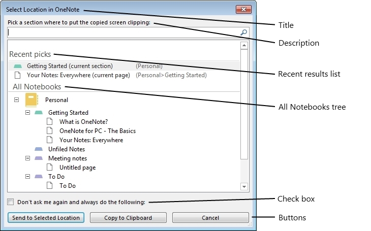

# <a name="quick-filing-dialog-box-interfaces-onenote"></a>クイック ファイリング ダイアログ ボックス インタ フェース (OneNote 2013)

このトピックは、 OneNote 2013では、[クイック ファイリング] ダイアログ ボックスをプログラムでカスタマイズするのに使用できるインターフェイスについて説明します。
  
## <a name="quick-filing-dialog-box"></a>クイック ファイリング ダイアログ ボックス

クイック ファイリング] ダイアログ ボックスのOneNote 2013では、OneNote の階層構造内の場所を選択できるようにするカスタマイズ可能なダイアログ ボックスです。選択可能な場所には、ノートブック、セクション グループ、セクション、ページおよびサブページが含まれます。ダイアログ ボックスは、OneNote アプリケーション内およびOneNote 2013 API を通じて、外部アプリケーションによって使用されます。図 1 は、既定の状態でクイック ファイリング] ダイアログ ボックスを示します。
  
**図 1。クイック ファイリング] ダイアログ ボックスのカスタマイズなし**


  
ユーザー、ダイアログ ボックス内の特定の場所、または、テキスト ボックスに入力することによって、OneNote ツリー構造の検索をすべてのノートブックの階層を移動できます。カスタマイズ可能なダイアログ ボックスの側面には、タイトル、説明、最近の結果のリスト、チェック ボックスのテキストと状態、ツリーの深さ、ボタン、および選択可能な場所の種類が含まれます。

クイック ファイリング ダイアログ ボックス機能はOneNote 2013の 2 つのインターフェイスを通じてアクセスできます。 **IQuickFilingDialog**インタ フェースのインスタンスを作成、設定することができます、ダイアログ ボックスを実行する. **IQuickFilingDialogCallback**インターフェイスは、ダイアログ ボックスが閉じられた後に呼び出されます。ダイアログ ボックスは、OneNote のプロセスで実行されるため、ダイアログ ボックスのスレッドの実行を維持する機構が必要にしが閉じているときに、ユーザーの選択やダイアログ ボックスの状態をキャプチャします。 
  
## <a name="iquickfilingdialog-interface"></a>IQuickFilingDialog インタ フェース
<a name="odc_IQuickFilingDialog"> </a>

このインターフェイスをカスタマイズして、ダイアログ ボックスを実行することができます。ユーザーは、 **Application.QuickFilingDialog**メソッドを使用して、 **Application**クラスを使用する] ダイアログ ボックスをインスタンス化できます。このメソッドはダイアログ ボックスのインスタンスを返します。 **IQuickFilingDialog.Run**メソッドのプロパティ] ダイアログ ボックスの設定は、ダイアログ ボックスを実行する使用されます。このメソッドは、新しいスレッドで、ダイアログ ボックスを実行します。 
  
**新しいプロパティ**

|**名前**|**型**|**説明**|
|:-----|:-----|:-----|
|**Title** <br/> |string  <br/> |取得またはダイアログ ボックス ウィンドウのタイトル バーに表示されるタイトル テキストを設定します。  <br/> |
|**Description** <br/> |string  <br/> |取得または設定、テキストの説明に何を選択するように指示します。この値は、複数行のテキストを指定できます。  <br/> |
|**CheckboxText** <br/> |string  <br/> |取得または、次のチェック ボックスのテキストを設定します。この値が空でない文字列に設定] ダイアログ ボックスで、チェック ボックスが表示されます。値は、空の文字列は、チェック ボックスは表示されません。  <br/> |
|**CheckboxState** <br/> |bool  <br/> |取得またはチェック ボックスの状態を設定します。 **false**に設定されている場合、ダイアログ ボックスを起動します] チェック ボックスは消去されます。 **true**が指定されている場合、ダイアログ ボックスの **CheckboxText**が空でない文字列が開始されると、このチェック ボックスが選択されます。 <br/> |
|**WindowHandle** <br/> |ulong  <br/> |クイック ファイリング ダイアログ ボックス ウィンドウのハンドル ID を取得します。  <br/> |
|**TreeDepth** <br/> |**HierarchyElement** <br/> |取得または設定、OneNote ツリー深さ、すべてのノートブック セクションに表示されます。既定では最大のセクションでは、ツリーが表示されます。このプロパティは要素の種類を選択することができます。 <br/> **TreeDepth**設定されている場合、要素をボタンのいずれかを選択できますが、OneNote の階層の下位に、表示されているツリーの深さは最も低い可能の選択可能な要素になります。つまり、ツリーの深さは、ページに表示する設定が選択可能な最小の要素は、セクション、セクションにツリーが表示されます。 <br/> |
|**ParentWindowHandle** <br/> |ulong  <br/> |取得またはダイアログ ボックスの親ウィンドウのハンドル ID を設定します。このプロパティが設定されている場合クイック ファイリング] ダイアログ ボックスになります割り当てられている親ウィンドウをモーダル ダイアログ ボックスを開くと。ユーザーはクイック ファイリング] ダイアログ ボックスが閉じられるまで、親ウィンドウにアクセスすることはできません。  <br/> |
|**Position** <br/> |tagPOINT  <br/> |取得または、画面を基準にして、[ウィンドウの位置を設定します。既定では親ウィンドウまたはデスクトップの中央に、ダイアログ ボックスが表示されます。  <br/> |
|**SelectedItem** <br/> |string  <br/> |ダイアログ ボックスを閉じたときに、ユーザーが選択した OneNote の場所のオブジェクト ID を取得します。オブジェクトが設定されている場合は、ユーザーが **[キャンセル**] ボタンをクリックすると、null にします。 <br/> |
|**PressedButton** <br/> |ulong  <br/> |ダイアログ ボックスが閉じるときにクリックしてされたボタンを取得します。 **[キャンセル**] ボタンがクリックしてされた場合は、このプロパティは-1 を返します。他のすべてのボタンがダイアログ ボックスに追加のボタンごとに 1 ずつインクリメントされます、0 から整数値が割り当てられます。既定の **[ok]** ボタンの整数の値は 0 です。 <br/> |
   
### <a name="methods"></a>メソッド

**SetRecentResults**

|||
|:-----|:-----|
|**説明** <br/> |クイック ファイリング ダイアログ ボックスで、どのような最近の結果のリストが表示されますを設定していくつかの特別なファイリングの場所リストに追加するかどうかを示します。ユーザーは、 [RecentResultType](enumerations-onenote-developer-reference.md#odc_RecentResultType)列挙体からの最近の結果リストを選択できます。ユーザーは、次のオプションを一覧に追加する選択もできます。 現在のセクション、現在のページ、または落書きノート。 **RecentResultType.rrtNone**を選択すると、結果の最新のリストは表示されません。 <br/> |
|**構文** <br/> | `HRESULT SetRecentResults (`<br/>`[in]RecentResultType recentResults,`<br/>`[in]VARIANT_BOOL fShowCurrentSection,`<br/>`[in]VARIANT_BOOL fShowCurrentPage,`<br/>`[in]VARIANT_BOOL fShowUnfiledNotes);` <br/> |
|**パラメーター** <br/> | _recentResults_&ndash;型のオブジェクトをどの最近の結果のリストを示す**RecentResultType**が表示されます。 **rrtNone**がオンの場合] ダイアログ ボックスで最新の結果のリストは表示されません。<br/><br/>  _fShowCurrentSection_&ndash;最近の結果リストの現在のセクションを含める必要があるかどうかを示す真偽値。<br/><br/>  _fShowCurrentPage_&ndash;を現在のページが最新の結果リストに入れるべきかどうかを示す真偽値。<br/><br/>  _fShowUnfiledNotes_&ndash;最近の結果リストの落書きノート セクションを含める必要があるかどうかを示す真偽値。  <br/> |
   
> [!NOTE]
> [!メモ] 特別なファイリングの場所] ダイアログ ボックスで、ボタンのいずれかで選択できません、する場合、一覧には表示されません。最近の結果の一覧で、選択可能な項目が見つからない場合、結果の最新のリストは表示されません。 
  
次の使用例は、最近の結果の一覧で、現在のセクション、現在のページと、落書きノート セクションを表示するのに、 **SetRecentResults**メソッドを使用します。 
  
```cs
        static void Main(string[] args)
        {
            Microsoft.Office.Interop.OneNote.Application app = 
                new Microsoft.Office.Interop.OneNote.Application();
            ... 
            // RECENT RESULTS
            qfDialog.SetRecentResults(RecentResultType.rrtFiling,
                /*Current Section*/ true,
                /*Current Page*/ true,
                /*Unfiled Notes*/ true);
            ...
        }

```

**AddButton**

|||
|:-----|:-----|
|**説明** <br/> |ユーザーを追加し、ダイアログ ボックスのボタンをカスタマイズできます。ユーザーは、ボタンと各ボタンで選択できるは、OneNote の階層の要素に、テキストを指定できます。  <br/> |
|**構文** <br/> | `HRESULT AddButton (`<br/>`[in]BSTR bstrText,`<br/>`[in]HierarchyElement allowedElements,`<br/>`[in]HierarchyElement allowedReadOnlyElements,`<br/>`[in]VARIANT_BOOL fDefault);` <br/> |
|**パラメーター** <br/> | _bstrText_&ndash; ] ボタンを表示するテキストを指定する文字列。 既定の **[ok]** ボタンをカスタマイズするには、null 値 **bstrText**として渡します。  <br/><br/>_allowedElements_&ndash;どのような読み取り専用ではない OneNote の階層の要素を示すための**HierarchyElement**ボタンをクリックして選択をユーザーに許可します。 複数の項目を選択すると、ユーザーはすべて、uint と同じ型の値、 **HierarchyElement**の**HierarchyElement**として使用できるの**OR**演算子でに渡す必要があります。<br/><br/>  _allowedReadOnlyElements_&ndash;どのような OneNote の読み取り専用の階層の要素を示すための**HierarchyElement**ボタンをクリックして選択をユーザーに許可します。 複数の項目を選択すると、ユーザーは、 **HierarchyElement**として使用できる**HierarchyElement**の種類のすべての**uint**に対応する値の**OR**演算子でに渡す必要があります。<br/><br/>  _fDefault_&ndash;は、このボタンが既定のボタンにするかどうかを示す真偽値。 複数のボタンを既定値として設定した場合、最後に指定したボタンが既定のボタンになります。  <br/> |
   
次の使用例は、3 つのボタンをクイック ファイリング ダイアログ ボックス。OneNote の階層ツリー内のすべての要素を **すべて**最初のものを選択できます。他、 **ノートブック** **ページ**、ノート パソコンと、ページは、対応する要素が選択されている場合にのみ選択できます。
  
```cs
        static void Main(string[] args)
        {
            Microsoft.Office.Interop.OneNote.Application app = 
                new Microsoft.Office.Interop.OneNote.Application();
            ... 
            
            // BUTTONS
            HierarchyElement heAll = (HierarchyElement) 
                ((uint)HierarchyElement.heNotebooks | 
                (uint)HierarchyElement.heSectionGroups | 
                (uint)HierarchyElement.heSections |  
                (uint)HierarchyElement.hePages);
            
            qfDialog.AddButton("All", heAll, heAll, true);
            qfDialog.AddButton("Notebooks", HierarchyElement.heNotebooks, 
                HierarchyElement.heNotebooks, false);
            qfDialog.AddButton("Pages", HierarchyElement.hePages, 
                HierarchyElement.hePages, false);
            ... 
        }

```

**Run**

|||
|:-----|:-----|
|**説明** <br/> |新しいスレッドからクイック ファイリング ダイアログ ボックスが表示されます。ダイアログ ボックスを閉じますを **OnDialogClosed**メソッドが呼び出されます、 **IQuickFilingDialogCallback**インターフェイスへの参照になります。 <br/> |
|**構文** <br/> | `HRESULT Run (`<br/>`[in]IQuickFilingDialogCallback piCallback);` <br/> |
|**パラメーター** <br/> | _piCallback_&ndash;ダイアログ ボックスが閉じ後にインスタンス化される**IQuickFilingDialogCallback**インターフェイスへの参照。  <br/> |
   
新しいスレッドからクイック ファイリング ダイアログ ボックスを表示、 **Run**メソッドを次のコード例に示します。 
  
```cs
    class OpenQuickFilingDialog
    {
            ... 
        static void Main(string[] args)
        {
            Microsoft.Office.Interop.OneNote.Application app = 
                new Microsoft.Office.Interop.OneNote.Application();
            ... 
            // Display Quick Filing UI
            qfDialog.Run(new Callback());
            ... 
        }
    }

```

**TreeCollapsedState**

|||
|:-----|:-----|
|**説明** <br/> |階層ツリーを展開または縮小する必要があるかどうかを示します。  <br/> |
|**構文** <br/> | `HRESULT TreeCollapsedState(`<br/>`[in] TreeCollapsedStateType tcs);` <br/> |
|**パラメーター** <br/> | _tcs_では、ツリーを展開するか、折りたたまれているかどうかを指定します。  <br/> |
   
**NotebookFilterOut**

|||
|:-----|:-----|
|**説明** <br/> |ノート パソコンの種類別に表示の一覧をフィルター処理します。  <br/> |
|**構文** <br/> | `HRESULT NotebookFilterOut(`<br/>`[in] NotebookFilterOutType nfo);` <br/> |
|**パラメーター** <br/> | _nfo_ - は、ボックスの一覧からフィルターを適用するのには、ノートブックのセットを指定します。  <br/> |
   
**ShowCreateNewNotebook**

|||
|:-----|:-----|
|**説明** <br/> |新規のノートブックの作成] ダイアログ ボックスを表示します。  <br/> |
|**構文** <br/> | `HRESULT ShowCreateNewNotebook ();` <br/> |
|**パラメーター** <br/> |なし  <br/> |
   
**AddInitialEditor**

|||
|:-----|:-----|
|**説明** <br/> |クイック ファイリング] ダイアログ ボックスで、ノートを初期のエディターとしてユーザーを追加します。  <br/> |
|**構文** <br/> | `HRESULT AddInitialEditor (BSTR initialEditor);` <br/> |
|**パラメーター** <br/> | _initialEditor_のノートブックには、エディターとして追加するユーザーの電子メール アドレス。クイック ファイリング] ダイアログ ボックスを使用してノートブックを作成するときに初期のすべてのエディターで自動的に共有されます。 <br/> |
   
**ClearInitialEditors**

|||
|:-----|:-----|
|**説明** <br/> |クイック ファイリング ダイアログ ボックスからすべての最初のエディターを削除します。  <br/> |
|**構文** <br/> | `HRESULT ClearInitialEditors ();` <br/> |
|**パラメーター** <br/> |なし  <br/> |
   
**ShowSharingHyperlink**

|||
|:-----|:-----|
|**説明** <br/> |クイック ファイリング] ダイアログ ボックスで、共有のヘルプ ハイパーリンクが表示されます。  <br/> |
|**構文** <br/> | `HRESULT ShowSharingHyperlink();` <br/> |
|**パラメーター** <br/> |なし  <br/> |
   
## <a name="iquickfilingdialogcallback-interface"></a>IQuickFilingDialogCallback インタ フェース
<a name="odc_IQuickFilingDialog"> </a>

このインターフェイス、ダイアログ ボックスを閉じた後、ダイアログ ボックスのプロパティにアクセスすることができます。OneNote 2013は、ダイアログ ボックスを閉じると、このインターフェイスの **IQuickFilingDialogCallback.OnDialogClose**メソッドを呼び出します。 
  
このインターフェイスを継承するクラスを定義するのには。
  
### <a name="methods"></a>メソッド

次のセクションは以前詳細なインターフェイスに関連付けられたメソッドについて説明します。
  
**OnDialogClosed**

|||
|:-----|:-----|
|**説明** <br/> |キャプチャ] ダイアログ ボックスで、ユーザーの選択を使用して機能を追加することができます。クイック ファイリング] ダイアログ ボックスを閉じた後に、このメソッドは呼び出されます。このメソッドは、 **IQuickFilingDialogCallback**インタ フェースを定義する必要がある関数です。 <br/> |
|**構文** <br/> | `HRESULT OnDialogClosed (`<br/>`[in]IQuickFilingDialog dialog);` <br/> |
|**パラメーター** <br/> | _ダイアログ_&ndash; **IQuickFilingDialog**オブジェクトの**OnDialogClose**メソッドを呼び出した。  <br/> |
   
次の使用例は、サンプルの **IQuickFilingDialogCallback**インターフェイスです。 **OnDialogClose**メソッドは、ユーザーの選択クイック ファイリング] ダイアログ ボックスでコンソールに出力します。 
  
```cs
    class Callback : IQuickFilingDialogCallback
    {
        public Callback(){}
        public void OnDialogClosed(IQuickFilingDialog qfDialog)
        {
            Console.WriteLine(qfDialog.SelectedItem);
            Console.WriteLine(qfDialog.PressedButton);
            Console.WriteLine(qfDialog.CheckboxState);
        }
    }

```

## <a name="example"></a>例
<a name="odc_IQuickFilingDialog"> </a>

次のコード例では、カスタマイズされたタイトル、説明、最近の結果のリスト、ツリーの深さ、] チェック ボックスおよびボタンは、クイック ファイリング ダイアログ ボックスを開きます。ユーザーのボタンを押して、項目を選択して、ダイアログ ボックスを閉じると、コンソール ウィンドウでチェック ボックスの状態が表示されます。有効になっているページのボタンを表示するには、ユーザーはツリーの深さはのセクションに設定されているため、ページを検索し、選択する必要があります。ダイアログ ボックスは任意のウィンドウの子ウィンドウです。
  
```cs
using System;
using System.Collections.Generic;
using System.Linq;
using System.Text;
using System.Threading;
using Microsoft.Office.Interop.OneNote;
namespace SampleQFD
{
    class OpenQuickFilingDialog
    {
        private static EventWaitHandle wh = new AutoResetEvent(false);
        private static IQuickFilingDialog qfDialog;
        private static String strTitle = "Sample Title";
        private static String strDescription = "Sample Description";
        private static String strCheckboxText = "Sample Checkbox";
        static void Main(string[] args)
        {
            Microsoft.Office.Interop.OneNote.Application app = 
                new Microsoft.Office.Interop.OneNote.Application();
            // Instantiate Quick Filing UI
            qfDialog = app.QuickFiling();
            #region//SET API PARAMETERS
            // TITLE
            qfDialog.Title = strTitle;
            // DESCRIPTION
            qfDialog.Description = strDescription;
            // RECENT RESULTS
            qfDialog.SetRecentResults(RecentResultType.rrtFiling,
                /*Current Section*/ true,
                /*Current Page*/ true,
                /*Unfiled Notes*/ true);
            // TREE DEPTH
            qfDialog.TreeDepth = HierarchyElement.heSections;
            // CHECKBOX
            qfDialog.CheckboxText = strCheckboxText;
            qfDialog.CheckboxState = false;
            // BUTTONS
            HierarchyElement heAll = (HierarchyElement) 
                ((uint)HierarchyElement.heNotebooks | 
                (uint)HierarchyElement.heSectionGroups | 
                (uint)HierarchyElement.heSections |  
                (uint)HierarchyElement.hePages);
            
            qfDialog.AddButton("All", heAll, heAll, true);
            qfDialog.AddButton("Notebooks", HierarchyElement.heNotebooks, 
                HierarchyElement.heNotebooks, false);
            qfDialog.AddButton("Pages", HierarchyElement.hePages, 
                HierarchyElement.hePages, false);
            // PARENTWINDOW
            #endregion
            // Display Quick Filing UI
            qfDialog.Run(new Callback());
            // Clean up and Wait so console window does not close
            qfDialog = null;
            wh.WaitOne();
        }
    }
    class Callback : IQuickFilingDialogCallback
    {
        public Callback(){}
        public void OnDialogClosed(IQuickFilingDialog qfDialog)
        {
            Console.WriteLine(qfDialog.SelectedItem);
            Console.WriteLine(qfDialog.PressedButton);
            Console.WriteLine(qfDialog.CheckboxState);
        }
    }
}

```

## <a name="see-also"></a>関連項目

- [OneNote の開発者用リファレンス](onenote-developer-reference.md)

