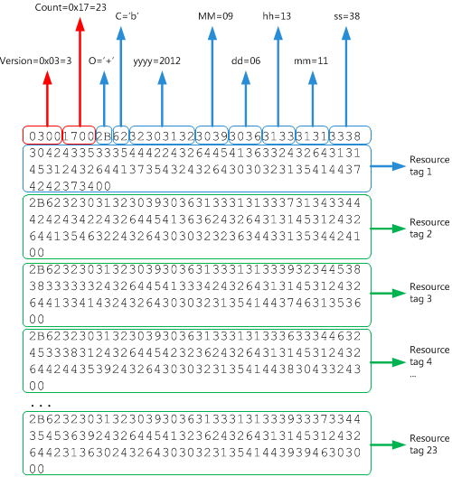

# POP3 アカウントのメッセージ ダウンロード履歴の解析Parsing the message download history for a POP3 account

このトピックでは、そのアカウントでダウンロードまたは削除されたメッセージを識別するために、POP3 アカウントのメッセージダウンロード履歴を表す POP3 BLOB の構造について説明します。This topic describes the structure of the POP3 BLOB that represents the message download history of a POP3 account, to identify the messages that have been downloaded or deleted on that account.

## メッセージのダウンロード履歴を解析する理由Why parse the message download history?

Outlook の post Office プロトコル (POP) プロバイダーを使用すると、ユーザーはローカル デバイス上の新しい電子メール メッセージを取得してダウンロードし、その後、メール サーバー上でこれらの電子メール メッセージを残したり削除したりできます。The Post Office Protocol (POP) provider for Outlook allows users to retrieve and download new email messages on their local device, and subsequently to leave or delete these email messages on the mail server. メール クライアントは、ダウンロードする新しいメッセージをチェックするときに、その受信トレイの新しいメッセージのみを識別してダウンロードできる必要があります。When the mail client checks for new messages to download, it has to be able to identify and download only the new messages for that Inbox. メール クライアントは、まず UIDL (Unique ID Listing) コマンドを使用して、その受信トレイに一意の識別子 (UID) に配信された各メッセージのマップを取得します。The mail client does this by first using the UIDL (Unique ID Listing) command to obtain a map of each message that has ever been delivered to that Inbox to a unique identifier (UID). クライアントは、そのクライアントの受信トレイに対してダウンロードまたは削除されたメッセージのメッセージダウンロード履歴も取得します。The client also gets the message download history for messages that have been downloaded or deleted for the Inbox on that client. メッセージ UID マップとダウンロード履歴を使用して、クライアントは履歴から存在しないメッセージを新しいメッセージとして識別し、したがってダウンロードする必要があります。Using the message UID map and download history, the client can then identify those messages that are absent from the history as new and, hence, should be downloaded.
  
受信トレイのメッセージダウンロード履歴を取得するには、次の方法を実行します。To get the messages download history for an Inbox:
  
- [「POP3](locating-the-message-download-history-for-a-pop3-account.md)アカウントのメッセージダウンロード履歴を検索する」の手順に従って、POP3 アカウントのメッセージ履歴を表すバイナリ ラージ オブジェクト (BLOB) を含む[PidTagAttachDataBinary](https://msdn.microsoft.com/library/3b0a8b28-863e-4b96-a4c0-fdb8f40555b9%28Office.15%29.aspx)プロパティを検索します。Follow the steps in [Locating the message download history for a POP3 account](locating-the-message-download-history-for-a-pop3-account.md) to find the [PidTagAttachDataBinary](https://msdn.microsoft.com/library/3b0a8b28-863e-4b96-a4c0-fdb8f40555b9%28Office.15%29.aspx) property, which contains a binary large object (BLOB) that represents the message history for a POP3 account. 
    
- このトピックでは、BLOB の構造について説明し、POP3 アカウントの受信トレイに対してダウンロードまたは削除されたメッセージを識別するための BLOB の例を示します。Read this topic, which describes the structure of the BLOB, and shows an example BLOB to identify messages that have been downloaded or deleted for the Inbox of the POP3 account.

## POP BLOB 構造POP BLOB structure

表 1 で説明されている POP BLOB 構造は、Versionと **Count** の 2つのフィールドから始まり、その後に Count のリソース タグの数が続き、それぞれが null で終了します。The POP BLOB structure, as described in Table 1, begins with two fields, **Version** and **Count**, followed by a **Count** number of resource tags, each of which is null-terminated. 
  
**表 1.POP3 アカウントのメッセージダウンロード履歴を表す BLOB の構造****Table 1. Structure of the BLOB that represents the message download history of a POP3 account**

|**BLOB のフィールド****Field in BLOB**|**[サイズ]****Size**|**説明****Description**|
|:-----|:-----|:-----|
|**バージョン****Version**   |2 バイト2 bytes    |3 ( PBLOB_VERSION_NUM )**である必要があります**。Must be 3 (**PBLOB_VERSION_NUM**).    |
|**Count****Count**   |2 バイト2 bytes    |この BLOB 内のリソース タグの数。The number of resource tags in this BLOB.    |
|リソース タグResource tag    |変数Variable    |リソース タグをエンコードする 0 UTF-8 null 終端文字列。0 or more null-terminated UTF-8 strings that encode the resource tags. null 終端文字列の数は Count と一致する **必要があります**。The number of null-terminated strings must match **Count**.    |
   
各リソース タグは、メッセージに適用される操作、操作に関する日時のメタデータを指定し、メッセージの UID をエンコードします。Each resource tag specifies the operation that is applied to a message, some date-time metadata about the operation, and encodes the UID of the message. リソース タグ文字列の形式は次のように分解され、表 2 でさらに説明します。The format of a resource tag string is broken down as follows, and is further explained in Table 2. 
  
`Ocyyyymmddhhmmssuuu...`
  
**表 2.リソース タグの構造****Table 2. Structure of a resource tag**

|**リソース タグのフィールド****Field in a resource tag**|**[サイズ]****Size**|**説明****Description**|
|:-----|:-----|:-----|
| `O`   |1 文字1 character    |電子メール メッセージに対して実行された操作。The operation performed on the email message. 値は"+"、"-"、または ""である必要があります。これは、それぞれ正常な取得、削除、または &amp; get-and-delete 操作を示します。The value must be "+", "-", or "&amp;", which indicates a successful get, delete, or get-and-delete operation, respectively.    |
| `c`   |1 文字1 character    |操作に関係するメッセージ コンテンツの部分。The part of the message content involved in the operation. 値は"、"h"、または "b" である必要があります。これは、それぞれ none、ヘッダー、または本文の内容を示します。The value must be " ", "h", or "b", which indicates the content of none, header, or body, respectively.    |
| `yyyy`   |4 文字4 characters    |操作の 4 桁の年。The four-digit year of the operation.    |
| `MM`   |2 文字2 characters    |操作の 2 桁の月。The two-digit month of the operation.    |
| `dd`   |2 文字2 characters    |操作の 2 桁の日。The two-digit day of the operation.    |
| `hh`   |2 文字2 characters    |操作の 2 桁の時間。The two-digit hour of the operation.    |
| `mm`   |2 文字2 characters    |操作の 2 桁の分。The two-digit minute of the operation.    |
| `ss`   |2 文字2 characters    |操作の 2 桁の秒。The two-digit second of the operation.    |
| `uuu…`   |可変長Variable length    |メッセージのエンコードされた UID。The encoded UID of a message.    |

## 例Example

図 1 は、POP アカウントのメッセージダウンロード履歴を表す BLOB の例を示しています。Figure 1 shows an example of a BLOB that represents the message download history of a POP account. 
  
**図 1.POP3 アカウントのメッセージダウンロード履歴の BLOB 構造の例****Figure 1. Example BLOB structure for the message download history of a POP3 account**

  
表 1 と表 2 に記載されている構造に基づいて、この BLOB は 23 の電子メール メッセージのダウンロード履歴を表します。Based on the structure described in Table 1 and Table 2, this BLOB represents the download history of 23 email messages.
  
各リソース タグで生の UID を解析するには、UID は次のエンコードに従います。UID の文字は主に英数字で、英数字以外の各文字の前には ASCII 文字 "$" (0x24) が付きます。To parse the raw UID in each resource tag, be aware that the UID follows this encoding: characters in a UID are mostly alphanumeric characters, and each non-alphanumeric character is preceded by the ASCII character "$" (0x24). したがって、ASCII 文字 $2d は英数字以外の文字 "-" を表します。So the ASCII characters $2d represent the non-alphanumeric character "-". 図 2 は、最初にリソース タグ 1 の生 UID を ASCII 表記に変換し、その後に"$" の前に英数字以外の文字を変換して実際の UID を生成する例を示しています。Figure 2 shows an example of first converting the raw UID in resource tag 1 to the ASCII representation, then converting any non-alphanumeric character preceded by "$" to produce the actual UID:
  
`0BC535DB-EA63-11E1-A75C-00215AD7BB74`
  
**図 2.リソース タグの生 UID を実際のメッセージ UID に変換する****Figure 2. Converting the raw UID in a resource tag to the actual message UID**

  
この BLOB のリソース タグ 1 を解釈するには、UID を含むメッセージが  `0BC535DB-EA63-11E1-A75C-00215AD7BB74` 2012 年 9 月 6 日 13:11:38 に正常に取得されました。To interpret resource tag 1 in this BLOB: the message with the UID  `0BC535DB-EA63-11E1-A75C-00215AD7BB74` was successfully retrieved on September 6, 2012, at 13:11:38. 
  
同様に、その BLOB の残りの 22 のリソース タグを解析できます。You can similarly parse the remaining 22 resource tags for that BLOB.
  
## 関連項目See also

- [POP3 アカウントのメッセージ ダウンロードの管理Managing message downloads for POP3 accounts](managing-message-downloads-for-pop3-accounts.md)    
- [POP3 アカウントのメッセージのダウンロードの履歴を検索します。Locating the message download history for a POP3 account](locating-the-message-download-history-for-a-pop3-account.md)    
- [POP3 UIDL 履歴の解析Parsing the POP3 UIDL History](https://blogs.msdn.com/b/stephen_griffin/archive/2012/12/04/parsing-the-pop3-uidl-history.aspx)
    

