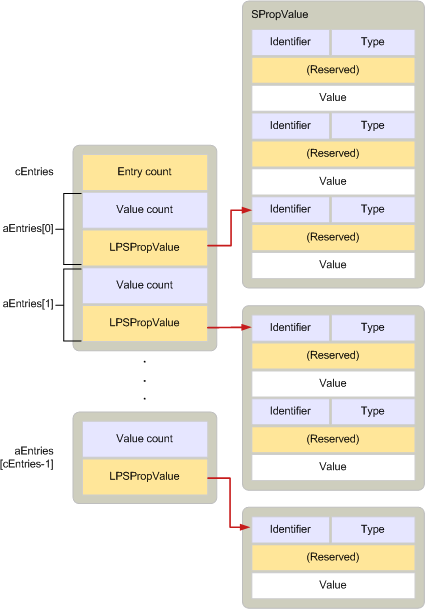

# <a name="adrlist"></a>ADRLIST

**適用対象**: Outlook 2013 | Outlook 2016 
  
1つまたは複数の受信者に属する0個以上のプロパティを記述します。 
  
|||
|:-----|:-----|
|ヘッダー ファイル:  <br/> |mapidefs.h  <br/> |
|関連するマクロ:  <br/> |[cbadrlist](cbadrlist.md)、 [cbnewadrlist](cbnewadrlist.md)、 [cbnewadrlist](cbnewadrlist.md) <br/> |
   
```cpp
typedef struct _ADRLIST
{
  ULONG cEntries;
  ADRENTRY aEntries[MAPI_DIM];
} ADRLIST, FAR *LPADRLIST;

```

## <a name="members"></a>メンバー

**centries**
  
> **aentries**メンバーによって指定された配列内のエントリの数。 
    
**aentries**
  
> [adrentry](adrentry.md)構造体の配列。各受信者の1つの構造体です。 
    
## <a name="remarks"></a>注釈

**adrlist**構造体には、1つまたは複数の**adrlist**構造体が含まれており、それぞれが受信者のプロパティを記述します。 受信者は未解決の場合があります。 これは、プロパティ値の配列にエントリ識別子がないことを意味します。 解決された受信者は **、\_PR ENTRYID** ([PidTagEntryId](pidtagentryid-canonical-property.md)) プロパティが含まれていることを意味します。 通常、解決された受信者には、 **PR_EMAIL_ADDRESS** ([PidTagEmailAddress](pidtagemailaddress-canonical-property.md)) プロパティの電子メールアドレスもあります。 ただし、電子メールアドレスは必須ではありません。 **adrlist**構造体は、たとえば、送信メッセージの受信者の一覧を記述したり、MAPI でアドレス帳のエントリを表示したりするために使用されます。 
  
**adrlist**構造は、[行セット](srowset.md)構造に似ています。テーブル内の行を表すために使用される構造。 実際には、これら2つの構造は、同じように使用できるように設計されています。 両方には、プロパティのグループと、配列内の値の数を記述する構造の配列が含まれています。 **adrlist**構造体には、配列に[adrlist](adrentry.md)構造体が含まれ**** ています。この配列には、srowset 構造体が含まれています。 [](srow.md) レイアウトでは、 **adrentry**構造体と**srow**構造は同じです。 **adrlist**および**srowset**構造は同じ割り当てルールに従っているため、アドレス帳コンテナーの contents テーブルから取得される**srowset**構造は、 **adrlist**構造体にキャストして、その代わりに使用することができます。 
  
次の図は、 **adrlist**構造のレイアウトを示しています。 
  
**ADRLIST コンポーネント**
  

  
adrentry 構造体の**adrentry**および**** [spropvalue](spropvalue.md)の部分は、他の部分とは独立して割り当てられ、解放される必要があります。 つまり、adrentry 構造体を解放する前に、 **adrentry**構造体のメモリを割り当てて解放した後**** で、各**spropvalue**構造体を個別に割り当てる必要があります。 このようにメモリを処理することで、受信者および個々の受信者のプロパティをアドレス一覧から自由に追加または削除することができます。 
  
**adrlist**構造体とそのすべての部分を割り当てて解放するには、 [MAPIAllocateBuffer](mapiallocatebuffer.md)関数と[MAPIFreeBuffer](mapifreebuffer.md)関数を使用する必要があります。 
  
受信者の一覧が大きすぎてメモリに入らない場合、クライアントは[IMessage:: modifyrecipients](imessage-modifyrecipients.md)メソッドを呼び出して、リストのサブセットを操作することができます。 クライアントは、このような状況では、アドレス帳の共通ダイアログボックスを使用しないでください。 
  
**adrentry**構造にメモリを割り当てる方法の詳細については、「 [adrentry および srowset 構造体のメモリの管理](managing-memory-for-adrlist-and-srowset-structures.md)」を参照してください。 
  
## <a name="see-also"></a>関連項目

- [ADRENTRY](adrentry.md)  
- [CbNewADRLIST](cbnewadrlist.md) 
- [IMessage::ModifyRecipients](imessage-modifyrecipients.md) 
- [SRowSet](srowset.md)
- [MAPI の構造](mapi-structures.md)

