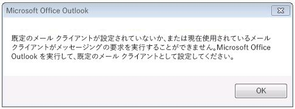
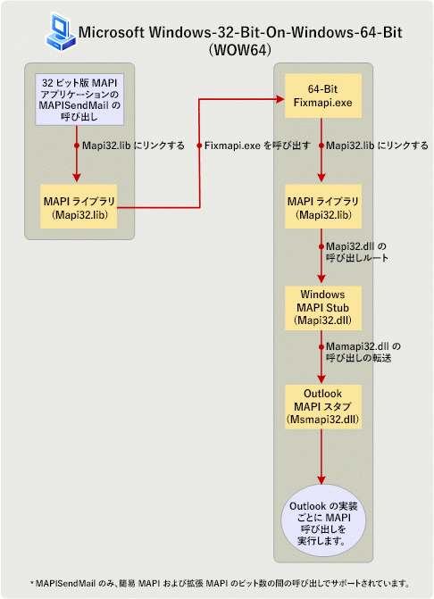

# 32 ビットと 64 ビット プラットフォーム上の MAPI アプリケーションの構築

**適用されます**: Outlook 2013 |Outlook 2016 
  
このトピックでは、MAPI 開発者が変更し、64 ビット プラットフォーム上で実行するのには MAPI アプリケーションを 32 ビットと 32 ビット プラットフォーム上で実行する 64 ビット アプリケーションを再ビルドする実行する操作について説明します。 このトピックでは、64 ビット プラットフォームとは、64 ビットの Microsoft Outlook と 64 ビットの Windows がインストールされているコンピューターで 32 ビット プラットフォームとは、Outlook の 32 ビットと 32 ビットまたは 64 ビットの Windows がインストールされているコンピューター。 
  
## オペレーティング システムと Office を 64 ビットの Outlook のサポートします。

> [!NOTE]
> 用語のビット数は、32 ビットと 64 ビット プロセッサ アーキテクチャと関連するアプリケーションとの互換性の違いを意味します。 このトピックでは、Windows、Microsoft Office、Outlook、または MAPI アプリケーションが、コンピューターの 32 ビットまたは 64 ビット プロセッサ アーキテクチャに合わせて構築およびそのコンピューター上で実行される他のアプリケーションのバージョンを適用するビット数が使用されます。 
  
開始すると、Microsoft Office 2010年では、Outlook が使用可能な 32 ビットおよび 64 ビット アプリケーションとして。 同じコンピューターは、Office がコンピューターに既にインストールされている場合も、Outlook のビットはビット (x86 または x64) は、Windows オペレーティング システムおよび Microsoft Office に依存します。 以下は、32 ビットまたは 64 ビット バージョンの Outlook のインストールの実行可能性を決定する要因の一部です。
  
- 32 ビットの Office (および 32 ビットの Outlook) は、32 ビット版と 64 ビット版の Windows オペレーティング システムにインストールできます。64 ビットの Office (および 64 ビットの Outlook) は、64 ビット版の Windows オペレーティング システムにのみインストールできます。
    
- 既定では、64 ビット版の Windows オペレーティング システムに 32 ビットの Office がインストールされます。
    
- インストール済みのバージョンの Outlook のビットは、同じコンピューターに Office がインストールされている場合常に Office でのビット数と同じです。 つまり、32 ビット バージョンの Outlook を既にインストールされている Microsoft Word の 64 ビットまたは 64 ビットの Microsoft Excel など他の Office アプリケーションの 64 ビット バージョンを同じコンピューターにインストールできません。 同様に、64 ビット バージョンの Outlook を既にインストールされている他の Office アプリケーションの 32 ビット バージョンを同じコンピューターにインストールできません。
    
## 32 ビットと 64 ビット プラットフォーム用の MAPI アプリケーションの準備をしています。

MAPI アプリケーションには、Microsoft の Communicator と MFCMAPI、およびアドレス帳などのサービス プロバイダーは、保存、およびトランスポート プロバイダーなど、スタンドアロン アプリケーションが含まれます。 MAPI メソッドおよび関数の MAPI アプリケーションのビットを (簡易 MAPI 機能の 1 つ、MAPISendMail)、以外の MAPI アプリケーションで操作を呼び出す必要があるアプリケーションを対象とするコンピューター上の MAPI サブシステムのビット数と同じ上で実行します。 MAPI サブシステムのビット数で決まりますが、常にインストールされているバージョンの Outlook のビット数と同じです。 次の表は、Office およびさまざまなビットの Windows で構成されている対象のコンピューター上で実行するのには MAPI アプリケーションを準備するために必要なアクションをまとめたものです。
  
|MAPI アプリケーションのビット数|対象のコンピューター上の Outlook のビット数|対象のコンピューター上の Windows のビット数|対象となるコンピューター上で実行するアプリケーションを有効にするために必要なアクション|
|:-----|:-----|:-----|:-----|
|32 ビット    |32 ビット    |32 ビットまたは 64 ビット    |特定のアクションは必要ありません。    |
|32 ビット    |64 ビット    |64 ビット    |64 ビット アプリケーションとしてアプリケーションを再構築します。 それ以外の場合、すべての MAPI メソッドおよび関数呼び出し ( **MAPISendMail**) 以外は失敗します。    |
|64 ビット    |64 ビット    |64 ビット    |特定のアクションは必要ありません。    |
|64 ビット    |32 ビット    |32 ビットまたは 64 ビット    |32 ビット アプリケーションとしてアプリケーションを再構築します。 それ以外の場合、すべての MAPI メソッドおよび関数呼び出し ( **MAPISendMail**) 以外は失敗します。    |
   
さらに次のセクションでは、各シナリオについて説明します。 MAPI アプリケーションを再構築を必要とするシナリオにリンクして、MAPI の関数の呼び出しに関する詳細については[MAPI の関数へのリンク](how-to-link-to-mapi-functions.md)を参照してください。 
  
### MAPI アプリケーションを 32 ビットと 32 ビットの Outlook

Outlook の 32 ビットと 32 ビットまたは 64 ビットの Windows がインストールされているコンピューターでサポートされている MAPI アプリケーションが Microsoft Outlook 2013 では、前にそれらのバージョンを含む、Outlook の 32 ビット バージョンで利用可能な 32 ビットの MAPI サブシステム用にコンパイルを続行します。オペレーティング システム。 アプリケーション開発者に必要な特定のアクションはありません。
  
### MAPI アプリケーションを 32 ビットと 64 ビットの Outlook

Outlook の 64 ビットと 64 ビットの Windows がインストールされているコンピューター上で実行するのには、32 ビットの MAPI アプリケーションはサポートされていません。 アプリケーション開発者は、更新し、64 ビット プラットフォームで 64 ビット アプリケーションとしてアプリケーションを再構築する必要があります。 これは、32 ビット アプリケーションは 64 ビットの Msmapi32.dll ファイルを読み込むことができませんので。 少数のアプリケーション開発者は、64 ビット環境で正常にそのコードをビルドに組み込む必要があります、API の変更点があります。 64 ビット プラットフォームをサポートするためにこれらの変更により、MAPI ヘッダー ファイルが更新されました。 これらのヘッダー ファイルをダウンロードすることができます[Outlook 2010: MAPI ヘッダー ファイル](http://www.microsoft.com/downloads/details.aspx?FamilyID=f8d01fc8-f7b5-4228-baa3-817488a66db1)です。 開発者は、32 ビットと 64 ビットの両方の MAPI アプリケーションを構築するのにこの同じ MAPI ヘッダー ファイルのセットを使用できます。
  
### MAPI アプリケーションを 64 ビットと 64 ビットの Outlook

Outlook の 64 ビットと 64 ビットの Windows がインストールされているコンピューターでは、64 ビットの MAPI アプリケーションがサポートされています。 アプリケーション開発者に必要な特定のアクションはありません。
  
### MAPI アプリケーションを 64 ビットと 32 ビットの Outlook

Outlook の 32 ビットと 32 ビットまたは 64 ビットの Windows がインストールされているコンピューター上で実行するのには、64 ビットの MAPI アプリケーションはサポートされていません。 アプリケーション開発者は、更新し、32 ビットの Outlook で動作する 32 ビット アプリケーションとしてアプリケーションを再構築する必要があります。 ダウンロードできる更新された MAPI ヘッダー ファイルを使用して[Outlook 2010: MAPI ヘッダー ファイル](http://www.microsoft.com/downloads/details.aspx?FamilyID=f8d01fc8-f7b5-4228-baa3-817488a66db1)です。 開発者は、32 ビットと 64 ビットの両方の MAPI アプリケーションを構築するのにこの同じ MAPI ヘッダー ファイルのセットを使用できます。
  
### 例外: MAPISendMail

64 ビットに 32 ビットの MAPI アプリケーションを実行して必要があります一般的には、プラットフォーム (64 ビット Windows 上で 64 ビット Outlook) に最初の 64 ビット アプリケーションと 64 ビットの MAPI アプリケーションと 32 ビットの Outlook がインストールされているコンピューターで実行する必要がありますように再構築された、32 ビットまたは 64 ビット最初に Windows 32 ビット アプリケーションとして再構築中です。 図 1 は、これらのシナリオのいずれかの場合は、表示される警告ダイアログ ボックスを示しています。
  
**図 1 です。ビット数の間のほとんどの MAPI のエラー メッセージを呼び出します。**

  
ただし、Windows-32-bit-on-Windows-64-bit (WOW64) または Windows-64-bit-on-Windows-32-bit (WOW32) のシナリオで、 **MAPISendMail**、すべての簡易 MAPI および MAPI の要素の間で 1 つの関数呼び出しは成功し、上記の警告は発生しません。 この WOW64 のシナリオは、Windows 7 にのみ適用されます。 

図 2 は、32 ビットの MAPI アプリケーションが 64 ビットの Windows 7 がインストールされているコンピューターで**MAPISendMail**を呼び出すを WOW64 シナリオを示しています。 このシナリオでは、MAPI ライブラリは、Fixmapi 64 ビット アプリケーションを起動する COM 呼び出しを行います。 Fixmapi アプリケーションは、MAPI ライブラリに成功するために**MAPISendMail**関数の呼び出しを有効にすると、Outlook MAPI スタブへの呼び出しを転送する Windows の MAPI スタブは、関数呼び出しのルーティングに暗黙的にリンクします。 
  
**図 2 になります。MAPISendMail WOW64 で処理しています。**

  
## 関連項目

- [MAPI 機能へのリンク](how-to-link-to-mapi-functions.md)

