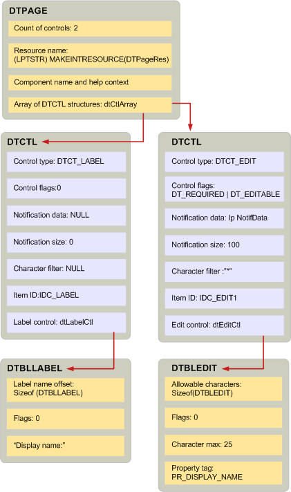

# 表示のテーブルと関連する構造体を作成します。
  
**適用対象**: Outlook 
  
表示テーブルを作成することは、スクリプト言語でプログラムを記述に似ています。 [BuildDisplayTable](builddisplaytable.md)を呼び出すか、またはテーブルの列と行を作成するカスタム コードを作成するか、表示テーブルを作成することができます。 一般に、簡単であるために、 **BuildDisplayTable**テクニックを使用してください。 
  
表示のテーブルを作成するための MAPI メッセージを表示する**BuildDisplayTable**を呼び出すことができます、前に、階層構造を構築する必要があります。 [DTPAGE](dtpage.md)、最上位レベルの構造では、1 つのタブ付きプロパティ ページについて説明します。 すべて**DTPAGE**には、構造体は、エディット ボックスやオプション ボタンなど、1 つのコントロールを記述する[DTCTL](dtctl.md)構造です。 **DTCTL**の各構造体には、コントロールの種類に固有である構造体が含まれています。 たとえば、 **DTCTL**構造体は、エディット ボックス コントロールを記述すると、 **DTBLEDIT**構造体が含まれます。 オプション ボタンの**DTCTL**構造体には、 **DTBLRADIOBUTTON**構造体が含まれています。 
  
これらの構造体は、直接**BuildDisplayTable**。この関数のコンテキスト外の意味があるありません。 **BuildDisplayTable**を呼び出すと、入力パラメーターとして 1 つまたは複数の**DTPAGE**構造体を渡します。 **DTPAGE**構造体には、 **DTCTL**構造体の配列と、配列内の**DTCTL**構造体の数のカウントが含まれています。 ダイアログ ボックスに表示するすべてのコントロールに対して 1 つの構造があります。 **DTPAGE**構造体は、対応するヘルプ ファイル、ダイアログ ボックス リソースの名前を表す文字列もあります。 
  
**DTPAGE**構造内の個々 の**DTCTL**構造体には、コントロールのプロパティを設定するために使用される次のデータが含まれています。 
  
- **PR_CONTROL_TYPE** ([PidTagControlType](pidtagcontroltype-canonical-property.md)) を設定するためのコントロールの種類。
    
- **PR_CONTROL_FLAGS** ([PidTagControlFlags](pidtagcontrolflags-canonical-property.md)) を設定するためのフラグを制御します。
    
- **PR_CONTROL_ID** ([PidTagControlId](pidtagcontrolid-canonical-property.md)) を設定するためのデータを通知します。
    
- **PR_CONTROL_STRUCTURE** ([PidTagControlStructure](pidtagcontrolstructure-canonical-property.md)) を設定するための制御構造です。
    
**DTCTL**構造体には、リソース識別子も含まれていると、編集し、コンボ ボックス コントロール、文字のフィルターです。 
  
**DTCTL**構造体の制御構造体のメンバーでは、コントロールの種類に対して一意であるデータについて説明します。 MAPI では、コントロールの種類ごとに別の構造を定義します。 などのエディット コントロールのデータは、 **DTBLEDIT**構造体で表されます。リスト ボックスのデータは、 **DTBLLBX**構造体によって表されます。 
  
表示テーブルの構造体の 3 つのタイプ間の関係は次の図に表示されます。 表示の次の表に記載されているダイアログ ボックスには 2 つのコントロール: エディット コントロールおよびラベルです。 **DTBLLBX**構造体といくつかの制御構造体は、ラベルの文字の文字列の開始位置を示すラベルのオフセット メンバーがあります。 ラベルの文字列は通常、メモリの構造体の直後に配置します。 
  
**表示テーブルの構造**
  

  
## 関連項目

- [表示テーブルの実装](display-table-implementation.md)

