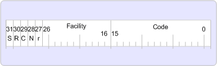

# MAPI でのエラー処理

**適用されます**: Outlook 
  
ハンドル、または HRESULT を結果として呼ばれる 32 ビットの数値を使用して成功、警告、エラー値が返されます。 HRESULT は本当に何もへのハンドル値のエンコードされたいくつかのフィールドを持つ 32 ビット値だけですることをお勧めします。 ゼロという結果は成功を示し、0 以外の結果は失敗を示します。
  
MAPI 32 ビットのプラットフォームでは、HRESULT の値でのみ動作します。
  
次の図では、32 ビット プラットフォーム用の HRESULT の形式を示します。
  
**HRESULT の形式**
  

  
HRESULT の最上位ビットは、戻り値が成功または失敗を表すかどうかを示します。 かどうかは 0 に設定すると、値成功を示します。 1 に設定すると、その障害を示しています。
  
HRESULT には、R、C、N、r ビットが予約されています。
  
両方のバージョンの機能のフィールドでは、エラーの責任の範囲を示します。 いくつかの機能がありますが、MAPI エラーの大部分では、FACILITY_ITF を使用して、インターフェイスのエラーを表します。 現在使用されている最も一般的な機能: FACILITY_NULL、FACILITY_ITF、FACILITY_DISPATCH、FACILITY_RPC、および FACILITY_STORAGE。 新しい設備が必要な場合は、Microsoft ライセンスを割り当てますは一意である必要があるためです。 次の表では、さまざまな機能のフィールドについて説明します。
  
|施設|説明|
|:-----|:-----|
|FACILITY_NULL    |広範に適用される一般的なステータス コード S_OK、または E_OUTOF_MEMORY です。値は 0 です。    |
|FACILITY_ITF    |インターフェイス メソッドから返されたステータス コードのほとんどの値は、インターフェイスによって定義されます。 正確に 32 ビット値が同じ 2 つの異なるインターフェイスから返される 2 つの HRESULT 値は、異なる意味を持つ可能性があります。    |
|FACILITY_DISPATCH    |[IDispatch](http://msdn.microsoft.com/en-us/library/ms221608.aspx)を遅延バインディングのインターフェイスのエラーを実行します。    |
|FACILITY_RPC    |リモート ・ プロシージャ ・ コールから返されるステータス ・ コードです。    |
|FACILITY_STORAGE    |構造化ストレージに関連する[IStorage](http://msdn.microsoft.com/en-us/library/aa380015%28VS.85%29.aspx)または[IStream](http://msdn.microsoft.com/en-us/library/aa380034%28VS.85%29.aspx)のメソッド呼び出しから返されるステータス ・ コードです。 コード (下位 16 ビット) 値が範囲の Windows のエラー コードでステータス コード (つまり、256 文字未満) 対応する Windows のエラーと同じ意味を持ちます。    |
   
[コード] フィールドは、エラーまたは警告を表すために割り当てられている一意の番号です。
  

