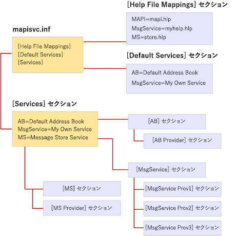

# MapiSvc.inf ファイルの形式File format of MapiSvc.inf

**適用されます**: Outlook**Applies to**: Outlook 
  
MapiSvc.inf ファイルは、MAPI メッセージ サービスの構成情報を中央のデータベースとして機能します。The MapiSvc.inf file acts as the central database for MAPI message service configuration information. MapiSvc.inf には、各ワークステーション、各メッセージのサービスに属しているサービス プロバイダーに関する情報と、MAPI サブシステムについての情報にインストールされているメッセージ サービスに関する情報が含まれています。MapiSvc.inf contains information about each of the message services installed on the workstation, information about the service providers that belong to each message service, and information about the MAPI subsystem. MapiSvc.inf は、プロファイルの情報のプライマリ ソースです。MapiSvc.inf is the primary source of information for profiles. 新しいプロファイルのビルド時または既存の変更、メッセージ サービスごとに関連する情報またはサービス ・ プロバイダーは、MapiSvc.inf からコピーします。That is, when a new profile is being built or an existing one modified, relevant information for each message service or service provider is copied from MapiSvc.inf. 
  
MapiSvc.inf は、階層リンクのセクションに分かれています。MapiSvc.inf is divided into linked hierarchical sections:
  
1. セクションのすべてのプロファイルに適用される情報が含まれています。Section containing information that applies to all profiles. このセクションでは、3 つの部分があります。This section has three parts:
    
   - **[サービス]** セクションで、サービスのセクションの以降のメッセージへのリンクを提供します。**[Services]** section, providing links to each of the subsequent message service sections. 
    
   - **[ヘルプ ファイルのマッピング]** セクションに関する情報が含まれています。HLP ファイルがメッセージ サービスによって提供されます。**[Help File Mappings]** section, containing information about .HLP files provided by message services. 
    
   - **[既定のサービス]** セクションで、既定のインストールを構成するメッセージ サービスを一覧表示します。**[Default Services]** section, listing message services that make up a default installation. 
    
2. 個々 のメッセージ サービスに適用される情報が含まれているセクションです。Section containing information that applies to individual message services. これらのセクション内のエントリは、その後のサービス ・ プロバイダーのセクションへのリンクを提供します。Entries in these sections provide links to subsequent service provider sections.
    
3. メッセージ サービス内の個々 のサービス プロバイダーに適用される情報が含まれているセクションです。Section containing information that applies to individual service providers in a message service.
    
次の図は、典型的な MapiSvc.inf ファイルの構成を示します。The following illustration shows the organization of a typical MapiSvc.inf file. 3 つのメッセージ サービスがある: AB、MsgService、および MS です。There are three message services: AB, MsgService, and MS. メッセージ サービスごとに、等号の右側の名前は、サービスの表示名です。The name on the right hand side of the equal sign for each message service is the service's display name. 各メッセージ サービスは、独自のセクションを他の場所には 1 つまたは複数のサービス プロバイダーのセクションにリンクされているファイルに。Each message service has its own section elsewhere in the file that is linked to one or more service provider sections. メッセージ サービスに属しているすべてのサービス プロバイダーの 1 つのサービス プロバイダー] セクションがあります。There is one service provider section for every service provider that belongs to the message service. AB と MS メッセージ サービスは、3 つのサービス プロバイダーは、MsgService サービスに属しているが、1 つのプロバイダー サービスです。The AB and MS message services are single provider services whereas three service providers belong to the MsgService service.
  
**MapiSvc.inf ファイルの編成****MapiSvc.inf file organization**
  

  
MAPI には、MAPI サブシステムのエントリが含まれている MapiSvc.inf ファイルのスケルトン バージョンが用意されています。MAPI provides a skeletal version of the MapiSvc.inf file that contains the entries for the MAPI subsystem. 各メッセージ サービスの実装側は、サービスとそのサービスに属しているサービス ・ プロバイダーの両方に該当するエントリを追加します。Each message service implementer adds entries that are appropriate both for their service and the service providers that belong to their service. 一部のエントリは必要です。Some of the entries are required while others are optional. たとえば、MAPI は、メッセージ サービスの名前とそれぞれのサービス ・ プロバイダーのパスを指定することが必要です。For example, MAPI requires that you specify the name and path of each of the service providers in your message service. この情報は、読み込みができなくなります。Without this information, they cannot be loaded.
  
メッセージ サービス、またはサービスのプロバイダー セクションには、どちらかのセクションで必須およびオプションの情報を追加できます。You can add required and optional information in either the section for your message service and/or to the service provider sections. メッセージ サービスを記述する情報の格納先とは、サービスのサービス プロバイダーの数によって異なります。Where you put the information describing your message service depends on the number of service providers in the service. この情報は、サービスの各サービス ・ プロバイダーに適用するため行う必要があります、すべてのプロバイダーにアクセスできるようにします。Because this information applies to each service provider in the service, you must make it accessible to all providers. [メッセージ サービス] セクションで、[優先] オプション、またはすべてのサービス プロバイダー セクションでは、それを格納します。Store it either in the message service section, the preferred option, or in all of the service provider sections. 不要なレプリケーション、複数のコピーを保持する必要性を回避するには、同期後は、情報を格納します。Store information once to avoid unnecessary replication and the need to keep multiple copies synchronized.
  
メッセージ サービスが 1 つのプロバイダーのサービスの場合は、サービスのセクションではなく、サービス ・ プロバイダーについては、「メッセージ サービス情報をすべて保存します。If your message service is a single provider service, store all of the message service information in the section for the service provider rather than in the section for the service. サービス プロバイダー] セクションにアクセスする、高速化とメッセージの [サービス] セクションにアクセスするよりもより直接的です。Accessing the service provider section is faster and more direct than accessing the message service section. 
  
MapiSvc.inf ファイルの公開の構成データだけを格納します。Store only public configuration data in the MapiSvc.inf file. プライベートまたは保護を強化するなど、パスワードやその他の資格情報を必要とする情報は必要がありますこのファイルには含まれません。Information that is private or requires extra protection, such as passwords or other credentials, should not be included in this file. 代わりに、しないように選択するか、すべてのこのタイプの情報を格納またはセキュリティで保護されたプロパティとプロファイルに保管する必要です。Instead, opt either not to store information of this type at all or keep it in the profile as secure properties. セキュリティで保護されたプロパティには、暗号化などの組み込みの保護機能があります。Secure properties have built-in protection features such as encryption.
  

