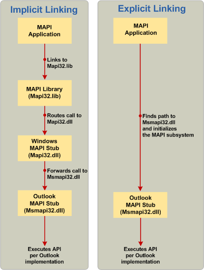

# <a name="link-to-mapi-functions"></a>MAPI 機能へのリンク

**適用対象**: Outlook 2013 | Outlook 2016 
  
リンクには、暗黙的なリンク、明示的なリンク、MAPI スタブ ライブラリを使用した新しいハイブリッド モデルの 3 つの方法があります。
  
## <a name="implicit-linking"></a>暗黙的なリンク

従来、メッセージング アプリケーションで MAPI 関数を呼び出す場合は、常に Mapi32.lib ライブラリへのリンクが必要でした。 これには、MAPI スタブ ライブラリ Windows Mapi32.dll に MAPI 呼び出しをルーティングし、実行時に既定の MAPI クライアント実装に呼び出しを転送しました。 この呼び出しプロセスは暗黙的リンクと呼ばれる。 次の図の左側は、MAPI 関数呼び出しプロセスで使用される暗黙的なリンクの例を示しています。 このプロセスは MAPI アプリケーションによって開始され、MAPI ライブラリ (Mapi32.lib) と Windows MAPI スタブ (Mapi32.dll) が関係し、MAPI スタブ (Msmapi32.dll) の Outlook MAPI クライアント実装によって完了します。
  
**暗黙的リンクと明示的リンクの比較。**


  
## <a name="explicit-linking"></a>明示的なリンク

既定の MAPI クライアントは、Windows インストーラー (MSI) を使用してオンデマンド インストールをサポートしていますので、MAPI ライブラリと Windows MAPI スタブを使用する代わりに、Outlook MAPI スタブでメッセージング アプリケーションを直接開発できます。 前の図の右側に、MAPI 関数呼び出しプロセスの例を示します。まず、MAPI アプリケーションで Outlook MAPI スタブのパスと DLL 名を検索し (次のセクションの手順 2)、Outlook MAPI スタブに関数呼び出しを行います (次のセクションの手順 3)。 次の手順は、明示的なリンクを使用して MAPI 関数を呼び出す方法を示しています。 
  
> [!NOTE]
> 明示的なリンクに関するこの情報は、次のセクションで説明する MAPIStubLibrary.lib の導入により、ニーズに余計な可能性があります。 暗黙的なモデルと同様に、新しいライブラリは、すべてを管理し、アプリケーションの MAPI を直接読み込Outlook明示的なリンク ロジックを実装します。 
  
明示的なリンクの詳細については、「Linking Explicitly」を参照してください。
  
### <a name="to-call-mapi-api-elements-without-the-mapi-library-and-the-windows-mapi-stub"></a>MAPI ライブラリと MAPI スタブを使用せずに MAPI API 要素Windowsするには

1. プログラム ファイルで、使用している MAPI API 要素ごとに関数ポインターのグローバル リストを作成します。 
    
   次の例は、この手順を示しています。
    
   ```cpp
    //Global MAPI function pointers
    LPMAPIINITIALIZE pfnMAPIInitialize = NULL;
    LPMAPIUNINITIALIZE pfnMAPIUninitialize = NULL;
   ```

2. 既定の MAPI クライアントの MAPI DLL にリンクする MAPI 関数を初期化する関数を作成します (たとえば、Microsoft の MAPI クライアントMsmapi32.dllなどOutlook。 この関数では、次の操作を行います。 
    
    1. 適切mapi32.dllディレクトリからデータを読み込む。 
        
       |||
       |:-----|:-----|
       |x64 または x86 ネイティブ  <br/> |**%windir%\system32\mapi32.dll** <br/> |
       |woW モードでの x86  <br/> |**%windir%\syswow64\mapi32.dll** <br/> |
    
    2. MAPI サブシステムを実装するパスと DLL 名を取得するには [、FGetComponentPath](fgetcomponentpath.md) 関数を呼び出します。 詳細については、「読み込 [む MAPI の特定のバージョンを選択する」を参照してください](how-to-choose-a-specific-version-of-mapi-to-load.md)。
        
    3. LoadLibrary 関数を呼び出して DLL を読み込む。 
        
    4. GetProcAddress 関数を呼び出して MAPI 関数ポインター配列を初期化します。 
        
    次の例は、前の手順を示しています。
        
   ```cpp
    void InitializeMapiFunctions()
    {
    {
        // Get the DLL path and name of the actual MAPI implementation.
        FGetComponentPath(g_szMapiComponentGUID, NULL, szMAPIDLL, MAX_PATH);
        // Load the DLL.
        hMod = LoadLibrary(szMAPIDLL);
        // Initialize MAPI functions.
        pfnMAPIInitialize = GetProcAddress(hMod, "MAPIInitialize");
        pfnMAPIUninitialize = GetProcAddress(hMod, "MAPIUninitialize");
    }
   ```

3. 最後に、MAPI API 要素を呼び出す前に、メッセージング アプリケーションの手順 2 で作成した関数を呼び出します。 
    
   > [!CAUTION]
   > アプリケーションを閉じる前に、MAPI サブシステムの初期化を解除する必要があります。 
  
   次の例は、この手順を示しています。 
    
   ```cpp
    int main()
    {
        HRESULT hr;
        InitializeMapiFunctions();
        // Initialize the MAPI subsystem.
        hr = (*pfnMAPIInitialize)(NULL);
        if (hr!= S_OK)
        {
            // Handle the error case.
        }
        // Here is where you make calls to other MAPI interfaces.
        // Uninitialize the MAPI subsystem.
        (*pfnMAPIUninitialize)();
    return (0);
    }
   ```

## <a name="mapistublibrarylib"></a>MAPIStubLibrary.lib

Microsoft Outlook 2010 および 64 ビット MAPI の出現は、Microsoft Outlook 2013 に拡張され、完全実装には従来の 32 ビット API を超える必要があります。 CodePlex Web サイトに投稿された新しいプロジェクトである MAPI スタブ ライブラリは、32 ビット MAPI アプリケーションと 64 ビット MAPI アプリケーションの両方の構築をサポートする Mapi32.lib のドロップイン置換を提供します。 MAPIStubLibrary.lib を使用すると、MAPI に明示的にリンクする必要がなく、ビルドした後、リンカー設定から Mapi32.lib を削除し、MAPIStubLibrary.lib に置き換える必要があります。コードをそれ以上変更する必要はありません。 また、明示的なリンクを使用した場合に必要になる Mapi32.lib ではなく、このライブラリ ファイルに含まれる新しいエクスポートを処理するために、LoadLibrary、GetProcAddress、**および FreeLibrary** コードを記述する必要もなくします。   
  
Mapi32.lib で使用できないこのライブラリからリンクされた新しい関数には、次のようなものがあります。
  
- [GetDefCachedMode](getdefcachedmode.md)    
- [HrGetGALFromEmsmdbUID](hrgetgalfromemsmdbuid.md)   
- [HrOpenOfflineObj](hropenofflineobj.md)    
- [MAPICrashRecovery](mapicrashrecovery.md)   
- [OpenStreamOnFileW](openstreamonfilew.md)    
- [WrapCompressedRTFStreamEx](wrapcompressedrtfstreamex.md)
    
MAPI スタブ ライブラリを組み込む別の方法として、ソース ファイル MapiStubLibrary.cpp と StubUtils.cpp をプロジェクトに直接コピーし、Mapi32.lib へのリンクと MAPI に明示的にリンクするコードを削除します。
  
MAPI スタブ ライブラリ ファイルにアクセスし、プロジェクトにビルドして統合する方法の詳細、およびこのライブラリを使用する場合と使用する理由など、このライブラリに関する質問については、CodePlex サイトの [MAPI](https://mapistublibrary.codeplex.com/documentation) スタブ ライブラリを参照してください。 
  
## <a name="see-also"></a>関連項目

- [MAPI プログラミングの概要](mapi-programming-overview.md)
- [MAPI サブシステムのインストール](installing-the-mapi-subsystem.md)
- [MAPI ヘッダー ファイルのインストール](how-to-install-mapi-header-files.md)
- [読み込む MAPI の特定のバージョンを選択する](how-to-choose-a-specific-version-of-mapi-to-load.md)
- [使用するリンク 方法の決定](https://msdn.microsoft.com/library/253b8k2c.aspx)
- [実行可能ファイルを DLL にリンクする](https://msdn.microsoft.com/library/9yd93633.aspx)
- [MAPI DLL の MSI キーのセットアップ](https://msdn.microsoft.com/library/ee909494%28v=VS.85%29.aspx)

