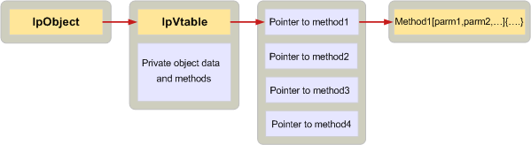

# <a name="implementing-objects-in-c"></a><span data-ttu-id="1c2a0-103">C 言語でオブジェクトを実装します。</span><span class="sxs-lookup"><span data-stu-id="1c2a0-103">Implementing objects in C</span></span>

<span data-ttu-id="1c2a0-104">**適用されます**: Outlook 2013 |Outlook 2016</span><span class="sxs-lookup"><span data-stu-id="1c2a0-104">**Applies to**: Outlook 2013 | Outlook 2016</span></span> 
  
<span data-ttu-id="1c2a0-105">クライアント アプリケーションとサービス プロバイダーが C で書かれたデータ構造体と、仮想関数テーブルまたは vtable と呼ばれる順序付けられた関数ポインターの配列を作成することで MAPI オブジェクトを定義します。</span><span class="sxs-lookup"><span data-stu-id="1c2a0-105">Client applications and service providers written in C define MAPI objects by creating a data structure and an array of ordered function pointers known as a virtual function table, or vtable.</span></span> <span data-ttu-id="1c2a0-106">Vtable へのポインターは、データ構造体の最初のメンバーである必要があります。</span><span class="sxs-lookup"><span data-stu-id="1c2a0-106">A pointer to the vtable must be the first member of the data structure.</span></span>
  
<span data-ttu-id="1c2a0-107">V のテーブル自体は、オブジェクトでサポートされている各インタ フェースのすべてのメソッドの 1 つのポインターがあります。</span><span class="sxs-lookup"><span data-stu-id="1c2a0-107">In the vtable itself, there is one pointer for every method in each interface supported by the object.</span></span> <span data-ttu-id="1c2a0-108">ポインターの順序は、Mapidefs.h ヘッダー ファイルで公開されているインターフェイスの仕様内のメソッドの順序に従う必要があります。</span><span class="sxs-lookup"><span data-stu-id="1c2a0-108">The order of the pointers must follow the order of the methods in the interface specification published in the Mapidefs.h header file.</span></span> <span data-ttu-id="1c2a0-109">Vtable 内の各関数ポインターは、実際のメソッドの実装のアドレスに設定されています。</span><span class="sxs-lookup"><span data-stu-id="1c2a0-109">Each function pointer in the vtable is set to the address of the actual implementation of the method.</span></span> <span data-ttu-id="1c2a0-110">C++ では、コンパイラは、vtable を自動的に設定します。</span><span class="sxs-lookup"><span data-stu-id="1c2a0-110">In C++, the compiler automatically sets up the vtable.</span></span> <span data-ttu-id="1c2a0-111">C ではないです。</span><span class="sxs-lookup"><span data-stu-id="1c2a0-111">In C, it does not.</span></span> 
  
<span data-ttu-id="1c2a0-112">次の図は、このしくみを示しています。</span><span class="sxs-lookup"><span data-stu-id="1c2a0-112">The following illustration shows how this works.</span></span> <span data-ttu-id="1c2a0-113">一番左のボックスでは、サービス プロバイダー オブジェクトを使用する必要があるクライアントを表します。</span><span class="sxs-lookup"><span data-stu-id="1c2a0-113">The box on the far left represents a client that needs to use a service provider object.</span></span> <span data-ttu-id="1c2a0-114">セッションでは、クライアントは、 **lpObject**オブジェクトへのポインターを取得します。</span><span class="sxs-lookup"><span data-stu-id="1c2a0-114">Through the session, the client obtains a pointer to the object, **lpObject**.</span></span> <span data-ttu-id="1c2a0-115">Vtable では、プライベート データとメソッドの後にオブジェクトの最初の項目が表示されます。</span><span class="sxs-lookup"><span data-stu-id="1c2a0-115">The vtable appears first in the object followed by private data and methods.</span></span> <span data-ttu-id="1c2a0-116">Vtable ポインターが指す実際の vtable は、の各インターフェイスのメソッドの実装へのポインターが含まれています。</span><span class="sxs-lookup"><span data-stu-id="1c2a0-116">The vtable pointer points to the actual vtable, which contains pointers to each of the implementations of the methods in the interface.</span></span> 
  
<span data-ttu-id="1c2a0-117">**オブジェクトの実装**</span><span class="sxs-lookup"><span data-stu-id="1c2a0-117">**Object implementation**</span></span>
  
<span data-ttu-id="1c2a0-118"></span><span class="sxs-lookup"><span data-stu-id="1c2a0-118"></span></span>
  
<span data-ttu-id="1c2a0-119">C のサービス プロバイダーが、単純な状態のオブジェクトを定義する方法を次のコード例に示します。</span><span class="sxs-lookup"><span data-stu-id="1c2a0-119">The following code example shows how a C service provider can define a simple status object.</span></span> <span data-ttu-id="1c2a0-120">最初のメンバーは、vtable ポインターです。オブジェクトの残りの部分はデータ メンバーで構成されています。</span><span class="sxs-lookup"><span data-stu-id="1c2a0-120">The first member is the vtable pointer; the rest of the object is made up of data members.</span></span> 
  
```C
typedef struct _MYSTATUSOBJECT
{
    const STATUS_Vtbl FAR *lpVtbl;
    ULONG              cRef;
    ANOTHEROBJ        *pObj;
    LPMAPIPROP         lpProp;
    LPFREEBUFFER       lpFreeBuf;
} MYSTATUSOBJECT, *LPMYSTATUSOBJ;
 
```

<span data-ttu-id="1c2a0-121">それぞれのメソッドの実装へのポインターが vtable に含まれていますこのオブジェクトが状態オブジェクトであるため、 [IMAPIStatus: IMAPIProp](imapistatusimapiprop.md)の基本インターフェイスのメソッドの実装へのポインターと同様に、インターフェイス、IUnknown の**** と**IMAPIProp**。</span><span class="sxs-lookup"><span data-stu-id="1c2a0-121">Because this object is a status object, the vtable includes pointers to implementations of each of the methods in the [IMAPIStatus : IMAPIProp](imapistatusimapiprop.md) interface, as well as pointers to implementations of each of the methods in the base interfaces — **IUnknown** and **IMAPIProp**.</span></span> <span data-ttu-id="1c2a0-122">Vtable 内のメソッドの順序は、Mapidefs.h ヘッダー ファイルで定義されている指定された順序と一致します。</span><span class="sxs-lookup"><span data-stu-id="1c2a0-122">The order of methods in the vtable matches the specified order as defined in the Mapidefs.h header file.</span></span>
  
```js
static const MYOBJECT_Vtbl vtblSTATUS =
{
    STATUS_QueryInterface,
    STATUS_AddRef,
    STATUS_Release,
    STATUS_GetLastError,
    STATUS_SaveChanges,
    STATUS_GetProps,
    STATUS_GetPropList,
    STATUS_OpenProperty,
    STATUS_SetProps,
    STATUS_DeleteProps,
    STATUS_CopyTo,
    STATUS_CopyProps,
    STATUS_GetNamesFromIDs,
    STATUS_GetIDsFromNames,
    STATUS_ValidateState,
    STATUS_SettingsDialog,
    STATUS_ChangePassword,
    STATUS_FlushQueues
};
 
```

<span data-ttu-id="1c2a0-123">クライアントとサービス プロバイダーが C で書かれた、v テーブルを通じて間接的にオブジェクトを使用し、すべての呼び出しの最初のパラメーターとして、オブジェクトのポインターを追加します。</span><span class="sxs-lookup"><span data-stu-id="1c2a0-123">Clients and service providers written in C use objects indirectly through the vtable and add an object pointer as the first parameter in every call.</span></span> <span data-ttu-id="1c2a0-124">MAPI インターフェイスのメソッドを呼び出すたびには、最初のパラメーターとして呼び出されているオブジェクトへのポインターが必要です。</span><span class="sxs-lookup"><span data-stu-id="1c2a0-124">Every call to a MAPI interface method requires a pointer to the object being called as its first parameter.</span></span> <span data-ttu-id="1c2a0-125">C++ では、この目的のため、 **this**ポインターと呼ばれる特殊なポインターを定義します。</span><span class="sxs-lookup"><span data-stu-id="1c2a0-125">C++ defines a special pointer known as the **this** pointer for this purpose.</span></span> <span data-ttu-id="1c2a0-126">**This**ポインターは、最初のパラメーターとしてメソッド呼び出しのたびに、C++ コンパイラによって暗黙に追加します。</span><span class="sxs-lookup"><span data-stu-id="1c2a0-126">The C++ compiler implicitly adds the **this** pointer as the first parameter to every method call.</span></span> <span data-ttu-id="1c2a0-127">C ではこのようなポインターです。それを明示的に追加する必要があります。</span><span class="sxs-lookup"><span data-stu-id="1c2a0-127">In C there is no such pointer; it must be explicitly added.</span></span> 
  
<span data-ttu-id="1c2a0-128">次のコードでは、クライアントが MYSTATUSOBJECT のインスタンスへの呼び出しを作成する方法を示します。</span><span class="sxs-lookup"><span data-stu-id="1c2a0-128">The following code demonstrates how a client can make a call to an instance of MYSTATUSOBJECT:</span></span>
  
```C
lpMyObj->lpVtbl->ValidateState(lpMyObj, ulUIParam, ulFlags);
 
```

## <a name="see-also"></a><span data-ttu-id="1c2a0-129">関連項目</span><span class="sxs-lookup"><span data-stu-id="1c2a0-129">See also</span></span>

- [<span data-ttu-id="1c2a0-130">MAPI オブジェクトの実装</span><span class="sxs-lookup"><span data-stu-id="1c2a0-130">Implementing MAPI Objects</span></span>](implementing-mapi-objects.md)

