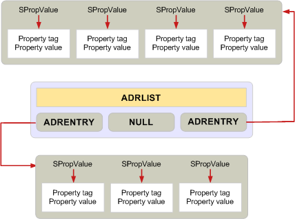

# ADRLIST と SRowSet 構造体のメモリを管理するには」

**適用対象**: Outlook 
  
バッファーに割り当てるすべてのメモリを 1 つの**MAPIAllocateBuffer**呼び出しを可能な限り要件は、アドレス一覧、または**ADRLIST**、および行セット、または**SRowSet**、構造体を使用する場合に適用されません。 
  
これら 2 つの構造体は、割り当てとメモリを解放するための標準的な規則の例外です。 構造体の複数のレベルが含まれている、個々 のメンバーを追加または削除を有効にするように設計されています。 したがって、各プロパティは、個別の割り当てをする必要があります。 

独自の呼び出しを**MAPIFreeBuffer**または**FreeProws**または**のいずれか 1 回の呼び出しで解放する必要があります**MAPIFreeBuffer**、 **ADRLIST**または**SRowSet**構造体の個々 のエントリごとに 1 つの呼び出しのほとんどの構造体を解放する場所FreePadrlist**。 詳細については、 [MAPIFreeBuffer](mapifreebuffer.md)、 [ADRLIST](adrlist.md)、および[SRowSet](srowset.md)を参照してください。 

**FreeProws**と**FreePadrlist**は、これらのデータ構造体の解放を簡略化するため、MAPI によって提供される機能です。 詳細については、 [FreeProws](freeprows.md)および[FreePadrlist](freepadrlist.md)を参照してください。 **FreePadrlist** **ADRLIST**構造体のメモリと構造体のメンバーに関連付けられているすべてのメモリを解放します。**SRowSet**構造体の同じは**FreeProws**を行います。 
  
次の図は、必要な別のメモリが割り当てられたことを示す、 **ADRLIST**データ構造体のレイアウトを示しています。 灰色のボックスを表示すると、メモリを割り当てられ、1 回の呼び出しでリリースされたことができます。 
  
**ADRLIST メモリの割り当て**
  

  
## 関連項目

- [MAPI でのメモリを管理します。](managing-memory-in-mapi.md)

