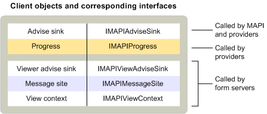

# MAPI クライアント オブジェクトMAPI client objects
  
**適用対象**: Outlook**Applies to**: Outlook 
  
メッセージング クライアント アプリケーションの標準的な実装の 1 つのオブジェクト、アドバイズ シンクします。Standard messaging client applications implement only one object — an advise sink. シンクの継承からのアドバイス、 [IMAPIAdviseSink: IUnknown](imapiadvisesinkiunknown.md)インタ フェースおよび MAPI によってし、イベント通知のためのプロバイダーのサービスを提供します。Advise sinks inherit from the [IMAPIAdviseSink : IUnknown](imapiadvisesinkiunknown.md) interface and are used by MAPI and service providers for event notification. 一部のクライアントでは、進行状況ダイアログ ボックスの表示をサポートするために進行中のオブジェクトも実装します。Some clients also implement progress objects to support the display of progress dialog boxes. 
  
複雑なクライアントのサポートのユーザー設定フォームが別のアドバイスを実装するオブジェクトとメッセージ サイト オブジェクトから継承するなど、他のいくつかのオブジェクトのシンク、 [IMAPIMessageSite: IUnknown](imapimessagesiteiunknown.md)インタ フェースとビュー コンテキスト オブジェクトから継承する、[IMAPIViewContext: IUnknown](imapiviewcontextiunknown.md)インタ フェースです。More complex clients that support custom forms implement another advise sink object and a few other objects, such as the message site object that inherits from the [IMAPIMessageSite : IUnknown](imapimessagesiteiunknown.md) interface and the view context object that inherits from the [IMAPIViewContext : IUnknown](imapiviewcontextiunknown.md) interface. 追加のアドバイズ シンク オブジェクトの継承、 [IMAPIViewAdviseSink: IUnknown](imapiviewadvisesinkiunknown.md)インタ フェースです。The additional advise sink object inherits from the [IMAPIViewAdviseSink : IUnknown](imapiviewadvisesinkiunknown.md) interface. 
  
次の表は、標準メッセージング クライアントとユーザー設定フォームの表示をサポートするクライアントによって実装される MAPI オブジェクトをまとめたものです。The following table summarizes the MAPI objects implemented by standard messaging clients and by clients that support the viewing of custom forms.
  
|**クライアント オブジェクト****Client object**|**説明****Description**|
|:-----|:-----|
|アドバイズ シンクAdvise sink    |メッセージ ・ ストア、アドレス帳、またはセッションで発生するイベントのコールバック関数を提供します。Provides a callback function for events that occur in the message store, address book, or the session.    |
|メッセージ サイトMessage site    |フォーム オブジェクトの操作を処理します。Handles the manipulation of form objects.    |
|ProgressProgress    |操作の進行状況を表示するダイアログ ボックスが表示されます。Displays a dialog box to show the progress of an operation.    |
|ビューのアドバイズ シンクView advise sink    |フォームで発生するイベントのコールバック関数を提供します。Provides callback functions for events that occur in a form.    |
|ビュー コンテキストView context    |印刷、フォームを保存し、フォーム間を移動するには、コマンドをサポートしています。Supports commands for printing and saving forms and for navigating between forms.    |
   
次の図は、これらのさまざまなクライアント オブジェクト、継承、インターフェイスおよびそれらを使用する MAPI コンポーネント間の関係を示します。The following illustration shows the relationship between these different client objects, the interfaces from which they inherit, and the MAPI components that use them. 
  

  
クライアントは、実装するよりも多くのより多くのオブジェクトを使用します。Clients use many more objects than they implement. すべてのクライアントは、さまざまなサービス ・ プロバイダーのオブジェクトや MAPI を実装するオブジェクトへのアクセスを得るために、セッション オブジェクトを使用します。All clients use a session object to gain access to a wide variety of service provider objects and objects that MAPI implements. クライアントは、セッション、アドレス帳、または MAPI が提供する状態オブジェクトを介して間接的に、または特定のサービス プロバイダーを実装するオブジェクトのさまざまなを使用して直接のいずれかのサービス プロバイダーと対話します。Clients interact with service providers either indirectly, through the session, the address book, or the status objects that MAPI supplies, or directly through a variety of objects that particular service providers implement. アドレス帳プロバイダーへの直接連絡をするためは、クライアントは、ユーザー、および配布リストのメッセージ、アドレス帳コンテナーで使用します。To make direct contact with address book providers, clients use address book containers, messaging users, and distribution lists. メッセージ ストア プロバイダーにアクセスするのには、直接クライアントを使用してメッセージ ストアのオブジェクト、フォルダー、メッセージ、および添付ファイルです。To access a message store provider directly, clients use the message store object, folders, messages, and attachments. サービス プロバイダーは、状態オブジェクトをサポート、すると、クライアントはサービス プロバイダーの状態を監視するのに状態オブジェクトを使用できます。When service providers support a status object, clients can use the status object to monitor the service provider's state.
  
サービス プロバイダーとサービスのメッセージの構成をサポートするクライアントが MAPI を実装する 3 つのオブジェクトを使用して: メッセージ サービスの管理オブジェクト、管理、および、プロバイダーの管理オブジェクトです。Clients that support service provider and message service configuration use three objects that MAPI implements: the message service administration object, profile administration object, and provider administration object. カスタム フォームを表示するクライアントは、フォーム ライブラリのプロバイダーまたはフォーム サーバーを実装するいくつかのフォーム オブジェクトを使用します。Clients that display custom forms use several form objects that a form library provider or a form server implements.
  
## 関連項目See also

- [IMAPIMessageSite : IUnknownIMAPIMessageSite : IUnknown](imapimessagesiteiunknown.md) 
- [IMAPIViewContext : IUnknownIMAPIViewContext : IUnknown](imapiviewcontextiunknown.md)  
- [IMAPIViewAdviseSink : IUnknownIMAPIViewAdviseSink : IUnknown](imapiviewadvisesinkiunknown.md)
- [MAPI オブジェクトとインターフェイスの概要MAPI Object and Interface Overview](mapi-object-and-interface-overview.md)

