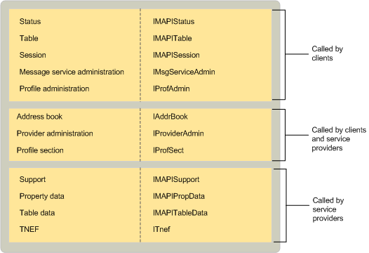

# MAPI 実装オブジェクトMAPI-implemented objects
  
**適用されます**: Outlook 2013 |Outlook 2016**Applies to**: Outlook 2013 | Outlook 2016 
  
MAPI は、クライアント アプリケーションとサービス ・ プロバイダーで使用するためのいくつかのオブジェクトを実装します。MAPI implements several objects for use by client applications and service providers. セッション オブジェクトは、テーブルにアクセスし、サービス プロバイダーと通信するためにセッションのサービスを使用するクライアントを許可します。The session object allows clients to use session services, to access tables, and to communicate with service providers. アドレス帳のオブジェクトは、すべての別のアドレス帳プロバイダーへの統合されたアクセスを持つクライアントを提供します。The address book object provides clients with integrated access to all of the different address book providers. 
  
MAPI には、表示およびセッションとサービス プロバイダーの情報を監視するに使用するクライアントに対して、複数のテーブルとの状態のオブジェクトが用意されています。MAPI supplies multiple table and status objects for clients to use for viewing and monitoring session and service provider information. など、MAPI は、プロファイル テーブルのすべてのコンピューターにインストールされているプロファイルについての情報とメッセージ サービス テーブルのすべての現在のプロファイルでメッセージ サービスに関する情報を提供します。For example, MAPI provides a profile table with information about all of the profiles that are installed on the computer and a message service table with information about all of the message services in the current profile. MAPI には、3 つの異なる状態のオブジェクトが用意されています: いずれかの全体的なサブシステム、MAPI スプーラーを無効に 1 つと内蔵のアドレス帳の 1 つを表す。MAPI provides three different status objects: one that represents the overall subsystem, one for the MAPI spooler, and one for the integrated address book. 
  
MAPI は、メッセージ サービス、サービス プロバイダー、およびプロファイルの構成を管理するための 4 つの異なるオブジェクトを実装します。MAPI implements four different objects for managing the configuration of message services, service providers, and profiles. クライアントとサービス ・ プロバイダーの両方を使用して、プロバイダーの管理とプロファイル セクションのオブジェクトです。これらのオブジェクトには、サービス プロバイダーを構成し、プロファイル プロパティにアクセスすることが有効にします。Both clients and service providers use provider administration and profile section objects; these objects enable them to configure service providers and access profile properties. クライアントは、メッセージ サービスのみとプロファイルの管理オブジェクト、メッセージ サービス、およびプロファイルの管理をサポートするオブジェクトを使用します。Clients use only message service and profile administration objects, the objects that support the administration of message services and profiles. 
  
MAPI には、サービス ・ プロバイダー向けの 2 つのオブジェクトが用意されています: サポート オブジェクトと TNEF オブジェクトです。MAPI provides two objects for service providers: a support object and a TNEF object. すべてのサービス プロバイダーを使用して、1 つ以上のサポート オブジェクトです。次の 4 つの異なるサポート オブジェクトの実装があります。All service providers use one or more support objects; there are four different support object implementations. MAPI には、アドレス帳、メッセージ ・ ストア、およびトランスポート プロバイダーをサポートするために特定の実装と構成をサポートする実装が用意されています。MAPI supplies an implementation to support configuration as well as specific implementations to support address book, message store, and transport providers. TNEF オブジェクトは、トランスポート ニュートラル カプセル化形式 (TNEF) をサポートするトランスポート プロバイダーによって使用されます。The TNEF object is used by transport providers that support the Transport Neutral Encapsulation Format (TNEF).
  
ユーティリティの 2 つのオブジェクト、テーブルのデータおよびプロパティ データは通常、サービス プロバイダーによって使用されます。Two utility objects, table data and property data, are typically used by service providers. テーブル オブジェクトの実装では、テーブルのデータ オブジェクトのヘルプします。セットとビューのプロパティへのアクセスとヘルプの実装では、プロパティ データ オブジェクトのヘルプ[IMAPIProp: IUnknown](imapipropiunknown.md)、プロパティの基本インターフェイスです。Table data objects help in the implementation of table objects; property data objects help to set and view property access and help in the implementation of [IMAPIProp : IUnknown](imapipropiunknown.md), the base property interface. 
  
次の表は、MAPI を実装するオブジェクトごとに目的をまとめたものです。The following table summarizes the purpose for each object that MAPI implements.
  
|**MAPI オブジェクト****MAPI object**|**説明****Description**|
|:-----|:-----|
|アドレス帳Address book    |すべての現在のプロファイルで、アドレス帳プロバイダーに属している受信者の情報の統合されたビューへのアクセスを提供します。Provides access to the integrated view of recipient information that belongs to all of the address book providers in the active profile.    |
|メッセージ サービスの管理Message service administration    |構成のメッセージ サービスの情報へのアクセスを提供します。Provides access to message service information for configuration.    |
|プロファイルの管理Profile administration    |構成のプロファイル情報へのアクセスを提供します。Provides access to profile information for configuration.    |
|プロファイル セクションProfile section    |メッセージの特定のサービスまたはサービス ・ プロバイダーを記述するためのプロファイルの一部です。A part of a profile used to describe a particular message service or service provider.    |
|プロパティのデータProperty data    |プロパティへのアクセスを維持し、 **IMAPIProp**の導入を支援します。Maintains access to properties and helps implement **IMAPIProp**.    |
|プロバイダーの管理Provider administration    |構成のサービス プロバイダーの情報へのアクセスを提供します。Provides access to service provider information for configuration.    |
|セッションSession    |基になるメッセージング システムへの接続を表し、MAPI リソースへのアクセスをクライアントに提供します。Represents a connection to underlying messaging systems and provides clients with access to MAPI resources.    |
|StatusStatus    |MAPI サブシステム、アドレス帳、または MAPI スプーラーを無効の状態へのアクセスを提供します。Provides access to the state of the MAPI subsystem, the address book, or the MAPI spooler.    |
|サポートSupport    |サービス プロバイダーがクライアントの要求を処理することができます。Helps service providers handle client requests.    |
|テーブルTable    |行と列の形式でデータベース テーブルのようなオブジェクトのデータの概要ビューへのアクセスを提供します。Provides access to a summary view of object data in row and column format, similar to a database table.    |
|テーブルのデータTable data    |基になるテーブルのデータへのアクセスを維持し、テーブルのオブジェクトを実装します。Maintains access to underlying table data and implements table objects.    |
|TNEFTNEF    |トランスポート ニュートラル カプセル化形式 (TNEF) の使用をサポートしています。Supports the use of the Transport Neutral Encapsulation Format (TNEF).    |
   
MAPI が実装しているオブジェクト、継承、インターフェイス、およびそれらを使用するコンポーネント間の関係を次の図に示します。The following illustration shows the relationship between the objects that MAPI implements, the interfaces from which they inherit, and the components that use them. 
  
**MAPI が実装するオブジェクト****Objects that MAPI implements**
  

  
## 関連項目See also

- [IMAPIProp : IUnknownIMAPIProp : IUnknown](imapipropiunknown.md)
- [MAPI オブジェクトとインターフェイスの概要MAPI Object and Interface Overview](mapi-object-and-interface-overview.md)

