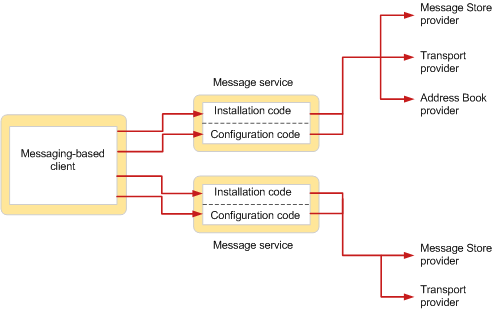

# MAPI メッセージ サービスの概要
  
**適用対象**: Outlook 2013 | Outlook 2016 
  
メッセージ サービスは、関連するサービス プロバイダーのグループ (通常は同じメッセージング システムで動作するサービス プロバイダー) を定義します。 サービス プロバイダーはメッセージング システムと MAPI サブシステム間の通信作業を実行しますが、メッセージ サービスは、共通のメッセージング システムで動作するユーザーとサービス プロバイダーとの間のインターフェイスの作業を実行します。  
  
ユーザーがサービス プロバイダーのインストールと構成を容易にするために、メッセージ サービスが存在します。 ユーザーがサービス プロバイダーを直接インストールまたは構成する必要があります。メッセージ サービスは、サービスに属する各サービス プロバイダーのインストールと構成を完全に処理します。 この機能により、ユーザーは特定のサービス プロバイダー構成要件を理解する必要がなんらない。 
  
次の図は、メッセージング ベースのクライアント アプリケーションと 2 つのメッセージ サービスの関係を示しています。
  
**メッセージ サービスのインストールおよび構成**
  

  
ユーザーは、各メッセージ サービスのインストール コードを呼び出して、サービスとそのサービス プロバイダーをプロファイルに追加します。 図に示すメッセージ サービスの 1 つには、3 つのサービス プロバイダーがあります。他のメッセージ サービスには、2 つのサービス プロバイダーがあります。 インストールが完了した後、通常はログオン時に、各メッセージ サービスのサービス プロバイダーが構成されます。 各メッセージ サービスの構成コードは、サービス内のプロバイダーの構成を処理します。
  
メッセージ サービスがインストールされている場合、インストール プログラムは、インストール ソースからユーザーのローカル ディスクに必要なファイルをコピーし、構成ファイル Mapisvc.inf を更新します。 Mapisvc.inf ファイルには、コンピューターにインストールできるすべてのメッセージ サービスとサービス プロバイダーの構成設定が含まれている。 階層セクションで構成され、各セクション間のリンクは各レベルで行います。 トップ レベルのセクションには、利用可能なすべてのメッセージ サービスの一覧やオンライン ヘルプ のインストールなど、MAPI サブシステムに関連する情報が含まれている。 次のレベルには、メッセージ サービスの DLL ファイル名や構成エントリ ポイント関数の名前などの情報を含む、各メッセージ サービスのセクションがあります。 3 番目のレベルには、メッセージ サービス内の各サービス プロバイダーの構成データを含むセクションがあります。 
  
構成を処理するために、メッセージ サービスは、MAPI で定義されたプロトタイプと、プロパティ シートと呼ばれるタブ付きダイアログ ボックスに準拠するエントリ ポイント関数を実装します。 MAPI は、メッセージ サービス内のプロファイル管理とサービス プロバイダーの管理に関連するクライアント要求にサービスを提供するためにエントリ ポイント関数を呼び出します。 プロパティ シートは、メッセージ サービスおよびサービス プロバイダー構成プロパティの表示および変更に使用されます。 
  
## 関連項目

- [MAPI の機能とアーキテクチャ](mapi-features-and-architecture.md)

