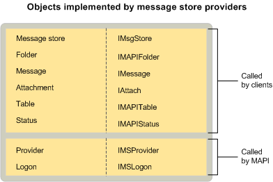

# MAPI メッセージ ストア プロバイダー オブジェクトMAPI message store provider objects
  
**適用されます**: Outlook**Applies to**: Outlook 
  
メッセージ ストア プロバイダーは、すべてのサービス プロバイダーとプロバイダーとログオン オブジェクトを実装します。Message store providers implement provider and logon objects, as do all service providers. また、メッセージ ストアのオブジェクト、フォルダー、メッセージ、添付ファイル、およびテーブルを実装します。They also implement a message store object, folders, messages, attachments, and tables. オプションとしては、いくつかのメッセージ ストア プロバイダーは、状態オブジェクトを実装します。As an option, some message store providers implement status objects.
  
次の図は、各メッセージ ストアのオブジェクトの対応するインターフェイスとそれを使用する MAPI コンポーネントを示します。The following illustration shows each message store object with its corresponding interface and the MAPI component that uses it.
  

  
## 関連項目See also

- [MAPI サービス プロバイダー オブジェクトMAPI Service Provider Objects](mapi-service-provider-objects.md)

