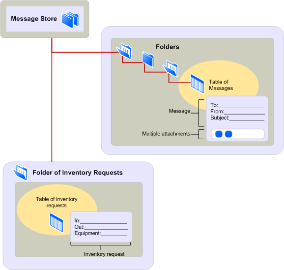

# MAPI メッセージ ストア プロバイダーの概要MAPI message store provider overview
  
**適用対象**: Outlook 2013 | Outlook 2016**Applies to**: Outlook 2013 | Outlook 2016 
  
メッセージ ストア プロバイダーは、クライアント アプリケーションのユーザーのメッセージなどの情報の保存と取得を処理します。Message store providers handle the storage and retrieval of messages and other information for the users of client applications. メッセージ情報は、メッセージ ストアと呼ばれる階層システムを使用して整理されます。The message information is organized by using a hierarchical system known as a message store. メッセージ ストアは複数のレベルで実装され、フォルダーと呼ばれるコンテナーはさまざまな種類のメッセージを保持します。The message store is implemented in multiple levels, with containers called folders holding messages of different types. メッセージ ストア内のレベルの数に制限はありません。フォルダーには、多数のサブフォルダーを含めできます。There is no limit to the number of levels in a message store; folders can contain many subfolders. 
  
次の図は、階層メッセージ ストアのアーキテクチャを示しています。The following illustration shows the hierarchical message store architecture.
  
**メッセージ ストアのアーキテクチャ****Message store architecture**
  

  
図は、サブフォルダーを持つ 2 つのフォルダーを示しています。The figure shows two folders, one with a subfolder. クライアント アプリケーション ユーザーは、各フォルダーに含まれるメッセージの概要ビューにアクセスしたり、フォームで個別に表示することができます。Client application users can access a summary view of the messages contained in each folder or view them individually with a form. クライアントが MAPI が提供する標準フォームを表示するか、フォーム開発者が提供するカスタム フォームを表示するかは、メッセージの種類またはクラスによって異なります。Whether the client displays a standard form that MAPI supplies or a custom form that a form developer supplies depends on the type, or class, of the message. 最初のフォルダーにはメモ メッセージが含まれます。MAPI 標準メモ フォームを使用します。The first folder contains note messages and uses the MAPI standard note form. 2 番目のフォルダーにはインベントリ要求メッセージが含まれます。カスタム インベントリ フォームを使用します。The second folder contains inventory request messages and uses a custom inventory form. 両方のフォームの情報は、メッセージのプロパティを表します。The information on both forms represents the properties of the message.
  
メッセージ ストア データは、さまざまな方法で使用できます。You can use message store data in a variety of ways. 従来の電子メールにデータを使用する以外に、パブリック ディスカッションのフォーラムとして、参照ドキュメントのリポジトリとして、またはボイス メール、予定表、連絡先、タスクなどのコンテナーとしてフォルダーを使用できます。In addition to using data for traditional electronic mail, you can use folders as a forum for public discussion, as a repository for reference documents, or as a container for voice mail, calendar, contacts, or tasks, for example. 1 つのメッセージ ストアには、さまざまな種類の情報を格納できます。A single message store can hold many types of information. 複数のクライアントが同じメッセージ ストアをインストールできます。Multiple clients can install the same message store. これにより、データの共有が簡単かつ迅速になります。This makes the sharing of data easy and fast. 
  
メッセージ ストア フォルダーを使用すると、メッセージの並べ替えとフィルター処理を行い、ユーザー インターフェイスでメッセージ表示をカスタマイズできます。Message store folders enable you to sort and filter messages and to customize the message display in a user interface. フィルター処理されたメッセージへのリンクは、検索結果フォルダーと呼ばれる特別なフォルダーに保持されます。Links to filtered messages are held in special folders called search-results folders. クライアント アプリケーションのユーザーは、MAPI が制限として参照するフィルター条件を入力し、1 つ以上のフォルダーに格納されているメッセージに条件が適用されます。The user of a client application enters filtering criteria, which MAPI refers to as a restriction, and the criteria is applied to the messages stored in one or more folders. たとえば、ユーザーは、特定の件名を扱い、先週より新しい到着日を持つメッセージのみを表示する場合があります。For example, a user might want to view only those messages that deal with a particular subject and have arrival dates that are more recent than last week. 条件に一致するメッセージへの参照が検索フォルダーに一覧表示され、実際のメッセージは通常のフォルダーに残ります。References to the messages that match the criteria are listed in the search folder, and the real messages remain in their regular folders.
  
メッセージは、あるユーザーまたはアプリケーションから別のユーザーまたはアプリケーションに転送されるデータの単位です。Messages are the units of data that are transferred from one user or application to another user or application. すべてのメッセージには、単純または複雑な書式設定を含むメッセージ テキストと、送信に使用されるメッセージ エンベロープ情報が含まれる。Every message contains some message text, with simple or complex formatting, and message envelope information that is used for transmission. 一部のメッセージには、1 つ以上の添付ファイル、またはファイル、別のメッセージ、または OLE オブジェクトの形式でメッセージに関連して転送される追加のデータが含まれます。Some messages include one or more attachments, or additional data related to and transported with a message in the form of a file, another message, or an OLE object. 
  
メッセージ ストア プロバイダーに応じて、ユーザーは、送信または受信されたメッセージに加えて、現在書き込み中の新しいメッセージを保存できます。Depending on the message store provider, a user can save a new message currently being written in addition to messages that have been sent or received. メッセージは 1 つのフォルダーから別のフォルダーにコピーまたは移動できます。各コピーは個別にコピー、削除、または変更できる個別のメッセージになる場合があります。Messages can be copied or moved from one folder to another with each copy becoming a separate message that can be copied, deleted, or modified individually. 一部のメッセージ ストア プロバイダーが有効にするもう 1 つの機能は、メッセージを受信した後で変更し、そのフォルダーに保存し戻す機能です。Another feature that some message store providers enable is the ability to change a message after it has been received and to store it back in its folder. ユーザーは、この機能を利用して、逆さまに到着した FAX メッセージを回転させる場合があります。A user might take advantage of this feature for rotating a fax message that arrived upside down. ユーザーは、後で表示するために正しいビューをフォルダーに保存できます。The user can store the correct view in the folder for later viewing. 
  
## 関連項目See also

- [MAPI の機能とアーキテクチャMAPI Features and Architecture](mapi-features-and-architecture.md)

