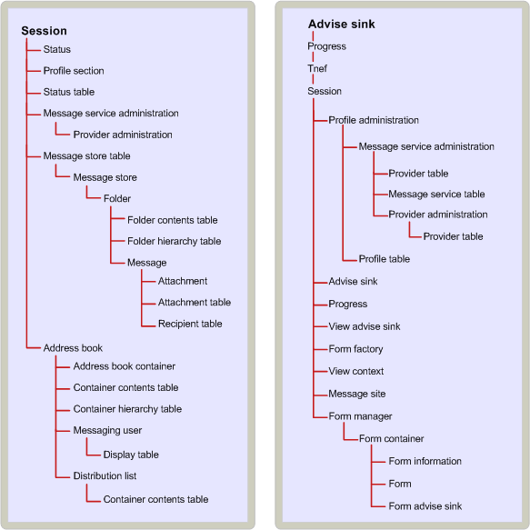

# MAPI オブジェクトの格納階層
  
**適用対象**: Outlook 2013 | Outlook 2016 
  
オブジェクト間の格納関係は、一部のオブジェクトがアクセスのために他のオブジェクトに対して持つ依存関係を指定します。 クライアント アプリケーションの場合、特定のオブジェクトにアクセスすると、他のオブジェクトにアクセスできます。 サービス プロバイダーによって実装されたオブジェクト間の格納関係は、論理階層に従う場合があります。 それ以外の場合は、任意です。 
  
クライアントは、他の多くのオブジェクト (サービス プロバイダーや MAPI アドレス帳など) を使用する前に、MAPI セッション オブジェクトへのアクセスを取得する必要があります。
  
メッセージ ストアの格納は、メッセージ ストア内のオブジェクト間の階層的な関係 (メッセージ ストア オブジェクト自体、フォルダー、メッセージ、添付ファイル) に基づいて行います。 論理的には、添付ファイルはメッセージ、フォルダー内のメッセージ、およびメッセージ ストア内のフォルダーに含まれます。 格納関係は、この論理階層と一致します。 たとえば、メッセージにアクセスするには、クライアントが最初にメッセージが含まれているフォルダーにアクセスする必要があります。 プロファイルと状態オブジェクトは、より任意の格納関係の例です。 これらの両方のオブジェクトは、セッションを通じて使用できます。 
  
一部のオブジェクトでは、コンテナーが唯一のアクセスを提供します。 添付ファイルと受信者は、コンテナーに完全に依存するオブジェクトの例です。 添付ファイルまたは受信者への唯一のアクセスは、その添付ファイルが属するメッセージを介して行います。 他のオブジェクトには、代替アクセス パスがあります。 これらのオブジェクトには、エントリ識別子と呼ばれるバイナリ識別子が、それらを作成するサービス プロバイダーによって割り当てられます。 エントリ識別子を使用してオブジェクトに直接アクセスし、クライアントが格納ツリーをバイパスできます。 
  
次の図は、MAPI 格納階層を示しています。 セッションは、クライアントが他のすべてのオブジェクトにアクセスするセッションを通じて行うので、ツリーの上部に表示されます。 次のレベルには、メッセージ ストア テーブル、現在のセッションのすべてのメッセージ ストア プロバイダーのプロパティを一覧表示するテーブル オブジェクト、およびすべてのアドレス帳プロバイダーへのアクセスを提供するアドレス帳が含まれます。 メッセージ ストア テーブルとアドレス帳は、次に示す特定のサービス プロバイダーによって実装されたオブジェクトに格納順序でアクセスするために使用されます。
  
**MAPI 含有階層**
  

  
## 関連項目

- [MAPI オブジェクトとインターフェイスの概要](mapi-object-and-interface-overview.md)

