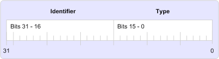

# MAPI プロパティ タグ
  
**適用対象**: Outlook 2013 | Outlook 2016 
  
プロパティ タグは、16 から 31 のビットの一意のプロパティ識別子とプロパティの型のビット 0 ~ 15 は次の図に示すように含まれている 32 ビットの数値です。 
  
**プロパティ タグ要素**
  

  
プロパティ タグを使用して MAPI プロパティを識別し、すべてのプロパティは、いずれか、MAPI、クライアント、またはサービス プロバイダーによって、プロパティが定義されているかどうかに関係なく必要があります。 MAPI は、Mapitags.h ヘッダー ファイル内のプロパティのプロパティ タグ定数のセットを定義します。これらのプロパティは、[MAPI 定義のプロパティ] と呼ばれます。 
  
プロパティ タグ定数は、一貫性と使いやすさの名前付け規則に従います。 各プロパティ タグの名前に 2 つの部分がある: PR_ プレフィックスおよびプロパティの内容を説明する 1 つまたは複数の文字の文字列です。 複数文字の文字列は、アンダー スコアで区切られます。 メッセージの受信者のアドレスの種類のプロパティ タグは、たとえば、 **PR\_ADDRTYPE** ([PidTagOrgAddrtype](https://msdn.microsoft.com/library/d40b5707-e4d5-4746-88d4-8616a3789789%28Office.15%29.aspx)) と、すべての送信メッセージのコピーを受信するように指定されたフォルダーのエントリ id は、 **PR_IPM_SENTMAIL_エントリ ID** ([PidTagIpmSentMailEntryId](pidtagipmsentmailentryid-canonical-property.md))。
  
[PROP_TYPE](prop_type.md)、 [PROP_ID](prop_id.md)、および[PROP_TAG](prop_tag.md)にそれらの間で、プロパティ タグを付ける作業を支援するいくつかのマクロを利用できます。 **プロペラ\_型**プロパティ タグからプロパティの型を抽出します。**プロペラ\_ID** id を抽出します。 **PROP_TAG**は、プロパティの型と識別子のプロパティ タグを作成します。 
  
## 関連項目

- [MAPI のプロパティの概要](mapi-property-overview.md)

