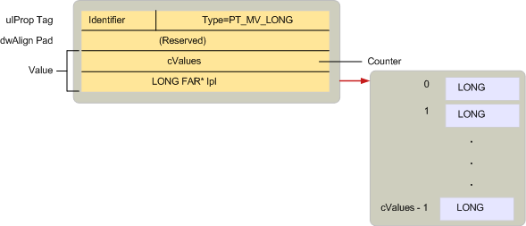

# MAPI プロパティの型の概要MAPI property type overview
  
**適用対象**: Outlook**Applies to**: Outlook 
  
プロパティの型は、MAPIDEFS では、MAPI によって定義されている定数です。H ヘッダー ファイルのプロパティ値の基になるデータ型を示す。Property types are constants defined by MAPI in the MAPIDEFS.H header file that indicate the underlying data type of a property value. すべてのプロパティは、MAPI、クライアント アプリケーション、またはサービス ・ プロバイダーに定義されているかどうかを使用して、これらの種類のいずれかです。All properties, whether they are defined by MAPI, by client applications, or by service providers, use one of these types. 
  
プロパティの型は、次のような名前付け規則のプロパティ タグを使用に設定します。Property types follow a similar naming convention to the one used for property tags. 多くのプロパティの種類には、単一値と複数値の両方のバージョンがインストールされています。Many property types have both a single-value and multiple-value version. 1 つの値を持つプロパティには、1 つの整数や文字列などの型の 1 つの値が含まれています。Single valued properties contain one value of its type such as a single integer or character string. 単一値のプロパティを表すために使用する定数には、2 つの部分: プレフィックス PT_ と時間の長い、STRING8 など、実際の型を記述する文字列。The constant used to represent a single value property has two parts: the prefix PT_ and a string describing the actual type, such as LONG or STRING8. 
  
複数値プロパティには、その型の 1 つ以上の値が含まれています。Multiple-value properties contain more than one value of its type. OLE バリアント型の配列とは異なりは、同じ種類の複数値を持つプロパティに含まれる値です。Unlike OLE variant arrays, every value in a multivalued property is of the same type. 複数値を持つプロパティを表すために使用する定数は、対応する 1 つの値を表す定数基本型と、MV_FLAG フラグを組み合わせることによって作成されます。The constant used to represent multivalued properties is created by combining the MV_FLAG flag with the corresponding single value constant representing the base type. 次の 3 つの部分があります: MV_ の後に PT_ というプレフィックスの後に型を表す文字列。There are three parts: the prefix PT_ followed by MV_ followed by a string that describes the type. たとえば、複数の整数を格納しているプロパティの型は、PT_MV_LONG、PT_MV_STRING8 は、複数の文字列をします。For example, the type for a property containing multiple integers is PT_MV_LONG and for multiple character strings is PT_MV_STRING8.
  
次の図は、複数値の整数では、PT_MV_LONG の種類のプロパティを記述する[SPropValue](spropvalue.md)構造体の構造を示します。The following illustration shows the structure of an [SPropValue](spropvalue.md) structure to describe a multiple-value integer, a property of type PT_MV_LONG. **値**のメンバーは、プロパティとそれらの値の配列へのポインターに整数値の数のカウントを含むように拡張されます。The **Value** member is expanded to include a count of the number of integer values in the property and a pointer to an array of those values. 
  
**複数値プロパティ****Multiple-value properties**
  

  
複数値をサポートするプロパティは省略可能、MAPI は、クライアントとサービス ・ プロバイダーをサポートして両方の種類のプロパティのため、有効に MAPI 準拠のコンポーネント間の対話をよりことをお勧めします。Although support for multiple-value properties is optional, MAPI recommends that clients and service providers support both types of properties because doing so enables greater interaction between MAPI-compliant components.
  
次の図では、すべて**SPropValue**構造体に格納されている場所を示すさまざまなプロパティ型の定数の一覧表示されます。The following illustration lists all of the different property type constants, showing where they are stored in an **SPropValue** structure. **値**のメンバーのサイズは、特定のタイプによって異なります。The size of the **Value** member is dependent on the particular type. 対応する複数値があるすべての単一値の型に注意してください。Notice that not all of the single-value types have multiple-value equivalents. 
  
**プロパティ タイプ定数****Property type constants**
  

  
クライアントとサービス プロバイダーのプロパティは、2 つの手順に従う必要があります。Clients and service providers working with a property need to follow two steps:
  
1. プロパティが使用可能または使用できないかを確認します。Determine if the property is available or unavailable.
    
2. 可能な場合、プロパティの値を取得します。If available, retrieve the property's value.
    
クライアントまたはサービス プロバイダーが必要なプロパティの存在をチェックだけ場合があります。それ以外の場合は、特定の値を確認する必要があります。Sometimes a client or service provider need only check for the existence of a property; other times it is necessary to check for a specific value. たとえば、トランスポート プロバイダーが処理のためのアクションの 3 つの異なるコースをある、 **PR\_SEND_RICH_INFO** ([PidTagSendRichInfo](pidtagsendrichinfo-canonical-property.md)) のプロパティ、メッセージで送信されるかどうかを示すブール値書式設定されたテキストです。For example, transport providers have three different courses of action for processing the **PR\_SEND_RICH_INFO** ([PidTagSendRichInfo](pidtagsendrichinfo-canonical-property.md)) property, a Boolean value that indicates whether or not a message should be transmitted with formatted text. 場合**PR\_SEND_RICH_INFO**は、トランスポート プロバイダーは、TRUE に設定すると、書式設定されたテキストを送信します。If **PR\_SEND_RICH_INFO** is set to TRUE, the transport provider transmits the formatted text. FALSE に設定されている場合は、伝送する前に書式設定されたテキストが破棄されます。If it is set to FALSE, the formatted text is discarded before transmission. **PR_SEND_RICH_INFO**では、トランスポート プロバイダーは、次のようにアクションのどのような場合は、その既定コースは特定のプロバイダーにします。If **PR_SEND_RICH_INFO** is unavailable, the transport provider follows its default course of action, whatever that is for the particular provider. 
  
MAPI は、PT_UNSPECIFIED は、クライアントまたはサービス プロバイダーは、プロパティの型が不明の場合は、プロパティを取得するために使用できる特殊なプロパティ型を定義します。型の事前知識がないプロパティを取得するには、クライアントまたはサービス プロバイダーはオブジェクトの[IMAPIProp::GetProps](imapiprop-getprops.md)メソッドを呼び出すし、プロパティ タグのプロパティの識別子と、PT_UNSPECIFIED プロパティのデータ型を渡します。MAPI defines a special property type, PT_UNSPECIFIED, that a client or service provider can use to retrieve a property when the property type is unknown.To retrieve a property without advance knowledge of its type, a client or service provider calls an object's [IMAPIProp::GetProps](imapiprop-getprops.md) method and passes a property tag made up of the property's identifier and the PT_UNSPECIFIED property type. **GetProps**に、PT_UNSPECIFIED を適切な型に置き換えてプロパティの[SPropValue](spropvalue.md)構造体を返します。**GetProps** returns an [SPropValue](spropvalue.md) structure for the property, replacing PT_UNSPECIFIED with the appropriate type. **GetProps**を実装するサービス プロバイダーは、PT_UNSPECIFIED をサポートする必要があります。Service providers implementing **GetProps** are required to support PT_UNSPECIFIED. 
  
MAPI オブジェクトのいくつかは、オブジェクトを自体はプロパティをサポートします。Some MAPI objects support properties that are themselves objects. PT_OBJECT 型は、オブジェクトのプロパティであります。Object properties have the type PT_OBJECT. 通常これらのプロパティ、クライアント、サービス プロバイダーにアクセスするのには**IMAPIProp::GetProps**を使用する代わりにユーザーのいずれかの[IMAPIProp::OpenProperty](imapiprop-openproperty.md)メソッド、オブジェクトのアクセス、またはメソッドの適切なインターフェイスを指定します。プロパティをサポートします。Instead of using **IMAPIProp::GetProps** to access these properties, clients and service providers typically user either the [IMAPIProp::OpenProperty](imapiprop-openproperty.md) method, specifying the appropriate interface for access, or a method on the object supporting the property. 
  
オブジェクトのプロパティの値にアクセスするため、オブジェクトの使用するインタ フェースのいずれかの**GetProps**が適切ではありませんが含まれます。Because accessing the value of an object property involves using one of the interfaces for the object, **GetProps** is inappropriate. **GetProps**、呼び出し元がプロパティの値をアクセス**SPropValue**構造体を使用。With **GetProps**, the caller accesses a property's value through an **SPropValue** structure. **IMAPIProp::OpenProperty**では、呼び出し元は、オブジェクトにアクセスできるインターフェイスへのポインターを取得します。With **IMAPIProp::OpenProperty**, the caller retrieves a pointer to an interface that can access the object. **OpenProperty**は、オブジェクトのプロパティを取得するために常に使用できます。**OpenProperty** can always be used to retrieve an object property. すべてのオブジェクト プロパティを使用して、オブジェクトのメソッドを呼び出して、他のオプションが得られません。The other option, calling a method on the object, is not available with every object property. 
  
たとえば、すべてのフォルダーには、2 つのテーブル、階層テーブルおよび内容のテーブルがサポートされています。For example, every folder supports two tables, a hierarchy table and a contents table. これらのテーブルには、フォルダーのプロパティプロパティ タグは、 **PR_CONTAINER_HIERARCHY** ([PidTagContainerHierarchy](pidtagcontainerhierarchy-canonical-property.md)) および**PR_CONTAINER_CONTENTS** ([PidTagContainerContents](pidtagcontainercontents-canonical-property.md)) です。These tables are properties of the folder; their property tags are **PR_CONTAINER_HIERARCHY** ([PidTagContainerHierarchy](pidtagcontainerhierarchy-canonical-property.md)) and **PR_CONTAINER_CONTENTS** ([PidTagContainerContents](pidtagcontainercontents-canonical-property.md)). テーブルは、アクセスの**IMAPITable**インターフェイスを必要とするオブジェクトです。Tables are objects that require the **IMAPITable** interface for access. クライアントは、階層テーブルの内容のテーブル、またはフォルダーの[IMAPIProp::OpenProperty にアクセスするためのフォルダーの[IMAPIContainer::GetContentsTable](imapicontainer-getcontentstable.md)メソッドにアクセスするためのフォルダーの[IMAPIContainer::GetHierarchyTable](imapicontainer-gethierarchytable.md)メソッドを呼び出すことができます。](imapiprop-openproperty.md)いずれかのテーブルにアクセスするメソッドです。A client can call the folder's [IMAPIContainer::GetHierarchyTable](imapicontainer-gethierarchytable.md) method to access the hierarchy table, the folder's [IMAPIContainer::GetContentsTable](imapicontainer-getcontentstable.md) method to access the contents table, or the folder's [IMAPIProp::OpenProperty](imapiprop-openproperty.md) method to access either table. **OpenProperty**を呼び出すには、クライアントは、最初のパラメーターと 2 番目のパラメーターとしてのアクセスに使用するインターフェイスのインターフェイス識別子とプロパティのプロパティ タグを渡します。To call **OpenProperty**, a client passes the property tag for the property as the first parameter and an interface identifier for the interface to be used for access as the second parameter. これらのパラメーターは、 **PR_CONTAINER_HIERARCHY**または**PR_CONTAINER_CONTENTS**と**IID_IMAPITable**になります。These parameters would be **PR_CONTAINER_HIERARCHY** or **PR_CONTAINER_CONTENTS** and **IID_IMAPITable**.
  
単一値および複数値プロパティの型の完全なリストは、[プロパティの型](property-types.md)を参照してください。For a complete list of the single-value and multiple-value property types, see [Property Types](property-types.md). 
  
## 関連項目See also

- [MAPI のプロパティの概要MAPI Property Overview](mapi-property-overview.md)

