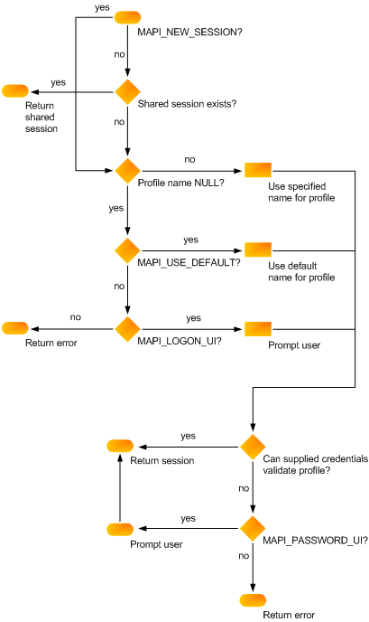

# MAPI セッション

**適用対象**: Outlook 2013 | Outlook 2016 
  
��ɂȂ郁�b�Z�[�W���O �V�X�e���Ăяo���N���C�A���g �A�v���P�[�V�����ɂ́A�O�ɁA�Z�b�V�����A�܂��� MAPI �T�u�V�X�e���Ƃ̐ڑ���m������K�v������܂��B
  
���O�I������ƁA���[�U�[�A�L���ȃv���t�@�C���ɃA�N�Z�X���A���b�Z�[�W���O �V�X�e���ƃ��b�Z�[�W �T�[�r�X�̎��i����m�F����v���Z�X�́A�Z�b�V�������J�n����܂��B���ɁA�v���Z�X�ɂ��A���ׂẴv���t�@�C���̃��b�Z�[�W�̃T�[�r�X���������\������Ă��܂��B�N���C�A���g�̃C���^�[�t�F�C�X��g�p����ɂ́A���O�I���Ăяo�������܂�܂��BMAPI �N���C�A���g�ł́A [MAPILogonEx](mapilogonex.md)�֐���Ăяo���܂��B 
  
Message service configuration is one of the most important parts of the logon process. The profile is the initial source for configuration information. If information for a particular message service is missing, the logon process tries to prompt the user to supply it. This is not always successful for two reasons: First, prompting the user requires the display of a dialog box. It is possible for clients to disallow the display of a user interface by passing a flag into the logon call. Second, the user could cancel the dialog box before the needed information can be added.
  
When a logon process fails one time, the user is informed of the failure and given the chance to retry or correct the error condition. Once again, a user interface will be displayed, if the client allows it, and the user will be prompted to enter whatever data is missing. If this second try is unsuccessful, MAPI disables all service providers in the message service for the duration of the session. In effect, the whole message service is disabled. This means that none of the service providers in the message service can work. This is done because if one provider fails logon, the other providers usually also fail. The logon process can fail due to an invalid path for a necessary resource, an incompatible version of MAPI, an unavailable messaging server, or data corruption. 
  
�N���C�A���g�����O�I���ʘb��m������Z�b�V������ 2 ��ނ̂����ꂩ��w��ł��܂��B �X �̃Z�b�V�����܂��͋��L�̃Z�b�V�����B�X �̃Z�b�V�����̓v���C�x�[�g�ڑ����܂��B�N���C�A���g �A�v���P�[�V������g�p���Ă���Z�b�V�����̊Ԃ̈�Έꃊ���[�V�����V�b�v������܂��B���ʂƂ��āA�Z�b�V�����̋��L��N���C�A���g �A�v���P�[�V������v���t�@�C������L���܂��B���L�Z�b�V������ 1 ��m�����܂����A������g�p����K�v�����邻�̑��̃N���C�A���g �A�v���P�[�V�����Ŏg�p���邱�Ƃ��ł��܂��B�v���t�@�C������ю��i���́A�ŏ��̃��O�I���݂̂�w�肵�܂��B 
  
Clients can log on multiple times as the same user or as multiple users. MAPI does not prevent this. Some service providers, however, might not be as flexible, returning the error value MAPI_E_SESSION_LIMIT on subsequent logon attempts. Service providers with underlying hardware limitations can be required to enforce a session limit.
  
The function calls for establishing a session have a collection of flags and parameters that control how the session is created. The client specifies an optional profile name and a window handle that acts as the parent window for any dialog boxes that are displayed. The flags include MAPI_NEW_SESSION, which requests that a new, individual session (rather than a shared session) be established, and the MAPI_LOGON_UI user interface flag. The user interface flag is set to request a logon dialog box.
  
���̐}�́A�����̂��܂��܂ȃp�����[�^�[�ƃt���O�� MAPI �Z�b�V������m��������@������܂��B
  
**MAPI �Z�b�V�����̃t���[�`���[�g**
  

  
�N���C�A���g �A�v���P�[�V���������Z�b�V�����̏������@�̏ڍׂɂ‚��ẮA [MAPI �Z�b�V�����̏���](mapi-session-handling.md)��Q�Ƃ��Ă��������B
  
## 関連項目

- [MAPILogonEx](mapilogonex.md)  
- [IMAPISession: IUnknown](imapisessioniunknown.md)
- [MAPI �Z�b�V�����̏���](mapi-session-handling.md)  
- [MAPI �v���O���~���O�̊T�v](mapi-programming-overview.md)

