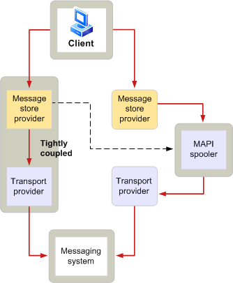

# MAPI スプーラーの概要
  
**適用対象**: Outlook 
  
MAPI スプーラーは、Microsoft Office Outlook プロセスが担当するへのメッセージ送信と受信メッセージのメッセージング システムからの機能です。 MAPI スプーラーは、メッセージの受信と配信で重要な役割を果たします。 メッセージング システムが使用できない場合は、MAPI スプーラーはメッセージを格納し、後でそれらが自動的に転送します。 上に保持または、必要に応じてデータを送信するには、この機能は、保存し、転送、リモート接続は、共通であり、ネットワーク トラフィックが高い環境で重要な機能と呼ばれます。 MAPI スプーラーは、Outlook 内でバック グラウンド スレッドとして実行されます。
  
MAPI スプーラーは、メッセージの配布に関連するその他の責任を持っています。 これらの余分な作業を以下に示します。
  
- 追跡は、特定のトランスポート プロバイダーによって処理される受信者の種類です。
    
- 新しいメッセージが配信されたときにクライアント アプリケーションに通知します。
    
- 前処理スクリプトと後処理の呼び出しのメッセージです。
    
- そのメッセージの配信を示すレポートを生成するが発生しました。
    
- 処理された受信者の状態を維持します。
    
次の図は、クライアントからのメッセージング システムにメッセージのフローを高レベルでは。
  
**出力メッセージ フロー**
  

  
クライアント アプリケーションのユーザーは、1 つまたは複数の受信者にメッセージを送信します。 メッセージは、送信側のプロセスでは、伝送のために必要な追加情報を持つメッセージの書式設定プロバイダーが初期化を格納します。
  
MAPI スプーラーは、次の条件のいずれかが発生した場合を処理するメッセージを受信します。
  
- メッセージ ストア プロバイダーは、トランスポート プロバイダーの密結合されていません。
    
- メッセージには、前処理が必要です。
    
- トランスポート、メッセージ ストア プロバイダーは緊密に結びついているが、相手にメッセージの宛先がすべての受信者を処理することはできません。
    
MAPI スプーラーは、メッセージを受信する必要な処理を実行し、適切なトランスポート プロバイダーにメッセージを配信します。 トランスポート プロバイダーは、そのメッセージング システム、その目的の受信者に送信するメッセージを使用できます。
  
受信メッセージの流れが逆になります。 トランスポート プロバイダーは、そのメッセージング システムからメッセージを受信し、MAPI スプーラーを通知します。 スプーラーでは、すべての必要な後処理を実行およびメッセージ ストア プロバイダーに新しいメッセージが到着したことを通知します。 この通知には、新しいメッセージを確認するユーザーを有効にすると、メッセージの表示を更新するのにはクライアントが発生します。
  
## 関連項目

- [MAPI の機能とアーキテクチャ](mapi-features-and-architecture.md)

