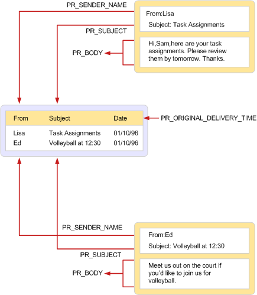

# MAPI テーブル
  
**適用対象**: Outlook 2013 | Outlook 2016 
  
MAPI テーブルは、特定の種類の他の MAPI オブジェクトに属するプロパティのコレクションを表示するために使用される MAPI オブジェクトです。 MAPI テーブルは、各行がオブジェクトを表し、各列がオブジェクトのプロパティを表す行と列形式で構成されます。 通常、各行に含まれるプロパティの **1** つは、PR_ENTRYID ([PidTagEntryId](pidtagentryid-canonical-property.md)) プロパティです。オブジェクトを開いて変更するために使用できる識別子です。 
  
行にはプロパティ値が含まれるため、テーブルから行を取得すると、その行が表すオブジェクトから一連のプロパティを直接取得するのと似ています。 どちらの操作でも、プロパティ値配列が取得されます。 主な違いは、長い文字列プロパティとバイナリ プロパティの処理です。 テーブルに含める場合、一部のテーブル実装者は、これらのプロパティを 255 バイトに切り詰めます。 オブジェクトから直接取得すると、常に完全な値を使用できます。
  
テーブルは、テーブルの種類と、その中のオブジェクトに応じて、アドレス帳とメッセージ ストア プロバイダー、MAPI によって実装されます。 メッセージ ストア プロバイダーは、フォルダー内のメッセージに関する情報を含む各フォルダーのフォルダーとコンテンツ テーブルを実装します。 アドレス帳プロバイダーは、アドレス帳コンテナーと、その組織を示す階層テーブルを実装します。 MAPI では、いくつかの異なるテーブルが実装されています。一部はクライアント アプリケーションで使用するために、いくつかはサービス プロバイダーによって使用され、一部は両方で使用されます。 状態テーブルは、MAPI が最終的にテーブルを提供する一意ですが、行は MAPI に加えて、すべての種類のサービス プロバイダーからの投稿で構成されます。 
  
次の図は、MAPI で頻繁に使用されるテーブルの 1 つを示しています。フォルダーの内容を表示します。 右側には、一般的なメッセージング クライアント アプリケーションに表示される可能性がある 2 つのメッセージが表示されます。 この表示には、各メッセージに関する 4 つの情報 (送信者、受信者、件名、メッセージ テキスト) が含まれる。 各情報は、メッセージのプロパティに対応します。
  
左側には、これら 2 つのメッセージを含むコンテンツ テーブルのビューがあります。 フォルダーには 10 個のメッセージがあり、各行には 3 つ以上の列が含まれているため、コンテンツ テーブルには 10 行が含まれる場合があります。この特定のビューは 2 行と 3 列に制限されます。
  
次の表に、テーブル ビューの列セットを構成するプロパティを示します。
  
|**プロパティ**|**説明**|
|:-----|:-----|
|**PR_SENDER_NAME** ([PidTagSenderName](pidtagsendername-canonical-property.md))    |送信者名    |
|**PR_ORIGINAL_DELIVERY_TIME** ([PidTagOriginalDeliveryTime](pidtagoriginaldeliverytime-canonical-property.md))    |メッセージが送信された日時    |
|**PR_SUBJECT** ([PidTagSubject](pidtagsubject-canonical-property.md))    |メッセージの件名    |
   
メッセージに表示されるプロパティのセットは、テーブルに表示される列のセットと同じではありません。 テーブルの実装者 (この場合はメッセージ ストア プロバイダー) は、既定の列セットを既定の順序で提供します。 クライアントは、この列セットを変更したり、追加の列を要求したり、既定の列を拒否したりして、特定の方法で順序付けを要求できます。 クライアントは行を並べ替え、1 つ以上の列の値に従って並べ替えすることもできます。
  
**テーブルを使用してフォルダーの内容を表示**
  

  
テーブルを操作するには、次の 2 つのインターフェイスがあります。
  
- [IMAPITable : IUnknown](imapitableiunknown.md) は、クライアントとサービス プロバイダーにテーブルの基になるデータの読み取り専用ビューを提供し、プレゼンテーションのみを表示および変更できます。 複数のユーザーが IMAPITable と同時に同じ **データにアクセスできます**。 **IMAPITable** は、MAPI およびサービス プロバイダーによって実装されます。 
    
- [ITableData : IUnknown](itabledataiunknown.md) は、クライアントとサービス プロバイダーにテーブルの基になるデータへの読み取り/書き込みアクセス権を与え、永続的な変更を行えます。 **IMAPITable は** MAPI によって実装され、主に CreateTable 関数を呼び出してアクセスする [サービス プロバイダーによって使用](createtable.md) されます。 **ITableData 実装では**、テーブルのすべてのデータとメモリ内の関連付けられた制限が保持され、非常に大きなテーブルでの使用には適しくなっています。 複合的な制限と、分類などの複雑な操作はサポートされていません。 
    
## 関連項目

- [MAPI の概念](mapi-concepts.md)

