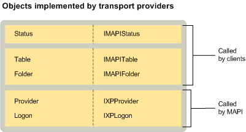

# MAPI トランスポートプロバイダーのオブジェクトMAPI transport provider objects
  
**適用対象**: Outlook 2013 | Outlook 2016**Applies to**: Outlook 2013 | Outlook 2016 
  
すべてのサービスプロバイダーで実装されている標準のプロバイダーおよびログオンオブジェクトに加えて、status オブジェクトを実装するには、トランスポートプロバイダーが必要です。In addition to the standard provider and logon objects implemented by all service providers, transport providers are required to implement a status object. その他のサービスプロバイダーの種類については、status オブジェクトを実装することはオプションです。For the other service provider types, implementing a status object is optional. ただし、MAPI はトランスポートプロバイダーに対して必須です。However, MAPI requires it for transport providers. リモートサーバーからのメッセージヘッダーのダウンロードをサポートするトランスポートプロバイダーも、フォルダーとテーブルを実装します。Transport providers that support the downloading of message headers from a remote server also implement a folder and a table. 
  
次の図は、トランスポートプロバイダーが対応するインターフェイスと共に実装できる各オブジェクトを示しています。The following illustration shows each of the objects that transport providers can implement with their corresponding interfaces. この図は、MAPI またはクライアントがオブジェクトのユーザーであるかどうかも示しています。The illustration also indicates whether MAPI or a client is the object's user.
  

  
## 関連項目See also

- [MAPI サービスプロバイダオブジェクトMAPI Service Provider Objects](mapi-service-provider-objects.md)

