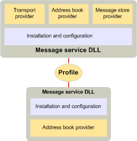

# メッセージ サービス、およびプロファイル
  
**適用対象**: Outlook 
  
一部のユーザーは、それぞれ 1 つまたは複数のサービス プロバイダーが、いくつかのメッセージング システムのサービスを必要とします。 インストールし、これらのサービス プロバイダーのそれぞれを個別に構成するのには煩雑なため、メッセージング サーバーは通常、すべての機能を公開するのには関連するプロバイダーのグループを必要とするため、MAPI には、メッセージ サービスの概念が含まれています。 メッセージ サービスでは、ユーザーをインストールし、サービス プロバイダーの構成を支援します。
  
メッセージ サービスを作成するには、開発者は、サービス内の各プロバイダーの構成を処理するために、メッセージ サービスのエントリ ポイント プログラムとは、次のセットアップ プログラムを書き込みます。
  
- サービスでは、各プロバイダーをインストールします。
    
- レジストリと初期化ファイルのエントリを作成します。
    
- Mapisvc.inf MAPI 構成ファイルにエントリを作成します。
    
Mapisvc.inf ファイルには、すべてのメッセージ サービス、およびコンピューターにインストールされているサービス プロバイダーの構成に関連する情報が含まれています。 構造になっている階層のセクションで次にリンクされている各レベルにします。 上部の内容は以下の 3 つのセクションには。 
  
- メッセージ サービスのヘルプ ファイルの一覧です。
    
- 最も重要なまたは、既定のメッセージ サービスの一覧です。
    
- コンピューター上のすべてのサービスの一覧です。
    
次のレベルには、各メッセージのサービスについては、セクションが含まれているし、最後のレベルには、サービスのサービス プロバイダーごとにセクションが含まれています。 MAPI は、サービス プロバイダーおよびメッセージ サービスの開発者が Mapisvc.inf; に特定のエントリを追加する必要があります。開発者は、独自の裁量により、他のエントリを追加できます。 Mapisvc.inf の末尾を 1 つの情報のほとんど、または複数のプロファイルのユーザーの構成情報のコレクションでは、メッセージ サービスのセットが優先されます。 コンピューターが複数のユーザーを持つことができますので、1 人のユーザーが複数の環境設定のセットを持つことができます多くのプロファイルがコンピューターに存在できます。 各プロファイルでは、別のメッセージ サービスのセットについて説明します。 複数のプロファイルを持つ、たとえば、自宅セットを操作する 1 つのメッセージ サービスとオフィスの異なるセットを使用してユーザーを有効にします。
  
プロファイルは、構成のサポートを提供するクライアント ・ アプリケーションで、メッセージ サービスのインストールまたはログオン時に作成されます。 MAPI がこのような 2 つのクライアント アプリケーションを実現しています: コントロール パネルの項目と、プロファイル ウィザードです。 コントロール パネルのアイテムは、フル構成のアプリケーションをユーザーが作成、削除、編集、プロファイルをコピーし、プロファイル内のエントリに変更を加えるです。 プロファイル ウィザードは、メッセージ サービスを追加するプロファイルをできるだけ簡単にするように設計された単純なアプリケーションです。 プロファイル ウィザードは、ダイアログ ボックス、[プロパティ ページ] のインストールと構成、サービスのプロセスをユーザーに確認すると呼ばれる一連ので構成されます。 ユーザーは、値が要求されただけの最も重要な設定です。その他のすべての設定は、既定値を継承します。 プロファイルが作成されると、変更を加えるユーザーを作成できません。 
  
コントロール パネルからコントロール パネルの項目が常に呼び出されると、一方は、呼び出されるプロファイル ウィザードを引き起こす可能性のあるシナリオのさまざまながあります。 クライアント アプリケーションと 1 つがまだ作成されていないログオン時に既定のプロファイルを作成するのにはプロファイル ウィザードを呼び出すことができます。 プロファイルを追加するコードを再実装をするのではなく、コントロール パネルの項目または別のクライアント アプリケーションは、プロファイル ウィザード内の既存の機能に利用できます。 メッセージ サービスでは、そのエントリ ポイント関数で呼び出すことができますプロファイル ウィザード サービスが既定のプロファイルに追加する必要がある場合。 プロファイル ウィザードを使用するメッセージ サービスには、余分なエントリ ポイント関数と標準の Windows ダイアログ ボックス プロシージャを書き込む必要があります。 プロファイル ウィザードは、ダイアログ ボックス プロシージャがこのダイアログ ボックスが使用しているときに生成されるメッセージを処理中にサービスの構成] ダイアログ ボックスを取得するためにエントリ ポイント関数を呼び出します。 
  
Mapisvc.inf ファイルを同様の方法では、プロファイルが構成されています。 プロファイルへのリンクが階層的なセクションです。サービス プロバイダー固有のセクションで最下位レベルで、メッセージ サービスが、中間レベルのセクションを所有して、MAPI は、最上位レベルのセクションを所有しています。 各セクションは、 [MAPIUID](mapiuid.md)と呼ばれる一意の識別子で識別されます。 MAPI セクションなどの他のセクションへのリンク、メッセージ サービスのプロファイル セクションのすべての識別子は、mapi の内部の情報が含まれています。 各メッセージのサービス] セクションは、そのプロバイダーのセクションへのリンクを格納し、各プロバイダー] セクションの [サービス] セクションへのリンクを格納します。 
  
次の図は、2 つの一般的なプロファイルの内容を示しています。 Sam では、自分のコンピューター、ホーム用とオフィス用の 2 つのプロファイルがあります。 ホームのプロファイルには、次の 3 つのメッセージ サービスが含まれています。 サービス X のメッセージは、アドレス帳の管理を 1 つのプロバイダー サービスです。 サービスの Y および Z は、次の 3 つのプロバイダーを持つメッセージ、アドレス帳プロバイダー、メッセージ ストア プロバイダー、およびトランスポート プロバイダー。 Sam の作業プロファイルには、それぞれが持つアドレス帳プロバイダー、メッセージ ストア プロバイダー、およびトランスポート プロバイダーの 2 つの異なるメッセージ サービスが含まれています。 
  
**プロファイルの例**
  

  
次の図は、2 つのメッセージ サービスを含むプロファイルを示します。 インストールしてメッセージ サービスに属しているサービス プロバイダーを構成するためのコードでは、プロバイダーのコードと同じ DLL に存在します。 このコードは、サービス ・ プロバイダーを構成するのにはログオン時にプロファイルから情報を読み取るし、ユーザー、可能であれば、必要に応じて、不足している情報のメッセージが表示されます。 表示または任意のプロバイダーの構成設定を変更するようにクライアントからの要求も、この共通のコードで処理します。
  
**サービス プロバイダーのインストールおよび構成**
  

  
## 関連項目

- [MAPIUID](mapiuid.md)
- [MAPI �v���O���~���O�̊T�v](mapi-programming-overview.md)

