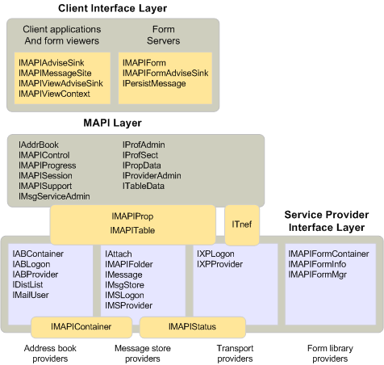

# オブジェクト、および MAPI アーキテクチャ

**適用されます**: Outlook 
  
すべての MAPI を定義するオブジェクトは、MAPI アーキテクチャでは、1 つまたは複数のレイヤーに分けられます。 クライアント ・ インタ フェース ・ レイヤーには、クライアント アプリケーション、フォームのビューアー、またはフォームのサーバーを実装するすべてのオブジェクトが含まれています。 サービス プロバイダー インターフェイス層には、任意の型のサービス ・ プロバイダーを実装するオブジェクトが含まれています。 このレイヤーには、アドレス帳、メッセージ ・ ストア、トランスポート プロバイダー、およびフォーム ライブラリで実装されているオブジェクトが含まれています。 MAPI のサブシステムを表すレイヤーは、クライアントとサービス プロバイダーのインターフェイス層の間に配置されます。 MAPI のレイヤーには、すべての MAPI を使用するには、クライアントまたはサービス プロバイダーの実装するオブジェクトが含まれています。 
  
MAPI オブジェクトの組み込まれているか、MAPI アーキテクチャを次の図に示します。 オブジェクトは、派生インターフェイスの名前で表されます。 アドバイズ シンク オブジェクトを表示するたとえば、 [IMAPIAdviseSink: IUnknown](imapiadvisesinkiunknown.md)、 [IUnknown](http://msdn.microsoft.com/library/33f1d79a-33fc-4ce5-a372-e08bda378332%28Office.15%29.aspx)から派生して、すべてのアドバイズ シンク オブジェクトを実装するインターフェイスです。 レイヤーを埋めるためのインタ フェースは、使用か、または複数のコンポーネントによって実装されています。 すべての通信が、MAPI を介してフローする必要があることを暗に示して、クライアントとプロバイダー層を分離するのには MAPI のレイヤーが表示されますが、そうではないです。 クライアントことができ、サービス ・ プロバイダーのオブジェクトと直接通信を行います。 
  
**MAPI オブジェクト レイヤー**
  

  
## 関連項目

- [IMAPIAdviseSink: IUnknown](imapiadvisesinkiunknown.md)
- [MAPI オブジェクトとインターフェイスの概要](mapi-object-and-interface-overview.md)

