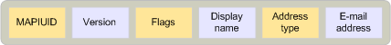

# 一時エントリ識別子One-off entry identifiers
  
**適用対象**: Outlook 2013 | Outlook 2016**Applies to**: Outlook 2013 | Outlook 2016 
  
**IAddrBook:: createoneoff**メソッドと、ゲートウェイコンポーネントなどの mapi サブシステムにアクセスできないコンポーネントによって、1回限りのエントリ識別子が mapi によって作成されます。One-off entry identifiers are created by MAPI in the **IAddrBook::CreateOneOff** method and by components that do not have access to the MAPI subsystem, such as gateway components. �ڍׂɂ‚��ẮA [IAddrBook::CreateOneOff](iaddrbook-createoneoff.md)��Q�Ƃ��Ă��������BFor more information, see [IAddrBook::CreateOneOff](iaddrbook-createoneoff.md). 次の図は、1回限りのエントリ識別子の形式を示しています。The following illustration shows the format of a one-off entry identifier.
  
**一時エントリ識別子の形式****One-off entry identifier format**
  

  
最初のフィールドは、カスタム受信者を表すエントリ id を識別する特別な[MAPIUID](mapiuid.md)構造です。The first field is a special [MAPIUID](mapiuid.md) structure that identifies the entry identifier as representing a custom recipient. この**MAPIUID**構造は、定数 MAPI_ONE_OFF_UID に設定する必要があります。This **MAPIUID** structure must be set to the constant MAPI_ONE_OFF_UID. MAPI_ONE_OFF_UID は、ヘッダーファイル mapidefs.h で定義されています。H.MAPI_ONE_OFF_UID is defined in the header file MAPIDEFS.H. 
  
version および flags フィールドは、Intel バイトオーダーでの16ビットの単語です。The version and flags fields are 16-bit words in Intel byte order. バージョンフィールドは0に設定する必要があります。The version field must be set to zero. flags フィールドには、次の値を設定できます。The flags field can be set to the following values:
  
MAPI_ONE_OFF_NO_RICH_INFOMAPI_ONE_OFF_NO_RICH_INFO
  
MAPI_ONE_OFF_UNICODEMAPI_ONE_OFF_UNICODE
  
MAPI_ONE_OFF_NO_RICH_INFO フラグは、受信者がトランスポートニュートラルカプセル化形式 (TNEF) でメッセージコンテンツを受信できないように設定されています。The MAPI_ONE_OFF_NO_RICH_INFO flag is set if a recipient should not receive message content in the Transport Neutral Encapsulation Format (TNEF). このフラグは、MAPI_SEND_NO_RICH_INFO が[IAddrBook:: createoneoff](iaddrbook-createoneoff.md)メソッドに渡されたときに設定されます。This flag is set when MAPI_SEND_NO_RICH_INFO is passed to [IAddrBook::CreateOneOff](iaddrbook-createoneoff.md) method. 
  
表示名と電子メールアドレスが UNICODE 文字列の場合は、MAPI_ONE_OFF_UNICODE フラグが設定されます。The MAPI_ONE_OFF_UNICODE flag is set if the display name and email address are Unicode strings. このフラグは、MAPI_UNICODE が**IAddrBook:: createoneoff**に渡されたときに設定されます。This flag is set when the MAPI_UNICODE is passed to **IAddrBook::CreateOneOff**. MAPI_UNICODE フラグが**createoneoff**に渡されていない場合、MAPI では、表示名と電子メールアドレスの文字列がワークステーションの現在の ANSI 文字セットに含まれていると見なされます。When the MAPI_UNICODE flag is not passed to **CreateOneOff**, MAPI assumes that the display name and email address strings are in the workstation's current ANSI character set. ANSI 文字列は、コードページがエントリ識別子でエンコードされていないために、異なる文字セットを使用してプラットフォーム間で送信されるメッセージでは、通常は適切に機能しません。ANSI strings generally do not work well in messages that are sent between platforms using different character sets because the code page is not encoded in the entry identifier. このような非互換性の問題から保護するために、多くのアドレスの種類は、複数の文字セットで共通の文字に制限されています。To protect against this potential incompatibility, many address types are limited to only those characters that are common across multiple character sets. ただし、文字セットとプラットフォームの互換性を確保するために、クライアントはメッセージ内の文字列に Unicode を使用する必要があります。However, to ensure character set and platform compatibility, clients should use Unicode for the character strings in their messages.
  
表示名は、受信者の**PR_DISPLAY_NAME** ([PidTagDisplayName](pidtagdisplayname-canonical-property.md)) プロパティ、および**IAddrBook:: createoneoff**に渡された_lpszname_パラメーターに対応する、null で終わる文字列です。The display name is a null-terminated string that corresponds to the recipient's **PR_DISPLAY_NAME** ([PidTagDisplayName](pidtagdisplayname-canonical-property.md)) property and to the  _lpszName_ parameter passed to **IAddrBook::CreateOneOff**. MAPI_ONE_OFF_UNICODE フラグが設定されている場合、文字セットが Unicode で、クリアされている場合は ANSI になります。The character set is Unicode if the MAPI_ONE_OFF_UNICODE flag is set and ANSI if it is clear. 
  
アドレスの種類は、受信者の**PR_ADDRTYPE** ([PidTagAddressType](pidtagaddresstype-canonical-property.md)) プロパティ、および**IAddrBook:: createoneoff**に渡された_lpszadrtype_パラメーターに対応する、null で終わる文字列です。The address type is a null-terminated string that corresponds to the recipient's **PR_ADDRTYPE** ([PidTagAddressType](pidtagaddresstype-canonical-property.md)) property and to the  _lpszAdrType_ parameter passed to **IAddrBook::CreateOneOff**. 
  
電子メールアドレスは、受信者の**PR_EMAIL_ADDRESS** ([PidTagEmailAddress](pidtagemailaddress-canonical-property.md)) プロパティ、および**IAddrBook:: createoneoff**に渡された_lpszaddress_パラメーターに対応する、null で終了する文字列です。The email address is a null-terminated string that corresponds to the recipient's **PR_EMAIL_ADDRESS** ([PidTagEmailAddress](pidtagemailaddress-canonical-property.md)) property and to the  _lpszAddress_ parameter passed to **IAddrBook::CreateOneOff**. 
  
> [!NOTE]
> 1回限りのエントリ識別子の構造には、パディングはありません。バイトは上記で示したとおりにパックされ、エントリ識別子の長さには、電子メールアドレスの終端の null 文字を超えるバイトを含めることはできません。There is no padding in one-off entry identifier structures; the bytes are packed exactly as indicated above and the entry identifier length should not include any bytes beyond the terminating null character of the email address. 
  
**PR_RECORD_KEY** ([PidTagRecordKey](pidtagrecordkey-canonical-property.md)) および**PR_SEARCH_KEY** ([PidTagSearchKey](pidtagsearchkey-canonical-property.md)) プロパティの値を生成する必要があるのは、1回限りのエントリ識別子を手動で作成するクライアントとアドレス帳プロバイダーです。Clients and address book providers that manually construct one-off entry identifiers might also need to generate values for the **PR_RECORD_KEY** ([PidTagRecordKey](pidtagrecordkey-canonical-property.md)) and **PR_SEARCH_KEY** ([PidTagSearchKey](pidtagsearchkey-canonical-property.md)) properties. record キーは、エントリ識別子と同じです。The record key is identical to the entry identifier. 検索キーは、次の順序で各フィールドを連結することによって形成する必要があります。The search key should be formed by concatenating the following fields in the following order:
  
1. 住所の種類を大文字に変換します。The address type, converted to uppercase characters.
    
2. コロン (:)A colon (:).
    
3. 電子メールアドレス。大文字に変換されます。The email address, converted to uppercase characters.
    
4. 終端の null 文字。A terminating null character.
    
検索キーを生成するときに、文字セット変換を行わないでください。No character set conversion must be done when generating the search key.
  

