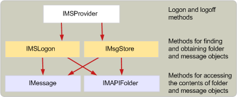

# メッセージ ストア プロバイダーの構造
  
**適用対象**: Outlook 2013 | Outlook 2016 
  
メッセージ ストア プロバイダーは、メモリ内で実行されている場合は [、IMSProvider : IUnknown インターフェイス](imsprovideriunknown.md) です。 **IMSProvider インターフェイスを使用** すると、クライアント アプリケーションと MAPI スプーラーは、メッセージ ストアへのログオンとオフを行えます。 クライアント アプリケーションと MAPI スプーラーがメッセージ ストア内のフォルダーとメッセージにアクセスするために使用するインターフェイスは [、IMSLogon](imslogoniunknown.md) インターフェイスと [IMsgStore](imsgstoreimapiprop.md) インターフェイスです。 これらのインターフェイスは、通常、メッセージ ストアが最初にログオンするときに作成されます。ただし、メッセージ ストア DLL の [MSProviderInit](msproviderinit.md) エントリ ポイントも作成できます。 
  
**IMSLogon** インターフェイスと **IMsgStore** インターフェイスは一部のメソッドを共有しますので、これらの両方のインターフェイスから継承するクラス オブジェクトを 1 つ作成する方が簡単な場合があります。 これらのインターフェイスを個別のオブジェクトに実装し **、IMSLogon** インターフェイスと **IMsgStore** インターフェイスのメソッドから呼び出す共有メソッドを実装するヘルパー関数を DLL に記述することもできます。 
  
次の図は、実行中のメッセージ ストア内のオブジェクト階層の概要を示しています。
  
**メッセージ ストアのオブジェクト階層**
  

  
## 関連項目

- [MAPI メッセージ ストア プロバイダーの開発](developing-a-mapi-message-store-provider.md)

