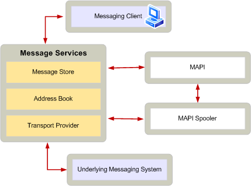

# MAPI のサブシステムのトランスポート プロバイダーの役割
  
**適用されます**: Outlook 
  
トランスポート プロバイダーのダイナミック リンク ライブラリ (Dll) では、MAPI スプーラーとメッセージの送信と受信を担当するメッセージング システムの部品間のインタ フェースを提供します。 MAPI スプーラーとトランスポート プロバイダーは、メッセージの送信や受信メッセージの責任を処理するために連携します。 MAPI スプーラーは、最初に使用されるし、不要になった時に解放する場合に、トランスポート プロバイダーの DLL を読み込みます。 同じシステムに複数のトランスポート プロバイダーをインストールすることができますが、MAPI が必要な 1 つのスプーラーを提供します。
  
クライアント アプリケーションは、通常はトランスポート プロバイダーと直接通信しません。 代わりに、クライアントは、ストア プロバイダーを経由してメッセージを送信し、MAPI スプーラーが適切なトランスポート プロバイダーに送信するメッセージを送信し、適切なメッセージ ・ ストアに受信メッセージを配信します。 MAPI スプーラー機能の動作し、フォア グラウンド アプリケーションがアイドル状態のときに、プロバイダーをトランスポートするための呼び出しを行います。 トランスポート プロバイダーが最初に必要に応じてダイアログ ボックスを表示するがログオンした後、トランスポート プロバイダーは、送信および受信キューをフラッシュするにクライアントによって呼び出される場合を除き、バック グラウンドで動作します。 
  
トランスポート プロバイダーでは、MAPI メッセージング システムに次の責任があります。
  
- MAPI スプーラーは、適切なトランスポート プロバイダーによっては、メッセージの宛先アドレスにメッセージを送信できるように、MAPI スプーラーを無効に使用できるアドレスの種類を登録します。 1 つのトランスポート プロバイダーは、複数のアドレスの種類を登録できます。 トランスポート プロバイダーは、MAPI スプーラーを無効に特定の受信者のアドレスを登録することもできます。 これらのアドレスのいずれかに送信されるメッセージは、MAPI スプーラーにアドレスを登録されているトランスポート プロバイダーに送信されます。 詳細については、[トランスポート プロバイダーおよび MAPI スプーラーの運用モデル](transport-provider-and-mapi-spooler-operational-model.md)を参照してください。
    
- MAPI スプーラーを無効にするには、受信メッセージを提供します。 メッセージング システムによっては、トランスポート プロバイダーことができますか、直接 MAPI スプーラーを無効またはときに通知、新しいメッセージが到着すると、MAPI スプーラーにトランスポート プロバイダーは、新しいメッセージをチェックするには、定期的にポーリングを要求することができます。
    
- 間のメッセージング システムとネイティブ ・ メッセージ ・ プロパティは、MAPI メッセージのプロパティを変換します。 などのトランスポート プロバイダーは、メッセージング システムに許容されるフォームを送信メッセージに、送信者と受信者のアドレスを変換する必要があります。 いくつかのメッセージング システムはすべての MAPI メッセージのプロパティはサポートしていません。 メッセージング システムにメッセージを配信する場合は、MAPI メッセージのプロパティを保存する方法についての詳細については、 [TNEF-Enabled トランスポート プロバイダーの開発](developing-a-tnef-enabled-transport-provider.md)を参照してください。
    
- トランスポート プロバイダーに固有のメッセージと受信者のオプションを登録します。
    
- メッセージング システムに必要な資格情報の確認を実行します。
    
- メッセージ オブジェクトを使用して送信メッセージにアクセスは、MAPI スプーラーによってに渡されます。
    
- 基になるメッセージング システムで必要なメッセージ形式を変換します。
    
- MAPI スプーラーを無効にする受信者の**れない**([PidTagResponsibility](pidtagresponsibility-canonical-property.md)) のプロパティを設定することによって処理のための責任を受け入れたトランスポート プロバイダーは、送信メッセージの受信者を通知します。
    
- MAPI スプーラーは、受信メッセージを処理する必要があるときに通知します。
    
- メッセージ オブジェクトを使用して、MAPI スプーラーを無効に受信メッセージのデータを渡します。
    
- 受信メッセージに必要な MAPI メッセージ プロパティをすべてに値を割り当てます。
    
- 必要な場合に、配信後、基になるメッセージング システムからメッセージを削除します。
    
- MAPI スプーラーとクライアント アプリケーションの状態に関する情報を提供します。
    
MAPI アーキテクチャの他のコンポーネントについて、トランスポート プロバイダーの役割を次の図に示します。
  
**メッセージング システムでトランスポート プロバイダーの役割**
  

  

