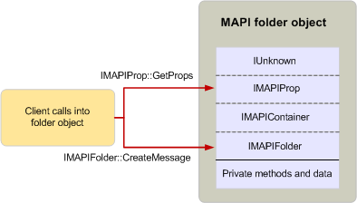

# MAPI オブジェクトの使用

**適用対象**: Outlook 2013 | Outlook 2016 
  
クライアントおよびサービスプロバイダーは、インターフェイス実装のメソッドを呼び出すことによって MAPI オブジェクトを使用します。 MAPI オブジェクトを使用できるのは、この方法のみです。MAPI インターフェイスの外部にあるオブジェクトによって実装されるメソッドは、パブリックにアクセスできません。 オブジェクトのすべてのインターフェイスは継承によって関連付けられているため、オブジェクトのユーザーは、基本インターフェイスまたは継承されたインターフェイスのいずれかで、同じインターフェイスに属するかのようにメソッドを呼び出すことができます。 
  
オブジェクトのユーザーがメソッドを呼び出す必要があり、そのオブジェクトが継承に関連するいくつかのインターフェイスを実装している場合、ユーザーはそのメソッドが属するインターフェイスを知る必要はありません。 ユーザーは、オブジェクトへの単一のポインターを使用して、インターフェイスのいずれかのメソッドを呼び出すことができます。 たとえば、次の図は、クライアントアプリケーションが folder オブジェクトを使用する方法を示しています。 Folder オブジェクトは[imapifolder: IMAPIContainer](imapifolderimapicontainer.md) interface を実装します。このインターフェイスは、 [imapifolder: iunknown](imapipropiunknown.md)および[IMAPIContainer: imapifolder](imapicontainerimapiprop.md)を介して[iunknown](https://msdn.microsoft.com/library/33f1d79a-33fc-4ce5-a372-e08bda378332%28Office.15%29.aspx)を間接的に継承します。 クライアントは、imapiprop [:: GetProps](imapiprop-getprops.md)などの**imapiprop**のメソッドのいずれかを呼び出し、同じオブジェクトポインターを使用した場合と同じ方法で、imapiprop [:: CreateMessage](imapifolder-createmessage.md)のような imapiprop:: [IMAPIContainer](imapifolderimapicontainer.md)メソッドの1つを呼び出すことができます。 クライアントは、これらの呼び出しが異なるインターフェイスに属していることを認識していないか、または影響を受けません。
  
**クライアントがフォルダー オブジェクトを使用**
  

  
これらの呼び出しは、呼び出しを行うクライアントが C または C++ で記述されているかどうかによって、コードによって異なる方法で変換されます。 メソッドへの呼び出しを行う前に、インターフェイス実装へのポインターを取得する必要があります。 インターフェイスポインターは、次の方法で取得できます。
  
- 別のオブジェクトに対するメソッドの呼び出し。
    
- API 関数の呼び出し。
    
- ターゲットオブジェクトで[IUnknown:: QueryInterface](https://msdn.microsoft.com/library/54d5ff80-18db-43f2-b636-f93ac053146d%28Office.15%29.aspx)メソッドを呼び出しています。 
    
MAPI には、インターフェイス実装へのポインターを返すメソッドと API 関数がいくつか用意されています。 たとえば、クライアントは[imapisession:: getmsgstorestable](imapisession-getmsgstorestable.md)メソッドを呼び出して、 [IMAPITable: IUnknown](imapitableiunknown.md)インターフェイスを介してメッセージストアプロバイダ情報へのアクセスを提供する table オブジェクトへのポインターを取得することができます。 サービスプロバイダーは、 [CreateTable](createtable.md) API 関数を呼び出して、テーブルデータオブジェクトへのポインターを取得することができます。 使用可能な関数またはメソッドがなく、クライアントまたはサービスプロバイダーが既にオブジェクトへのポインターを持っている場合は、オブジェクトの**QueryInterface**メソッドを呼び出して、そのオブジェクトのインターフェイス実装へのポインターを取得することができます。 
  
## 関連項目

- [MAPI のオブジェクトとインターフェイスの概要](mapi-object-and-interface-overview.md)

