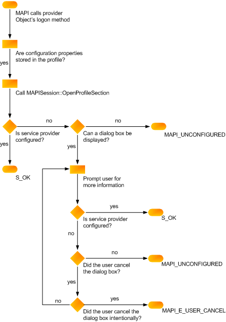

# サービス プロバイダーの構成の確認Verifying service provider configuration
  
**適用されます**: Outlook**Applies to**: Outlook 
  
([IABProvider::Logon](iabprovider-logon.md)、 [IMSProvider::Logon](imsprovider-logon.md)、または[IXPProvider::TransportLogon](ixpprovider-transportlogon.md)) は、logon メソッドは、プロバイダーの構成を確認してください。Your logon method ([IABProvider::Logon](iabprovider-logon.md), [IMSProvider::Logon](imsprovider-logon.md), or [IXPProvider::TransportLogon](ixpprovider-transportlogon.md)) must verify your provider's configuration. これには、すべての完全な運用に必要なプロパティが正しく設定されてチェックが含まれます。This involves checking that all of the properties needed for full operation are set correctly. すべてのプロバイダーのプロパティ数を変更する必要があります。構成は、プロバイダーとを許可するユーザーの介入の度合いによって異なります。Every provider requires a different number of properties; configuration depends on your provider and the degree of user interaction you allow. サービス プロバイダーによっては、プロファイルに必要なプロパティのすべてをしてください。Some service providers keep all of the necessary properties in the profile. 

他のサービス プロバイダーでは、プロファイルのプロパティのセットの一部を保持し、欠落している値をユーザーに確認します。Other service providers keep a partial set of properties in the profile and prompt the user for missing values. 他のプロバイダーに格納しないでプロパティ、プロファイル、ユーザーはすべての構成に必要な情報に依存しています。Still other providers do not store properties in the profile at all, relying on the user to supply all of the information needed for configuration.
  
### プロファイルに格納されているプロパティを取得するにはTo retrieve properties stored in the profile
  
1. [IMAPISupport::OpenProfileSection](imapisupport-openprofilesection.md)、入力パラメーターとして、プロバイダーの[MAPIUID](mapiuid.md)を渡すことを呼び出します。Call [IMAPISupport::OpenProfileSection](imapisupport-openprofilesection.md), passing the [MAPIUID](mapiuid.md) of your provider as an input parameter. 
    
2. 個々 のプロパティまたはプロパティの一覧を取得するためにプロファイル セクションの[IMAPIProp::GetProps](imapiprop-getprops.md)または[IMAPIProp::GetPropList](imapiprop-getproplist.md)のメソッドを呼び出します。Call the profile section's [IMAPIProp::GetProps](imapiprop-getprops.md) or [IMAPIProp::GetPropList](imapiprop-getproplist.md) methods to retrieve individual properties or a property list. 
    
### ユーザー情報のプロパティを設定するのにはTo set properties from user information
  
MAPI では、表示を禁止するフラグを設定していない場合、プロパティ シートを表示します。Display a property sheet, if MAPI has not set a flag prohibiting the display. 次のフラグは、ユーザー インターフェイスを表示できないことを示します。The following flags indicate that a user interface cannot be presented.
  
|**Flag****Flag**|**サービス プロバイダー****Service provider**|
|:-----|:-----|
|AB_NO_DIALOGAB_NO_DIALOG    |アドレス帳プロバイダーAddress book provider    |
|LOGON_NO_DIALOGLOGON_NO_DIALOG    |トランスポート プロバイダーTransport provider    |
|MDB_NO_DIALOGMDB_NO_DIALOG    |メッセージ ストア プロバイダーMessage store provider    |
   
場合は、プロバイダーに保存しません。 すべての構成プロパティ、プロファイル、ユーザーの介入を必要とするし、MAPI ダイアログ ボックスの抑制のフラグのいずれかのログオン方法として、MAPI_E_UNCONFIGURED を返します。If your provider does not store all of its configuration properties in the profile, requiring user interaction, and MAPI passes one of the dialog box suppression flags to your logon method, return MAPI_E_UNCONFIGURED. ダイアログの抑制のフラグが設定されていないが、ユーザーがすべての必要な情報を提供しない場合もこのエラーを返します。Also return this error when the dialog suppression flag is not set, but the user does not supply all of the required information.
  
サービス ・ プロバイダーには、MAPI_E_UNCONFIGURED では、そのログオン方法が失敗した場合、MAPI は、エントリ ポイント関数をもう一度呼び出します。When your service provider fails its logon method with MAPI_E_UNCONFIGURED, MAPI calls your entry point function again. 情報を 2 番目の呼び出しを特定できない場合は、サービス プロバイダーの重要度に応じて、そのセッション可能性があります終了します。If the information cannot be located with the second call, the session might terminate, depending on how important your service provider is. 
  
次の図は、サービス プロバイダーのログオン方法の構成に必要なロジックを示します。The following illustration shows the logic required for configuration in your service provider logon method. 
  
**構成の確認フローチャート****Configuration verification flowchart**
  

  
## 関連項目See also

- [サービス プロバイダーへのログオンを実装します。Implementing Service Provider Logon](implementing-service-provider-logon.md)

