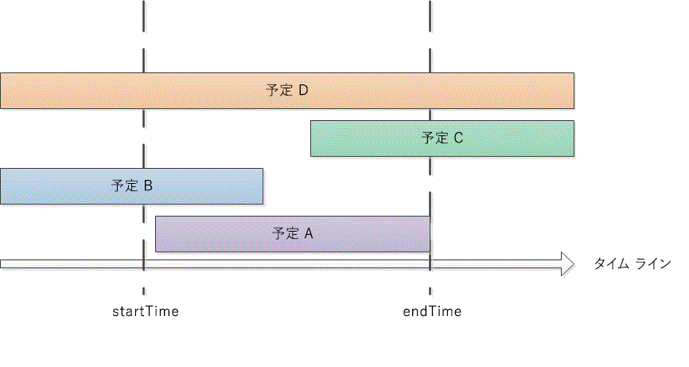

# <a name="search-and-obtain-appointments-in-a-time-range"></a>時間範囲内の予定を検索、取得する

この例では、既定の Microsoft Outlook の予定表にある特定の時間範囲の予定を返します。

## <a name="example"></a>例

このコード例には、DemoAppointmentsInRange と GetAppointmentsInRange の2 つのメソッドが含まれています。DemoAppointmentsInRange は、現在サインインしている Outlook のプロファイルの既定のカレンダーを取得し、今日の 12:00 AM を起点に5 日間の日付の範囲を設定し、GetAppointmentsInRange を呼び出して、その時間の範囲に入る予定を返し、返された予定それぞれの件名と開始時刻を表示します。

GetAppointmentsInRange は、Outlook フォルダーと、時間の範囲の開始と終了の **DateTime** 値を入力パラメーターとして受け入れます。 このメソッドは、 [Restrict(String)](https://msdn.microsoft.com/library/bb612531\(v=office.15\)) メソッドと、指定した時間範囲内に開始、終了する予定を返す Jet 形式の文字列フィルターを使用します。 \[Start\] と \[End\] を予定の開始時刻と終了時刻、startTime と endTime を指定した時間範囲の開始と終了時刻と仮定して、GetAppointmentsInRange では `[Start]>=startTime`、および `[End]<=endTime` の予定を見つけるフィルターを設定します。 次のコードは、C\# での Jet フィルターを示しています。

```csharp
string filter = "[Start] >= '"
    + startTime.ToString("g")
    + "' AND [End] <= '"
    + endTime.ToString("g") + "'";
```

**Items.Restrict** メソッドを呼び出して予定を検索する前に、指定した時間範囲内で発生する定期的な予定を含めるために、GetAppointmentsInRange は他に次の 2 つの処理を行います。 

- [Items](https://msdn.microsoft.com/library/bb645287\(v=office.15\)) コレクションの [IncludeRecurrences](https://msdn.microsoft.com/library/bb646522\(v=office.15\)) プロパティを設定します。

- [Start](https://msdn.microsoft.com/library/bb647263\(v=office.15\)) プロパティ別に、指定された予定表フォルダーの予定アイテムを並べ替える。

一方、指定した時間範囲にその一部または全体が重なる予定を検索したい場合は、別のフィルターを指定して、返したい予定の種類を追加します (図 1 を参照)。

- 指定した時間の範囲内に開始して終了する予定 (たとえば、予定 A):<br/><br/>`[Start]>=startTime and [End]<=endTime`

- 指定した時間の範囲よりも前に開始し、指定した時間の範囲内に終了する予定 (たとえば、予定 B):<br/><br/>`[Start]<startTime and [End]<=endTime`

- 指定した時間の範囲内に開始し、指定した時間の範囲よりも後に終了する予定 (たとえば、予定 C):<br/><br/>`[Start]>=startTime and [End]>endTime`

- 指定した時間の範囲よりも前に開始し、指定した時間の範囲よりも後に終了する予定 (たとえば、予定 D):<br/><br/>`[Start]<startTime and [End]>endTime`

**図 1. 時間の範囲内で発生するか、その時間の範囲に重なる予定の種類**


 

どのような時間の範囲も `startTime<=endTime` になるため、`[Start]<=endTime` および `[End]>=startTime` のフィルターによって、その時間の範囲に含まれる上記の種類の予定が取得されます。

C\# では、Jet フィルターを次のように表現できます。

```csharp
string filter = "[Start] <= '"
    + endTime.ToString("g")
    + "' AND [End] >= '"
    + startTime.ToString("g") + "'";
```

次のコードは、完全な例を示しています。 Visual Studio を使用してこのコード例をテストする場合、**Microsoft.Office.Interop.Outlook** 名前空間をインポートするときに、まず Microsoft Outlook 15.0 オブジェクト ライブラリ コンポーネントへの参照を追加し、Outlook 変数を指定します。 **Imports** または **using** ステートメントは、コード例の関数の前に直接置くことはできません。パブリック Class 宣言の前に追加する必要があります。 次のコード行は、Visual Basic および C\# でインポートおよび割り当てを行う方法を示しています。

```vb
Imports Outlook = Microsoft.Office.Interop.Outlook
```


```csharp
using Outlook = Microsoft.Office.Interop.Outlook;
```


```csharp
private void DemoAppointmentsInRange()
{
    Outlook.Folder calFolder =
        Application.Session.GetDefaultFolder(
        Outlook.OlDefaultFolders.olFolderCalendar)
        as Outlook.Folder;
    DateTime start = DateTime.Now;
    DateTime end = start.AddDays(5);
    Outlook.Items rangeAppts = GetAppointmentsInRange(calFolder, start, end);
    if (rangeAppts != null)
    {
        foreach (Outlook.AppointmentItem appt in rangeAppts)
        {
            Debug.WriteLine("Subject: " + appt.Subject 
                + " Start: " + appt.Start.ToString("g"));
        }
    }
}

/// <summary>
/// Get recurring appointments in date range.
/// </summary>
/// <param name="folder"></param>
/// <param name="startTime"></param>
/// <param name="endTime"></param>
/// <returns>Outlook.Items</returns>
private Outlook.Items GetAppointmentsInRange(
    Outlook.Folder folder, DateTime startTime, DateTime endTime)
{
    string filter = "[Start] >= '"
        + startTime.ToString("g")
        + "' AND [End] <= '"
        + endTime.ToString("g") + "'";
    Debug.WriteLine(filter);
    try
    {
        Outlook.Items calItems = folder.Items;
        calItems.IncludeRecurrences = true;
        calItems.Sort("[Start]", Type.Missing);
        Outlook.Items restrictItems = calItems.Restrict(filter);
        if (restrictItems.Count > 0)
        {
            return restrictItems;
        }
        else
        {
            return null;
        }
    }
    catch { return null; }
}
```

## <a name="see-also"></a>関連項目

- [検索とフィルター](search-and-filter.md)

