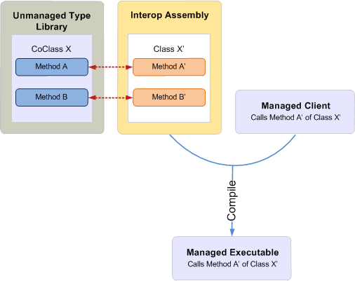

# COM と .NET の相互運用性の概要

Component Object Model (COM) と .NET 開発では、型システムおよびオブジェクト有効期間管理、インターフェイス作成、インターフェイス継承のメカニズムが大きく異なります。 

たとえば、COM の **Variant** 型が、.NET Framework では **System.Object** データ型になります。 オブジェクトを作成する場合、COM クライアントは [CoCreateInstance](https://docs.microsoft.com/windows/desktop/api/combaseapi/nf-combaseapi-cocreateinstance) インスタンスを呼び出しますが、マネージ クライアントはマネージ プログラミング言語に組み込まれている new や New などのキーワードを使用できます。 

COM は従来の継承をサポートせず、COM クライアントは [IUnknown](https://docs.microsoft.com/windows/desktop/api/unknwn/nn-unknwn-iunknown) によって提供される内部参照カウントを管理してコクラスを解放しますが、マネージ クライアントは .NET Framework によって提供される共通言語ランタイム (CLR) ガベージ コレクターを利用してオブジェクトを解放します。 

COM と .NET 開発の間にはこのような違いがあるため、COM オブジェクト モデルに基づいてマネージ クライアントを開発するときは、これらの違いを解決するメカニズムが必要です。 ランタイム呼び出し可能ラッパー (RCW) は、COM とマネージ プログラミング モデルの間の透過的な通信を促進するメカニズムです。

ここでは、RCW が COM とマネージ プログラミング モデルの間の通信を容易にする仕組みの概要について説明します。このトピックでは Visual Studio を使用して RCW のメカニズムを示しますが、Visual Studio が関与しない相互運用機能アセンブリを使用してマネージ クライアントを開発することもできます。

## 相互運用性の促進: 相互運用機能アセンブリと RCW

### コンパイル時

相互運用機能アセンブリは、COM ベースのタイプ ライブラリにマップされ、マネージ クライアントがやり取りできるマネージ インターフェイスを定義します。 Visual Studio で相互運用機能アセンブリを使用するには、まず、対応する COM コンポーネントへの参照を追加します。 Visual Studio により、自動的に相互運用機能アセンブリのローカル コピーが生成されます。 相互運用機能アセンブリには、1 つの名前空間が含まれていて、その名前空間には COM オブジェクト モデルの各 COM オブジェクトの同等のマネージ インターフェイスがあります。 

図 1 は、コクラス X を定義する COM タイプ ライブラリを使用しようとしているマネージ クライアントを示しています。このマネージ クライアントは、相互運用機能アセンブリで定義されているコクラス X と同等のマネージ インターフェイスであるクラス X を呼び出しています。 コンパイル時に、マネージ プロジェクトは相互運用機能アセンブリのクラス X についての情報でコンパイルされます。

**図 1. アンマネージ タイプ ライブラリとの相互運用性を備えた、相互運用機能アセンブリを使用してコンパイルされるマネージ アプリケーション**

  
通常、タイプ ライブラリへの参照の設定さえ行えば、Visual Studio がそのタイプ ライブラリに対する相互運用機能アセンブリのコピーを生成します。同じ COM 型を記述する相互運用機能アセンブリがいくつ存在してもかまいません。ただし、タイプ ライブラリが持つことのできるプライマリ相互運用機能アセンブリ (PIA) は 1 つだけです。PIA は、タイプ ライブラリによって公開される相互運用機能アセンブリです。他の相互運用機能アセンブリとは異なり、PIA は Visual Studio で参照を追加するたびに生成されることはありません。PIA はコンピューターのグローバル アセンブリ キャッシュ (GAC) に 1 回だけインストールします。タイプ ライブラリへの参照を追加すると、Visual Studio によって PIA が自動的に読み込まれます。

Outlook 用のマネージ ソリューションをプログラムする場合は、Outlook PIA を使用してください。 Outlook PIA からの情報をマネージ アドインに組み込むには、最初に Outlook PIA を GAC にインストールする必要があります。 Visual Studio を使用してマネージ プロジェクトを作成している場合は、Outlook タイプ ライブラリへの参照を追加すると、Visual Studio が PIA を読み込みます。 オブジェクト ブラウザーでは、名前空間 Microsoft.Office.Interop.Outlook の下に、Outlook オブジェクト モデルでのオブジェクトに対応する名前のマネージ インターフェイスが表示されます。 たとえば、Account インターフェイスは Outlook オブジェクト モデルの **Account** オブジェクトに対応します。 マネージ プロジェクトをコンパイルするときに、この情報が実行可能ファイルに組み込まれます。

### 実行時

実行時に、.NET Framework CLR は、相互運用機能アセンブリによって提供された情報を使用して、マネージ クライアントが対話するコクラスごとに RCW を作成します。クライアントがコクラスから取得したインターフェイスの数にかかわらず、ランタイムが作成する RCW はコクラスごとに 1 つだけであることに注意してください。RCW は、COM のコクラスをラップする .NET Framework クラスの型です。RCW は、コクラスのインスタンスを追跡し、クライアントで RCW が不要になったときにのみインスタンスへの参照を解放します。これにより、マネージ クライアントは、COM でアンマネージ クライアントが行うような方法で、オブジェクトの有効期間を管理する必要がなくなります。

図 2 に示す RCW は、実行時にマネージ クライアントからの API 呼び出しを途中で受信し、相互運用機能アセンブリからの情報を使用して、呼び出しを COM コクラスの対応する API に透過的にマップします。このときに行われる処理について次に説明します。

1.  マネージ クライアントは、COM タイプ ライブラリに対する相互運用機能アセンブリでの定義に従って、クラス X' のメソッド A' を呼び出します。

2.  クラス X' に対する RCW がまだ存在しない場合、.NET Framework ランタイムは相互運用機能アセンブリからの情報を使用して、クラス X' 用の RCW を作成します。

3.  RCW は、メソッド A' の呼び出しを途中で受信し、引数を対応する COM 型に変換して、COM タイプ ライブラリでの定義に従ってコクラス X のメソッド A を呼び出します。

**図 2. マネージ実行可能ファイルからの呼び出しを途中で受信してアンマネージ タイプ ライブラリのコクラスにマップする RCW**

  

## 関連項目

- [Outlook PIA を使用する理由](why-use-the-outlook-pia.md)
- [Outlook PIA のインストールと参照](installing-and-referencing-the-outlook-pia.md)

