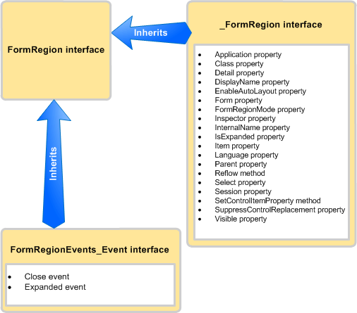

# <a name="methods-and-properties-in-the-outlook-pia"></a><span data-ttu-id="d191b-102">Outlook PIA でのメソッドとプロパティ</span><span class="sxs-lookup"><span data-stu-id="d191b-102">Methods and Properties in the Outlook PIA</span></span>

<span data-ttu-id="d191b-103">ここでは、Outlook プライマリ相互運用機能アセンブリ (PIA) を使用してマネージ コードのオブジェクトのメソッドとプロパティにアクセスする方法を説明します。</span><span class="sxs-lookup"><span data-stu-id="d191b-103">This topic describes how to access methods and properties of an object in managed code by using the Outlook Primary Interop Assembly (PIA).</span></span>

## <a name="where-helper-objects-come-from"></a><span data-ttu-id="d191b-104">ヘルパー オブジェクトの由来</span><span class="sxs-lookup"><span data-stu-id="d191b-104">Where Helper Objects Come From</span></span>

<span data-ttu-id="d191b-p101">Outlook PIA を作成するため、Outlook は .NET Framework のタイプ ライブラリ インポーター (TLBIMP) を使用して、COM タイプ ライブラリでの型定義を共通言語ランタイム (CLR) アセンブリでの同等の定義に変換します。COM では、オブジェクトは実際には以下のもので構成されるコクラスです。</span><span class="sxs-lookup"><span data-stu-id="d191b-p101">To create the Outlook PIA, Outlook uses the Type Library Importer (TLBIMP) in the .NET Framework to convert type definitions in the COM type library into equivalent definitions in a common language runtime (CLR) assembly. In COM, an object is actually a coclass that consists of the following:</span></span>

- <span data-ttu-id="d191b-107">プライマリ インターフェイス (例: [\_FormRegion](https://msdn.microsoft.com/library/bb645761\(v=office.15\)) インターフェイス)。</span><span class="sxs-lookup"><span data-stu-id="d191b-107">The primary interface (for example, the _FormRegion interface).</span></span>

- <span data-ttu-id="d191b-108">イベント インターフェイス (例: [FormRegionEvents](https://msdn.microsoft.com/library/bb611940\(v=office.15\)) インターフェイス)。</span><span class="sxs-lookup"><span data-stu-id="d191b-108">The event interface (for example, the [FormRegionEvents](https://msdn.microsoft.com/library/bb611940\(v=office.15\)) interface).</span></span>

<span data-ttu-id="d191b-109">TLBIMP は、各オブジェクトのプライマリ インターフェイスとイベント インターフェイスをインポートし、複数のインターフェイス、デリゲート、およびクラスを作成します。その中には次のものが含まれます。</span><span class="sxs-lookup"><span data-stu-id="d191b-109">TLBIMP imports the primary interface and the event interface for each object and creates a number of interfaces, delegates, and classes, among which are the following:</span></span>

- <span data-ttu-id="d191b-110">.NET イベント インターフェイス (例: [FormRegionEvents\_Event](https://msdn.microsoft.com/library/bb647619\(v=office.15\)) インターフェイス)。</span><span class="sxs-lookup"><span data-stu-id="d191b-110">The .NET event interface (for example, the FormRegionEvents_Event interface).</span></span>

- <span data-ttu-id="d191b-111">.NET クラス (例: [FormRegionClass](https://msdn.microsoft.com/library/bb624204\(v=office.15\)) クラス)。</span><span class="sxs-lookup"><span data-stu-id="d191b-111">The .NET class (for example, the [FormRegionClass](https://msdn.microsoft.com/library/bb624204\(v=office.15\)) class).</span></span>

- <span data-ttu-id="d191b-112">.NET インターフェイス (例: [FormRegion](https://msdn.microsoft.com/library/bb652633\(v=office.15\)) インターフェイス)。</span><span class="sxs-lookup"><span data-stu-id="d191b-112">The .NET interface (for example, the [FormRegion](https://msdn.microsoft.com/library/bb652633\(v=office.15\)) interface).</span></span>

## <a name="what-the-helper-objects-are-for"></a><span data-ttu-id="d191b-113">ヘルパー オブジェクトの対象</span><span class="sxs-lookup"><span data-stu-id="d191b-113">What the Helper Objects Are For</span></span>

<span data-ttu-id="d191b-114">**FormRegion** オブジェクトを引き続き例として使用し、次のリストでは前に示した各インターフェイスとクラスに含まれるものを説明します。</span><span class="sxs-lookup"><span data-stu-id="d191b-114">Continuing to use the **FormRegion** object as an example, the following list examines what each interface and class listed earlier contains.</span></span>

- <span data-ttu-id="d191b-115">\_FormRegion インターフェイスは FormRegion のすべてのメソッドとプロパティを定義します。</span><span class="sxs-lookup"><span data-stu-id="d191b-115">The _FormRegion interface defines all the methods and properties of FormRegion.</span></span> <span data-ttu-id="d191b-116">通常、後で説明する場合を除き、このインターフェイスをコードで使用することはありません。</span><span class="sxs-lookup"><span data-stu-id="d191b-116">Typically you do not use this interface in code, except for a condition discussed below.</span></span>

- <span data-ttu-id="d191b-117">**FormRegionEvents** インターフェイスは、FormRegion のイベントへのメソッドのマッピングを定義します。</span><span class="sxs-lookup"><span data-stu-id="d191b-117">The FormRegionEvents interface defines methods mapping to events of FormRegion.</span></span> <span data-ttu-id="d191b-118">このインターフェイスはコードでは使用しません。</span><span class="sxs-lookup"><span data-stu-id="d191b-118">You do not use this interface in code.</span></span>

- <span data-ttu-id="d191b-119">TLBIMP は、**FormRegionEvents** インターフェイスをさらに処理し、FormRegion のすべてのイベントを定義する、**FormRegionEvents**\_Event インターフェイスを作成します。</span><span class="sxs-lookup"><span data-stu-id="d191b-119">TLBIMP further processes the **FormRegionEvents** interface to create the **FormRegionEvents_Event** interface that defines all the events of \_.</span></span> <span data-ttu-id="d191b-120">通常、後で説明する場合を除き、このインターフェイスをコードで使用することはありません。</span><span class="sxs-lookup"><span data-stu-id="d191b-120">Typically you do not use this interface in code, except for a condition discussed below.</span></span>

- <span data-ttu-id="d191b-p105">FormRegionClass クラスでは、 FormRegion のすべてのメソッド、プロパティ、およびイベントが定義されています。このクラスにより FormRegion インターフェイスが裏側で関連付けられて、 FormRegion インターフェイスのインスタンスを作成するためのコードを記述できます。ただし、コードでこのインターフェイスを直接使用することはありません。</span><span class="sxs-lookup"><span data-stu-id="d191b-p105">The FormRegionClass class defines all the method, property, and event members of FormRegion. This is the class that the FormRegion interface is attributed to associate with behind the scenes so that you can write code to create an instance of the FormRegion interface. However, you do not use this interface directly in code.</span></span>

- <span data-ttu-id="d191b-124">FormRegion インターフェイスは、\_FormRegion インターフェイスと **FormRegionEvents**\_Event インターフェイスを継承します。</span><span class="sxs-lookup"><span data-stu-id="d191b-124">The \_ interface inherits the **_FormRegion** interface and the \_ interface.</span></span> <span data-ttu-id="d191b-125">図 1 は、この継承のリレーションシップを示します。</span><span class="sxs-lookup"><span data-stu-id="d191b-125">Figure 1 illustrates this inheritance relationship.</span></span>
    
  <span data-ttu-id="d191b-126">**図 1. FormRegion インターフェイスは \_FormRegion からメソッドとプロパティを継承し、FormRegionEvents\_Event interface** からイベントを継承する</span><span class="sxs-lookup"><span data-stu-id="d191b-126">Figure 1. The FormRegion interface inherits methods and properties from the _FormRegion interface, and inherits events from the FormRegionEvents_Event interface</span></span>

  
    
  <span data-ttu-id="d191b-128">通常、FormRegion は、マネージ コードで **FormRegion** オブジェクトのオブジェクトとメソッド、プロパティ、およびイベント メンバーへアクセスするために使用されるインターフェイスです。</span><span class="sxs-lookup"><span data-stu-id="d191b-128">Typically, **FormRegion** is the one interface you use in managed code to access the object and the method, property, and event members of the FormRegion object.</span></span>

<span data-ttu-id="d191b-p107">別の例として **Application** オブジェクトを使用すると、 **Application** オブジェクト、メソッド、プロパティ、およびイベントには、 [Application](https://msdn.microsoft.com/library/bb646615\(v=office.15\)) インターフェイスを介してアクセスします。ただし、以下の 3 つの例外的状況では、別のインターフェイスを使用する必要があるか、または言語によっては別のインターフェイスを使用した方がよい場合があります。</span><span class="sxs-lookup"><span data-stu-id="d191b-p107">Using the **Application** object as another example, you access the **Application** object, methods, properties, and events through the [Application](https://msdn.microsoft.com/library/bb646615\(v=office.15\)) interface. There are however three exceptions where you must use a different interface, or depending on the language, you would want to use a different interface:</span></span>

- <span data-ttu-id="d191b-131">イベントと同じ名前を共有するメソッドにアクセスするときは、プライマリ インターフェイスにキャストしてメソッドを呼び出すのがよい方法です。</span><span class="sxs-lookup"><span data-stu-id="d191b-131">When you access a method that shares the same name as an event, a good practice is to cast to the primary interface to call the method.</span></span> <span data-ttu-id="d191b-132">たとえば、**Application** オブジェクトには [Quit](https://msdn.microsoft.com/library/bb646614\(v=office.15\)) メソッドと [Quit](https://msdn.microsoft.com/library/bb622595\(v=office.15\)) イベントがあります。</span><span class="sxs-lookup"><span data-stu-id="d191b-132">For example, the **Application** object has a [Quit](https://msdn.microsoft.com/library/bb646614\(v=office.15\)) method and a [Quit](https://msdn.microsoft.com/library/bb622595\(v=office.15\)) event.</span></span> <span data-ttu-id="d191b-133">Visual Basic .Net では、アプリケーションのインターフェイス経由で Quit メソッドにアクセスできます。</span><span class="sxs-lookup"><span data-stu-id="d191b-133">In Visual Basic .NET, you can access the Quit method through the Application interface.</span></span> <span data-ttu-id="d191b-134">C\# では、次のコード例のように、Quit メソッドをプライマリ インターフェイスにキャストすることにより、コンパイラの警告を回避できます。</span><span class="sxs-lookup"><span data-stu-id="d191b-134">In C#, you can avoid a compiler warning by casting the \# method to the primary interface, as shown in the following code sample:</span></span>
    
   ```csharp
      void DemoApp()
      {
          Outlook.Application myApp = new Outlook.Application();
          // Other application code here
          ((Outlook._Application)myApp).Quit();
      }
   ```

- <span data-ttu-id="d191b-135">そのオブジェクトのメソッドと同じ名前を共有するイベントにアクセスするときは、適切なイベント インターフェイスにキャストしてイベントに接続する必要があります。</span><span class="sxs-lookup"><span data-stu-id="d191b-135">When you access an event that shares the same name as a method of that object, you must cast to the appropriate event interface to connect to the event.</span></span> <span data-ttu-id="d191b-136">上記の例と似ていますが、Quit イベントに接続するには [ApplicationEvents\_11\_Event](https://msdn.microsoft.com/library/bb622725\(v=office.15\)) インターフェイスにキャストします。</span><span class="sxs-lookup"><span data-stu-id="d191b-136">Similar to the example above, to connect to the Quit event, you cast to the ApplicationEvents_11_Event interface.</span></span>

- <span data-ttu-id="d191b-137">以前のバージョンのイベントで、後のバージョンの Outlook において拡張されているものに接続するときは、前のインターフェイスのバージョンのイベントに接続する必要があります。</span><span class="sxs-lookup"><span data-stu-id="d191b-137">When you connect to an earlier version of an event that has been subsequently extended in a later version of Outlook, you must connect to the version of the event in the earlier interface.</span></span> <span data-ttu-id="d191b-138">たとえば、最新バージョンではなくて Outlook 2002 で実装された **Application** オブジェクト用の Quit イベントのバージョンに接続する場合、ApplicationEvents\_11\_Event インターフェイスで定義された Quit イベントではなく、[ApplicationEvents\_10\_Event](https://msdn.microsoft.com/library/bb610098\(v=office.15\)) インターフェイスで定義された [Quit](https://msdn.microsoft.com/library/bb609660\(v=office.15\)) イベントに接続します。</span><span class="sxs-lookup"><span data-stu-id="d191b-138">For example, if you want to connect to the version of the Quit event for the Application object implemented for Outlook 2002 instead of the latest version, connect to the Quit event defined in the ApplicationEvents_10_Event interface, instead of the Quit event defined in the ApplicationEvents_11_Event interface.</span></span>

## <a name="see-also"></a><span data-ttu-id="d191b-139">関連項目</span><span class="sxs-lookup"><span data-stu-id="d191b-139">See also</span></span>

- [<span data-ttu-id="d191b-140">Outlook PIA とオブジェクト モデルの関係</span><span class="sxs-lookup"><span data-stu-id="d191b-140">Relating the Outlook PIA with the Object Model</span></span>](relating-the-outlook-pia-with-the-object-model.md)
- [<span data-ttu-id="d191b-141">Outlook PIA でのオブジェクト</span><span class="sxs-lookup"><span data-stu-id="d191b-141">Objects in the Outlook PIA</span></span>](objects-in-the-outlook-pia.md)
- [<span data-ttu-id="d191b-142">Outlook PIA でのイベント</span><span class="sxs-lookup"><span data-stu-id="d191b-142">Events in the Outlook PIA</span></span>](events-in-the-outlook-pia.md)

