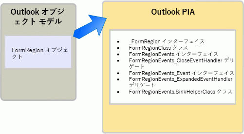

# <a name="objects-in-the-outlook-pia"></a>Outlook PIA のオブジェクト

オブジェクト ブラウザーで Outlook プライマリ相互運用機能アセンブリ (PIA) をブラウズすると、多くのインターフェイスやクラスの名前が、Outlook オブジェクト モデルでお馴染みのオブジェクトを指していることに気付きます。 このオブジェクト モデルの一部のオブジェクトには、PIA のインターフェイスに対する一対一のマッピングがあります。 

たとえば、 **AddressEntry** は [AddressEntry](https://msdn.microsoft.com/library/bb609728\(v=office.15\)) インターフェイスにマップされ、 **AddressList** オブジェクトは PIA の [AddressList](https://msdn.microsoft.com/library/bb623538\(v=office.15\)) インターフェイスにマップされます。 

しかし、その他の多くのオブジェクトには、PIA の一対多マッピングがあります。 この一対多マッピングは、Microsoft Office Outlook 2007 より以前から存在する一部のオブジェクトと、Outlook 2007 以降に追加されたすべてのオブジェクトに適用されます。 このトピックでは、COM オブジェクトにマップされる典型的な .NET インターフェイス、クラス、およびデリゲートを示し、Outlook PIA のオブジェクトにアクセスする方法を説明します。 また、COM ベースのオブジェクト モデルではオブジェクトが非公開または非推奨になっている Outlook PIA のいくつかの例外についても説明します。

## <a name="helper-objects"></a>ヘルパー オブジェクト

このセクションでは、 **FormRegion** オブジェクトを例として使用し、Outlook PIA のオブジェクトに対する典型的なヘルパー クラスを示します。 **FormRegion** オブジェクトがオブジェクト モデルに追加されたのは Outlook 2007 のときです。PIA の **FormRegion** オブジェクトに関連するものには、図 1 に示すインターフェイス、クラス、およびデリゲートがあります。

**図 1. Outlook オブジェクト モデルと Outlook PIA での FormRegion オブジェクトの表現**



**FormRegion** オブジェクトとそのメソッド、プロパティ、およびイベント メンバーへのアクセスに最も頻繁に使用するインターフェイスが、[FormRegion](https://msdn.microsoft.com/library/bb652633\(v=office.15\)) インターフェイスです。 ただし、**FormRegion** .NET インターフェイスは **FormRegion** COM オブジェクトの完全なミラー イメージであると見なすことはできません。Visual Studio のオブジェクト ブラウザーで調べると、**FormRegion** インターフェイスは別のインターフェイスである [\_FormRegion](https://msdn.microsoft.com/library/bb645761\(v=office.15\)) インターフェイスから継承していることがわかります。 実際、**FormRegion** インターフェイスは、COM タイプ ライブラリに基づいて Outlook PIA を作成した結果による、いくつかのインターフェイスとクラスのうちの 1 つに過ぎません。

Outlook は、Outlook PIA を作成するために .NET Framework のタイプ ライブラリ インポーター (TLBIMP) を使用して COM タイプ ライブラリのタイプの定義を共通言語ランタイム アセンブリの同等の定義に変換します。COM における **FormRegion** オブジェクトは、実際には、 **FormRegion** オブジェクトで実装されるインターフェイスを定義する次の 2 つのインターフェイスから成るコクラスとなります。

- プライマリ インターフェイス **\_FormRegion**

- イベント インターフェイス [FormRegionEvents](https://msdn.microsoft.com/library/bb611940\(v=office.15\))

TLBIMP は、タイプ ライブラリから **\_FormRegion** と **FormRegionEvents** を直接インポートします。

TLBIMP は、プライマリ インターフェイスとイベント インターフェイスをインポートするだけでなく、COM オブジェクトと同じ名前の .NET インターフェイスと .NET クラスを作成します。このクラスの名前はオブジェクト名に "Class" を付けたものとなります。 **FormRegion** オブジェクトの場合は、TLBIMP によって次のものが作成されます。

- .NET インターフェイス **FormRegion**

- .NET クラス [FormRegionClass](https://msdn.microsoft.com/library/bb624204\(v=office.15\))

このトピックで説明する .NET インターフェイスと .NET クラスに関しては、必ず TLBIMP で作成した .NET インターフェイスを使用してオブジェクトにアクセスします。たとえば、VB の **FormRegion** オブジェクトにアクセスするには、次のコード例で示すように、必ず **FormRegion** インターフェイスを使用します。

```vb
Imports Outlook = Microsoft.Office.Interop.Outlook
Sub DemoFormRegion(ByVal Region As Outlook.FormRegion)
    Dim MyFormRegion As Outlook.FormRegion = Region
    ' Additional method code here
End Sub
```

<br/>

```csharp
using Outlook = Microsoft.Office.Interop.Outlook; 
void DemoFormRegion(Outlook.FormRegion region) 
{
    Outlook.FormRegion myFormRegion = region; 
    // Additional method code here
}
```

TLBIMP でインポートされるプライマリ インターフェイスと作成される .NET クラスの詳細については、「[Outlook PIA でのメソッドとプロパティ](methods-and-properties-in-the-outlook-pia.md)」を参照してください。 イベントに関連するインターフェイスの用途の詳細については、「[Outlook PIA でのイベント](events-in-the-outlook-pia.md)」を参照してください。

## <a name="deprecated-objects"></a>非推奨オブジェクト

タイプ ライブラリでは非推奨のオブジェクトが、Outlook PIA では公開されています。 たとえば、タイプ ライブラリでは **\_DDocSiteControl** オブジェクトと **\_DRecipientControl** オブジェクトは非公開になっていますが、PIA では公開されています。

非推奨オブジェクトのもう 1 つの例として、**MAPIFolder** オブジェクトが挙げられます。 Outlook 2007 以降のオブジェクト モデルでは、 **MAPIFolder** オブジェクトに代わって **Folder** オブジェクトを使用することになりました。 既存のソリューションが **MAPIFolder** を参照している場合はそれを **Folder** に変更し、Outlook 2007 以降の新しいソリューションでは、常に **Folder** オブジェクトだけを使用するようにしてください。 非管理対象のソリューションの場合、 **MAPIFolder** オブジェクトは、Visual Basic Editor のオブジェクト ブラウザーで隠しオブジェクトとしてもリストされません。 

管理対象のソリューションの場合、Outlook PIA では、 [Folder](https://msdn.microsoft.com/library/bb645774\(v=office.15\)) オブジェクトとそのメンバーにアクセスするための **Folder** インターフェイスが公開されますが、 [Folder](https://msdn.microsoft.com/library/bb624369\(v=office.15\)) オブジェクトのメンバーを定義するインターフェイスとして **MAPIFolder** も公開されます。

## <a name="see-also"></a>関連項目

- [Outlook PIA とオブジェクト モデルの関係](relating-the-outlook-pia-with-the-object-model.md)


