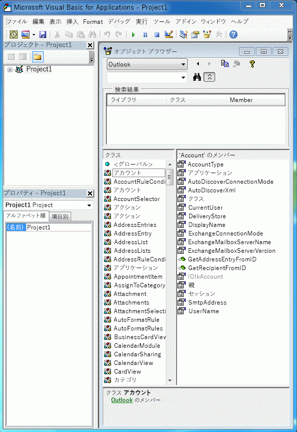
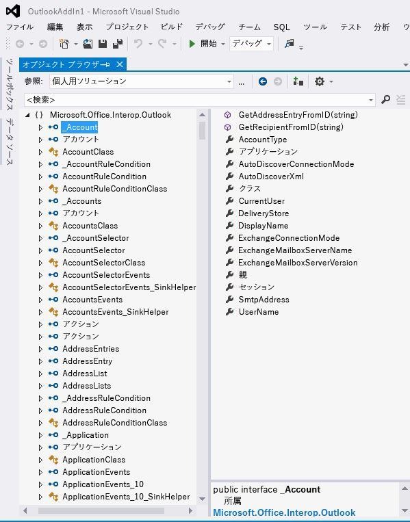

# Outlook PIA とオブジェクト モデルの関係

Outlook プライマリ相互運用機能アセンブリ (PIA) は、Outlook で正式に公開されている相互運用機能アセンブリであり、これによって COM ベースの Outlook オブジェクト モデルを操作するためのマネージ アドイン用のマネージ インターフェイスが定義されます。 「[COM と .NET の相互運用性の概要](introduction-to-interoperability-between-com-and-net.md)」では、COM ベースのタイプ ライブラリと比較して、相互運用機能アセンブリによってマネージ クライアント プログラミングが、技術的にどのようにサポートされるかについて説明しています。 このトピックでは、COM ベースの Outlook オブジェクト モデルのオブジェクトやメンバーが PIA の対応するマネージ インターフェイスやクラスにマップされるしくみについて、その概要を示します。

## ヘルパー オブジェクト

Visual Basic Editor のオブジェクト ブラウザーにリストされる Outlook タイプ ライブラリのオブジェクト (図 1) と、Visual Studio のオブジェクト ブラウザーにリストされる PIA のオブジェクト (図 2) を比較すると、PIA に非常に多くの特別なヘルパー オブジェクトがあることに驚かされます。オブジェクトの中には、 **Action** オブジェクトのように、特定のインターフェイス ( [Action](https://msdn.microsoft.com/library/bb646971\(v=office.15\)) インターフェイス) にマップされるものもあれば、 **Account** オブジェクトのように、PIA の対応する特定のインターフェイスに必ずしもマップされないものもあります。

**図 1. オブジェクト ブラウザーに表示される、COM ベースの Outlook タイプ ライブラリのオブジェクト**

**図 2. オブジェクト ブラウザーに表示される、Outlook のオブジェクト**

これらのインターフェイスのうち、多くのものの名前は先頭がアンダースコア ('\_') で、その後にオブジェクト名が続いています。 たとえば、**Account** オブジェクトは、Visual Studio のオブジェクト ブラウザーでパブリック インターフェイス \_Account とパブリック クラス Account にマップされています。 実際、Visual Studio のオブジェクト ブラウザーには明示的に示されていませんが、**Account** オブジェクトは PIA の 2 つのインターフェイスと 1 つのクラス ([\_Account](https://msdn.microsoft.com/library/bb609471\(v=office.15\)) インターフェイス、[Account](https://msdn.microsoft.com/library/bb645103\(v=office.15\)) コクラス、および [AccountClass](https://msdn.microsoft.com/library/bb645768\(v=office.15\)) クラス) にマップされています。 

これらのインターフェイス、コクラス、およびクラスと、それらがどこから得られるか、またオブジェクトがタイプ ライブラリから PIA にマップされるしくみの詳細については、「 [Outlook PIA でのオブジェクト](objects-in-the-outlook-pia.md)」を参照してください。

## 独立したイベント インターフェイス

イベントを持つオブジェクトを詳しく調べると、PIA のイベントはそのオブジェクトの他のメソッドおよびプロパティ メンバーとはグループ化されておらず、独自のインターフェイス、イベント ハンドラー、およびクラスを形成するようにグループ化されていることがわかります。 

タイプ ライブラリから PIA にメソッドとプロパティがマップされる方法の詳細については、「[Outlook PIA でのメソッドとプロパティ](methods-and-properties-in-the-outlook-pia.md)」を参照してください。 イベントのインターフェイス、委任、およびクラスの詳細については、「[Outlook PIA でのイベント](events-in-the-outlook-pia.md)」を参照してください。

## 隠しオブジェクトと非推奨オブジェクト

PIA には、COM オブジェクト モデルでは非推奨になっていてオプションで非公開としてマークされるオブジェクト、メンバー、および列挙も含まれています。 それらのオブジェクト、メンバー、および列挙の多くは、PIA では公開されています。 ただし、それらが公開されているのは PIA の完全性を保つためであり、それらがソリューション開発者によって使用されることを想定しておらず、したがって、それらに関しては最小限の説明しかありません。 いくつかの例外はありますが (タイプ ライブラリでは非公開の **\_DocSiteControl** オブジェクトや **\_RecipientControl** オブジェクトなど)、PIA リファレンスのファースト クラス オブジェクトとして公開され文書化されています。 

**\_DocSiteControl** オブジェクトの詳細については、「[\_DDocSiteControl](https://msdn.microsoft.com/library/bb609520\(v=office.15\))」を参照してください。 **\_RecipientControl** オブジェクトの詳細については、「[\_DRecipientControl](https://msdn.microsoft.com/library/bb609501\(v=office.15\))」を参照してください。

