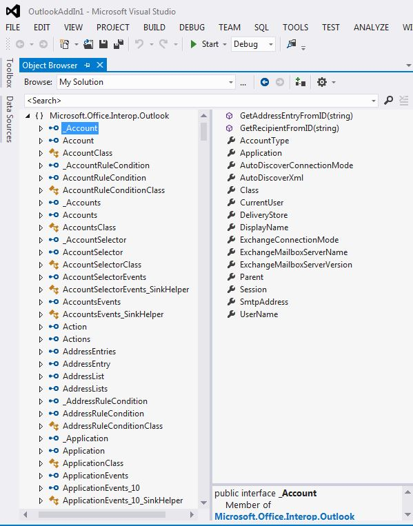

# Outlook PIA とオブジェクト モデルの関係Relating the Outlook PIA with the object model

Outlook プライマリ相互運用機能アセンブリ (PIA) は、Outlook で正式に公開されている相互運用機能アセンブリであり、これによって COM ベースの Outlook オブジェクト モデルを操作するためのマネージ アドイン用のマネージ インターフェイスが定義されます。The Outlook Primary Interop Assembly (PIA) is an interop assembly officially published by Outlook defining a managed interface for managed add-ins to interact with the COM-based Outlook object model. 「[COM と .NET の相互運用性の概要](introduction-to-interoperability-between-com-and-net.md)」では、COM ベースのタイプ ライブラリと比較して、相互運用機能アセンブリによってマネージ クライアント プログラミングが、技術的にどのようにサポートされるかについて説明しています。[Introduction to interoperability between COM and .NET](introduction-to-interoperability-between-com-and-net.md) describes technically how an interop assembly supports a managed client programming against a COM-based type library. このトピックでは、COM ベースの Outlook オブジェクト モデルのオブジェクトやメンバーが PIA の対応するマネージ インターフェイスやクラスにマップされるしくみについて、その概要を示します。This topic gives an overview of how objects and members in the COM-based Outlook object model are mapped to corresponding managed interfaces and classes in the PIA.

## ヘルパー オブジェクトHelper objects

Visual Basic Editor のオブジェクト ブラウザーにリストされる Outlook タイプ ライブラリのオブジェクト (図 1) と、Visual Studio のオブジェクト ブラウザーにリストされる PIA のオブジェクト (図 2) を比較すると、PIA に非常に多くの特別なヘルパー オブジェクトがあることに驚かされます。オブジェクトの中には、 **Action** オブジェクトのように、特定のインターフェイス ( [Action](https://msdn.microsoft.com/library/bb646971\(v=office.15\)) インターフェイス) にマップされるものもあれば、 **Account** オブジェクトのように、PIA の対応する特定のインターフェイスに必ずしもマップされないものもあります。When you compare the objects of the Outlook type library listed in the object browser of the Visual Basic Editor, as in Figure 1, with the objects of the PIA listed in the object browser of Visual Studio, as in Figure 2, you might be overwhelmed by the large number of extra helper objects that exist in the PIA. You might notice that some objects, such as the **Action** object, maps to one interface, the [Action](https://msdn.microsoft.com/library/bb646971\(v=office.15\)) interface, but other objects, like the **Account** object, do not necessarily map to exactly one corresponding interface in the PIA.

**図 1. オブジェクト ブラウザーに表示される、COM ベースの Outlook タイプ ライブラリのオブジェクト****Figure 1. Object browser showing objects in the COM-based Outlook type library**

**図 2. オブジェクト ブラウザーに表示される、Outlook のオブジェクト****Figure 2. Object browser showing objects in Outlook**

これらのインターフェイスのうち、多くのものの名前は先頭がアンダースコア ('\_') で、その後にオブジェクト名が続いています。Among these interfaces, many of them have names that begin with an underscore ('\_') followed by an object name. たとえば、**Account** オブジェクトは、Visual Studio のオブジェクト ブラウザーでパブリック インターフェイス \_Account とパブリック クラス Account にマップされています。For example, the **Account** object maps to a public interface \_Account and a public class Account in the Visual Studio object browser. 実際、Visual Studio のオブジェクト ブラウザーには明示的に示されていませんが、**Account** オブジェクトは PIA の 2 つのインターフェイスと 1 つのクラス ([\_Account](https://msdn.microsoft.com/library/bb609471\(v=office.15\)) インターフェイス、[Account](https://msdn.microsoft.com/library/bb645103\(v=office.15\)) コクラス、および [AccountClass](https://msdn.microsoft.com/library/bb645768\(v=office.15\)) クラス) にマップされています。In fact, though not shown explicitly in the Visual Studio object browser, the **Account** object is mapped to two interfaces and one class in the PIA: an [\_Account](https://msdn.microsoft.com/library/bb609471\(v=office.15\)) interface, an [Account](https://msdn.microsoft.com/library/bb645103\(v=office.15\)) coclass, and an [AccountClass](https://msdn.microsoft.com/library/bb645768\(v=office.15\)) class. 

これらのインターフェイス、コクラス、およびクラスと、それらがどこから得られるか、またオブジェクトがタイプ ライブラリから PIA にマップされるしくみの詳細については、「 [Outlook PIA でのオブジェクト](objects-in-the-outlook-pia.md)」を参照してください。For more information about these interfaces, coclasses and classes, where they come from, and how objects are mapped from the type library to the PIA, see [Objects in the Outlook PIA](objects-in-the-outlook-pia.md).

## 独立したイベント インターフェイスSeparate event interfaces

イベントを持つオブジェクトを詳しく調べると、PIA のイベントはそのオブジェクトの他のメソッドおよびプロパティ メンバーとはグループ化されておらず、独自のインターフェイス、イベント ハンドラー、およびクラスを形成するようにグループ化されていることがわかります。If you examine objects that have events, events in the PIA are not grouped together with other method and property members of that object, but are grouped to form their own interfaces, event handlers, and classes. 

タイプ ライブラリから PIA にメソッドとプロパティがマップされる方法の詳細については、「[Outlook PIA でのメソッドとプロパティ](methods-and-properties-in-the-outlook-pia.md)」を参照してください。For more information about how methods and properties are mapped from the type library to the PIA, see [Methods and properties in the Outlook PIA](methods-and-properties-in-the-outlook-pia.md). イベントのインターフェイス、委任、およびクラスの詳細については、「[Outlook PIA でのイベント](events-in-the-outlook-pia.md)」を参照してください。For more information about event interfaces, delegates, and classes, see [Events in the Outlook PIA](events-in-the-outlook-pia.md).

## 隠しオブジェクトと非推奨オブジェクトHidden and deprecated objects

PIA には、COM オブジェクト モデルでは非推奨になっていてオプションで非公開としてマークされるオブジェクト、メンバー、および列挙も含まれています。The PIA also contains objects, members, and enumerations that have been deprecated and optionally marked as hidden in the COM object model. それらのオブジェクト、メンバー、および列挙の多くは、PIA では公開されています。Most of these objects, members, and enumerations are exposed in the PIA. ただし、それらが公開されているのは PIA の完全性を保つためであり、それらがソリューション開発者によって使用されることを想定しておらず、したがって、それらに関しては最小限の説明しかありません。However, they are exposed for the completeness of the PIA; they are no longer intended to be used by solution developers and are therefore minimally documented. いくつかの例外はありますが (タイプ ライブラリでは非公開の **\_DocSiteControl** オブジェクトや **\_RecipientControl** オブジェクトなど)、PIA リファレンスのファースト クラス オブジェクトとして公開され文書化されています。A few exceptions exist such as the **\_DocSiteControl** and **\_RecipientControl** objects, which are hidden in the type library but are exposed and documented as first class objects in the PIA reference. 

**\_DocSiteControl** オブジェクトの詳細については、「[\_DDocSiteControl](https://msdn.microsoft.com/library/bb609520\(v=office.15\))」を参照してください。For more information about the **\_DocSiteControl** object, see [\_DDocSiteControl](https://msdn.microsoft.com/library/bb609520\(v=office.15\)). **\_RecipientControl** オブジェクトの詳細については、「[\_DRecipientControl](https://msdn.microsoft.com/library/bb609501\(v=office.15\))」を参照してください。For more information about the **\_RecipientControl** object, see [\_DRecipientControl](https://msdn.microsoft.com/library/bb609501\(v=office.15\)).

