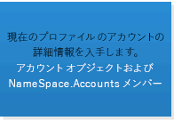

# Outlook 用のソリューションを開発するための API またはテクノロジの選択Selecting an API or technology for developing solutions for Outlook

この記事では Outlook 2013 を拡張するために使用できる API とテクノロジについて説明しており、各自のシナリオに適した API またはテクノロジを判断する際に役立てることができます。This article describes the APIs and technologies you can use to extend Outlook 2013, and helps you decide the appropriate API or technology for your scenario.
  
Microsoft は Outlook を拡張する各種 API およびテクノロジをサポートします。Microsoft supports various APIs and technologies that extend Outlook: 
  
- Office 2013 以降、Office プラットフォーム用アプリにより、デスクトップ、タブレット、スマートフォンで動作するすべての Outlook クライアントで Outlook の機能を拡張することが可能になりました。Office プラットフォームには、JavaScript API for Office とアプリ マニフェストのスキーマが含まれます。Starting in Office 2013, the apps for Office platform opens up opportunities to extend Outlook functionality across Outlook clients on the desktop, tablet and smart phone. The platform includes a JavaScript API for Office and a schema for app manifests.
    
- オブジェクト モデル、それに対応する Outlook プライマリ相互運用機能アセンブリ (PIA)、メッセージング API (MAPI) が、Outlook ソリューションで最もよく用いられる API です。The object model, the corresponding Outlook Primary Interop Assembly (PIA), and the Messaging API (MAPI) have been the most commonly used APIs in Outlook solutions.
    
- 補助 API は、一部のシナリオで MAPI を補完します。The auxiliary APIs complement MAPI in a few scenarios.
    
- Outlook Social Connector (OSC) プロバイダー拡張機能と天気予報バー拡張機能は、ニッチ マーケットの特定のシナリオで役立ちます。Outlook Social Connector (OSC) provider extensibility and the Weather Bar extensibility serve specific scenarios of their niche markets.
    
この記事では、Office アドイン プラットフォーム、オブジェクト モデル、PIA、MAPI の選択基準について説明します。 Office アドインは、JavaScript API for Office を使用する場合にオブジェクト モデルを呼び出すことはなく、その逆も起こらないことに注意してください。他の API を使用するソリューションでは、1 つ以上の API が使用されることがあります。たとえば、C++ で作成された COM アドインは、同じソリューション内でオブジェクト モデル、MAPI、および補助 API を使用することがあります。This article explains the selection criteria for the Office Add-ins platform, the object model, PIA, and MAPI. Note that Office Add-ins use the JavaScript API for Office and do not call into the object model, and vice versa. Solutions that use the other APIs can use one or more APIs. For example, a COM add-in written in C++ can use the object model, MAPI, and auxiliary APIs in the same solution.
  
この記事を最大限活用するには、ユーザー レベルで Outlook に精通しており、一般的なソフトウェア開発の知識を持っている必要があります。しかし、前述の API やテクノロジがサポートする機能を広範囲に理解している必要はありません。この記事から次の質問の答えが得られます。To get the most benefit from this article, you should be familiar with Outlook at the user level and have general software development knowledge. However, you do not need to have a comprehensive understanding of the features that these APIs or technologies support. The article helps answer the following questions:
  
- 自分が開発するソリューションの目標、ターゲットにするマーケット、利用可能なリソースについてのアイデアだけがある場合、他のどのような基準を検討して API を選択する必要があるか。If you have only an idea about the goals of your solution, the target market, and available resources, what other criteria should you consider to select an API?
    
- どのような理由で Office アドイン を検討することになるのか、またどのような場合にアドインではなくアプリの作成を選択するか。Why would you consider Office Add-ins, and when would you choose to create apps as opposed to add-ins?
    
- ソリューションを古いバージョンの Outlook (Outlook 2003 を含む) で実行しなければならない場合、そのことが API の選択にどのように影響するか。If your solution has to run on earlier versions of Outlook, including Outlook 2003, how does that affect your API choice?
    
- ソリューションが何千ものアイテムを含む Outlook フォルダを反復処理しなければならず、それらのアイテムを変更することもできなければならない場合、どの API が最適か。If your solution has to iterate through Outlook folders that contain thousands of items, and you need to be able to modify those items, which API would work best?
    
- ソリューションが Outlook ビジネス ロジックに大きく依存しており、かつ他の Office アプリケーションとも対話する場合、Outlook オブジェクト モデルを選択することが最善か。If your solution relies heavily on Outlook business logic and interacts with other Office applications, is the Outlook object model the best choice?
    
- オブジェクト モデルと MAPI を使用することにより、Outlook をどのように拡張できるか。What do the object model and MAPI allow you to extend in Outlook?
    
- オブジェクト モデルと MAPI のどちらを使用してもタスクを実行できる場合、どちらの API を使用するかどのように決めたらよいか。If you can use either the object model or MAPI to achieve your task, how should you decide which API to use?
    
## 客観的な評価基準Objective evaluation criteria

このセクションでは、Office アドイン プラットフォーム、オブジェクト モデル、PIA、MAPI を比較してどれがより良く要件を満たすのか判断する際に使用する基準について説明します。プロジェクトや使用可能なリソースによって、各種基準の重要度は異なります。This section describes criteria that you can use to compare the Office Add-ins platform, object model, PIA, and MAPI to determine which better meets your needs. Different criteria can be more or less important, depending on your projects and available resources.
  
このセクションの表では、評価基準を次の分類に分けて定義しています。The tables in this section define evaluation criteria in the following categories:
  
- 機能上の基準—テクノロジを使用して行えることと行えないことを説明します。Functional criteria—Describes the things you can and cannot do with the technology.
    
- 開発上の基準—テクノロジの使用に必要な開発ツールまたは情報について説明します。Development criteria—Describes the development tools or information you need to use the technology
    
- セキュリティ上の基準—テクノロジに関係するセキュリティおよびアクセス許可の問題について説明します。Security criteria—Describes the security and permissions issues related to the technology.
    
- 展開上の基準—テクノロジに対して推奨される展開および配布メソッドについて説明します。Deployment criteria—Describes the recommended deployment and distribution methods for the technology.
    
### Office プラットフォーム用アプリの客観的な評価基準Objective evaluation criteria for the apps for Office platform

Office 2013 以降、開発者は Office アドイン プラットフォームを使用して Web サービスとコンテンツを Office のリッチ クライアントと Web クライアントのコンテキストに拡張することができます。Office アドイン は、一般的な Web テクノロジを使用して開発され、(Outlook などの) Office クライアント アプリケーション内部でホストされる Web ページで、 社内またはクラウドで実行できます。Office アドイン の中でも、Outlook がサポートするタイプはメール アプリといいます。Outlook をアプリケーション レベルで自動化するためにオブジェクト モデル、PIA、MAPI をよく使用しますが、JavaScript API for Office を使用してアイテム レベルで電子メール メッセージ、会議出席依頼、予定の内容やプロパティを連動させることもできます。メール アプリは Office ストア や社内の Exchange カタログに公開できます。Starting in Office 2013, developers can use the Office Add-ins platform to extend web services and content into the context of Office rich and web clients. An Office Add-in is a web page that is developed using common web technologies, hosted inside an Office client application (such as Outlook), and can run on-premises or in the cloud. Of the few types of Office Add-ins, the type that Outlook supports is called mail apps. While the object model, PIA, and MAPI are often used to automate Outlook at an application level, you can use the JavaScript API for Office to interact at an item level with the content and properties of an email message, meeting request, or appointment. You can publish mail apps to the Office Store or an internal Exchange catalog. 
  
エンド ユーザーや管理者はメール アプリを Exchange メールボックスにインストールすれば、Outlook リッチ クライアントや Outlook Web App でもメール アプリを使用できます。 開発者であれば、自分のメール アプリをデスクトックでのみ利用可能にしたり、タブレットやスマートフォンでも利用可能にしたりすることもできます。図 1 に、[方法: YouTube ビデオを表示するための Outlook 2013 プレビュー用メール アプリを構築する方法](http://msdn.microsoft.com/library/bfde1d24-2c13-4798-9b13-5f307d49370f%28Office.15%29.aspx)で詳しく説明されている YouTube メール アプリの例を示します。YouTube メール アプリにより、エンド ユーザーは YouTube の URL を選択して、デスクトップやタブレットの Outlook または Outlook Web App 内でビデオを見ることができます。End users and administrators can install mail apps on an Exchange mailbox, and use mail apps in the Outlook rich client as well as Outlook Web App. As a developer, you can choose to make your mail app available on only the desktop, or also on the tablet or smart phone. Figure 1 shows an example of a YouTube mail app, which is described in detail in [Sample: Create a mail add-in to view YouTube videos in Outlook](http://msdn.microsoft.com/library/bfde1d24-2c13-4798-9b13-5f307d49370f%28Office.15%29.aspx). The YouTube mail app allows end users select a URL for a YouTube video and watch the video within Outlook or Outlook Web App, on the desktop or tablet.
  
**図 1. 選択したメッセージには YouTube.com のビデオの URL が含まれていて、このメッセージに対して YouTube メール アプリがアクティブになっている****Figure 1. YouTube mail app is active for the selected message, which contains a URL to a video on YouTube.com**

  
ユーザーがメール アプリをインストールすると、そのときのコンテキストがアプリの指定するアクティブ化条件と一致した場合、アプリ バーでアプリが使用可能になります。メール アプリでは、そのときに選択されているアイテムに関して、特定の条件と一致するときにのみメール アプリをアクティブにするルールを指定することができます。たとえば、選択した Outlook アイテムに YouTube.com のビデオの URL が含まれているときにのみ Outlook 内で YouTube ビデオを再生できるようにする YouTube メール アプリがその一例です。この場合、選択したメッセージに先のような URL が含まれている場合にのみ、アプリがアクティブになるように指定します。After a user installs a mail app, the app is available for use in the app bar when the current context matches the activation conditions that the app specifies. A mail apps allows you to specify rules about the currently selected item that activate a mail app only if certain conditions are met. For example, the YouTube mail app that lets you play a YouTube video within Outlook is relevant only when the selected Outlook item contains a URL to a video on YouTube.com. In this case, you would specify that the app should be active only when the selected message contains such a URL.
  
次の表は、Office アドイン プラットフォームの評価基準を示しています。The following tables show the evaluation criteria for the Office Add-ins platform.
  
#### 機能上の基準Functional criteria

|**基準****Criteria**|**Office プラットフォーム用のアプリでのメール アプリのサポート****Mail apps support in apps for Office platform**|
|:-----|:-----|
|アプリケーション ドメインApplication domain    |メール アプリのアクティビティの対象範囲は、ユーザーが選択しておりかつアクティブ化条件と一致する、ユーザーの Exchange メールボックス内にあるサポートされている、実質的にすべてのメッセージまたは予定アイテムです。メール アプリのアクセス許可によって、アイテムに存在するプロパティおよび特定のエンティティ (電子メール アドレスや電話番号など) に対してどのようなアクセスが行えるか判断されます。たとえば、 **メールボックスの読み取り/書き込み** アクセス許可を要求するメール アプリは、ユーザーのメールボックスにあるすべてのアイテムのすべてのプロパティに対して読み取りおよび書き込みを行い、すべてのフォルダまたはアイテムに対して作成、読み取り、書き込みを行い、そのメールボックスからアイテムを送信できます。  The scope of activity of a mail app is virtually any supported message or appointment item in the user's Exchange mailbox that the user has selected and that satisfies the activation conditions. The permissions of a mail app determine its access to the properties and specific entities (such as an email address or telephone number) that exist for that item. For example, a mail app requesting the **read/write mailbox** permission can read and write all the properties of any item in the user's mailbox; create, read, and write to any folder or item; and send an item from that mailbox.    |
|主要オブジェクトMajor objects    |JavaScript API for Office は、Office アドイン のすべてのタイプで共有される最上位の少数のオブジェクト [Office](http://msdn.microsoft.com/library/c490b13d-ee52-4291-af5d-f4a5a11d3af0%28Office.15%29.aspx)、[Context](http://msdn.microsoft.com/library/662883d5-b86f-4bdc-99f0-9ee9129ed16c%28Office.15%29.aspx)、および [AysncResult](http://msdn.microsoft.com/library/540c114f-0398-425c-baf3-7363f2f6bc47%28Office.15%29.aspx) を提供します。その次のレベルの、メール アプリに関連する固有の API には、 [Mailbox](http://msdn.microsoft.com/library/a3880d3b-8a09-4cf9-9274-f2682cb3b769%28Office.15%29.aspx)、[Item](http://msdn.microsoft.com/library/ad288df1-3ca2-474c-bea4-c51f46e6fc43%28Office.15%29.aspx)、[UserProfile](http://msdn.microsoft.com/library/6d0a36ec-0d5c-40e3-9f6f-9a7fcf0ac3d8%28Office.15%29.aspx) オブジェクトが含まれ、これらはユーザーおよびユーザーのメールボックスで選択されているアイテムに関する情報へのアクセスをサポートします。データ レベルでは、 [CustomProperties](http://msdn.microsoft.com/library/95a69bd6-c4dc-429a-8b27-e2b68f74f3e3%28Office.15%29.aspx) および [RoamingSettings](http://msdn.microsoft.com/library/cf21bb08-7274-4ad6-ae9e-b2c12f92abc9%28Office.15%29.aspx) オブジェクトがそれぞれ、選択したアイテムおよびユーザーのメールボックスに対してメール アプリが設定したプロパティの保持をサポートします。アイテム レベルのオブジェクトには、 [Item](http://msdn.microsoft.com/library/08ebffff-eb52-4e21-9d4e-8f79e426f992%28Office.15%29.aspx) を継承する [Appointment](http://msdn.microsoft.com/library/909ad9eb-a1bc-4caa-b51e-fd59a02b9569%28Office.15%29.aspx) オブジェクトと **Message** オブジェクト、および [Message](http://msdn.microsoft.com/library/c658fa3d-1138-4a67-9a4b-c9edd11f8385%28Office.15%29.aspx) を継承する **MeetingRequest** オブジェクトが含まれます。 これらはメール アプリをサポートする、予定や会議などの予定表アイテムや、電子メール メッセージ、会議出席依頼、応答、取り消しなどのメッセージ アイテムといった Outlook アイテムのタイプを表します。API でこのレベルを超えるものには、 特定の既知の [Entities](http://msdn.microsoft.com/library/ffa6812c-34b8-4b0a-8f92-22c3580c8379%28Office.15%29.aspx) オブジェクト ( [Contact](http://msdn.microsoft.com/library/1a06c8d1-dafe-46f4-967e-dd9b1d5b20e9%28Office.15%29.aspx)、[MeetingSuggestion](http://msdn.microsoft.com/library/2604b44c-7b79-47f0-ac3e-7d99bc9e6751%28Office.15%29.aspx)、[PhoneNumber](http://msdn.microsoft.com/library/9726fbff-0f4f-4b70-8deb-effc14607d4e%28Office.15%29.aspx)、および [TaskSuggestion](http://msdn.microsoft.com/library/cc86426a-2730-4774-9067-0611e5c8e9c1%28Office.15%29.aspx) など) をサポートするオブジェクトやプロパティだけでなく、アイテム レベルのプロパティ ( [Appointment.subject](http://msdn.microsoft.com/library/16b0c3d6-adf4-4a88-ad09-4bb5565816b1%28Office.15%29.aspx) など) もあります。  The JavaScript API for Office provides a few objects at the top level that are shared by all the types of Office Add-ins: [Office](http://msdn.microsoft.com/library/c490b13d-ee52-4291-af5d-f4a5a11d3af0%28Office.15%29.aspx), [Context](http://msdn.microsoft.com/library/662883d5-b86f-4bdc-99f0-9ee9129ed16c%28Office.15%29.aspx), and [AysncResult](http://msdn.microsoft.com/library/540c114f-0398-425c-baf3-7363f2f6bc47%28Office.15%29.aspx). The next level in the API that is applicable and specific to mail apps includes the [Mailbox](http://msdn.microsoft.com/library/a3880d3b-8a09-4cf9-9274-f2682cb3b769%28Office.15%29.aspx), [Item](http://msdn.microsoft.com/library/ad288df1-3ca2-474c-bea4-c51f46e6fc43%28Office.15%29.aspx), and [UserProfile](http://msdn.microsoft.com/library/6d0a36ec-0d5c-40e3-9f6f-9a7fcf0ac3d8%28Office.15%29.aspx) objects, which support accessing information about the user and the item currently selected in the user's mailbox. At the data level, the [CustomProperties](http://msdn.microsoft.com/library/95a69bd6-c4dc-429a-8b27-e2b68f74f3e3%28Office.15%29.aspx) and [RoamingSettings](http://msdn.microsoft.com/library/cf21bb08-7274-4ad6-ae9e-b2c12f92abc9%28Office.15%29.aspx) objects support persisting properties set up by the mail app for the selected item and for the user's mailbox, respectively. Item-level objects include the [Appointment](http://msdn.microsoft.com/library/08ebffff-eb52-4e21-9d4e-8f79e426f992%28Office.15%29.aspx) and [Message](http://msdn.microsoft.com/library/909ad9eb-a1bc-4caa-b51e-fd59a02b9569%28Office.15%29.aspx) objects that inherit from **Item**, and the [MeetingRequest](http://msdn.microsoft.com/library/c658fa3d-1138-4a67-9a4b-c9edd11f8385%28Office.15%29.aspx) object that inherits from **Message**. These represent the types of Outlook items that support mail apps: calendar items of appointments and meetings, and message items such as email messages, meeting requests, responses, and cancellations. Beyond this level in the API are item-level properties (such as [Appointment.subject](http://msdn.microsoft.com/library/ffa6812c-34b8-4b0a-8f92-22c3580c8379%28Office.15%29.aspx)) as well as objects and properties that support certain known [Entities](http://msdn.microsoft.com/library/1a06c8d1-dafe-46f4-967e-dd9b1d5b20e9%28Office.15%29.aspx) objects (for example [Contact](http://msdn.microsoft.com/library/2604b44c-7b79-47f0-ac3e-7d99bc9e6751%28Office.15%29.aspx), [MeetingSuggestion](http://msdn.microsoft.com/library/9726fbff-0f4f-4b70-8deb-effc14607d4e%28Office.15%29.aspx), [PhoneNumber](http://msdn.microsoft.com/library/cc86426a-2730-4774-9067-0611e5c8e9c1%28Office.15%29.aspx), and [TaskSuggestion](http://msdn.microsoft.com/library/16b0c3d6-adf4-4a88-ad09-4bb5565816b1%28Office.15%29.aspx)).    メール アプリ用にサポートされている機能の要約については、「[Outlook 2013 プレビュー用メール アプリの開発の基本](http://msdn.microsoft.com/library/2cd5641b-492b-4431-8388-7fc589163e9c%28Office.15%29.aspx)」を参照してください。See [Overview of Outlook add-ins architecture and features](http://msdn.microsoft.com/library/2cd5641b-492b-4431-8388-7fc589163e9c%28Office.15%29.aspx) for a summary of the features supported for mail apps.    |
|データ アクセス モデルData-access model    |JavaScript API for Office は、アプリの実行時環境、ユーザーのメールボックスおよびプロファイル、アイテムに関するデータの機能を階層的なオブジェクトの集合として表します。The JavaScript API for Office represents the following features as a hierarchical set of objects: the app's runtime environment, user's mailbox and profile, and data about an item.    |
|スレッド モデルThreading models    |各メール アプリは、Outlook プロセスとは別の独自のプロセスで実行されます。Each mail app executes in its own process separate from the Outlook process.    |
|アプリケーション アーキテクチャApplication architectures    |Outlook において、メール アプリは Web ブラウザ コントロール内部の別個のプロセスとしてホストされる HTML と JavaScript の Web ページの集まりであり、Web ブラウザ コントロールはセキュリティとパフォーマンス分離を提供するアプリ ランタイム プロセス内部でホストされます。In Outlook, a mail app is a set of HTML and JavaScript web pages hosted as a separate process inside a web browser control which, in turn, is hosted inside an app runtime process that provides security and performance isolation.    |
|リモート使用Remote usage    |メール アプリは JavaScript API for Office を使用して、通信する Exchange Server に保管されている現在のユーザー、メールボックス、選択したアイテムに関するデータにアクセスします。メール アプリには適切なアクセス許可が付与されており、クロス ドメイン アクセスに適した方法を使用するなら、メール アプリは Exchange Web Services および他のサード パーティ Web サービスを呼び出して機能を拡張することもできます。Mail apps use the JavaScript API for Office to access data about the current user, mailbox, and selected item stored on the corresponding Exchange Server. Provided that they have the appropriate permissions and use the appropriate technique for cross-domain access, mail apps can also call Exchange Web Services and other third-party web services to extend their functionality.    |
|トランザクションTransactions    |JavaScript API for Office はトランザクションをサポートしません。The JavaScript API for Office does not support transactions.    |
|可用性Availability    |Outlook 2013 以降、JavaScript API for Office は Exchange Server 2013 のメールボックスで使用できます。The JavaScript API for Office is available for mailboxes on Exchange Server 2013, starting in Outlook 2013.    |
   
#### 展開上の基準Development criteria

|**基準****Criteria**|**Office 用アプリ プラットフォームでのメール アプリ サポート****Mail apps support in apps for Office platform**|
|:-----|:-----|
|言語とツールLanguages and tools    |HTML5、JavaScript、CSS3、XML、REST API といった一般的な Web テクノロジを使用するメール アプリを実装できます。自分で選択した Web 開発ツールを使用できます。しかし、Napa、Visual Studio 2012、またはこれらのツールの新しいバージョンを使用すれば、開発に要する時間を節約できます。You can implement mail apps using any common web technology, including HTML5, JavaScript, CSS3, XML, and REST APIs. You can use your preferred web development tool. Alternatively, using Napa, Visual Studio 2012, or a later version of these tools provides conveniences that save you time in development.    |
|マネージ実装Managed implementation    |シナリオに適している場合は、メール アプリのサーバー側コードをマネージ .aspx ページを使用して実装できます。Where appropriate in your scenario, you can use managed .aspx pages to implement server-side code for your mail apps.    |
|スクリプトで使用可能Scriptable    |JavaScript API for Office はスクリプト内で直接使用されます。The JavaScript API for Office is directly used in scripts.    |
|テストおよびデバッグ ツールTest and debug tools    |お好みのどの Web 開発ツールでも使用できます。Napa と Visual Studio は、アプリのテストとデバッグを行うのに便利な統合開発環境を提供します。「[Outlook アドインのアクティブ化のトラブルシューティング](http://msdn.microsoft.com/library/da5b56c9-7fd1-4556-8c0e-f489c4c9e9b6%28Office.15%29.aspx)」と「[サンプル: Outlook アイテムのプロパティのデバッグ](http://msdn.microsoft.com/library/e3f14f07-cf35-4896-aab0-cb7625ca09b5%28Office.15%29.aspx)」に、メール アプリのトラブルシューティングとデバッグに関するさらに役立つ情報があります。  You can use any web development tools you prefer. Napa and Visual Studio provide an integrated development environment that facilitates app testing and debugging. [Troubleshoot Outlook add-in activation](http://msdn.microsoft.com/library/da5b56c9-7fd1-4556-8c0e-f489c4c9e9b6%28Office.15%29.aspx) and [Sample: Debug properties of Outlook items](http://msdn.microsoft.com/library/e3f14f07-cf35-4896-aab0-cb7625ca09b5%28Office.15%29.aspx) provide further help in troubleshooting and debugging mail apps.    |
|エキスパートの調達のしやすさExpert availability    |要求されている Office アドイン の Web 開発の専門スキルを備えたプログラマは比較的容易に見つかります。このプラットフォームは、専門的開発者および非専門的開発者の両方を対象としています。Programmers who have the required level of web development expertise for Office Add-ins are relatively easy to find. The platform is intended for both professional and non-professional developers.    |
|利用可能な情報Available information    |Office アドイン の開発と公開に関する情報は、「[Office および SharePoint 用アプリのビルド](http://msdn.microsoft.com/en-us/office/apps/fp160950.aspx)」にあります。メール アプリに関する特定の資料は、「[Outlook 2013 プレビュー用のメール アプリ](http://msdn.microsoft.com/library/71e64bc9-e347-4f5d-8948-0a47b5dd93e6%28Office.15%29.aspx)」にあります。  Information about developing and posting Office Add-ins is available at [Build apps for Office and SharePoint](http://msdn.microsoft.com/en-us/office/apps/fp160950.aspx). Specific documentation for mail apps is available at [Outlook add-ins](http://msdn.microsoft.com/library/71e64bc9-e347-4f5d-8948-0a47b5dd93e6%28Office.15%29.aspx).    |
|開発者および展開ライセンスDeveloper and deployment licensing    |Office アドイン アプリのライセンス フレームワークに関する情報については、「[Office アドインおよび SharePoint アドインのライセンス](http://msdn.microsoft.com/library/3e0e8ff6-66d6-44ff-b0c2-59108ebd9181%28Office.15%29.aspx)」を参照してください。Refer to [License your Office and SharePoint Add-ins](http://msdn.microsoft.com/library/3e0e8ff6-66d6-44ff-b0c2-59108ebd9181%28Office.15%29.aspx) for information about the app license framework for Office Add-ins.    |
   
#### セキュリティ上の基準Security criteria

|**基準****Criteria**|**Office 用アプリ プラットフォームでのメール アプリ サポート****Mail apps support in apps for Office platform**|
|:-----|:-----|
|デザイン時権限Design-time permissions    |メール アプリの開発に特別な権限は必要ありません。No special permissions are required to develop mail apps.    |
|セットアップ権限Setup permissions    |デフォルトでは、エンドユーザーと管理者は **制限** または **アイテムの読み取り**権限が必要な低信頼メール アプリをインストールでき、管理者は **メールボックスの読み取り/書き込み**権限を必要とする高信頼メール アプリをインストールできます。By default, end users and administrators can install low-trust mail apps that require **restricted** or **read item** permission, and administrators can install high-trust mail apps that require **read/write mailbox** permission.    |
|実行時権限Run-time permissions    |メール アプリは、 **制限**、 **アイテムの読み取り**、 **メールボックスの読み取り/書き込み**の 3 層のアクセス許可モデルに基づいて特定のレベルの権限を要求します。 .  Mail apps request a specific level of permission that is based on a three-tier permissions model: **restricted**, **read item**, and **read/write mailbox**.    |
|組み込みセキュリティ機能Built-in security features    | Office アドイン ランタイムには、アプリがエンド ユーザーの環境を損なわないようにするための次のような利点があります。The Office Add-ins runtime provides the following benefits to prevent an app from damaging the end user's environment:     アプリを実行するプロセスは分離されます。Isolates the process that the app runs in.     .dll または .exe 置換または ActiveX コンポーネントを使用しません。Doesn't involve .dll or .exe replacement or ActiveX components.     エンドユーザーによるアプリのインストールまたはアンインストールが容易です。Makes apps easy to install or uninstall by the end user.     管理者とエンドユーザーは、使用可能なメール アプリを制御することができ、メール アプリをインストールする前に要求された権限を付与するかどうかを判断できます。The administrator and end users have control over the mail apps that are made available and whether to grant the requested permission before installing a mail app.     リッチ クライアントの場合、悪意あるサービス拒否攻撃を防ぐためにメモリーと CPU の使用状況を統御します。In the case of rich clients, governs the use of memory and CPU to prevent denial of service malicious attacks.    |
|セキュリティ監視機能Security monitoring features    | メール アプリの場合、以下のリソースが監視されます。For mail apps, the following resources are monitored:     CPU コア使用状況。CPU core usage.     メモリー使用状況。Memory usage.     クラッシュ回数。Number of crashes.     アプリケーションをブロックする時間。Length of time blocking an application.     正規表現応答時間。Regular expression response time.     正規表現の再評価回数。Number of times re-evaluating regular expressions.     管理者は、リソース使用状況を制御するデフォルト設定に優先する設定を行えます。Administrators can override default settings that govern the resource usage.    |
   
#### 展開上の基準Deployment criteria

|**基準****Criteria**|**Office 用アプリ プラットフォームでのメール アプリ サポート****Mail apps support in apps for Office platform**|
|:-----|:-----|
|サーバー プラットフォームの要件Server platform requirements    |メール アプリをインストールするユーザーのメールボックスは Exchange Server 2013 またはそれ以降のバージョン上になければなりません。The user's mailbox for which a mail app is installed must be on Exchange Server 2013 or a later version.    |
|クライアント プラットフォームの要件Client platform requirements    |Outlook リッチ クライアント上で実行するメール アプリの場合、Outlook 2013 と Internet Explorer 9 (両方のアプリケーションについてそれ以上のバージョン) をローカル コンピューターにインストールする必要があります。For a mail app to run on the Outlook rich client, Outlook 2013 and Internet Explorer 9, or a later version of these applications, must be installed on the local computer.    |
|展開の方法Deployment methods    |メール アプリは、Office ストア や Exchange Server 上でアプリをユーザーに提供する Exchange カタログに公開することができます。その後、管理者またはユーザーは、 Exchange 管理センター (EAC) を使用するかまたはリモート Windows PowerShell コマンドレットを実行して、Office ストア または Exchange カタログからメール アプリをインストールできます。EAC へは、Outlook Backstage ビューまたは Outlook Web App から、あるいはメールボックスから直接 EAC にサインインしてアクセスできます。  You can publish mail apps to the Office Store or to an Exchange catalog that makes the app available to users on that Exchange Server. Administrators or users can then choose to install a mail app from the Office Store or Exchange catalog, by using either the Exchange Admin Center (EAC) or by running remote Windows PowerShell cmdlets. You can access the EAC from the Outlook Backstage view or Outlook Web App, or by directly signing into the EAC for your mailbox.    詳細については、「[Outlook 2013 プレビューでのテスト用メール アプリの展開とインストール](http://msdn.microsoft.com/library/d6eea4c4-bb21-4f24-bcba-1eccbb4e12dd%28Office.15%29.aspx)」を参照してください。For more information, see [Deploy and install Outlook add-ins for testing](http://msdn.microsoft.com/library/d6eea4c4-bb21-4f24-bcba-1eccbb4e12dd%28Office.15%29.aspx).    |
|展開に関する注意事項Deployment notes    |メール アプリを Outlook または Outlook Web App にインストールすると、そのメール アプリは両方の Outlook クライアントの同じメールボックスで利用可能になります。Once you install a mail app on Outlook or Outlook Web App, the mail app is available for that mailbox on both Outlook clients.    |
   
### オブジェクト モデルと PIA の客観的な評価基準Objective evaluation criteria for the object model and PIA

クライアント コンピューター上で実行するソリューションは、Outlook オブジェクト モデルまたは PIA を使用して、連絡先、メッセージ、予定表アイテム、会議出席依頼、タスクなどの Outlook アイテムにプログラム経由でアクセスします。MAPI とは異なり、Outlook オブジェクト モデルと PIA は、現在のフォルダの変更や Outlook 検査の表示といった Outlook ユーザー インターフェイスの変更のイベント通知を提供できます。Solutions that run on the client computer can use the Outlook object model or PIA to programmatically access Outlook items, such as contacts, messages, calendar items, meeting requests, and tasks. Unlike MAPI, the Outlook object model and PIA can provide event notifications for Outlook user-interface changes, such as changing the current folder or displaying an Outlook inspector.
  
> [!NOTE]
> [!メモ] Microsoft Exchange メールボックスまたは個人用フォルダー (.pst) ファイルに保管されているデータにアクセスするソリューションの場合、アプリケーションが実行されているクライアント コンピューターに Outlook をインストールして設定する必要があります。 > Outlook オブジェクト モデルと PIA は、Outlook を拡張する同一の機能をサポートします。PIA は、COM ベースのオブジェクト モデルにマップし、マネージ ソリューションとの対話が可能なマネージ インターフェイスを定義します。このセクションの残りの部分では、機能上、セキュリティ上、展開上の基準のほとんどが、オブジェクト モデルと PIA に同じように適用されます。COM と .NET Framework との間の相互運用性を PIA が円滑にする方法の詳細については、「[COM と .NET の相互運用性の概要](http://msdn.microsoft.com/library/6b2d099a-ec6f-4099-aaf6-e61003fe5a32%28Office.15%29.aspx)」および「[Outlook PIA のアーキテクチャ](http://msdn.microsoft.com/library/89577d14-e6e2-4270-8e72-b0adba378667%28Office.15%29.aspx)」を参照してください。For a solution to access data that is stored in a Microsoft Exchange mailbox or a personal folders (.pst) file, Outlook must be installed and configured on the client computer on which the application is running. > The Outlook object model and PIA support the same functionality to extend Outlook. The PIA defines managed interfaces that map to the COM-based object model and that a managed solution can interact with. In the remaining discussions in this section, most of the functional, security, and deployment criteria apply to the object model and the PIA in the same way. For more information about how the PIA facilitates interoperability between COM and the .NET Framework, see [Introduction to Interoperability Between COM and .NET](http://msdn.microsoft.com/library/6b2d099a-ec6f-4099-aaf6-e61003fe5a32%28Office.15%29.aspx) and [Architecture of the Outlook PIA](http://msdn.microsoft.com/library/89577d14-e6e2-4270-8e72-b0adba378667%28Office.15%29.aspx). 
  
Outlook オブジェクト モデルと PIA の評価基準を次の表に示します。The following tables show evaluation criteria for the Outlook object model and PIA.
  
#### 機能上の基準Functional criteria

|**基準****Criteria**|**Outlook オブジェクト モデル または PIA****Outlook object model or PIA**|
|:-----|:-----|
|アプリケーション ドメインApplication domain    |Outlook オブジェクト モデルまたは PIA を使用するアドインやスタンドアロン アプリケーションは、通常、ユーザー固有メッセージの処理、Outlook ユーザー インターフェイスのカスタマイズ、Outlook と統合する顧客関係管理 (CRM) ソリューションなどの特殊なソリューション用にカスタム アイテム タイプの作成を行います。Outlook オブジェクト モデルや PIA は、特に Microsoft Exchange Server 上のアプリケーション開発が許可されていない非公式なワークフロー プロセスでのメッセージ処理に使用されることもあります。ブラウザ ベースのクライアントとは異なり、ユーザーがオフラインであったり企業ネットワークから切断されている場合でも、キャッシュ モード操作によって Outlook ソリューションは動作します。Add-ins or standalone applications that use the Outlook object model or PIA typically handle user-specific messages, customize the Outlook user interface, or create custom item types for specialized solutions such as customer relationship management (CRM) solutions that integrate with Outlook. The Outlook object model or PIA is sometimes used for message processing in an informal workflow process, especially where application development on the Microsoft Exchange Server is not permitted. Unlike browser-based clients, cached-mode operation allows Outlook solutions to work when the user is offline or disconnected from the corporate network.    |
|主要オブジェクトMajor objects    |Outlook オブジェクト モデルと PIA の最上位オブジェクトは Outlook [Application](http://msdn.microsoft.com/library/797003e7-ecd1-eccb-eaaf-32d6ddde8348%28Office.15%29.aspx) オブジェクトです。 [Explorers](http://msdn.microsoft.com/library/8398532a-1fad-7390-6778-109ac5e6c67c%28Office.15%29.aspx)、[Conversation](http://msdn.microsoft.com/library/2705d38a-ebc0-e5a7-208b-ffe1f5446b1b%28Office.15%29.aspx)、[Inspectors](http://msdn.microsoft.com/library/b65475d6-a212-fc96-459d-47390dfe5ee5%28Office.15%29.aspx)、[Views](http://msdn.microsoft.com/library/5dd7edc2-12a2-f4c2-d158-8053d80e8dc9%28Office.15%29.aspx)、[NavigationPane](http://msdn.microsoft.com/library/b6538c72-6115-99fc-c926-e0532a747823%28Office.15%29.aspx)、[SolutionsModule](http://msdn.microsoft.com/library/4597765e-a95d-bf07-2ac4-103218ebc696%28Office.15%29.aspx)、[FormRegion](http://msdn.microsoft.com/library/3a0b83eb-4076-9cb3-86a9-68f9e44df89f%28Office.15%29.aspx) および関連オブジェクトは、Outlook ユーザー インターフェイスの要素を表します。 [NameSpace](http://msdn.microsoft.com/library/f0dcaa19-07f5-5d42-a3bf-2e42b7885644%28Office.15%29.aspx)、[Stores](http://msdn.microsoft.com/library/8915a8e4-9c22-21d5-c492-051d393ce5f7%28Office.15%29.aspx)、[Folders](http://msdn.microsoft.com/library/0c814c3c-74fc-414c-982d-a0097fcb35c2%28Office.15%29.aspx)、[Accounts](http://msdn.microsoft.com/library/2510b7d7-5062-8ea3-dda4-b544d2882a2b%28Office.15%29.aspx)、[AccountSelector](http://msdn.microsoft.com/library/846f176e-5680-a214-7624-75f3a524c989%28Office.15%29.aspx)、[AddressEntries](http://msdn.microsoft.com/library/db91b717-07c6-d1f2-c545-b766ee1f0c6b%28Office.15%29.aspx)、[ExchangeUser](http://msdn.microsoft.com/library/6ec117d1-7fdb-aa36-b567-1242f8238df0%28Office.15%29.aspx) および関連オブジェクトは、Outlook セッション、プロファイル、ユーザー アカウント、メッセージ ストア、およびフォルダの拡張をサポートします。データ レベルでは、 [MailItem](http://msdn.microsoft.com/library/14197346-05d2-0250-fa4c-4a6b07daf25f%28Office.15%29.aspx)、[AppointmentItem](http://msdn.microsoft.com/library/204a409d-654e-27aa-643a-8344c631b82d%28Office.15%29.aspx)、[ContactItem](http://msdn.microsoft.com/library/8e32093c-a678-f1fd-3f35-c2d8994d166f%28Office.15%29.aspx)、および [TaskItem](http://msdn.microsoft.com/library/5df8cfa5-5460-a5a1-a130-ba5bca1a0091%28Office.15%29.aspx) などのいくつかのアイテム レベルのオブジェクトが組み込み Outlook アイテム タイプを表します。 [PropertyAccessor](http://msdn.microsoft.com/library/2fc91e13-703c-3ec9-9066-ffee7144306c%28Office.15%29.aspx)、[Table](http://msdn.microsoft.com/library/0affaafd-93fe-227a-acee-e09a86cadc20%28Office.15%29.aspx)、[Search](http://msdn.microsoft.com/library/226a5d49-3caf-90dd-725c-265404d1939f%28Office.15%29.aspx)、[ItemProperties](http://msdn.microsoft.com/library/34a110ed-6617-72da-1e98-a9773c705b40%28Office.15%29.aspx)、[UserDefinedProperties](http://msdn.microsoft.com/library/196e5d4c-22be-02d3-95e0-3ea7594c2e4b%28Office.15%29.aspx)、[Attachments](http://msdn.microsoft.com/library/4cc96a5f-a822-8ad5-6f61-e996bee8ba22%28Office.15%29.aspx)、[Categories](http://msdn.microsoft.com/library/319efa26-269d-9f2f-c8ec-33082e80a9e2%28Office.15%29.aspx)、[Recipients](http://msdn.microsoft.com/library/774f56b7-4de8-9584-60cd-4fbf361f4c85%28Office.15%29.aspx)、[RecurrencePattern](http://msdn.microsoft.com/library/36c098f7-59fb-879a-5173-ed0260d13fa4%28Office.15%29.aspx)、[Reminders](http://msdn.microsoft.com/library/66b94251-7fe4-886b-7c29-7feac4440dee%28Office.15%29.aspx)、[Rules](http://msdn.microsoft.com/library/dd41b4de-bf5f-5532-46c9-394a5d078bec%28Office.15%29.aspx)、および関連オブジェクトはアイテム レベルのオブジェクトのカスタマイズと操作をサポートします。  The top-level object in the Outlook object model and PIA is the Outlook [Application](http://msdn.microsoft.com/library/797003e7-ecd1-eccb-eaaf-32d6ddde8348%28Office.15%29.aspx) object. [Explorers](http://msdn.microsoft.com/library/8398532a-1fad-7390-6778-109ac5e6c67c%28Office.15%29.aspx), [Conversation](http://msdn.microsoft.com/library/2705d38a-ebc0-e5a7-208b-ffe1f5446b1b%28Office.15%29.aspx), [Inspectors](http://msdn.microsoft.com/library/b65475d6-a212-fc96-459d-47390dfe5ee5%28Office.15%29.aspx), [Views](http://msdn.microsoft.com/library/5dd7edc2-12a2-f4c2-d158-8053d80e8dc9%28Office.15%29.aspx), [NavigationPane](http://msdn.microsoft.com/library/b6538c72-6115-99fc-c926-e0532a747823%28Office.15%29.aspx), [SolutionsModule](http://msdn.microsoft.com/library/4597765e-a95d-bf07-2ac4-103218ebc696%28Office.15%29.aspx), [FormRegion](http://msdn.microsoft.com/library/3a0b83eb-4076-9cb3-86a9-68f9e44df89f%28Office.15%29.aspx), and related objects represent elements of the Outlook user interface. The [NameSpace](http://msdn.microsoft.com/library/f0dcaa19-07f5-5d42-a3bf-2e42b7885644%28Office.15%29.aspx), [Stores](http://msdn.microsoft.com/library/8915a8e4-9c22-21d5-c492-051d393ce5f7%28Office.15%29.aspx), [Folders](http://msdn.microsoft.com/library/0c814c3c-74fc-414c-982d-a0097fcb35c2%28Office.15%29.aspx), [Accounts](http://msdn.microsoft.com/library/2510b7d7-5062-8ea3-dda4-b544d2882a2b%28Office.15%29.aspx), [AccountSelector](http://msdn.microsoft.com/library/846f176e-5680-a214-7624-75f3a524c989%28Office.15%29.aspx), [AddressEntries](http://msdn.microsoft.com/library/db91b717-07c6-d1f2-c545-b766ee1f0c6b%28Office.15%29.aspx), [ExchangeUser](http://msdn.microsoft.com/library/6ec117d1-7fdb-aa36-b567-1242f8238df0%28Office.15%29.aspx), and related objects support extending Outlook sessions, profiles, user accounts, message stores, and folders. At the data level, a number of item-level objects, such as [MailItem](http://msdn.microsoft.com/library/14197346-05d2-0250-fa4c-4a6b07daf25f%28Office.15%29.aspx), [AppointmentItem](http://msdn.microsoft.com/library/204a409d-654e-27aa-643a-8344c631b82d%28Office.15%29.aspx), [ContactItem](http://msdn.microsoft.com/library/8e32093c-a678-f1fd-3f35-c2d8994d166f%28Office.15%29.aspx), and [TaskItem](http://msdn.microsoft.com/library/5df8cfa5-5460-a5a1-a130-ba5bca1a0091%28Office.15%29.aspx), represent the built-in Outlook item types. The [PropertyAccessor](http://msdn.microsoft.com/library/2fc91e13-703c-3ec9-9066-ffee7144306c%28Office.15%29.aspx), [Table](http://msdn.microsoft.com/library/0affaafd-93fe-227a-acee-e09a86cadc20%28Office.15%29.aspx), [Search](http://msdn.microsoft.com/library/226a5d49-3caf-90dd-725c-265404d1939f%28Office.15%29.aspx), [ItemProperties](http://msdn.microsoft.com/library/34a110ed-6617-72da-1e98-a9773c705b40%28Office.15%29.aspx), [UserDefinedProperties](http://msdn.microsoft.com/library/196e5d4c-22be-02d3-95e0-3ea7594c2e4b%28Office.15%29.aspx), [Attachments](http://msdn.microsoft.com/library/4cc96a5f-a822-8ad5-6f61-e996bee8ba22%28Office.15%29.aspx), [Categories](http://msdn.microsoft.com/library/319efa26-269d-9f2f-c8ec-33082e80a9e2%28Office.15%29.aspx), [Recipients](http://msdn.microsoft.com/library/774f56b7-4de8-9584-60cd-4fbf361f4c85%28Office.15%29.aspx), [RecurrencePattern](http://msdn.microsoft.com/library/36c098f7-59fb-879a-5173-ed0260d13fa4%28Office.15%29.aspx), [Reminders](http://msdn.microsoft.com/library/66b94251-7fe4-886b-7c29-7feac4440dee%28Office.15%29.aspx), [Rules](http://msdn.microsoft.com/library/dd41b4de-bf5f-5532-46c9-394a5d078bec%28Office.15%29.aspx), and related objects support customizing and manipulating item-level objects.    |
|データ アクセス モデルData-access model    |Outlook オブジェクト モデルと PIA は、すべてのデータをオブジェクトとコレクションの階層的な集合として表します。The Outlook object model and PIA represent all data as a hierarchical set of objects and collections.    |
|スレッド モデルThreading models    |Outlook オブジェクト モデルと PIA へのすべての呼び出しは、Outlook のメイン フォアグラウンド スレッドで実行されます。Outlook オブジェクト モデルが唯一サポートするスレッド モデルはシングルスレッド アパートメント (STA) です。Outlook オブジェクト モデルまたは PIA をバックグラウンド スレッドから呼び出すことはサポートされていないため、ソリューションがエラーになったり予期しない結果になる可能性があります。All calls to the Outlook object model and PIA execute on Outlook's main foreground thread. The only threading model that the Outlook object model supports is single-threaded apartment (STA). Calling the Outlook object model or PIA from a background thread is not supported and can lead to errors and unexpected results in your solution.    |
|アプリケーション アーキテクチャApplication architectures    |通常、COM アドインと他の Office アプリケーションは Outlook オブジェクト モデルを使用して Outlook を拡張します。マネージ ソリューションは Outlook PIA と Visual Studio および .NET Framework の COM 相互運用性レイヤーとを使用して Outlook オブジェクト モデルにアクセスすることができます。Visual Studio にはテンプレートと追加のクラス ライブラリおよびマニフェストとが用意されていて、Office のドキュメントとアプリケーションのカスタマイズを容易に行うことができます。 Visual Studio を使用した Outlook 用マネージ アドインの開発の詳細については、「[Architecture of Application-Level Add-Ins](http://msdn.microsoft.com/library/978f102f-15c6-44e4-84e8-80b161408324.aspx)」および「[Outlook Solutions](http://msdn.microsoft.com/library/2ae3cd9c-bf31-4efa-8b18-b6b1c34a8d93.aspx)」を参照してください。また、Outlook オブジェクト モデルは Visual Basic for Applications (VBA) マクロと Windows スクリプト ホスト (WSH) をサポートしますが、Windows サービス アプリケーションはサポートしません。  Typically, COM add-ins and other Office applications use the Outlook object model to extend Outlook. Managed solutions can use the Outlook PIA and the COM interoperability layer of Visual Studio and the .NET Framework to access the Outlook object model. Visual Studio provides templates and additional class libraries and manifests to facilitate Office document and application customizations. For more information about using Visual Studio to develop managed add-ins for Outlook, see [Architecture of Application-Level Add-Ins](http://msdn.microsoft.com/library/978f102f-15c6-44e4-84e8-80b161408324.aspx) and [Outlook Solutions](http://msdn.microsoft.com/library/2ae3cd9c-bf31-4efa-8b18-b6b1c34a8d93.aspx). The Outlook object model also supports Visual Basic for Applications (VBA) macros and Windows Scripting Host (WSH), but does not support Windows Service applications.    |
|リモート使用Remote usage    |Outlook オブジェクト モデルと PIA は、Outlook がインストールされているコンピュータでのみ使用できます。Outlook オブジェクト モデルを使用して、Exchange に保管されている Outlook アプリケーション内で利用可能な情報にアクセスできます。The Outlook object model and PIA can be used only on a computer on which Outlook is installed. The Outlook object model can be used to access information stored in Exchange that is available in the Outlook application.    |
|トランザクションTransactions    |Outlook オブジェクト モデルと PIA はトランザクションをサポートしません。The Outlook object model and PIA do not support transactions.    |
|可用性Availability    |Outlook オブジェクト モデルは現在すべてのバージョンの Outlook で使用できます。PIA は Outlook 2003 以降のすべてのバージョンの Outlook で使用できます。Outlook の各新バージョンには、それぞれに拡張機能や改良点があります。The Outlook object model is currently available in all versions of Outlook. The PIA is available in versions of Outlook since Outlook 2003. There have been extensions and improvements with each new version of Outlook.    |
   
#### 展開上の基準Development criteria

|**基準****Criteria**|**Outlook オブジェクト モデル または PIA****Outlook object model or PIA**|
|:-----|:-----|
|言語とツールLanguages and tools    |COM または Visual Basic や C# といったどのオートメーション互換言語、さらにはネイティブの C や C++ といった非 COM 言語のどの言語でも、Outlook オブジェクト モデル アプリケーションを実装できます。Microsoft Visual Studio 2010 の Microsoft Office 開発ツール は、Outlook 2010 および Outlook 2007 用マネージ アドイン開発の推奨ツールです。Microsoft Visual Studio 2005 Tools for the Microsoft Office System は Outlook 2003 用の推奨ツールです。また、Visual Studio 2010 の Office 開発ツール を使用して 32 ビットおよび 64 ビット版 Outlook のソリューションを作成することができます。Visual Studio 2010 の Office 開発ツール または Microsoft Visual Studio Tools for the Microsoft Office System でソリューションを作成する場合は、対象のプラットフォームに [ **Any CPU**] オプションを指定すると、32 ビットおよび 64 ビット版の Outlook 2010 の両方に対応するマネージ ソリューションが作成されます。  You can implement Outlook object model applications by using any COM or automation-compatible language, such as Visual Basic or C#, as well as non-COM languages, such as native C or C++. Microsoft Office development tools in Microsoft Visual Studio 2010 are the preferred tools for development of managed add-ins for Outlook 2010 and Outlook 2007. Microsoft Visual Studio 2005 Tools for the Microsoft Office System are the preferred tools for Outlook 2003. You can also use Office development tools in Visual Studio 2010 to create solutions for 32-bit and 64-bit versions of Outlook. When you build a solution in Office development tools in Visual Studio 2010 or Microsoft Visual Studio Tools for the Microsoft Office System, specifying the **Any CPU** option for the target platform results in managed solutions that work for both 32-bit and 64-bit versions of Outlook 2010.    |
|マネージ実装Managed implementation    |Outlook PIA を使用することにより、マネージ コード環境で Outlook オブジェクト モデルを使用できるようになります。この環境は、豊富なクラス ライブラリでサポートされ、VBA や COM アドインが持つ多くの制約を解消するテクノロジをサポートします。この PIA は COM ラッパーであり、マネージ環境と COM 環境の橋渡しをします。詳細については、「[Outlook PIA を使用する理由](http://msdn.microsoft.com/library/5cc9085e-7c97-4698-8cb9-e33e427c02e7%28Office.15%29.aspx)」を参照してください。  The Outlook PIA enables the Outlook object model to be used in a managed-code environment, which is supported by a rich set of class libraries and support technologies that address many limitations of VBA and COM add-ins. The PIA is a COM wrapper that acts as a bridge between the managed and COM environments. For more information, see [Why Use the Outlook PIA](http://msdn.microsoft.com/library/5cc9085e-7c97-4698-8cb9-e33e427c02e7%28Office.15%29.aspx).    |
|スクリプトで使用可能Scriptable    |Outlook オブジェクト モデルはスクリプト内で使用できます。The Outlook object model can be used in scripts.    |
|テストおよびデバッグ ツールTest and debug tools    |Outlook オブジェクト モデルや PIA を使用するために、特殊なデバッグ ツールは必要ありません。一方、Visual Studio を使用すれば、アプリケーションのテストとデバッグを行うのに便利な統合開発環境が提供されます。No special debugging tools are needed to use the Outlook object model or PIA. On the other hand, you can use Visual Studio to provide an integrated development environment that facilitates application testing and debugging.    |
|エキスパートの調達のしやすさExpert availability    |Outlook オブジェクト モデルや PIA を使用して首尾よくアプリケーションを開発する開発者を見つけるのは比較的容易です。Outlook オブジェクト モデルと PIA は、Visual Studio などの広範囲に利用可能な開発ツールを使用して作成されたアドイン向けです。これらのツールは開発プロセスを簡潔にするデザイン時環境を提供します。Developers who can successfully develop applications by using the Outlook object model or PIA are relatively easy to find. The Outlook object model and PIA are intended for add-ins created by using widely available development tools, such as Visual Studio. These tools provide design-time environments that simplify the development process.    |
|利用可能な情報Available information    |Outlook オブジェクト モデルを使用したプログラミングに関する情報は、Microsoft とサード パーティの両方から入手できます。Outlook オブジェクト モデルの詳細については、「[Outlook 2010 開発者用リファレンス](http://msdn.microsoft.com/library/75e4ad96-62a2-49d2-bc51-48ceab50634c%28Office.15%29.aspx)」を参照してください。Outlook PIA の詳細については、「[プライマリ相互運用機能アセンブリ リファレンス](http://msdn.microsoft.com/library/54bdde85-8dc9-4498-a1ac-f72eaf8f0cd3%28Office.15%29.aspx)」を参照してください。Visual Studio でOffice 開発ツールを使用して開発した管理 Office ソリューションの例については、「 [Visual Studio を使用した管理 Outlook ソリューション](http://msdn.microsoft.com/en-us/vsto/dd162450.aspx)」を参照してください。  Information about programming by using the Outlook object model is available in both Microsoft and third-party resources. For more information about the Outlook object model, see the [Outlook 2010 Developer Reference](http://msdn.microsoft.com/library/75e4ad96-62a2-49d2-bc51-48ceab50634c%28Office.15%29.aspx). For more information about the Outlook PIA, see the [Outlook 2010 Primary Interop Assembly Reference](http://msdn.microsoft.com/library/54bdde85-8dc9-4498-a1ac-f72eaf8f0cd3%28Office.15%29.aspx). For examples of managed Outlook solutions developed by using Office development tools in Visual Studio, see [Outlook Solutions with Visual Studio](http://msdn.microsoft.com/en-us/vsto/dd162450.aspx).    |
|開発者および展開ライセンスDeveloper and deployment licensing    |ご使用のアプリケーションで Outlook および Outlook オブジェクト モデルの使用に追加のライセンスが必要かどうかを判断するには、Exchange および Microsoft Developer Network (MSDN) サブスクリプション ライセンス契約を確認してください。Refer to your Exchange and Microsoft Developer Network (MSDN) subscription licensing agreements to determine whether additional licenses are required for Outlook and Outlook object model use in your applications.    |
   
#### セキュリティ上の基準Security criteria

|**基準****Criteria**|**Outlook オブジェクト モデルまたは PIA****Outlook object model or PIA**|
|:-----|:-----|
|デザイン時権限Design-time permissions    |Outlook オブジェクト モデルまたは PIA を使用してアプリケーションを開発するために、特別な権限は必要ありません。No special permissions are required to develop applications by using the Outlook object model or PIA.    |
|セットアップ権限Setup permissions    |Outlook オブジェクト モデルや PIA を使用するアプリケーションをインストールするために、特別な権限は必要ありません。ただし、Office と Outlook をインストールするためにローカル管理者権限が必要です。No special permissions are required to install applications that use the Outlook object model or PIA. However, local administrator rights are required to install Office and Outlook.    |
|実行時権限Run-time permissions    |Outlook オブジェクト モデルまたは PIA を使用するアプリケーションを実行するために、特別な権限は必要ありません。No special permissions are required to run applications that use the Outlook object model or PIA.    |
|組み込みセキュリティ機能Built-in security features    |Outlook オブジェクト モデルと PIA は、MAPI を使用して Exchange と、Active Directory サービス インターフェイス (ADSI) を使用して Active Directory と通信します。アプリケーションを実行中のユーザーの現在のセキュリティ コンテキストを使用して、コードがどのリソースにアクセス可能か判別されます。既定では、アドインは Outlook オブジェクト モデルまたは PIA のすべてのオブジェクト、プロパティ、 メソッドへの完全なアクセスが可能です。IT 管理者は、どのアドインとオブジェクトが Outlook オブジェクト モデルまたは PIA にアクセス可能かを制御することができます。Outlook オブジェクト モデルと PIA は、Outlook プロセス外で実行されているコードがセキュリティ保護されたオブジェクトやメソッドにアクセスできないようにします。The Outlook object model and PIA communicate with Exchange by using MAPI and with Active Directory by using Active Directory Service Interfaces (ADSI). The current security context of the user who is running the application is used to determine what resources that code can access. By default, add-ins are trusted for full access to all objects, properties, and methods in the Outlook object model or PIA. IT administrators can exercise control over which add-ins and objects can access the Outlook object model or PIA. The Outlook object model and PIA prevent code that is run outside the Outlook process from accessing secure objects and methods.    |
|セキュリティ監視機能Security monitoring features    | Outlook は、アドインを無効にする必要があるかどうかを判断するために、次のアドインの指標を監視します。Outlook monitors the following metrics of an add-in to determine whether it should disable the add-in:     スタートアップStartup     シャットダウンShutdown     フォルダーの切り替えFolder switch     開いているアイテムItem open    **Invoke** 頻度**Invoke** frequency     管理者はグループ ポリシーを使用して、ユーザーの設定に優先される設定を行い、ユーザーのコンピューター上で実行するアドインを制御することができます。Administrators can use group policy to override user settings and control the add-ins that run on the user's computers.     詳細については、「 [アドインを有効に保つためのパフォーマンス基準](https://msdn.microsoft.com/en-us/library/office/4c6d44d2-238b-42d8-896b-51d513c9e14c#ol15WhatsNew_AddinDisabling)」を参照してください。For more information, see [Performance criteria for keeping add-ins enabled](https://msdn.microsoft.com/en-us/library/office/4c6d44d2-238b-42d8-896b-51d513c9e14c#ol15WhatsNew_AddinDisabling).    |
   
#### 展開上の基準Deployment criteria

|**基準****Criteria**|**Outlook オブジェクト モデルまたは PIA****Outlook object model or PIA**|
|:-----|:-----|
|サーバー プラットフォームの要件Server platform requirements    |Outlook オブジェクト モデルと PIA はクライアント側のテクノロジです。The Outlook object model and PIA are client-side technologies.    |
|クライアント プラットフォームの要件Client platform requirements    |Outlook オブジェクト モデルまたは PIA を使用して Exchange データにアクセスするアプリケーションを使用するには、ローカル コンピューターに Outlook がインストールされていることが必要です。Applications that use the Outlook object model or PIA to access Exchange data require that Outlook be installed on the local computer.    |
|展開の方法Deployment methods    |Outlook オブジェクト モデルまたは PIA を使用するアプリケーションは、標準のアプリケーション インストール ソフトウェアを使用して配布されます。Applications that use the Outlook object model or PIA are distributed by using standard application installation software.    |
|展開に関する注意事項Deployment notes    |Outlook を Exchange Server にインストールすることができないため、Outlook オブジェクト モデルや PIA を使用するアプリケーションは Exchange Server 上で実行できません。Because Outlook should not be installed on the Exchange Server, applications that use the Outlook object model or PIA cannot be run on the Exchange Server.    |
   
### MAPI の客観的な評価基準Objective evaluation criteria for MAPI

MAPI を使用して、公開用ストアおよび非公開ストアにあるアイテムやフォルダーにアクセスしたり、各アイテムとともに保管されているプロパティにもアクセスできます。すべてのバージョンの Outlook で MAPI を使用できます。MAPI を使用するクライアントを作成したり、MAPI サーバーや MAPI フォーム ハンドラーを作成することも可能です。このセクションの情報は MAPI クライアント アプリケーションにのみ適用されます。You can use MAPI to access items and folders in public and private stores, as well as to access the properties stored with each item. All versions of Outlook use MAPI. You can create clients that use MAPI, and can create MAPI servers and MAPI forms handlers, as well. The information in this section applies only to MAPI client applications.
  
> [!NOTE]
> [!メモ] MAPI は Exchange または個人用フォルダー (.pst) ファイル内にある情報へのアクセスに使用される成熟したメカニズムで、MAPI は他の API にはないいくつかの機能を提供します。しかし、MAPI はイントラネット外では十分に機能せず、MAPI セッション継続中は接続が開かれたままになりますし、習得が難しいかもしれません。MAPI は Outlook ビジネス ロジックを強制しないため、Outlook ビジネス ロジックが必ず保持されるよう特に注意する必要があります。MAPI is a mature mechanism used to access information in Exchange or in a personal folders (.pst) file, and MAPI provides some capabilities that are not available in any other API. However, MAPI does not work well outside an intranet, maintains an open connection for the duration of the MAPI session, and can be difficult to learn. MAPI does not enforce Outlook business logic, so you must take special care to ensure that Outlook business logic is maintained. 
  
MAPI の評価基準を次の表に示します。The following tables show evaluation criteria for MAPI.
  
#### 機能上の基準Functional criteria

|**基準****Criteria**|**MAPI****MAPI**|
|:-----|:-----|
|アプリケーション ドメインApplication domain    |MAPI を使用するクライアント アプリケーションは、Exchange に保管されているユーザー メールボックスやパブリック フォルダー情報および Active Directory に保管されているユーザー ディレクトリ情報にアクセスします。一般に、MAPI を使用するクライアント アプリケーションは、Outlook などの電子メール クライアントや複雑な電子メール処理を必要とするアプリケーションです。Client applications that use MAPI access a user mailbox or public folder information stored in Exchange, and user directory information stored in Active Directory. Client applications that use MAPI are typically email clients, such as Outlook, and applications that require complex email processing.    |
|主要オブジェクトMajor objects    |MAPI オブジェクトはすべて [IMAPISession: IUnknown](http://msdn.microsoft.com/library/5650fa2a-6e62-451c-964e-363f7bee2344%28Office.15%29.aspx) インターフェイスを通して取得します。セッション オブジェクトはオブジェクトへのクライアント アクセスを提供して、MAPI プロファイル、状態、メッセージ サービス プロバイダー管理、メッセージ ストア テーブル、アドレス帳を処理できるようにします。メッセージ ストア テーブルには、メッセージ ストア、フォルダ、メッセージ、添付ファイル、受信者のオブジェクトが含まれます。アドレス帳テーブルには、ユーザーや配布リストにメッセージ送信するためのオブジェクトが含まれています。  MAPI objects are all obtained through the [IMAPISession : IUnknown](http://msdn.microsoft.com/library/5650fa2a-6e62-451c-964e-363f7bee2344%28Office.15%29.aspx) interface. The session object provides the client access to objects for working with MAPI profiles, status, message service provider administration, message store tables, and address books. The message store table contains objects for the message store, folders, messages, attachments, and recipients. The address book tables contain objects for messaging users and distribution lists.    |
|データ アクセス モデルData-access model    |MAPI はメッセージとユーザーを階層的なオブジェクトの集合として表します。MAPI represents messages and users as a hierarchical set of objects.    |
|スレッド モデルThreading models    |スレッドに関する特定の禁止事項はありません。しかし、オブジェクトのマーシャリングのコストが大きいため、フリースレッドを使用するアプリケーションではスレッド間で MAPI オブジェクトを共有しないようにする必要があります。MAPI および MAPI サービス プロバイダーはフリースレッドを使用します。There are no specific threading prohibitions. However, applications that use free-threading should avoid sharing MAPI objects among threads due to the high costs of marshaling the object. MAPI and MAPI service providers use free-threading.    |
|アプリケーション アーキテクチャApplication architectures    |一般に、MAPI クライアント アプリケーションは Windows フォーム ベースのクライアント アプリケーションです。しかし、MAPI を使用して N 層アプリケーションを作成できます。MAPI client applications are typically Windows Forms-based client applications. However, you can use MAPI to write N-tier applications.    |
|リモート使用Remote usage    |MAPI はリモート プロシージャ コール (RPC) を使用して Exchange Server と通信します。通常、RPC はインターネット ファイアウォールを通過しないよう意図的にブロックされています。MAPI uses remote procedure calls (RPCs) to communicate with the Exchange Server. Typically RPCs are intentionally blocked from passing through Internet firewalls.    |
|トランザクションTransactions    |MAPI はトランザクションをサポートしません。MAPI does not support transactions.    |
|可用性Availability    |MAPI スタブは現在すべてのバージョンの Windows に付属しています。Office は、Outlook インストール時に、独自の MAPI サブシステムをインストールします。この時点で、MAPI は変更されません。A MAPI stub currently ships with all versions of Windows. Office installs its own MAPI subsystem when it installs Outlook. No changes to MAPI are anticipated at this time.    |
   
#### 展開上の基準Development criteria

|**基準****Criteria**|**MAPI****MAPI**|
|:-----|:-----|
|言語とツールLanguages and tools    |C または C++ を使用することにより、MAPI に直接アクセスすることができます。C/C++ 呼び出し規約にアクセス可能な他の言語も MAPI にアクセスできる場合があります。Visual Basic や C# などのマネージ言語の使用はサポートされていません。32 ビット版の Outlook と 64 ビット版の Outlook 用に別個に MAPI ソリューションをコンパイルする必要があります。You can directly access MAPI by using C or C++. Other languages that can access the C/C++ calling convention may be able to access MAPI. The use of managed languages, such as Visual Basic or C#, is not supported. You must compile separate MAPI solutions for 32-bit and 64-bit versions of Outlook.    |
|マネージ実装Managed implementation    |MAPI はアンマネージ コンポーネントです。Visual Studio と .NET Framework の COM 相互運用性レイヤーでは MAPI の使用はサポートされていません。マネージ コンポーネントの MAPI サポートの詳細については、サポート技術情報の記事「 [266353: クライアント側メッセージング開発のサポート ガイドライン](http://go.microsoft.com/fwlink/?LinkId=133254)」を参照してください。  MAPI is an unmanaged component. Use of MAPI is not supported under the COM interoperability layer of Visual Studio and the .NET Framework. For more information about MAPI support for managed components, see Knowledge Base article [266353: The support guidelines for client-side messaging development](http://go.microsoft.com/fwlink/?LinkId=133254).    |
|スクリプトで使用可能Scriptable    |スクリプト内では MAPI を直接使用できません。MAPI cannot be directly used in scripts.    |
|テストおよびデバッグ ツールTest and debug Tools    |MAPI を使用するアプリケーションをデバッグするのに、特殊なデバッグ ツールは必要なく、[MFCMAPI](http://mfcmapi.codeplex.com/) を使用できます。MFCMAPI は MAPI を使用して、グラフィカル ユーザー インターフェイスによる MAPI ストアへのアクセスを提供し、MAPI を使用して Outlook を拡張している場合に生じた問題の調査を円滑に行えるようにします。  No special debugging tools are needed to debug applications that use MAPI. On the other hand, you can use [MFCMAPI](http://mfcmapi.codeplex.com/). MFCMAPI uses MAPI to provide access to MAPI stores through a graphical user interface, and facilitates investigation of issues when you extend Outlook by using MAPI.    |
|エキスパートの調達のしやすさExpert availability    |熟達した MAPI プログラマを見つけることは容易ではなく、このテクノロジを学習するには多大の時間を要します。Microsoft コミュニティに加えて、MAPI 開発に役立つ情報を提供しているサード パーティによる質の高い Web サイトが少数ながらあります。Expert MAPI programmers can be difficult to find, and learning the technology can take a significant amount of time. In addition to the Microsoft communities, there are only a small number of high-quality third-party websites that provide helpful MAPI development information.    |
|利用可能な情報Available information    |MAPI プログラミングを説明した Microsoft とサード パーティの書籍が入手可能です。Both Microsoft and third-party books that describe MAPI programming are available.    |
|開発者および展開ライセンスDeveloper and deployment licensing    |MAPI を使用するアプリケーションを開発するために、特別なライセンスは必要ありません。No special licensing is required for developing applications that use MAPI.    |
   
#### セキュリティ上の基準Security criteria

|**基準****Criteria**|**MAPI****MAPI**|
|:-----|:-----|
|デザイン時権限Design-time permissions    |開発者は Exchange ストア内のデータにアクセスする権限を持っていなければなりません。Exchange はユーザーおよび配布リストの情報を Active Directory に保管するため、その情報にアクセスする MAPI クライアント アプリケーションを作成する開発者はその情報を取得および設定できなければなりません。The developer must have permissions to access the data in the Exchange store. Exchange stores user and distribution list information in Active Directory, so developers who create MAPI client applications that access that information must have the ability to retrieve and set that information.    |
|セットアップ権限Setup permissions    |通常、MAPI ベースのアプリケーションを設定するには、ユーザーがローカル管理者であるか、またはソフトウェアをインストールする権限を持っている必要があります。Setting up MAPI-based applications typically requires the user to be a local administrator, or to have rights to install software.    |
|実行時権限Run-time permissions    |通常、MAPI ベースのアプリケーションを実行するには、ユーザーが Exchange ストアまたは個人用フォルダー (.pst) ファイルのデータにアクセスする十分な権限を持っていることだけが必要です。Running a MAPI-based application usually requires only that the user has sufficient permissions to access the data on an Exchange store or personal folders (.pst) file.    |
|組み込みセキュリティ機能Built-in security features    |MAPI プロファイルは、ほとんどのプラットフォームでパスワードによる保護ができます。MAPI profiles can be password protected on most platforms.    |
   
#### 展開上の基準Deployment criteria

|**基準****Criteria**|**MAPI****MAPI**|
|:-----|:-----|
|サーバー プラットフォームの要件Server platform requirements    |MAPI クライアント アプリケーションのユーザーのユーザー データが保管されている Exchange Server は、MAPI クライアントがアクセスできるように正しく設定されている必要があります。The Exchange Server on which user data is stored for users of the MAPI client application must be properly configured to allow access by MAPI clients.    |
|クライアント プラットフォームの要件Client platform requirements    |クライアント アプリケーション インストーラーは、適切なバージョンの MAPI がコンピューター上で使用可能であること、および MAPI が Mapisvc.inf ファイルを使用して正しく設定されていることを確認します。The client application installer should verify that the proper version of MAPI is available on the computer, and that it is properly configured by using the Mapisvc.inf file.    |
|展開の方法Deployment methods    |MAPI を使用するアプリケーションは、標準のソフトウェア配布テクノロジを使用してクライアント コンピューターに展開できます。Applications that use MAPI can be deployed to client computers by using standard software distribution technologies.    |
|展開に関する注意事項Deployment notes    |インストーラーは、正しいバージョンの MAPI が使用可能になっていることを確認します。The installer should verify that the correct version of MAPI is available.    |
   
## Office プラットフォーム用アプリの決定要因Decision factors for the apps for Office platform

Office アドイン には Web テクノロジが使用されているので、クラウドや社内管理で提供されるサービスへの接続、またそのサービスのリッチ クライアントや Web クライアントのコンテキストへの統合に最も適しています。適切な権限を要求することにより、メール アプリもメールボックス内のアイテムの読み取り、書き込み、または送信を行えます。Because Office Add-ins use web technologies, they are best for connecting to services in the cloud or on-premises, and bringing the services into the context of the rich client and web client. By requesting appropriate permissions, mail apps also allow reading, writing, or sending items in a mailbox.
  
開発者にとってアドインよりもメール アプリを選択するほうが良いと言える一般的な理由は次のとおりです。The following are common reasons why mail apps are a better choice for developers than add-ins:
  
- HTML、JavaScript、CSS などの Web テクノロジの既存の知識と利点を利用できます。パワー ユーザーと新人開発者にとって、XML、HTML、JavaScript は、オブジェクト モデルや MAPI を含め、COM ベースの API よりも習得に要する時間が少なくて済みます。You can use existing knowledge of and the benefits of web technologies such as HTML, JavaScript, and CSS. For power users and new developers, XML, HTML, and JavaScript require less significant ramp-up time than COM-based APIs, including the object model and MAPI.
    
- 単純な Web 展開モデルを使用することで、Outlook クライアントに複雑なインストール作業を行わずに、Web サーバー上のメール アプリ (そのアプリが使用する Web サービスを含む) を更新できます。実際、アプリ マニフェストの場合を除き、メール アプリの更新では Office クライアント上でのアップデートが必要ありません。便利なことに、メール アプリのコードやユーザー インターフェイスは Web サーバー上で更新できます。このことは、アドインの更新に関連する管理オーバーヘッドの面で顕著な利点です。You can use a simple web deployment model to update your mail app (including the web services that the app uses) on your web server without any complex installation on the Outlook client. In fact, any updates to the mail app, with the exception of the app manifest, do not require any updating on the Office client. You can update the code or user interface of the mail app conveniently just on the web server. This presents a significant advantage over the administrative overhead involved in updating add-ins.
    
- デスクトップ、タブレット、スマートフォン上の Outlook リッチ クライアントや Outlook Web アプリ間でローミング可能な、メール アプリ用の共通 Web 開発プラットフォームを使用できます。他方、アドインは Outlook リッチ クライアント用のオブジェクト モデルを使用するため、デスクトップ フォーム ファクターのリッチ クライアントでのみ実行可能です。You can use a common web development platform for mail apps that can roam across the Outlook rich client and Outlook Web App on the desktop, tablet, and smartphone. On the other hand, add-ins use the object model for the Outlook rich client and, hence, can run on only that rich client on a desktop form factor.
    
- Office ストア によって、アプリのビルドとリリースを短時間で進めることができます。You can enjoy rapid turnaround of building and releasing apps via the Office Store.
    
- 3 層のアクセス許可モデルのために、ユーザーと管理者はアドインよりもメール アプリのほうがセキュリティとプライバシーが保護されていると感じます。それは、アドインがユーザーのプロファイル内の各アカウントの内容に対する完全なアクセスを持っているためで、そのためにユーザーはかえってアプリを使用することを選びます。Because of the three-tier permissions model, users and administrators perceive better security and privacy in mail apps than add-ins, which have full access to the content of each account in the user's profile. This, in turn, encourages user consumption of apps.
    
- シナリオによっては、メール アプリに固有の、アドインではサポートされていない便利な機能があります。Depending on your scenarios, there are features unique to mail apps that you can take advantage of and that are not supported by add-ins:
    
  - 特定のコンテキストでのみメール アプリがアクティブ化されるように指定できます (ユーザーが選択した予定のメッセージ クラスが IPM.Appointment.Contoso である場合や電子メールの本文にパッケージ追跡番号や顧客 ID が含まれている場合にのみ、Outlook のアプリ バーにアプリが表示されるなど)。You can specify a mail app to activate only for certain contexts (for example, Outlook displays the app in the app bar only if the message class of the user-selected appointment is IPM.Appointment.Contoso, or if the body of an email contains a package tracking number or a customer identifier).
    
  - 選択したメッセージに住所、連絡先、電子メール アドレス、提案された会議、タスクのヒントなど何らかの既知のエンティティが含まれている場合に、メール アプリをアクティブ化できます。You can activate a mail app if the selected message contains some known entities, such as an address, contact, email address, meeting suggestion, or task suggestion.
    
  - ID トークンによる認証および Exchange Web サービスの利点を活用できます。You can take advantage of authentication by identity tokens, and of Exchange Web Services.
    
しかし、以下の機能はアドインだけにあり、特定の状況ではメール アプリよりもアドインを選択するほうがよい場合があります。However, the following features are unique to add-ins and may make them a more appropriate choice than mail apps in some circumstances:
  
- アプリケーション レベルでは Outlook を拡張または自動化するのにアドインを使用できます。これは、オブジェクト モデルと PIA が Outlook の諸機能 (すべての Outlook アイテム タイプ、ユーザー インターフェイス、セッション、ルールなど) と広範囲に統合されているからです。アイテム レベルでは、アドインは読み取りモードまたは新規作成モードでアイテムを操作できます。メール アプリを使用する場合は、アプリケーション レベルで Outlook を自動化することはできず、ユーザーのメールボックス内にあるサポート対象のアイテム (メッセージと予定) を読み取りモードにしている場合にのみ Outlook の機能を拡張できます。You can use add-ins to extend or automate Outlook at an application-level, because the object model and PIA have extensive integration with Outlook features (such as all Outlook item types, user interface, sessions, and rules). At the item-level, add-ins can interact with an item in read or compose mode. With mail apps, you cannot automate Outlook at the application level, and you can extend Outlook's functionality in the context of only the read-mode of the supported items (messages and appointments) in the user's mailbox.
    
- 新しいアイテム タイプのカスタム ビジネス ロジックを指定できます。You can specify custom business logic for a new item type.
    
- リボンと Backstage ビューにカスタム コマンドを追加したり、カスタム コマンドを変更したりできます。You can modify and add custom commands in the ribbon and Backstage view.
    
- ユーザー設定のフォーム ページやフォーム領域を表示できます。You can display a custom form page or form region.
    
- アイテムの送信やアイテムのプロパティの変更などのイベントを検出できます。You can detect events such as sending an item or modifying properties of an item.
    
- 以前のバージョンの Outlook や Exchange だけでなく、Outlook 2013 と Exchange Server 2013 でのアドインを使用できます。他方、メール アプリは Outlook 2013 と Exchange Server 2013 以降の Outlook と Exchange で動作し、以前のバージョンでは動作しません。You can use add-ins on Outlook 2013 and Exchange Server 2013, as well as earlier versions of Outlook and Exchange. On the other hand, mail apps work with Outlook and Exchange starting in Outlook 2013 and Exchange Server 2013, but not earlier versions
    
オブジェクト モデルと PIA がサポートするシナリオの詳細については、次のセクション「[オブジェクト モデルまたは PIA の決定要因](#OLSelectAPI_FactorsOM)」を参照してください。Office アドイン プラットフォームと他の Office 用の拡張機能テクノロジとの比較については、「[Office および SharePoint 用アプリの背景](http://blogs.msdn.com/b/officeapps/archive/2012/07/23/introducing-apps-for-the-new-office-and-sharepoint.aspx)」を参照してください。For more information about scenarios that the object model and PIA support, see the next section, [Decision factors for the object model or PIA](#OLSelectAPI_FactorsOM). For a comparison of the Office Add-ins platform with other extensibility technologies for Office, see [The background on apps for Office and SharePoint](http://blogs.msdn.com/b/officeapps/archive/2012/07/23/introducing-apps-for-the-new-office-and-sharepoint.aspx).
  
## オブジェクト モデルまたは PIA の決定要因Decision factors for the object model or PIA

一般に、ソリューションで Outlook ユーザー インターフェイスをカスタマイズするか、またはソリューションが Outlook のビジネス ロジックに依存している場合、オブジェクト モデルまたは PIA を使用します。図 2 は、Outlook ソリューションがオブジェクト モデルまたは PIA を使用する主な基準となるシナリオを示します。In general, use the object model or the PIA if your solution customizes the Outlook user interface or relies on Outlook's business logic. Figure 2 shows the major baseline scenarios for which Outlook solutions use the object model or the PIA. 
  
> [!NOTE]
> [!メモ] シナリオの詳細については、次の図のボックスをクリックしてください。For more information about the scenarios, click the boxes in the following figures. 
  
図 2. Outlook オブジェクト モデルまたは PIA によってサポートされる基準となる主なシナリオFigure 2. Major baseline scenarios supported by the Outlook object model or PIA
  
[
  
(selecting-an-api-or-technology-for-developing-solutions-for-outlook.md#OLSelectAPI_CustomizeTheOutlookInterface) [](selecting-an-api-or-technology-for-developing-solutions-for-outlook.md#OLSelectAPI_CustomizeTheOutlookInterface)[
  
](http://msdn.microsoft.com/library/6ea4babf-facf-4018-ef5a-4a484e55153a%28Office.15%29.aspx)[
  
(selecting-an-api-or-technology-for-developing-solutions-for-outlook.md#OLSelectAPI_ItemPropFieldsForms)](selecting-an-api-or-technology-for-developing-solutions-for-outlook.md#OLSelectAPI_ItemPropFieldsForms)
  
[
  
(selecting-an-api-or-technology-for-developing-solutions-for-outlook.md#OLSelectAPI_Events) [](selecting-an-api-or-technology-for-developing-solutions-for-outlook.md#OLSelectAPI_Events)[
  
(selecting-an-api-or-technology-for-developing-solutions-for-outlook.md#OLSelectAPI_AutomateOutlook)](selecting-an-api-or-technology-for-developing-solutions-for-outlook.md#OLSelectAPI_AutomateOutlook)
  
基準となるシナリオに加えて、Outlook ソリューションが図 3 に示されているいずれかのシナリオをサポートし、ソリューションを Outlook 2007 より前ではなくそれ以降のバージョンで実行する予定である場合、オブジェクト モデルまたは PIA も使用できます。図 3 では、各シナリオを拡張するために Outlook オブジェクト モデルで使用可能な主なオブジェクトやメンバーが指定されています (Visual Studio 自動化オブジェクト モデルの [IDTExtensibility2](https://msdn.microsoft.com/library/Extensibility.IDTExtensibility2.aspx) インターフェイス、および Office オブジェクト モデルの [IRibbonExtensibility](http://msdn.microsoft.com/library/b27a7576-b6f5-031e-e307-78ef5f8507e0%28Office.15%29.aspx) インターフェイスは除外します。後者は Outlook オブジェクト モデルと統合可能です)。In addition to the baseline scenarios, if your Outlook solution supports any of the scenarios shown in Figure 3, and your solution is intended to run on Outlook 2007 or a later version but not earlier versions, you can use the object model or the PIA, as well. Figure 3 specifies the main objects or members you can use in the Outlook object model to extend each scenario (with the exception of the [IDTExtensibility2](https://msdn.microsoft.com/library/Extensibility.IDTExtensibility2.aspx) interface in the Visual Studio automation object model, and the [IRibbonExtensibility](http://msdn.microsoft.com/library/b27a7576-b6f5-031e-e307-78ef5f8507e0%28Office.15%29.aspx) interface in the Office object model, which you can integrate with the Outlook object model). 
  
図 3. オブジェクト モデルまたは PIA によってサポートされるその他のシナリオ (Outlook 2007 以降のバージョン)Figure 3. Additional scenarios supported by the object model or PIA since Outlook 2007
  
[
  
(selecting-an-api-or-technology-for-developing-solutions-for-outlook.md#OLSelectAPI_CustomizeTheOutlookInterface) [](selecting-an-api-or-technology-for-developing-solutions-for-outlook.md#OLSelectAPI_CustomizeTheOutlookInterface)[
  
(selecting-an-api-or-technology-for-developing-solutions-for-outlook.md#OLSelectAPI_CustomFormRegions) [](selecting-an-api-or-technology-for-developing-solutions-for-outlook.md#OLSelectAPI_CustomFormRegions)[
  
(selecting-an-api-or-technology-for-developing-solutions-for-outlook.md#OLSelectAPI_CustomizingProperties)](selecting-an-api-or-technology-for-developing-solutions-for-outlook.md#OLSelectAPI_CustomizingProperties)
  
[
  
(selecting-an-api-or-technology-for-developing-solutions-for-outlook.md#OLSelectAPI_Enumerating) [](selecting-an-api-or-technology-for-developing-solutions-for-outlook.md#OLSelectAPI_Enumerating)[
  
(selecting-an-api-or-technology-for-developing-solutions-for-outlook.md#OLSelectAPI_ItemsFlag) [](selecting-an-api-or-technology-for-developing-solutions-for-outlook.md#OLSelectAPI_ItemsFlag)[
  
(selecting-an-api-or-technology-for-developing-solutions-for-outlook.md#OLSelectAPI_Sharing)](selecting-an-api-or-technology-for-developing-solutions-for-outlook.md#OLSelectAPI_Sharing)
  
[
  
(selecting-an-api-or-technology-for-developing-solutions-for-outlook.md#OLSelectAPI_Attachments) [](selecting-an-api-or-technology-for-developing-solutions-for-outlook.md#OLSelectAPI_Attachments)[
  
(selecting-an-api-or-technology-for-developing-solutions-for-outlook.md#OLSelectAPI_Misc) [](selecting-an-api-or-technology-for-developing-solutions-for-outlook.md#OLSelectAPI_Misc)[
  
(selecting-an-api-or-technology-for-developing-solutions-for-outlook.md#OLSelectAPI_Categories)](selecting-an-api-or-technology-for-developing-solutions-for-outlook.md#OLSelectAPI_Categories)
  
[
  
(selecting-an-api-or-technology-for-developing-solutions-for-outlook.md#OLSelectAPI_PrimaryAccount) [](selecting-an-api-or-technology-for-developing-solutions-for-outlook.md#OLSelectAPI_PrimaryAccount)[
  
(selecting-an-api-or-technology-for-developing-solutions-for-outlook.md#OLSelectAPI_AddressBook) [](selecting-an-api-or-technology-for-developing-solutions-for-outlook.md#OLSelectAPI_AddressBook)[
  
(selecting-an-api-or-technology-for-developing-solutions-for-outlook.md#OLSelectAPI_StoringData)](selecting-an-api-or-technology-for-developing-solutions-for-outlook.md#OLSelectAPI_StoringData)
  
Outlook ソリューションを Outlook 2010 より前ではなく、Outlook 2010 で実行する予定である場合には、オブジェクト モデルまたは PIA を使用して図 4 に示されているシナリオをサポートできます。図 4 では、各シナリオを拡張するために Outlook オブジェクト モデルで使用可能な主なオブジェクトやメンバーが指定されています ([IRibbonControl](http://msdn.microsoft.com/library/63aef709-e1d3-b1a6-76af-b568ad0e69ae%28Office.15%29.aspx)、[IRibbonExtensibility](http://msdn.microsoft.com/library/b27a7576-b6f5-031e-e307-78ef5f8507e0%28Office.15%29.aspx)、[IRibbonUI](http://msdn.microsoft.com/library/d323aa21-de74-e821-c914-db71ef3b9c5e%28Office.15%29.aspx) インターフェイスは除外します。これらは Office オブジェクト モデル内にあり、Outlook オブジェクト モデルと統合可能です)。If your Outlook solution is intended to run on Outlook 2010 and not earlier versions, you can choose to use the object model or the PIA to support the scenarios shown in Figure 4. Figure 4 specifies the main objects or members you can use in the Outlook object model to extend each scenario (with the exception of the [IRibbonControl](http://msdn.microsoft.com/library/63aef709-e1d3-b1a6-76af-b568ad0e69ae%28Office.15%29.aspx), [IRibbonExtensibility](http://msdn.microsoft.com/library/b27a7576-b6f5-031e-e307-78ef5f8507e0%28Office.15%29.aspx), and [IRibbonUI](http://msdn.microsoft.com/library/d323aa21-de74-e821-c914-db71ef3b9c5e%28Office.15%29.aspx) interfaces that are in the Office object model, which you can integrate with the Outlook object model). 
  
図 4. オブジェクト モデルまたは PIA によってサポートされるその他のシナリオ (Outlook 2010 以降のバージョン)Figure 4. More scenarios supported by the object model or PIA since Outlook 2010
  
[
  
(selecting-an-api-or-technology-for-developing-solutions-for-outlook.md#OLSelectAPI_CustomizingUIOutlook2010) [](selecting-an-api-or-technology-for-developing-solutions-for-outlook.md#OLSelectAPI_CustomizingUIOutlook2010)[
  
(selecting-an-api-or-technology-for-developing-solutions-for-outlook.md#OLSelectAPI_Conversations) [](selecting-an-api-or-technology-for-developing-solutions-for-outlook.md#OLSelectAPI_Conversations)[
  
(selecting-an-api-or-technology-for-developing-solutions-for-outlook.md#OLSelectAPI_ItemSelection)](selecting-an-api-or-technology-for-developing-solutions-for-outlook.md#OLSelectAPI_ItemSelection)
  
[
  
(selecting-an-api-or-technology-for-developing-solutions-for-outlook.md#OLSelectAPI_AttachmentSelection) [](selecting-an-api-or-technology-for-developing-solutions-for-outlook.md#OLSelectAPI_AttachmentSelection)[
  
(selecting-an-api-or-technology-for-developing-solutions-for-outlook.md#OLSelectAPI_MultipleAccounts) [](selecting-an-api-or-technology-for-developing-solutions-for-outlook.md#OLSelectAPI_MultipleAccounts)[
  
](http://msdn.microsoft.com/library/d050e0e3-3c0d-bd01-f008-2628056625d1%28Office.15%29.aspx)
  
[
  
(selecting-an-api-or-technology-for-developing-solutions-for-outlook.md#OLSelectAPI_Folders)](selecting-an-api-or-technology-for-developing-solutions-for-outlook.md#OLSelectAPI_Folders)
  
ソリューションを Outlook 2013 より前ではなく、Outlook 2013 で実行する予定である場合には、オブジェクト モデルまたは PIA を使用して図 5 に示されているシナリオをサポートできます。And if your solution is intended to run on Outlook 2013 and not any earlier version, you can use the object model or the PIA to support the scenarios shown in Figure 5.
  
図 5. オブジェクト モデルまたは PIA によってサポートされるその他のシナリオ (Outlook 2013 以降のバージョン)Figure 5. Additional scenarios supported by the object model or PIA since Outlook 2013
  
[
  
](http://msdn.microsoft.com/library/7b569709-5da8-a950-a0fb-9d64b520a21b%28Office.15%29.aspx)[
  
(selecting-an-api-or-technology-for-developing-solutions-for-outlook.md#OLSelectAPI_InlineResponse) [](selecting-an-api-or-technology-for-developing-solutions-for-outlook.md#OLSelectAPI_InlineResponse)[
  
(selecting-an-api-or-technology-for-developing-solutions-for-outlook.md#OLSelectAPI_ContactCheckDialogs)](selecting-an-api-or-technology-for-developing-solutions-for-outlook.md#OLSelectAPI_ContactCheckDialogs)
  
[
  
](http://msdn.microsoft.com/library/6ea4babf-facf-4018-ef5a-4a484e55153a%28Office.15%29.aspx)
  
## MAPI の決定要因Decision factors for MAPI

一般に、Microsoft Exchange サーバーなどの MAPI ベースのサーバーにあるデータにアクセスしたり、次のような作業を行ったりするには、MAPI を使用します。In general, you use MAPI to access data on a MAPI-based server such as the Microsoft Exchange server, and to do tasks such as the following:
  
- アドレス帳プロバイダー、転送プロバイダー、ストア プロバイダーなどのカスタム サービス プロバイダーの作成。Create a custom service provider such as an address book provider, transport provider, or store provider.
    
- シンク プロセスの作成。Create a sink process.
    
- プロファイルの作成または操作。Create or manipulate a profile.
    
- アプリケーションの Windows NT サービスとしての実行。Run an application as a Windows NT service.
    
- バック グラウンド スレッドでのタスクの実行。たとえば、フォルダー内の多数のアイテムを列挙したり、バックグラウンド スレッドのアイテムのプロパティを変更したりすることでパフォーマンスを最適化できます。Run tasks on a background thread. For example, enumerating numerous items in a folder and modifying the items' properties in a background thread can optimize performance.
    
詳細およびコード サンプルについては、「[Outlook MAPI リファレンス](http://msdn.microsoft.com/library/3d980b86-7001-4869-9780-121c6bfc7275%28Office.15%29.aspx)」および「[MFCMAPI](http://mfcmapi.codeplex.com/)」を参照してください。For more information and code samples, see the [Outlook MAPI Reference](http://msdn.microsoft.com/library/3d980b86-7001-4869-9780-121c6bfc7275%28Office.15%29.aspx) and [MFCMAPI](http://mfcmapi.codeplex.com/).
  
また、ソリューションを Outlook 2007 より前のバージョンの Outlook で実行し、次のようなシナリオがソリューションに適用される場合は、MAPI を使用してそのシナリオを拡張してください。In addition, if your solution runs on a version of Outlook earlier than Outlook 2007, and scenarios such as the following apply to your solution, you should use MAPI to extend those scenarios.
  
- オブジェクト モデルでは公開されていないアイテム レベルの組み込みプロパティの設定および取得。Set and get built-in item-level properties that are not exposed in the object model.
    
- アカウント、添付ファイル、Exchange 配布リスト、Exchange ユーザー、ストアの管理。Manage accounts, attachments, Exchange distribution lists, Exchange users, or stores.
    
- ソリューション用のプライベート データの保管。Store private data for solutions.
    
- アカウントのメッセージ ストアの管理。Manage a message store for an account.
    
Outlook 2007 より前であれば開発者が MAPI または Microsoft Collaboration Data Objects (CDO) 1.2.1 や Microsoft Exchange Client Extensions といった他の API の力を借りて実現していた広範囲の機能を、Outlook 2007 以降はオブジェクト モデルがサポートしています。したがって、前述のリストのいずれかのシナリオが自分のソリューションに当てはまるものの、ソリューションを Outlook 2007 または Outlook 2010 上で実行する場合は、Outlook オブジェクト モデルまたは PIA を使用してこれらのシナリオをサポートすることができますし、そのようにすることをお薦めします。Outlook 開発テクノロジを統合する Outlook 2007 拡張機能に関する詳細については、「[What's New for Developers in Outlook 2007 (Part 1 of 2)](http://msdn.microsoft.com/library/76e3f0b7-ef2b-4e9f-8515-3002d75d7721%28Office.15%29.aspx)」を参照してください。Since Outlook 2007, the object model has supported a range of features that, prior to Outlook 2007, developers had to resort to MAPI or other APIs such as Microsoft Collaboration Data Objects (CDO) 1.2.1 and Microsoft Exchange Client Extensions. So if any of the scenarios in the previous list applies to your solution, but your solution runs on Outlook 2007 or Outlook 2010, you can and should use the Outlook object model or PIA to support these scenarios. For more information about Outlook 2007 enhancements that unify Outlook development technologies, see [What's New for Developers in Outlook 2007 (Part 1 of 2)](http://msdn.microsoft.com/library/76e3f0b7-ef2b-4e9f-8515-3002d75d7721%28Office.15%29.aspx).
  
## 補助 API の決定要因Decision factors for the Auxiliary APIs

Outlook 補助 API は、オブジェクト モデルや MAPI ではソリューションが提供されない一部のシナリオの Outlook ビジネス ロジックや MAPI と統合できます。次のシナリオでは Outlook 補助 API を使用します。The Outlook auxiliary APIs can integrate with Outlook business logic or MAPI in some scenarios where the object model or MAPI does not provide a solution. Use the Outlook auxiliary APIs in the following scenarios:
  
- アカウント管理: アカウント情報の管理、アカウントの操作、アカウント変更に関する通知の提供、スパムからのアカウントの保護を行います。Account management: Manage account information, manipulate accounts, provide notification on account changes, and protect accounts from spam. 
    
- データ劣化: オブジェクトをネイティブ形式で公開するのではなく、推奨される文字形式でオブジェクトをラップします。Data degradation: Wrap an object in a preferred character format rather than exposing the object in its native format.
    
- カレンダーとタイム ゾーンのサポートの再編成: 夏時間をサポートするように Outlook 予定表を再編成します。Rebasing calendars and time zone support: Rebase Outlook calendars to support daylight saving time.
    
- 空き時間情報: 予定表の空き時間情報を提供します。Free/busy status: Provide free/busy information on calendars.
    
- 連絡先の写真: Outlook に連絡先の画像を表示するか決定します。Contact pictures: Determine the display of a contact's picture in Outlook.
    
- アイテムの現在状態: Outlook アイテムの変更がまだ保存されていないか確認します。Item currency: Determine whether an Outlook item has unsaved changes.
    
- アイテムの分類: Outlook アイテムを送信後に、そのアイテムを分類します。Categorizing an item: Categorize an Outlook item after sending the item.
    
補助 API の詳細については、「[その他の技術資料—補助 API](#OLSelectAPI_AdditionalResourcesAuxAPIs)」セクションをご覧ください。For more information about the auxiliary APIs, see the [Additional resources—Auxiliary APIs](#OLSelectAPI_AdditionalResourcesAuxAPIs) section. 
  
## インプロセス ソリューションとプロセス外ソリューションによる Outlook 自動化の違いAutomating Outlook by in-process vs. out-of-process Solutions

> [!NOTE]
> [!メモ] このセクションと次のセクションの Outlook 自動化に関する論考は、Office アドイン の対象ではありません。Office アドイン は、Office クライアントや Web アプリケーションの機能性を拡張することを目的としており、自動化することを目的とはしていません。The discussion of automating Outlook in this section and the next is outside the scope of Office Add-ins, which are intended to extend the functionality of the Office client or web application but not to automate it. 
  
Outlook は、Outlook プロセスと同じフォアグラウンド プロセスで実行するアドインを使用することや、Outlook プロセス外部の別個の独自プロセスで実行するスタンドアロン ソリューションによって、自動化をサポートします。一般に、Outlook を自動化するには、アドインを使用してオブジェクト モデル、PIA、MAPI 経由で、あるいはまれに補助 API ([HrProcessConvActionForSentItem](auxiliary/hrprocessconvactionforsentitem.md) など) 経由で Outlook と対話します。プロセス外ソリューションは、それが必要な場合にのみ使用します (たとえば、Tzmovelib.dll ファイルを使って顧客の Outlook 予定表を再編成する MAPI クライアント アプリケーションを作成している場合や、フォルダ内の多数のアイテムを列挙し、パフォーマンスを最適化するためにそのアイテムのプロパティをバックグラウンド スレッドで変更する場合など)。Outlook supports automation by using add-ins that run in the same foreground process as the Outlook process, and by standalone solutions that run in their own separate process outside of the Outlook process. Generally, to automate Outlook, use an add-in to interact with Outlook through the object model, PIA, or MAPI, and in less common scenarios, through an auxiliary API (such as [HrProcessConvActionForSentItem](auxiliary/hrprocessconvactionforsentitem.md)). Use an out-of-process solution only when it's necessary (for example, when you're writing a MAPI client application that uses the Tzmovelib.dll file to rebase Outlook calendars for customers, or enumerating numerous items in a folder and modifying the items' properties in a background thread to optimize performance). 
  
アドインは Outlook 自動化の推奨ソリューションです。それは、Outlook がアドインの [OnConnection(Object, ext_ConnectMode, Object, Array)](http://msdn.microsoft.com/library/797003e7-ecd1-eccb-eaaf-32d6ddde8348%28Office.15%29.aspx) イベント中、アドインに渡される [Application](https://msdn.microsoft.com/library/Extensibility.IDTExtensibility2.OnConnection.aspx) オブジェクトのみを信頼するからです。この **Application** オブジェクトからすべてのオブジェクト、プロパティ、メソッドを派生させることにより、オブジェクト モデル ガードのセキュリティ警告が表示されないようにすることができます。アドインが **Application** オブジェクトの新規インスタンスを作成する場合は、そのアドインが信頼されたアドインのリストに含まれているとしても、Outlook はそのオブジェクトを信頼しません。そのような **Application** オブジェクトから派生したオブジェクト、プロパティ、メソッドはいずれも信頼されず、ブロックされたプロパティやメソッドによってセキュリティ警告が呼び出されます。Outlook オブジェクト モデル ガードの詳細については、「 [Outlook オブジェクト モデルのセキュリティ動作 (英語)(機械翻訳)](http://msdn.microsoft.com/library/4aa3b7c7-5f3f-41ce-bbf3-75d8ecbd6d4f%28Office.15%29.aspx)」を参照してください。Add-ins are the preferred solution to automate Outlook, because Outlook trusts only the [Application](http://msdn.microsoft.com/library/797003e7-ecd1-eccb-eaaf-32d6ddde8348%28Office.15%29.aspx) object passed to the add-in during the [OnConnection(Object, ext_ConnectMode, Object, Array)](https://msdn.microsoft.com/library/Extensibility.IDTExtensibility2.OnConnection.aspx) event of the add-in. You can avoid the display of security warnings of the Object Model Guard by deriving all objects, properties, and methods from this **Application** object. If the add-in creates a new instance of the **Application** object, Outlook does not trust that object, even if the add-in is on the list of trusted add-ins. Any objects, properties, and methods derived from such an **Application** object will not be trusted and the blocked properties and methods will invoke security warnings. For more information about the Outlook Object Model Guard, see [Security Behavior of the Outlook Object Model](http://msdn.microsoft.com/library/4aa3b7c7-5f3f-41ce-bbf3-75d8ecbd6d4f%28Office.15%29.aspx).
  
## マネージ ソリューションとアンマネージ ソリューションによる Outlook 自動化の違いAutomating Outlook by managed vs. unmanaged solutions

Outlook は、マネージ言語またはアンマネージ言語で作成されたアドインとスタンドアロン アプリケーションによる自動化をサポートします。よく使用されるマネージ言語は C# と Visual Basic です。C++ と Delphi のツールはよくアンマネージ環境で使用されます。マネージ開発とアンマネージ開発のどちらを選択するかは、熟練したプログラマを調達できるかどうかを考慮して決定することになります。Outlook supports automation by add-ins and standalone applications, written in managed or unmanaged languages. The more commonly used managed languages are C# and Visual Basic. C++ and Delphi tools are more common in unmanaged development. Available expertise is one consideration when choosing between managed and unmanaged development. 
  
使用するソリューションがオブジェクト モデルのみを使用する場合は、PIA または Visual Studio の Office 開発ツールを使用したマネージ ソリューションの開発を検討できます。Visual Studio の Office 開発ツールにはプロジェクト テンプレートとビジュアル デザイナーが用意されていて、カスタム ユーザー インターフェイスの作成と Office ソリューションの開発を容易に行えます。If your solution uses only the object model, you can consider developing a managed solution by using the PIA, or Office development tools in Visual Studio. The Office development tools in Visual Studio provide project templates and visual designers that simplify creating custom user interfaces and developing Office solutions.
  
他方、MAPI は .NET Framework より何年も前に開発されており、Microsoft は MAPI 用のマネージ ラッパーを提供していないため、Microsoft ではマネージ コード内での MAPI の使用をサポートしていません。MAPI を使用している場合は、アンマネージ ソリューションを開発する必要があります。詳細については、「[クライアント側メッセージング開発のサポート ガイドライン](http://support.microsoft.com/kb/266353/en-us)」を参照してください。On the other hand, because MAPI was developed years before the .NET Framework, and Microsoft does not provide managed wrappers for MAPI, Microsoft does not support using MAPI in managed code. If you are using MAPI, you must develop an unmanaged solution. For more information, see [The support guidelines for client-side messaging development](http://support.microsoft.com/kb/266353/en-us).
  
## 最適な API とテクノロジNiche APIs and technologies

Outlook Social Connector (OSC) と天気予報バーは、Outlook の非常に特殊なシナリオの拡張をサポートします。The Outlook Social Connector (OSC) and Weather Bar support extending very specific scenarios in Outlook. 
  
### Outlook Social Connector (OSC) プロバイダー拡張機能Outlook Social Connector (OSC) provider extensibility

Outlook Social Connector (OSC) プロバイダー拡張機能は、ソーシャル ネットワークでの友人やアクティビティの更新を Outlook や他の Office クライアント アプリケーション上に表示できるようにするソーシャル ネットワーク用のプロバイダーの開発をサポートします。図 6 は、人物情報ウィンドウにソーシャル ネットワーク サイトの人物のアクティビティを表示する OSC を示しています。The Outlook Social Connector (OSC) provider extensibility supports developing a provider for a social network to allow users to view, in Outlook and other Office client applications, friends and activities updates on that social network. Figure 6 shows the OSC displaying in the People Pane the activities of a person in social network sites.
  
**図 6. 人物情報ウィンドウにソーシャル ネットワーク データを表示する OSC****Figure 6. The OSC displaying social network data in the People Pane**

![[Outlook Social Connector] ウィンドウ](media/2d6b867f-73d8-4a3b-b8bd-3844bc34bf4e.jpg)
  
Outlook の OSC は、ユーザーが Outlook の人物からの電子メール、添付ファイル、会議出席依頼の情報を人物情報ウィンドウに表示できます。組織の環境では、SharePoint サイト上で共同作業するユーザーは、その人物の SharePoint サイトでのドキュメント更新と他のサイトアクティビティを確認できます。Outlook Social Connector プロバイダー拡張機能は、ソーシャル ネットワークの更新を Outlook で同期化および表示するための OSC 用のプロバイダーの開発をサポートします。一般的な OSC プロバイダー (Facebook や LinkedIn など) はデフォルトで Outlook にインストールされています。Outlook ユーザーがサインインするソーシャル ネットワーク サイトによっては、ユーザーは接続するソーシャル ネットワークの写真、ステータス、アクティビティの更新などを人物情報ウィンドウに表示できます。The OSC in Outlook allows users to view, in the People Pane, an aggregation of emails, attachments, and meeting requests from a person in Outlook. In an organizational environment, users who collaborate on a SharePoint site can see document updates and other site activities of this person on the SharePoint site. Outlook Social Connector provider extensibility supports developing a provider for the OSC to synchronize and surface social network updates in Outlook. Common OSC providers (such as Facebook and LinkedIn) are installed by default with Outlook. Depending on the social network sites that an Outlook user has signed into, the user can see, in the People Pane, updates such as photos, status, and activities on the corresponding social networks. 
  
### 天気予報バー拡張機能Weather Bar extensibility

Outlook 2013 以降、天気予報バー用のサード パーティの天気 Web サービスをプラグインして、ユーザーが選択した場所の天気条件データを提供することができます。Outlook の天気バーには、ある地点の天気状況と天気予報が表示されます。ユーザーは 1 つ以上の地点を選択して、予定表モジュールの天気バーという便利な場所に天気データを表示できます。図 7 は、ニューヨーク州ニューヨークの 3 日間の天気予報が表示された天気バーを示しています。Starting in Outlook 2013, the Weather Bar allows developers to plug in a third-party weather web service for the Weather Bar, to provide weather conditions data for a user-chosen location. The Weather Bar in Outlook displays weather conditions and forecast for a geographic location. A user can choose one or multiple locations, and conveniently see weather data in the Weather Bar in the calendar module. Figure 7 shows the Weather Bar displaying a three-day forecast for New York, NY. 
  
**図 7. Outlook の天気バー****Figure 7. Weather Bar in Outlook**

  
既定では、Outlook は MSN 天気が提供する天気データを使用します。天気バーは、Outlook との通信用に定義されたプロトコルに準拠するサード パーティの天気データ Web サービスをサポートします。サード パーティの天気データ サービスがこのプロトコルをサポートする限り、ユーザーはその天気データ サービスを選択して天気バーに天気データを提供できます。By default, Outlook uses weather data provided by MSN Weather. The Weather Bar supports third-party weather data web services which follow a defined protocol to communicate with Outlook. As long as a third-party weather data service supports this protocol, users can choose that weather data service to provide weather data in the Weather Bar.
  
OSC プロバイダー拡張機能と天気バー拡張機能の使用の詳細については、「[その他の技術資料—主な参照資料、リソース、コード サンプル](#OLSelectAPI_AdditionalResourcesRefCode)」セクションをご覧ください。See the [Additional resources—primary references, resources, and code samples](#OLSelectAPI_AdditionalResourcesRefCode) section for more information about using OSC provider extensibility and the Weather Bar extensibility. 
  
## まとめConclusion

ソリューションに最適な API またはテクノロジーを判断するには、まずソリューションの目標を明確にする必要があります。To determine the best API or technology for your solution, you must first define the goals of your solution: 
  
- ソリューションでサポートすることにしている Outlook のバージョン。The versions of Outlook you intend your solution to support.
    
- ソリューションで優先度の高いシナリオ。ソリューションでは、主にメッセージや予定の内容とプロパティを処理しますか? それともソリューションではアプリケーション レベルで Outlook を自動化しますか? いずれかに該当する場合、そのシナリオには多数の Outlook アイテムを含むフォルダーの列挙、フィルター処理、変更が関係しますか?The high-priority scenarios of your solution. Does your solution mainly interact with the content and properties of a message or appointment item? Or does your solution automate Outlook at an application level? If so, do these scenarios involve enumerating, filtering, or modifying folders that contain many Outlook items?
    
まず、Office アドイン プラットフォームのメール アプリ サポートがニーズを満たしているかどうかを確認します。「[Office プラットフォーム用アプリの客観的な評価基準](#OLSelectAPI_ObjectiveEvalCritApps)」の「機能上の基準」セクションを参照して、主なオブジェクトや機能がシナリオをサポートをするかどうかを判断します。セクション「[Office プラットフォーム用アプリの決定要因](#OLSelectAPI_FactorsApps)」を参照して、シナリオにとってアドインよりもメール アプリがよりよい選択であるかどうかを判断します。通常は、可能であれば、各種フォーム ファクター用の Outlook クライアントでプラットフォームのサポートを活用できるように、ソリューションをアプリとして開発します。First, verify whether the mail app support in the Office Add-ins platform meets your needs. See the Functional Criteria section of [Objective evaluation criteria for the apps for Office platform](#OLSelectAPI_ObjectiveEvalCritApps) to determine whether the major objects and features support your scenarios. See the section [Decision factors for the apps for Office platform](#OLSelectAPI_FactorsApps) to verify whether mail apps are a better choice than add-ins for your scenarios. In general, develop your solution as an app, if possible, to take advantage of the platform's support across Outlook clients over different form factors. 
  
シナリオによる拡張がメッセージと予定以外も含む場合、またはOutlook をアプリケーション レベルで自動化する必要がある場合は、「[オブジェクト モデルまたは PIA の決定要因](#OLSelectAPI_FactorsOM)」のセクションで略述されているシナリオと照らし合わせてみてください。対象となるバージョンの Outlook のオブジェクト モデル (または PIA) がシナリオをサポートするものの、ソリューションが多数のアイテムを含むフォルダーを処理できない場合は、そのソリューションをマネージ言語またはアンマネージ言語のアドインとして実装することをお薦めします。If your scenarios require you to extend beyond message and appointment items, or require you to automate Outlook at an application level, try to match your scenarios with those outlined in the section [Decision factors for the object model or PIA](#OLSelectAPI_FactorsOM). If the object model (or PIA) of your target Outlook versions supports your scenarios, and your solution does not manipulate folders with many items, you should implement your solution as an add-in, in either a managed or unmanaged language. 
  
対象となるバージョンの Outlook のオブジェクト モデル (または PIA) が一部のシナリオをサポートしていない場合は、「[MAPI の決定要因](#OLSelectAPI_FactorsMAPI)」または「[補助 API の決定要因](#OLSelectAPI_FactorsAux)」セクションのシナリオで要件が満たされるかどうか確認してください。MAPI で要件が満たされる場合はアンマネージ コードでソリューションを実装します。補助 API でシナリオの 1 つが解決される場合はマネージ コードまたはアンマネージ コードを使用できます。If the object model (or PIA) of a target Outlook version does not support some of your scenarios, verify whether the scenarios in the [Decision factors for MAPI](#OLSelectAPI_FactorsMAPI) or [Decision factors for the Auxiliary APIs](#OLSelectAPI_FactorsAux) section meet your needs. If MAPI meets your needs, you should implement your solution in unmanaged code. If an auxiliary API solves one of your scenarios, you can use managed or unmanaged code. 
  
ソリューションが MAPI を使用する場合は、ソリューションを C++ などのアンマネージ コードで実装する必要があります。それ以外の場合、ソリューションの作成にマネージ コードとアンマネージ コードのどちらを使用するかは、一般的に言って利用可能な人材とその熟練度によって決まります。ソリューションをアドインとスタンドアロン アプリケーションのどちらとして実装するかを決定するときは、多数のアイテムを含むフォルダーの操作が必要となるシナリオでなければ、ユーザーが何度も Outlook Object Model Guard を呼び出さなくてもよいように、アドインを選択してください。操作が必要なシナリオの場合は、ソリューションをバックグラウンド スレッドで実行するように実装すると、Outlook パフォーマンスを最適化できます。If your solution uses MAPI, you must implement it in unmanaged code, such as C++. Otherwise, the decision to use managed or unmanaged code to create the solution generally depends on your available resources and their expertise. As for deciding whether to implement the solution as an add-in or standalone application, choose an add-in to avoid the user constantly invoking the Outlook Object Model Guard, unless your scenario requires manipulation of folders that contain numerous items. In the latter scenario, implementing the solution to run as a background thread can optimize Outlook performance.
  
シナリオにソーシャル ネットワークの情報や更新を Outlook に表示する処理が含まれる場合は、OSC プロバイダー拡張機能を使用して COM 可視 DLL を作成してください。この作業はマネージ言語とアンマネージ言語のどちらでも行えます。If your scenarios include showing social network information or updates in Outlook, you should use the OSC provider extensibility to create a COM-visible DLL. You can do this in either a managed or unmanaged language.
  
サード パーティの天気データ サービスを天気バーにプラグインすることを検討している場合は、天気バー拡張機能で定義されているプロトコルに準拠すれば、目的にかなった Web サービスを提供することができます。そのような Web サービスはマネージ言語で作成できます。If you are interested in plugging in a third-party weather data service to the Weather Bar, you can follow the protocol defined by Weather Bar extensibility and provide the appropriate web services. You can create these web services in a managed language.
  
ソリューションで使用する API またはテクノロジが決まったなら、詳細について「[その他の技術資料—主な参照資料、リソース、コード サンプル](#OLSelectAPI_AdditionalResourcesRefCode)」セクションのその他の資料やコード サンプルを参照できます。Once you have decided on the APIs or technologies to use in your solution, you can refer to additional documentation and code samples in the [Additional resources—primary references, resources, and code samples](#OLSelectAPI_AdditionalResourcesRefCode) section for more information. 
  
## 参照してください: Office のアドインSee also: Office Add-ins

[Office 用アプリの構築を開始する](http://msdn.microsoft.com/library/e64de870-ce22-4331-92e7-76d35279bf91%28Office.15%29.aspx) には、アーキテクチャや開発ライフ サイクルを含む Office アドイン の概要がわかりやすく提供されています。[Office Add-ins platform overview](http://msdn.microsoft.com/library/e64de870-ce22-4331-92e7-76d35279bf91%28Office.15%29.aspx) provides a good introduction of Office Add-ins, including the architecture and development life cycle. 
  
メール アプリの開発に関するリソースの詳細なロードマップについては、「[Outlook 2013 プレビュー用のメール アプリ](http://msdn.microsoft.com/library/71e64bc9-e347-4f5d-8948-0a47b5dd93e6%28Office.15%29.aspx)」を参照してください。See [Outlook add-ins](http://msdn.microsoft.com/library/71e64bc9-e347-4f5d-8948-0a47b5dd93e6%28Office.15%29.aspx) for a detailed roadmap of resources about developing mail apps. 
  
## 参照してください: オブジェクト モデルと PIASee also: Object model and PIA

次の技術資料には、オブジェクト モデルおよび PIA の使用に関する詳細情報が提供されています。The following resources provide more information about using the object model and PIA.
  
### アカウント—プロファイルのプライマリ Exchange アカウントAccounts—primary Exchange account in profile

- [Account](http://msdn.microsoft.com/library/f624438c-4e45-2822-18b6-bfe8074a33c0%28Office.15%29.aspx) オブジェクト[Account](http://msdn.microsoft.com/library/f624438c-4e45-2822-18b6-bfe8074a33c0%28Office.15%29.aspx) object 
    
- [NameSpace.Accounts](http://msdn.microsoft.com/library/80e969ea-d2cc-966d-5fe4-68d59951b5c9%28Office.15%29.aspx) プロパティ[NameSpace.Accounts](http://msdn.microsoft.com/library/80e969ea-d2cc-966d-5fe4-68d59951b5c9%28Office.15%29.aspx) property 
    
### アカウント—プロファイルの複数アカウントAccounts—multiple accounts in profile

- [Account](http://msdn.microsoft.com/library/f624438c-4e45-2822-18b6-bfe8074a33c0%28Office.15%29.aspx) オブジェクト[Account](http://msdn.microsoft.com/library/f624438c-4e45-2822-18b6-bfe8074a33c0%28Office.15%29.aspx) object 
    
- [Outlook で同じプロファイルに複数のアカウントを使用する(機械翻訳)Using Multiple Accounts for the Same Profile on Outlook](http://msdn.microsoft.com/library/9e06e076-d62a-37c8-4502-709da5a0b104%28Office.15%29.aspx)
    
- [複数のアカウントの情報を取得するObtain Information for Multiple Accounts](http://msdn.microsoft.com/library/af587ee2-429a-252f-ecb6-2f058b9a37a8%28Office.15%29.aspx)
    
- [Manipulating Multiple Exchange Accounts in Outlook 2010Manipulating Multiple Exchange Accounts in Outlook 2010](http://msdn.microsoft.com/library/b5a80da9-102d-4617-8a06-49ded01a237a%28Office.15%29.aspx)
    
### アドレス帳と Exchange ユーザーAddress book and Exchange users

- [アドレス帳から名前を表示する(機械翻訳)Display Names from the Address Book](http://msdn.microsoft.com/library/32e7179c-8133-ee20-ecf6-52c9275f205f%28Office.15%29.aspx)
    
- [アドレス帳から Exchange のユーザーまたは配布リストの情報にアクセスする(機械翻訳)Access Exchange User or Distribution List Information from the Address Book](http://msdn.microsoft.com/library/077a8666-09c5-e641-0b9b-7d83133d931f%28Office.15%29.aspx)
    
- [自分の管理者が属するグループを一覧表示するList the Groups that My Manager Belongs to](http://msdn.microsoft.com/library/2f0ff92c-e026-4f62-c039-fbda9aaf1546%28Office.15%29.aspx)
    
- [Exchange 配布リストに属する各管理者の名前と勤務先を一覧表示するList the Name and Office Location of Each Manager Belonging to an Exchange Distribution List](http://msdn.microsoft.com/library/abc26854-62db-be7f-4025-46acbcb42541%28Office.15%29.aspx)
    
- [AddressEntries](http://msdn.microsoft.com/library/db91b717-07c6-d1f2-c545-b766ee1f0c6b%28Office.15%29.aspx) オブジェクト[AddressEntries](http://msdn.microsoft.com/library/db91b717-07c6-d1f2-c545-b766ee1f0c6b%28Office.15%29.aspx) object 
    
- [AddressLists](http://msdn.microsoft.com/library/b8c5ce75-3030-0179-45bb-f44fe6628074%28Office.15%29.aspx) オブジェクト[AddressLists](http://msdn.microsoft.com/library/b8c5ce75-3030-0179-45bb-f44fe6628074%28Office.15%29.aspx) object 
    
- [ExchangeDistributionList](http://msdn.microsoft.com/library/2830dfba-6c0a-a81f-6b98-92ac2aafb59d%28Office.15%29.aspx) オブジェクト[ExchangeDistributionList](http://msdn.microsoft.com/library/2830dfba-6c0a-a81f-6b98-92ac2aafb59d%28Office.15%29.aspx) object 
    
- [ExchangeUser](http://msdn.microsoft.com/library/6ec117d1-7fdb-aa36-b567-1242f8238df0%28Office.15%29.aspx) オブジェクト[ExchangeUser](http://msdn.microsoft.com/library/6ec117d1-7fdb-aa36-b567-1242f8238df0%28Office.15%29.aspx) object 
    
- [SelectNamesDialog](http://msdn.microsoft.com/library/1522736a-3cad-9f1c-4da9-b52a3a01731c%28Office.15%29.aspx) オブジェクト[SelectNamesDialog](http://msdn.microsoft.com/library/1522736a-3cad-9f1c-4da9-b52a3a01731c%28Office.15%29.aspx) object 
    
### 添付ファイルAttachments

- [メール アイテムにファイルを添付するAttach a File to a Mail Item](http://msdn.microsoft.com/library/1d94629b-e713-92cb-32de-c8910612e861%28Office.15%29.aspx)
    
- [Outlook 2010 で制限される添付ファイルの種類Attachment file types restricted by Outlook 2010](http://technet.microsoft.com/en-us/library/cc179163.aspx)
    
- [Attachment](http://msdn.microsoft.com/library/3e11582b-ac90-0948-bc37-506570bb287b%28Office.15%29.aspx) オブジェクト[Attachment](http://msdn.microsoft.com/library/3e11582b-ac90-0948-bc37-506570bb287b%28Office.15%29.aspx) object 
    
- [AttachmentSelection](http://msdn.microsoft.com/library/398cf106-a904-9048-e627-e47aaadf1105%28Office.15%29.aspx) オブジェクト[AttachmentSelection](http://msdn.microsoft.com/library/398cf106-a904-9048-e627-e47aaadf1105%28Office.15%29.aspx) object 
    
- アイテム オブジェクトごとの **AttachmentAdd** イベント**AttachmentAdd** event per item object 
    
- アイテム オブジェクトごとの **AttachmentRead** イベント**AttachmentRead** event per item object 
    
- アイテム オブジェクトごとの **AttachmentRemove** イベント**AttachmentRemove** event per item object 
    
- アイテム オブジェクトごとの **BeforeAttachmentAdd** イベント**BeforeAttachmentAdd** event per item object 
    
- アイテム オブジェクトごとの **BeforeAttachmentPreview** イベント**BeforeAttachmentPreview** event per item object 
    
- アイテム オブジェクトごとの **BeforeAttachmentRead** イベント**BeforeAttachmentRead** event per item object 
    
- アイテム オブジェクトごとの **BeforeAttachmentSave** イベント**BeforeAttachmentSave** event per item object 
    
- アイテム オブジェクトごとの **BeforeAttachmentWrite** イベント**BeforeAttachmentWrite** event per item object 
    
### 添付ファイル: 検査での選択Attachments: selection in inspector

- [Inspector.AttachmentSelection](http://msdn.microsoft.com/library/19466ce7-def8-4cce-1776-dcea1df9f15d%28Office.15%29.aspx) プロパティ[Inspector.AttachmentSelection](http://msdn.microsoft.com/library/19466ce7-def8-4cce-1776-dcea1df9f15d%28Office.15%29.aspx) property 
    
- [Inspector.AttachmentSelectionChange](http://msdn.microsoft.com/library/1250045d-bcb3-b823-31d5-ec31c64ad59e%28Office.15%29.aspx) イベント[Inspector.AttachmentSelectionChange](http://msdn.microsoft.com/library/1250045d-bcb3-b823-31d5-ec31c64ad59e%28Office.15%29.aspx) event 
    
### Outlook の自動化Automating Outlook

- [COM アドインを使用した Outlook のカスタマイズ(機械翻訳)Customizing Outlook using COM add-ins](http://msdn.microsoft.com/library/84a4f616-3ace-0139-57d5-f0c070064ab2%28Office.15%29.aspx)
    
- [Outlook 2010 の C++ アドインをビルドするBuilding a C++ Add-in for Outlook 2010](http://msdn.microsoft.com/library/70b308e7-d713-4a26-9892-5021f7320674%28Office.15%29.aspx)
    
- [COM と .NET の相互運用性の概要Introduction to Interoperability Between COM and .NET](http://msdn.microsoft.com/library/6b2d099a-ec6f-4099-aaf6-e61003fe5a32%28Office.15%29.aspx)
    
- [Outlook PIA を使用する理由Why Use the Outlook PIA](http://msdn.microsoft.com/library/5cc9085e-7c97-4698-8cb9-e33e427c02e7%28Office.15%29.aspx)
    
- [マネージ Outlook アドインの開発でのベスト プラクティスBest Practices in Developing Managed Outlook Add-Ins](http://msdn.microsoft.com/library/a03246f6-2ca5-4fcb-8e63-a11cfbc8d9a0%28Office.15%29.aspx)
    
- [取得し、Outlook のインスタンスへのログオンObtain and Log On to an Instance of Outlook ](http://msdn.microsoft.com/library/ef369364-6500-2759-3ef4-ed4411112e96%28Office.15%29.aspx)
    
- [Visual Basic アプリケーションからの Outlook の自動化Automating Outlook from a Visual Basic Application](http://msdn.microsoft.com/library/623f91af-cd50-1ff0-9519-5a39cbcf5d18%28Office.15%29.aspx)
    
- [他の Office アプリケーションを使用した Outlook の自動化(機械翻訳)Automating Outlook from Other Office Applications](http://msdn.microsoft.com/library/d3e44f80-df67-2d28-94dc-14d7a8c8c26c%28Office.15%29.aspx)
    
### カテゴリCategories

- [Outlook アイテムを分類する(機械翻訳)Categorize Your Outlook Items](http://msdn.microsoft.com/library/e8cfb450-b8b0-bee6-fdf0-d0a92bf9af56%28Office.15%29.aspx)
    
- [Category](http://msdn.microsoft.com/library/143ef095-54b0-cbe2-e356-632029061ac2%28Office.15%29.aspx) オブジェクト[Category](http://msdn.microsoft.com/library/143ef095-54b0-cbe2-e356-632029061ac2%28Office.15%29.aspx) object 
    
- [NameSpace.Categories](http://msdn.microsoft.com/library/3963afca-3a7e-38d7-1347-7e1467be3a10%28Office.15%29.aspx) プロパティ[NameSpace.Categories](http://msdn.microsoft.com/library/3963afca-3a7e-38d7-1347-7e1467be3a10%28Office.15%29.aspx) property 
    
### 連絡先: 住所とフル ネームの確認Contacts: check address and full name

- [ContactItem.ShowCheckAddressDialog](http://msdn.microsoft.com/library/773a1a3c-1247-fd48-399a-728766e56570%28Office.15%29.aspx) メソッド[ContactItem.ShowCheckAddressDialog](http://msdn.microsoft.com/library/773a1a3c-1247-fd48-399a-728766e56570%28Office.15%29.aspx) method 
    
- [ContactItem.ShowCheckFullNameDialog](http://msdn.microsoft.com/library/d42632e3-6f50-cce7-80c6-cf846be1f925%28Office.15%29.aspx) メソッド[ContactItem.ShowCheckFullNameDialog](http://msdn.microsoft.com/library/d42632e3-6f50-cce7-80c6-cf846be1f925%28Office.15%29.aspx) method 
    
### 会話Conversations

- [Outlook アイテムをスレッドとして管理する(機械翻訳)Managing Outlook Items as Conversations](http://msdn.microsoft.com/library/d91959d7-07b2-7952-8e6d-a39422d355e0%28Office.15%29.aspx)
    
- [選択されたスレッドを取得して列挙するObtain and Enumerate Selected Conversations](http://msdn.microsoft.com/library/3bba1e98-b2eb-c53d-354a-bdd899b65a59%28Office.15%29.aspx)
    
- [Conversation](http://msdn.microsoft.com/library/2705d38a-ebc0-e5a7-208b-ffe1f5446b1b%28Office.15%29.aspx) オブジェクト[Conversation](http://msdn.microsoft.com/library/2705d38a-ebc0-e5a7-208b-ffe1f5446b1b%28Office.15%29.aspx) object 
    
- [ConversationHeader](http://msdn.microsoft.com/library/5142d5f7-55c1-4d9d-3a11-d25c8763fcb7%28Office.15%29.aspx) オブジェクト[ConversationHeader](http://msdn.microsoft.com/library/5142d5f7-55c1-4d9d-3a11-d25c8763fcb7%28Office.15%29.aspx) object 
    
- [SimpleItems](http://msdn.microsoft.com/library/b929ae28-fe5f-607e-37b5-ed6a304d4896%28Office.15%29.aspx) オブジェクト[SimpleItems](http://msdn.microsoft.com/library/b929ae28-fe5f-607e-37b5-ed6a304d4896%28Office.15%29.aspx) object 
    
- アイテム オブジェクトごとの **ConversationID** プロパティ**ConversationID** property per item object 
    
### イベントEvents

- [Outlook のイベントの処理(機械翻訳)Working with Outlook Events](http://msdn.microsoft.com/library/514f8f31-8047-2a9f-cbac-d0a23218f49c%28Office.15%29.aspx)
    
- [検査項目と各設定の項目レベルのイベントを追跡のためのラッパーの実装Implement a Wrapper for Inspectors and Track Item-Level Events in Each Inspector](http://msdn.microsoft.com/library/8021dd2b-c36c-492b-b281-783e85140ad8%28Office.15%29.aspx)
    
### Explorer: インライン応答Explorer: inline response

- [Explorer.ActiveInlineResponse](http://msdn.microsoft.com/library/fc38314d-7cff-44f4-9151-6129f918a721%28Office.15%29.aspx) プロパティ[Explorer.ActiveInlineResponse](http://msdn.microsoft.com/library/fc38314d-7cff-44f4-9151-6129f918a721%28Office.15%29.aspx) property 
    
- [Explorer.ActiveInlineResponseWordEditor](http://msdn.microsoft.com/library/b9058694-ab8f-4962-ab7d-afac1704dd29%28Office.15%29.aspx) プロパティ[Explorer.ActiveInlineResponseWordEditor](http://msdn.microsoft.com/library/b9058694-ab8f-4962-ab7d-afac1704dd29%28Office.15%29.aspx) property 
    
- [Explorer.InlineResponse](http://msdn.microsoft.com/library/5dbaddbd-e6cd-4776-b417-c67f51b12812%28Office.15%29.aspx) イベント[Explorer.InlineResponse](http://msdn.microsoft.com/library/5dbaddbd-e6cd-4776-b417-c67f51b12812%28Office.15%29.aspx) event 
    
### アイテム: 基本のプロパティ、フィールド、フォームItems: basic properties, fields, and forms

- [Outlook アイテム オブジェクト(機械翻訳)Outlook Item Objects](http://msdn.microsoft.com/library/6ea4babf-facf-4018-ef5a-4a484e55153a%28Office.15%29.aspx)
    
- [ItemProperties](http://msdn.microsoft.com/library/34a110ed-6617-72da-1e98-a9773c705b40%28Office.15%29.aspx) オブジェクト[ItemProperties](http://msdn.microsoft.com/library/34a110ed-6617-72da-1e98-a9773c705b40%28Office.15%29.aspx) object 
    
- [UserProperties](http://msdn.microsoft.com/library/20b49c86-d74f-9bda-382c-559af278c148%28Office.15%29.aspx) オブジェクト[UserProperties](http://msdn.microsoft.com/library/20b49c86-d74f-9bda-382c-559af278c148%28Office.15%29.aspx) object 
    
- [標準フィールドの概要(機械翻訳)Standard Fields Overview](http://msdn.microsoft.com/library/f0d903a3-f404-8511-af3d-d4f3e30f0779%28Office.15%29.aspx)
    
- [Outlook のフィールドに対応するプロパティ(機械翻訳)Outlook Fields and Equivalent Properties](http://msdn.microsoft.com/library/acc5d2c5-f579-0a60-5676-3faa63f26c0e%28Office.15%29.aspx)
    
- [カスタム フィールドとデータ型の概要(機械翻訳)Custom Fields and Data Types Overview](http://msdn.microsoft.com/library/a85a7bc2-2b85-1782-04a3-0104e0df32aa%28Office.15%29.aspx)
    
- [フォーム ページとフォーム領域をカスタマイズする(機械翻訳)Customizing Form Pages and Form Regions](http://msdn.microsoft.com/library/c8c2d080-66a8-b761-bdc0-527b209e0bd1%28Office.15%29.aspx)
    
### アイテム: プロパティのカスタマイズItems: customizing properties

- [プロパティの概要(機械翻訳)Properties Overview](http://msdn.microsoft.com/library/242c9e89-a0c5-ff89-0d2a-410bd42a3461%28Office.15%29.aspx)
    
- [Efficiently Getting and Setting Custom Properties in a Contact Folder in Outlook 2010Efficiently Getting and Setting Custom Properties in a Contact Folder in Outlook 2010](http://msdn.microsoft.com/library/bb49f7a6-ec0a-483a-a27e-e843c6af781b%28Office.15%29.aspx)
    
- [PropertyAccessor](http://msdn.microsoft.com/library/2fc91e13-703c-3ec9-9066-ffee7144306c%28Office.15%29.aspx) オブジェクト[PropertyAccessor](http://msdn.microsoft.com/library/2fc91e13-703c-3ec9-9066-ffee7144306c%28Office.15%29.aspx) object 
    
### アイテム: 列挙、フィルター処理、並べ替えItems: enumerating, filtering, and sorting

- [Outlook のアイテムを保存する(機械翻訳)Storing Outlook Items](http://msdn.microsoft.com/library/e4a639a4-10b2-7665-9261-19d6e7707e48%28Office.15%29.aspx)
    
- [Table オブジェクトに表示される既定のプロパティ(機械翻訳)Default Properties Displayed in a Table Object](http://msdn.microsoft.com/library/649c64f3-2d1e-23f1-bf13-3368da79e62b%28Office.15%29.aspx)
    
- [Efficiently Filtering Contact Items in a Contact Folder in Outlook 2010Efficiently Filtering Contact Items in a Contact Folder in Outlook 2010](http://msdn.microsoft.com/library/b8dd39e7-d716-4acd-873b-d2b0faaff30d%28Office.15%29.aspx)
    
- [フォルダー内のアイテムの列挙、検索、フィルター(機械翻訳)Enumerating, Searching, and Filtering Items in a Folder](http://msdn.microsoft.com/library/d786d292-7a0e-0e1a-e132-affbfde37744%28Office.15%29.aspx)
    
- [フォルダー内のアイテムを並べ替える(機械翻訳)Sorting Items in a Folder](http://msdn.microsoft.com/library/bc3651da-cfdb-4301-4034-bb848f371e55%28Office.15%29.aspx)
    
- [Table](http://msdn.microsoft.com/library/0affaafd-93fe-227a-acee-e09a86cadc20%28Office.15%29.aspx) オブジェクト[Table](http://msdn.microsoft.com/library/0affaafd-93fe-227a-acee-e09a86cadc20%28Office.15%29.aspx) object 
    
### アイテム: タスクとしてのフラグItems: flag as tasks

[MailItem](http://msdn.microsoft.com/library/14197346-05d2-0250-fa4c-4a6b07daf25f%28Office.15%29.aspx) オブジェクトなどの一部のアイテム オブジェクトで次のタスク関連のプロパティを参照してください。See the following task-related properties in some item objects such as the [MailItem](http://msdn.microsoft.com/library/14197346-05d2-0250-fa4c-4a6b07daf25f%28Office.15%29.aspx) object: 
  
- [TaskCompleteDate](http://msdn.microsoft.com/library/4bee35d4-1f1e-0b77-2021-84d4916bef8e%28Office.15%29.aspx) プロパティ[TaskCompleteDate](http://msdn.microsoft.com/library/4bee35d4-1f1e-0b77-2021-84d4916bef8e%28Office.15%29.aspx) property 
    
- [TaskDueDate](http://msdn.microsoft.com/library/161ed0ed-0e3f-2e4c-7e63-daad4e918dd6%28Office.15%29.aspx) プロパティ[TaskDueDate](http://msdn.microsoft.com/library/161ed0ed-0e3f-2e4c-7e63-daad4e918dd6%28Office.15%29.aspx) property 
    
- [TaskStartDate](http://msdn.microsoft.com/library/76b7109f-55fc-b7e2-63dc-bf7804a709f5%28Office.15%29.aspx) プロパティ[TaskStartDate](http://msdn.microsoft.com/library/76b7109f-55fc-b7e2-63dc-bf7804a709f5%28Office.15%29.aspx) property 
    
- [TaskSubject](http://msdn.microsoft.com/library/f7e4629f-ad47-b455-9fee-b5e537602a34%28Office.15%29.aspx) プロパティ[TaskSubject](http://msdn.microsoft.com/library/f7e4629f-ad47-b455-9fee-b5e537602a34%28Office.15%29.aspx) property 
    
- [ToDoTaskOrdinal](http://msdn.microsoft.com/library/d1ccb01a-0792-3779-3f94-eb5195a39bb0%28Office.15%29.aspx) プロパティ[ToDoTaskOrdinal](http://msdn.microsoft.com/library/d1ccb01a-0792-3779-3f94-eb5195a39bb0%28Office.15%29.aspx) property 
    
### アイテム: Explorer での選択Items: selection in explorer

- [Selection.GetSelection](http://msdn.microsoft.com/library/c6af6665-d97d-3833-1014-5b43282bafc2%28Office.15%29.aspx) メソッド[Selection.GetSelection](http://msdn.microsoft.com/library/c6af6665-d97d-3833-1014-5b43282bafc2%28Office.15%29.aspx) method 
    
- [Selection.Location](http://msdn.microsoft.com/library/8a2db72a-8db0-840e-349e-5d9d22f3affb%28Office.15%29.aspx) プロパティ[Selection.Location](http://msdn.microsoft.com/library/8a2db72a-8db0-840e-349e-5d9d22f3affb%28Office.15%29.aspx) property 
    
### その他: ビジネス カード、ルール、ビューMiscellaneous: business cards, rules, and views

- [名刺をカスタマイズおよび共有する(機械翻訳)Customize and Share Business Cards](http://msdn.microsoft.com/library/d29fd962-ea5f-040d-e9af-e8ab70595832%28Office.15%29.aspx)
    
- [Outlook オブジェクト モデルでルールを管理する(機械翻訳)Managing Rules in the Outlook Object Model](http://msdn.microsoft.com/library/05ddd643-e9bd-a37d-b680-b8519960a5f6%28Office.15%29.aspx)
    
- [特定の電子メールをフォルダーに移動するルールを作成するCreate a Rule to Move Specific E-mails to a Folder](http://msdn.microsoft.com/library/e72fa307-8224-c2d2-1318-a18cd8e9f22f%28Office.15%29.aspx)
    
- [Rules](http://msdn.microsoft.com/library/dd41b4de-bf5f-5532-46c9-394a5d078bec%28Office.15%29.aspx) オブジェクト[Rules](http://msdn.microsoft.com/library/dd41b4de-bf5f-5532-46c9-394a5d078bec%28Office.15%29.aspx) object 
    
- [RuleActions](http://msdn.microsoft.com/library/82ba76cd-86a4-3372-cb51-2df1d58c8b71%28Office.15%29.aspx) オブジェクト[RuleActions](http://msdn.microsoft.com/library/82ba76cd-86a4-3372-cb51-2df1d58c8b71%28Office.15%29.aspx) object 
    
- [RuleConditions](http://msdn.microsoft.com/library/b2af6ebf-f9f8-8106-20a3-1725c3b78174%28Office.15%29.aspx) オブジェクト[RuleConditions](http://msdn.microsoft.com/library/b2af6ebf-f9f8-8106-20a3-1725c3b78174%28Office.15%29.aspx) object 
    
- [TimeZones](http://msdn.microsoft.com/library/c68f8589-44e9-3c12-45c1-96943fa9bcb7%28Office.15%29.aspx) オブジェクト[TimeZones](http://msdn.microsoft.com/library/c68f8589-44e9-3c12-45c1-96943fa9bcb7%28Office.15%29.aspx) object 
    
- [Outlook のビュー(機械翻訳)Outlook Views](http://msdn.microsoft.com/library/cbaa3192-6c27-26c0-ebd6-f6489c2e812e%28Office.15%29.aspx)
    
- [Views](http://msdn.microsoft.com/library/5dd7edc2-12a2-f4c2-d158-8053d80e8dc9%28Office.15%29.aspx) オブジェクト[Views](http://msdn.microsoft.com/library/5dd7edc2-12a2-f4c2-d158-8053d80e8dc9%28Office.15%29.aspx) object 
    
### セキュリティSecurity

- [Outlook オブジェクト モデルのセキュリティ動作 (英語)(機械翻訳)Security Behavior of the Outlook Object Model](http://msdn.microsoft.com/library/4aa3b7c7-5f3f-41ce-bbf3-75d8ecbd6d4f%28Office.15%29.aspx)
    
- [Outlook 2010 でのシャットダウンの変更Shutdown Changes for Outlook 2010](http://msdn.microsoft.com/library/1b154d46-8d13-4c65-91e3-180b22603d03%28Office.15%29.aspx)
    
- [Outlook 2010 で制限される添付ファイルの種類Attachment file types restricted by Outlook 2010](http://technet.microsoft.com/en-us/library/cc179163.aspx)
    
- [アプリケーションの終了に関する Outlook 2007 SP2 での変更点Application Shutdown Changes in Outlook 2007 SP2](http://msdn.microsoft.com/library/795a8237-7804-4da4-9d04-2bb663d300d9%28Office.15%29.aspx)
    
- [Code Security Changes in Outlook 2007Code Security Changes in Outlook 2007](http://msdn.microsoft.com/library/26a9fd8f-6277-48ac-a92f-3ff46e1d883a%28Office.15%29.aspx)
    
### 共有Sharing

- [予定表を共有する(機械翻訳)Sharing Calendars](http://msdn.microsoft.com/library/03e0b693-5446-ca62-f868-69a583087966%28Office.15%29.aspx)
    
- [オンライン予定表、RSS フィード、Microsoft SharePoint Foundation フォルダー、Exchange フォルダーを共有する(機械翻訳)Sharing Online Calendars, RSS Feeds, Microsoft SharePoint Foundation Folders, and Exchange Folders](http://msdn.microsoft.com/library/e579e026-bd10-37bb-eb3e-5c9f042fa0fa%28Office.15%29.aspx)
    
- [SharingItem](http://msdn.microsoft.com/library/63dd3451-44f3-7cc4-c6e2-7dad5835a7d2%28Office.15%29.aspx) オブジェクト[SharingItem](http://msdn.microsoft.com/library/63dd3451-44f3-7cc4-c6e2-7dad5835a7d2%28Office.15%29.aspx) object 
    
### ソリューション: ソリューション固有のフォルダーSolutions: solution-specific folders

- [Outlook 2010 ソリューション モジュールのプログラミングProgramming the Outlook 2010 Solutions Module](http://msdn.microsoft.com/library/5989a3da-2f2a-4abd-87b0-cc0e1560dd59%28Office.15%29.aspx)
    
- [SolutionsModule](http://msdn.microsoft.com/library/4597765e-a95d-bf07-2ac4-103218ebc696%28Office.15%29.aspx) オブジェクト[SolutionsModule](http://msdn.microsoft.com/library/4597765e-a95d-bf07-2ac4-103218ebc696%28Office.15%29.aspx) object 
    
### ソリューション: データの保管Solutions: storing data

- [ソリューションのデータを保存する(機械翻訳)Storing Data for Solutions ](http://msdn.microsoft.com/library/58e69983-5718-4dde-64fc-858abd80c9e5%28Office.15%29.aspx)
    
- [StorageItem](http://msdn.microsoft.com/library/41776bc3-b838-2755-fd6b-3b5012fb9ae5%28Office.15%29.aspx) オブジェクト[StorageItem](http://msdn.microsoft.com/library/41776bc3-b838-2755-fd6b-3b5012fb9ae5%28Office.15%29.aspx) object 
    
### ユーザー インターフェイス: フォーム領域のカスタマイズUser interface: customizing form regions

- [フォーム ページとフォーム領域をカスタマイズする(機械翻訳)Customizing Form Pages and Form Regions](http://msdn.microsoft.com/library/c8c2d080-66a8-b761-bdc0-527b209e0bd1%28Office.15%29.aspx)
    
- [フォーム領域(機械翻訳)Form Regions](http://msdn.microsoft.com/library/66e80f83-60db-e3b1-47e9-097f855f6512%28Office.15%29.aspx)
    
- [フォーム領域を作成するCreate a Form Region](http://msdn.microsoft.com/library/695b95a5-c795-cb4a-8d35-ba12b0007b1f%28Office.15%29.aspx)
    
- [チュートリアル: フォーム上の既存のページにフォーム領域を作成する(機械翻訳)Walkthrough: Add a Form Region to an Existing Page on a Form ](http://msdn.microsoft.com/library/3c988dac-f171-966d-cf9a-17139353d604%28Office.15%29.aspx)
    
- [Building an Outlook 2007 Form Region with a Managed Add-InBuilding an Outlook 2007 Form Region with a Managed Add-In](http://msdn.microsoft.com/library/cc8503c2-9e17-4718-a757-9f0b7d42f0ee%28Office.15%29.aspx)
    
- [Implementing a Form Region to Display Email Headers in Outlook 2010Implementing a Form Region to Display Email Headers in Outlook 2010](http://msdn.microsoft.com/library/243a4e64-d4ea-4cfc-871e-af19d622fb1b%28Office.15%29.aspx)
    
- [FormRegion](http://msdn.microsoft.com/library/3a0b83eb-4076-9cb3-86a9-68f9e44df89f%28Office.15%29.aspx) オブジェクト[FormRegion](http://msdn.microsoft.com/library/3a0b83eb-4076-9cb3-86a9-68f9e44df89f%28Office.15%29.aspx) object 
    
- [FormRegionStartup](http://msdn.microsoft.com/library/948ea6b7-2962-57e7-618d-fa0977b65651%28Office.15%29.aspx) オブジェクト[FormRegionStartup](http://msdn.microsoft.com/library/948ea6b7-2962-57e7-618d-fa0977b65651%28Office.15%29.aspx) object 
    
### ユーザー インターフェイス: Outlook 2007 以降のカスタマイズUser interface: customizing since Outlook 2007

- [リボンのユーザー設定の概要(機械翻訳)Overview of Customizing the Ribbon](http://msdn.microsoft.com/library/ee49751d-9eae-357c-5fa9-0b2dd4ff0890%28Office.15%29.aspx)
    
- [Customizing the Ribbon in Outlook 2007Customizing the Ribbon in Outlook 2007](http://msdn.microsoft.com/library/946e97ea-f556-4e84-8fac-01cd9214e170%28Office.15%29.aspx)
    
- [Developing Interfaces in Outlook 2007Developing Interfaces in Outlook 2007](http://msdn.microsoft.com/library/e50257a3-98dd-498f-b9ff-dbfb6705a95a%28Office.15%29.aspx)
    
- [Custom Task Panes OverviewCustom Task Panes Overview](http://msdn.microsoft.com/library/9a415109-5333-433e-95c6-3d59ce9c4d02.aspx)
    
- [Microsoft Office 2007 および 2010 のユーザー インターフェイス ソリューションの方法Targeting User Interface Solutions to the 2007 and 2010 Releases of Microsoft Office](http://msdn.microsoft.com/library/98726fb2-5d5c-44be-80c3-cfef926471f9%28Office.15%29.aspx)
    
- [ナビゲーション ウィンドウをカスタマイズする(機械翻訳)Customizing the Navigation Pane](http://msdn.microsoft.com/library/426c3d1c-13b5-cac5-702d-87dfe71f2478%28Office.15%29.aspx)
    
- [Outlook ビュー コントロール オブジェクト モデル リファレンス(機械翻訳)Outlook View Control Object Model Reference](http://msdn.microsoft.com/library/36fa9303-2135-6fcc-b93c-05eef37af3ec%28Office.15%29.aspx)
    
- [IDTExtensibility2](https://msdn.microsoft.com/library/Extensibility.IDTExtensibility2.aspx) インターフェイス[IDTExtensibility2](https://msdn.microsoft.com/library/Extensibility.IDTExtensibility2.aspx) interface 
    
- [IRibbonExtensibility](http://msdn.microsoft.com/library/b27a7576-b6f5-031e-e307-78ef5f8507e0%28Office.15%29.aspx) オブジェクト[IRibbonExtensibility](http://msdn.microsoft.com/library/b27a7576-b6f5-031e-e307-78ef5f8507e0%28Office.15%29.aspx) object 
    
- [NavigationPane](http://msdn.microsoft.com/library/b6538c72-6115-99fc-c926-e0532a747823%28Office.15%29.aspx) オブジェクト[NavigationPane](http://msdn.microsoft.com/library/b6538c72-6115-99fc-c926-e0532a747823%28Office.15%29.aspx) object 
    
### ユーザー インターフェイス: Outlook 2010 以降のカスタマイズUser interface: customizing since Outlook 2010

- [Outlook 2010 のユーザー インターフェイスの拡張Extending the User Interface in Outlook 2010](http://msdn.microsoft.com/library/00b504b0-e897-43b9-8615-44276166823f%28Office.15%29.aspx)
    
- [Outlook の Office Fluent ユーザー インターフェイス拡張機能(機械翻訳)Office Fluent User Interface Extensibility for Outlook](http://msdn.microsoft.com/library/8496c52e-1f9d-16ef-2fd8-c1bca1a96816%28Office.15%29.aspx)
    
- [Outlook 2010 ソリューション モジュールのプログラミングProgramming the Outlook 2010 Solutions Module](http://msdn.microsoft.com/library/5989a3da-2f2a-4abd-87b0-cc0e1560dd59%28Office.15%29.aspx)
    
- [Customizing the Context Menu of a Contact Card in Outlook 2010Customizing the Context Menu of a Contact Card in Outlook 2010](http://msdn.microsoft.com/library/8513c8de-15d7-4396-8ced-f5f56f4cd9b3%28Office.15%29.aspx)
    
- [IRibbonControl](http://msdn.microsoft.com/library/63aef709-e1d3-b1a6-76af-b568ad0e69ae%28Office.15%29.aspx) オブジェクト[IRibbonControl](http://msdn.microsoft.com/library/63aef709-e1d3-b1a6-76af-b568ad0e69ae%28Office.15%29.aspx) object 
    
- [IRibbonExtensibility](http://msdn.microsoft.com/library/b27a7576-b6f5-031e-e307-78ef5f8507e0%28Office.15%29.aspx) オブジェクト[IRibbonExtensibility](http://msdn.microsoft.com/library/b27a7576-b6f5-031e-e307-78ef5f8507e0%28Office.15%29.aspx) object 
    
- [IRibbonUI](http://msdn.microsoft.com/library/d323aa21-de74-e821-c914-db71ef3b9c5e%28Office.15%29.aspx) オブジェクト[IRibbonUI](http://msdn.microsoft.com/library/d323aa21-de74-e821-c914-db71ef3b9c5e%28Office.15%29.aspx) object 
    
### ユーザー インターフェイス: ソリューション固有のフォルダーUser interface: solutions-specific folders

- [Outlook 2010 ソリューション モジュールのプログラミングProgramming the Outlook 2010 Solutions Module](http://msdn.microsoft.com/library/5989a3da-2f2a-4abd-87b0-cc0e1560dd59%28Office.15%29.aspx)
    
- [Adding Solution-Specific Folders to the Solutions Module in Outlook 2010Adding Solution-Specific Folders to the Solutions Module in Outlook 2010](http://msdn.microsoft.com/library/9709af57-1577-4497-8c9c-3d239353e2ed%28Office.15%29.aspx)
    
- [SolutionsModule](http://msdn.microsoft.com/library/4597765e-a95d-bf07-2ac4-103218ebc696%28Office.15%29.aspx) オブジェクト[SolutionsModule](http://msdn.microsoft.com/library/4597765e-a95d-bf07-2ac4-103218ebc696%28Office.15%29.aspx) object 
    
## 参照してください: 補助 ApiSee also: Auxiliary APIs

次の技術資料には、Outlook 補助 API に関する詳細情報が提供されています。The following resources provide more information about the Outlook auxiliary APIs.
  
### アカウント管理Account management

- [アカウント管理 API についてAbout the Account Management API](auxiliary/about-the-account-management-api.md)
    
- [アカウント管理 API リファレンスAccount management API reference](auxiliary/account-management-api-reference.md)
    
- [スパム対策の設定についてAbout anti-spam settings](auxiliary/about-anti-spam-settings.md)
    
### アイテムの分類Categorizing items

- [HrProcessConvActionForSentItemHrProcessConvActionForSentItem](auxiliary/hrprocessconvactionforsentitem.md)
    
### 連絡先の画像Contact pictures

- [(Outlook の補助参照) を Outlook で連絡先の画像を表示するかどうかを指定します。Specify whether to display a contact's picture in Outlook (Outlook Auxiliary Reference)](https://msdn.microsoft.com/en-us/library/office/gg262879.aspx)
    
### データ劣化Data degradation

- [データの劣化層 API についてAbout the Data Degradation Layer API](auxiliary/about-the-data-degradation-layer-api.md)
    
- [データの低下のレイヤー API リファレンスData degradation layer API reference](auxiliary/data-degradation-layer-api-reference.md)
    
### 空き時間情報Free/busy status

- [空き時間情報 API についてAbout the Free/Busy API](auxiliary/about-the-free-busy-api.md)
    
- [空き時間情報データにアクセスする相対時間を使用します。Use relative time to access free/busy data](auxiliary/how-to-use-relative-time-to-access-free-busy-data.md)
    
- [空き時間情報の API リファレンスFree/busy API reference](auxiliary/free-busy-api-reference.md)
    
### アイテムの現在状態Item currency

- [Outlook アイテムが変更されたが、(Outlook の補助参照) が保存されていないかどうかを決定します。Determine whether an Outlook item has been modified but not saved (Outlook Auxiliary Reference)](auxiliary/how-to-determine-if-outlook-item-has-been-modified-but-not-saved.md)
    
### 予定表の再編成Rebase calendars

- [夏時間のプログラムを使用して予定表を再配置する方法About rebasing calendars programmatically for Daylight Saving Time](auxiliary/about-rebasing-calendars-programmatically-for-daylight-saving-time.md)
    
- [バイナリ プロパティをストリームに永続化の TZDEFINITION についてAbout persisting TZDEFINITION to a stream to commit to a binary property](auxiliary/about-persisting-tzdefinition-to-a-stream-to-commit-to-a-binary-property.md)
    
- [TZDEFINITION 構造体を読み取るためのバイナリのプロパティからのストリームを解析します。Parse a stream from a binary property to read the TZDEFINITION structure](auxiliary/how-to-parse-stream-from-binary-property-to-read-tzdefinition-structure.md)
    
- [TZREG 構造体を読み取るためのバイナリのプロパティからのストリームを解析します。Parse a stream from a binary property to read the TZREG structure](auxiliary/how-to-parse-a-stream-from-a-binary-property-to-read-the-tzreg-structure.md)
    
- [予定からタイム ゾーンのプロパティを読み取るRead time zone properties from an appointment](auxiliary/how-to-read-time-zone-properties-from-an-appointment.md)
    
## 参照してください: プライマリ参照、リソース、およびサンプル コードSee also: Primary references, resources, and code samples

次の技術資料には、Outlook の主な参照資料、リソース、コード サンプルに関する詳細情報が提供されています。The following resources provide more information about the primary Outlook references, resources, and code samples.
  
### 主な参照資料とリソースMajor references and resources

- [Office 用アプリの作成Office Add-ins](http://msdn.microsoft.com/library/1e123201-6e70-45c1-a48c-d5b955896ddb%28Office.15%29.aspx)
    
- [Outlook 2013 開発者用リファレンスOutlook 2013 developer reference](http://msdn.microsoft.com/library/75e4ad96-62a2-49d2-bc51-48ceab50634c%28Office.15%29.aspx)
    
- [Outlook 2010 プライマリ相互運用機能アセンブリ リファレンスOutlook 2010 Primary Interop Assembly Reference](http://msdn.microsoft.com/library/54bdde85-8dc9-4498-a1ac-f72eaf8f0cd3%28Office.15%29.aspx)
    
- [Outlook MAPI リファレンスOutlook MAPI Reference](http://msdn.microsoft.com/library/3d980b86-7001-4869-9780-121c6bfc7275%28Office.15%29.aspx)
    
- [Outlook 2013 補助リファレンスOutlook 2013 Auxiliary Reference](auxiliary/welcome-to-the-outlook-auxiliary-reference.md)
    
- [Outlook Social Connector のプロバイダーの参照Outlook Social Connector provider reference](social-connector/outlook-social-connector-provider-reference.md)
    
- [Outlook の天気予報バーの拡張Extending the Weather Bar in Outlook](weather/extending-the-weather-bar-in-outlook.md)
    
- [Outlook Weather Information XML SchemaOutlook Weather Information XML Schema](weather/outlook-weather-information-xml-schema.md)
    
- [Outlook Weather Location XML SchemaOutlook Weather Location XML Schema](weather/outlook-weather-location-xml-schema.md)
    
- [Outlook 2010 向け XML スキーマの新機能What's New in XML Schemas for Outlook 2010](http://msdn.microsoft.com/library/52f91e6f-a774-488c-8e55-111ae8f68f8a%28Office.15%29.aspx)
    
- [Outlook 2010: XML スキーマ リファレンスOutlook 2010: XML Schema Reference](http://www.microsoft.com/downloads/en/details.aspx?FamilyID=10ca414a-6cff-46a1-a521-e42c25f079d3&amp;displaylang=en)
    
- [32 ビットおよび 64 ビット システム用 Outlook 2010 ソリューションの開発Developing Outlook 2010 Solutions for 32-Bit and 64-Bit Systems](http://msdn.microsoft.com/library/076753e1-6252-4189-843c-7b1be1967176%28Office.15%29.aspx)
    
### コード サンプルCode samples

- [メール アプリのサンプルMail apps samples](http://code.msdn.microsoft.com/officeapps/site/search?f%5B0%5D.Type=Technology&amp;f%5B0%5D.Value=Outlook%202013)
    
- オブジェクト モデルのコード サンプル: [操作方法.(Outlook 2013 開発者用リファレンス)](http://msdn.microsoft.com/library/3c33646d-e5c2-3103-b219-487ffe23357f%28Office.15%29.aspx)Object model code samples: [How Do I ... in Outlook](http://msdn.microsoft.com/library/3c33646d-e5c2-3103-b219-487ffe23357f%28Office.15%29.aspx)
    
- PIA のコード サンプル: [操作方法 (Outlook リファレンス)](http://msdn.microsoft.com/library/ff647d52-bd32-4945-afa4-5b97d9a0d7dd%28Office.15%29.aspx)PIA code samples: [How Do I... (Outlook Reference)](http://msdn.microsoft.com/library/ff647d52-bd32-4945-afa4-5b97d9a0d7dd%28Office.15%29.aspx)
    
- [MAPI SamplesMAPI Samples](http://msdn.microsoft.com/library/641659f2-3c0a-43af-96f1-2521b4b06680%28Office.15%29.aspx)
    
- 補助 API のコード サンプル: [サンプル タスク (英語)](auxiliary/sample-tasks.md)Auxiliary API code samples: [Sample tasks](auxiliary/sample-tasks.md)
    

