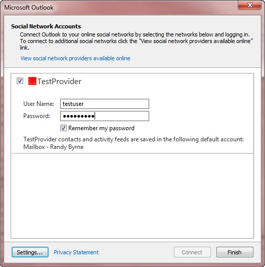

# XML 要素の機能Capabilities XML elements

このトピックの表は、**機能**XML の子要素を説明しをサポートしている領域ごとにグループ化します。The tables in this topic describe child elements of the **capabilities** XML and are grouped by the areas they support. **機能**の各要素の既定値は、 **false を指定**します。The default value of each **capabilities** element is **false**. **機能**、 [ISocialProvider::GetCapabilities](isocialprovider-getcapabilities.md)メソッドによって返される XML 要素を指定しない場合は、要素の値は**false**です。If the element is not specified in the **capabilities** XML returned by the [ISocialProvider::GetCapabilities](isocialprovider-getcapabilities.md) method, the value of the element is equal to **false**.
  
XML の**機能**の概要説明、[機能のための XML](xml-for-capabilities.md)を参照してください。For an overview description of **capabilities** XML, see [XML for Capabilities](xml-for-capabilities.md). XML の**機能**の使用例は、[機能の XML の例](capabilities-xml-example.md)を参照してください。For an example of **capabilities** XML, see [Capabilities XML Example](capabilities-xml-example.md). のどの要素には、必須またはオプションを含む、Microsoft Outlook ・ ソーシャル コネクタ (OSC) プロバイダーの XML スキーマの完全な定義は、 [Outlook ソーシャル コネクタ プロバイダーの XML スキーマ](outlook-social-connector-provider-xml-schema.md)を参照してください。For a complete definition of the Microsoft Outlook Social Connector (OSC) provider XML schema, including which elements are required or optional, see [Outlook Social Connector Provider XML Schema](outlook-social-connector-provider-xml-schema.md).
  
## 友人をサポートするための機能Capabilities for supporting friends

次の表は、同期の友人の友人以外の任意のフォームに適用する要素を示しています。The following table shows elements that apply to any form of synchronization of friends or non-friends.
  
|**要素****Element**|**説明****Description**|
|:-----|:-----|
|**doNotFollowPerson****doNotFollowPerson**   |[ISocialSession::UnFollowPerson](isocialsession-unfollowperson.md)メソッドの呼び出しをプロバイダーがサポートしているかどうかを示します。Indicates whether the provider supports the [ISocialSession::UnFollowPerson](isocialsession-unfollowperson.md) method call.    **followPerson**と**doNotFollowPerson**は、OSC プロバイダーのそれぞれ独立した機能です。**followPerson** and **doNotFollowPerson** are independent features of an OSC provider. OSC プロバイダーは、(設定**followPerson**を**true**に) 友達とユーザーを追加することや、ソーシャル ネットワーク アカウント (設定**doNotFollowPerson**を**true**に) に友人としてユーザーを削除することの機能を示すことができます。An OSC provider can indicate the capability of being able to add a person as a friend (setting **followPerson** to **true**) or being able to remove a person as a friend on a social network account (setting **doNotFollowPerson** to **true**). 一般に、理解することがわけのフォローを停止することです。In general, being able to follow does not imply being able to stop following. **followPerson**は、機能、および、ソーシャル ネットワーク アカウントの特定のユーザーまたはすべての人は、次の動作として解釈されるものとでは。**followPerson** is a capability, and it is not to be misinterpreted as an action to follow a specific person or every person on the social network account. **followPerson**が**true**では、 **doNotFollowPerson**が**false の場合**は意味しません。**followPerson** being **true** does not imply **doNotFollowPerson** is **false**.    |
|**followPerson****followPerson**   |[ISocialSession::FollowPerson](isocialsession-followperson.md)メソッドの呼び出しをプロバイダーがサポートしているかどうかを示します。Indicates whether the provider supports the [ISocialSession::FollowPerson](isocialsession-followperson.md) method call. OSC では、 **cacheFriends**がの場合**は true** (友人のキャッシュの同期) **followPerson**がチェックされ、 **dynamicContactsLookup**が**true** (オン ・ デマンドの友人と友人ではない)、同期または両方の**cacheFriends** **dynamicContactsLookup**が true の場合 (ハイブリッドの同期の友人と友人ではない)。The OSC checks **followPerson** if **cacheFriends** is **true** (cached synchronization of friends), **dynamicContactsLookup** is **true** (on-demand synchronization of friends and non-friends), or both **cacheFriends** and **dynamicContactsLookup** are true (hybrid synchronization of friends and non-friends). プロバイダーでは、 **true**として**followPerson**を設定、する場合、OSC バッジが表示されますネットワーク人物情報ウィンドウで、ユーザーがフォローして可能にする方のため、**の\<チーム\>** 人の**追加 (+)** メニューのコマンドウィンドウです。If the provider sets **followPerson** as **true**, the OSC displays a network badge in the People Pane for people that the user is following, and enables the **on \<NetworkName\>** command on the **Add (+)** menu in the People Pane. ネットワークのバッジが表示されていない場合は、プロバイダーでは、 **followPerson**が**false**に設定と**の\<ネットワーク名リソース\>** コマンドが非表示にします。If the provider sets **followPerson** as **false**, the network badge is not displayed, and the **on \<NetworkName\>** command is hidden.    |
|**getFriends****getFriends**   |プロバイダーが[ISocialPerson::GetFriendsAndColleagues](isocialperson-getfriendsandcolleagues.md)または[ISocialSession2::GetPeopleDetails](isocialsession2-getpeopledetails.md)メソッドの呼び出しをサポートしているかどうかを示します。Indicates whether the provider supports the [ISocialPerson::GetFriendsAndColleagues](isocialperson-getfriendsandcolleagues.md) or [ISocialSession2::GetPeopleDetails](isocialsession2-getpeopledetails.md) method call. プロバイダーでは、 **true**として**getFriends**を設定、OSC はソーシャル ネットワークの友人を保存する Outlook 連絡先アイテム、およびメモリができるかどうかを判断するのには**cacheFriends**または**dynamicContactsLookup**の値を使用します。If the provider sets **getFriends** as **true**, the OSC uses the value of **cacheFriends** or **dynamicContactsLookup** to determine whether the social network allows storing friends as Outlook contact items or in memory. ソーシャル ネットワークは友人と**ISocialPerson::GetFriendsAndColleagues**および**ISocialSession2::GetPeopleDetails**のメソッドをサポートしていませんし、OSC の値を無視する場合は、プロバイダーでは、 **getFriends**が**false**に設定、**cacheFriends**と**dynamicContactsLookup**。If the provider sets **getFriends** as **false**, the social network does not support friends and the **ISocialPerson::GetFriendsAndColleagues** and **ISocialSession2::GetPeopleDetails** methods, and the OSC ignores the values of **cacheFriends** and **dynamicContactsLookup**.    |
   
次の要素は、友人のキャッシュの同期や友人と友人ではないのハイブリッド同期にのみ適用されます。The following elements apply only to cached synchronization of friends or hybrid synchronization of friends and non-friends. 友人の同期の詳細については、[同期の友人との活動](synchronizing-friends-and-activities.md)を参照してください。For more information about synchronizing friends, see [Synchronizing Friends and Activities](synchronizing-friends-and-activities.md).
  
|**要素****Element**|**説明****Description**|
|:-----|:-----|
|**cacheFriends****cacheFriends**   |OSC プロバイダーによって、Outlook 連絡先アイテムとして友人を保存することができるかどうかを示します。Indicates whether the OSC provider allows storing friends as Outlook contact items. OSC は、 **getFriends**が**true**の場合にのみ、 **cacheFriends**をチェックします。The OSC checks **cacheFriends** only if **getFriends** is **true**. プロバイダーでは、 **true**として**cacheFriends**を設定、OSC は友人をキャッシュするには、同期し、友人の連絡先のユーザーの既定のストアに特定のネットワークの連絡先フォルダーを作成します。If the provider sets **cacheFriends** as **true**, the OSC synchronizes friends by caching, and creates a network-specific contacts folder in the user's default store for friend contacts. 特定のネットワークの連絡先フォルダーの名前は、 [ISocialProvider::SocialNetworkName](isocialprovider-socialnetworkname.md)プロパティの値です。The name of the network-specific contacts folder is the value of the [ISocialProvider::SocialNetworkName](isocialprovider-socialnetworkname.md) property. プロバイダーでは、 **cacheFriends**が**false**に設定、OSC では、友人を保存するのには友人の連絡先の特定のネットワークの連絡先フォルダーは作成されません。If the provider sets **cacheFriends** as **false**, the OSC does not create a network-specific contacts folder for friend contacts to store friends.    |
|**contactSyncRestartInterval****contactSyncRestartInterval**   |同期エラーが発生した場合は、ソーシャル ネットワークからの友人の情報を同期する間隔を分単位では、再試行の間隔を決定します。Determines the retry interval, in minutes, between attempts to synchronize friends' information from the social network, if a synchronization error occurs. OSC プロバイダーは、キャッシュの同期をサポートしているか、友人をソーシャル ネットワークに固有のハイブリッド同期連絡先フォルダーである場合にのみ、OSC がこの要素に使用 (されます**cacheFriends**が**true**になる)。The OSC uses this element only if the OSC provider supports cached synchronization or hybrid synchronization of friends to a social network-specific contacts folder (**cacheFriends** is **true**).    によって既定値がオーバーライドされない限り、既定の再試行間隔は、30 分、`ContactSyncRestartInterval`の下にキー `HKEY_CURRENT_USER\Software\Microsoft\Office\Outlook\SocialConnector`。The default retry interval is 30 minutes, unless the default is overridden by the  `ContactSyncRestartInterval` key under  `HKEY_CURRENT_USER\Software\Microsoft\Office\Outlook\SocialConnector`. プロバイダーは、 **contactSyncRestartInterval**を設定、プロバイダーの値は 30 分間またはレジストリ キーの値の既定の再試行間隔が上書きされます。If the provider sets **contactSyncRestartInterval**, the provider value will override the default retry interval of 30 minutes or the registry key value.    友人と友人ではない情報を必要に応じて同期についての詳細については、[同期の友人との活動](synchronizing-friends-and-activities.md)を参照してください。For more information about synchronizing friends and non-friends information on demand, see [Synchronizing Friends and Activities](synchronizing-friends-and-activities.md).    |
   
次の要素は、オンデマンド同期または以外の友人や友人のハイブリッド同期のみに適用されます。The following elements apply to only on-demand synchronization or hybrid synchronization of friends and non-friends.
  
|**要素****Element**|**説明****Description**|
|:-----|:-----|
|**dynamicContactsLookup****dynamicContactsLookup**   |OSC プロバイダーがオンデマンドの同期の友人と友人ではないの[ISocialSession2::GetPeopleDetails](isocialsession2-getpeopledetails.md)の呼び出しをサポートするかどうかを示します。Indicates whether the OSC provider supports the [ISocialSession2::GetPeopleDetails](isocialsession2-getpeopledetails.md) call for on-demand synchronization of friends and non-friends.    OSC は、 **getFriends**が**true**の場合にのみ、 **dynamicContactsLookup**をチェックします。**DynamicContactsLookup**の既定の設定は、 **false を指定**します。The OSC checks **dynamicContactsLookup** only if **getFriends** is **true**.The default setting for **dynamicContactsLookup** is **false**.    OSC プロバイダーでは、 **true**と**true**として**getFriends**として**dynamicContactsLookup**を指定した場合、人物情報ウィンドウが更新されるたびに、OSC は**ISocialSession2::GetPeopleDetails**を呼び出します。If the OSC provider specifies **dynamicContactsLookup** as **true** and **getFriends** as **true**, the OSC calls **ISocialSession2::GetPeopleDetails** every time the People Pane is refreshed. 人物情報ウィンドウが更新されるは、人物情報ウィンドウ、または Outlook エクスプ ローラー ウィンドウで別のアイテムに別のユーザーを選択するか、Outlook のインスペクター ウィンドウを開きます。The People Pane is refreshed when the user selects another user in the People Pane or another item in the Outlook explorer window, or opens an Outlook inspector window. 動的なメンバー参照では、ユーザーが常にユーザーの最新の画像と、人物情報ウィンドウにプロファイル情報が表示が、ソーシャル ネットワーク プロバイダーからの呼び出しの数が増加ことを保証します。Dynamic contacts lookup ensures that the user always sees the latest user pictures and profile information in the People Pane, but increases the number of calls from the provider to the social network.    プロバイダーでは、 **dynamicContactsLookup**が**false**に設定、OSC 人物情報ウィンドウを更新するのには**ISocialSession2::GetPeopleDetails**が呼び出されません。If the provider sets **dynamicContactsLookup** as **false**, the OSC does not call **ISocialSession2::GetPeopleDetails** to refresh the People Pane.    |
|**showOnDemandContactsWhenMinimized****showOnDemandContactsWhenMinimized**   |OSC 人物情報ウィンドウが最小化したとき以外の友人や友人たちは、オンデマンド同期を実行する必要があることを示します。Indicates if the OSC should carry out on-demand synchronization for friends and non-friends when the People Pane is minimized.    |
   
## 活動をサポートするための機能Capabilities for supporting activities

OSC プロバイダーでサポートされているアクティビティの同期の任意のフォームに、次の要素が適用されます。The following element applies to any form of synchronization of activities supported by the OSC provider.
  
|**要素****Element**|**説明****Description**|
|:-----|:-----|
|**getActivities****getActivities**   |プロバイダーが[ISocialSession2::GetActivitiesEx](isocialsession2-getactivitiesex.md)または[ISocialPerson::GetActivities](isocialperson-getactivities.md)メソッドの呼び出しをサポートしているかどうかを示します。Indicates whether the provider supports the [ISocialSession2::GetActivitiesEx](isocialsession2-getactivitiesex.md) or [ISocialPerson::GetActivities](isocialperson-getactivities.md) method calls. ソーシャル ネットワーク サイトでは、アクティビティを格納する Outlook の RSS アイテムとしてできるかどうかを判断するのには、OSC が**cacheActivities**または**dynamicActivitiesLookupEx**の値を使用して設定した場合、プロバイダー **getActivities** **は**、メモリ内のアクティビティです。If the provider sets **getActivities** as **true**, the OSC uses the value of **cacheActivities** or **dynamicActivitiesLookupEx** to determine whether the social network site allows storing activities as Outlook RSS items or as in-memory activities. **False**として**getActivities**を設定するプロバイダーに、ソーシャル ネットワークが活動し、 **ISocialSession2::GetActivitiesEx**と**ISocialPerson::GetActivities**メソッドの場合をサポートしていません、OSC が**の値を無視cacheActivities**と**dynamicActivitiesLookupEx**。If the provider sets **getActivities** as **false**, the social network does not support activities and the **ISocialSession2::GetActivitiesEx** and **ISocialPerson::GetActivities** methods, and the OSC ignores the values of **cacheActivities** and **dynamicActivitiesLookupEx**.    |
   
次の要素は、キャッシュの同期または活動のハイブリッド同期のみに適用されます。The following element applies to only cached synchronization or hybrid synchronization of activities.
  
|**要素****Element**|**説明****Description**|
|:-----|:-----|
|**cacheActivities****cacheActivities**   |プロバイダーは不要になったユーザーのストア内の非表示のフォルダーにそれらをキャッシュすることによって動作を同期するため、この要素の無視を OSC Outlook ソーシャル コネクタ 2013 で開始、します。Starting in Outlook Social Connector 2013, the OSC ignores this element since providers can no longer synchronize activities by caching them in a hidden folder in the user's store.    プロバイダーのサポート活動、プロバイダーがサポートする必要がある場合は、オン ・ デマンドの活動を同期します。If the provider supports activities, the provider must support synchronize activities on-demand. プロバイダーは、 **cacheActivities**を**false**に設定し、 **dynamicActivitesLookupEx**を**true**に設定します。The provider sets **cacheActivities** as **false** and sets **dynamicActivitesLookupEx** as **true**. OSC では、アクティビティ、オンデマンドでの同期をとり、メモリ内のアクティビティをキャッシュします。The OSC synchronizes activities on-demand, and caches activities in memory. 活動のメモリ キャッシュは、30 分間隔で更新されます。The activities memory cache is refreshed on a 30-minute interval.    |
   
次の要素は、オン ・ デマンドの同期または活動のハイブリッド同期のみに適用されます。The following elements apply to only on-demand synchronization or hybrid synchronization of activities.
  
|**要素****Element**|**説明****Description**|
|:-----|:-----|
|**dynamicActivitiesLookup****dynamicActivitiesLookup**   |OSC 1.1 では使用されなくなりました。Deprecated in OSC 1.1.    OSC を不要になったは OSC 1.1 以降では、 [ISocialSession::GetActivities](isocialsession-getactivities.md)を呼び出すし、 **dynamicActivitiesLookup**の値は無視されます。Starting in OSC 1.1, the OSC no longer calls [ISocialSession::GetActivities](isocialsession-getactivities.md) and ignores the value of **dynamicActivitiesLookup**. オン ・ デマンドでのアクティビティの参照をサポートするには、 **false を指定**し、 **getActivities**と**true** **dynamicActivitiesLookupEx**と、OSC に**ISocialSession2::GetActivitiesEx**を呼び出すと**cacheActivities**を設定します。To support on-demand activities lookup, set **cacheActivities** as **false** and **getActivities** and **dynamicActivitiesLookupEx** as **true**, and the OSC will call **ISocialSession2::GetActivitiesEx**.    |
|**dynamicActivitiesLookupEx****dynamicActivitiesLookupEx**   |OSC プロバイダーがオンデマンドの同期アクティビティのための**ISocialSession2::GetActivitiesEx**の呼び出しをサポートしているかどうかを示します。Indicates whether the OSC provider supports the **ISocialSession2::GetActivitiesEx** call for on-demand synchronization of activities.    OSC プロバイダーでは、オンデマンド アクティビティ同期をサポートする場合、 **getActivities**および**dynamicActivitiesLookupEx**として設定**true**および**false**として**cacheActivities**します。If the OSC provider supports on-demand activities synchronization, it sets **getActivities** and **dynamicActivitiesLookupEx** as **true**, and **cacheActivities** as **false**. OSC では、人物情報ウィンドウが更新されるたびに**ISocialSession2::GetActivitiesEx**をが呼び出されます。The OSC calls **ISocialSession2::GetActivitiesEx** every time the People Pane is refreshed. 人物情報ウィンドウは、Outlook エクスプ ローラー ウィンドウで選択した項目を変更するか、Outlook のインスペクター ウィンドウを開くときに更新されます。The People Pane is refreshed when the user changes the selected item in the Outlook explorer window or opens an Outlook inspector window. 参照の動的な活動により、ユーザーは、人物情報ウィンドウには、最新の活動を常に表示されますが、ソーシャル ネットワーク プロバイダーからの呼び出しの数が増加します。Dynamic activities lookup ensures that the user will always see the latest activities in the People Pane, but will increase the number of calls from the provider to the social network.    場合は、プロバイダーでは、 **dynamicActivitiesLookupEx**が**false**に設定、OSC では、人物情報ウィンドウに表示されている人は、 **ISocialSession2::GetActivitiesEx**は呼び出しません。If the provider sets **dynamicActivitiesLookupEx** as **false**, the OSC does not call **ISocialSession2::GetActivitiesEx** for people displayed in the People Pane.    |
|**showOnDemandActivitiesWhenMinimized****showOnDemandActivitiesWhenMinimized**   |かどうか、OSC を完了しておく活動のオン ・ デマンドの同期、人物情報ウィンドウが最小化されるときを示します。Indicates whether the OSC should carry out on-demand synchronization for activities when the People Pane is minimized.    |
   
## 友人、友人以外の場合、および活動のオン ・ デマンドまたはハイブリッドの同期をサポートするための一般的な機能Common capabilities for supporting on-demand or hybrid synchronization of friends, non-friends, and activities

|**要素****Element**|**説明****Description**|
|:-----|:-----|
|**実装しています。****hashFunction**   | OSC プロバイダーをサポートするハッシュ関数を指定します。Specifies the hash function that the OSC provider supports. OSC プロバイダーのソーシャル ネットワークや基幹業務アプリケーションに登録されていないユーザーの個人情報保護のため、 **ISocialSession2::GetPeopleDetails**と**ISocialSession2 にハッシュ化された e メール アドレスを渡されます。GetActivitiesEx**。To protect personally identifiable information of users who are not on the provider's social network or line-of-business application, the OSC passes hashed email addresses to **ISocialSession2::GetPeopleDetails** and **ISocialSession2::GetActivitiesEx**.     プロバイダーが使用可能な値のいずれかに**実装しています。** を設定する必要があります**dynamicContactsLookup**が**true**に設定、または**dynamicActivitiesLookupEx**が**true**に設定されて、: **SHA1**、 **MD5**、または**CRC32MD5**。If **dynamicContactsLookup** is set to **true** or **dynamicActivitiesLookupEx** is set to **true**, the provider must set **hashFunction** to one of the allowed values: **SHA1**, **MD5**, or **CRC32MD5**. **実装しています。** が存在しないか不適切な値を指定する場合、OSC はエラーを返します。If **hashFunction** is missing or specifies an incorrect value, the OSC returns an error.    **SHA1**は、インターネット技術標準化委員会 (IETF) 米国のセキュリティで保護されたハッシュ アルゴリズム[[RFC3174]](http://www.rfc-editor.org/rfc/rfc3174.txt)で定義されている 1 です。**SHA1** is Internet Engineering Task Force (IETF) US Secure Hash Algorithm 1 defined by [[RFC3174]](http://www.rfc-editor.org/rfc/rfc3174.txt). 電子メール アドレス melissa@contoso.com の**SHA1**ハッシュ値は、たとえば、 `bb81577b567262a21a4df5f6e335c1250acd7b50`。For example, the **SHA1** hashed value of email address melissa@contoso.com is  `bb81577b567262a21a4df5f6e335c1250acd7b50`.    **MD5**は、 [[RFC1321]](http://www.rfc-editor.org/rfc/rfc1321.txt)で定義されている、インターネット技術標準化委員会 (IETF) MD5 メッセージ ダイジェスト アルゴリズムです。**MD5** is Internet Engineering Task Force (IETF) MD5 Message-Digest Algorithm defined by [[RFC1321]](http://www.rfc-editor.org/rfc/rfc1321.txt). 電子メール アドレス melissa@contoso.com の**MD5**ハッシュ値は、たとえば、 `c8c39e61ca1662477b39b83d7b0a0615`。For example, the **MD5** hashed value of email address melissa@contoso.com is  `c8c39e61ca1662477b39b83d7b0a0615`.    **CRC32MD5**は**CRC32**の組み合わせであり、 **MD5**は次のように定義されています。**CRC32MD5** is a combination of **CRC32** and **MD5** defined as follows:     先頭および末尾の空白文字とすべての文字を小文字に変換を削除することによって電子メール アドレスを正規化します。Normalize the email address by removing leading and trailing whitespace and converting all characters to lowercase.     正規化された電子メール アドレスの**CRC32**の値を計算し、この値の 10 進の整数表現を使用します。Compute the **CRC32** value for the normalized email address and use the decimal integer representation of this value. 実装では、符号付き整数が返された場合は、符号なし整数の符号付き整数を変換する必要があります。If your implementation returns signed integers, you must convert the signed integer to an unsigned integer.     正規化された電子メール アドレスの**MD5**値を計算し、この値を使用して小文字の A F から) の 16 進表現を使用します。Compute the **MD5** value for the normalized email address and use the hex representation of this value (using lowercase for A through F).     アンダー スコアでこれら 2 つの値を結合します。Combine these two values with an underscore.     電子メール アドレス melissa@contoso.com の**CRC32MD5**のハッシュ値は、たとえば、 `2149665315_c8c39e61ca1662477b39b83d7b0a0615`。For example, the **CRC32MD5** hashed value of email address melissa@contoso.com is  `2149665315_c8c39e61ca1662477b39b83d7b0a0615`.    |
   
## 認証およびアカウントの構成をサポートするための機能Capabilities for supporting authentication and account configuration

|**要素****Element**|**説明****Description**|
|:-----|:-----|
|**allowChangesToAutoConfigure****allowChangesToAutoConfigure**   |ソーシャル ネットワークにログオンする別の URL を提供するなど、自動構成の設定を変更するユーザーができるかどうかを示します。Indicates whether the social network allows the user to change auto-configuration settings, such as providing a different URL to log on.    |
|**createAccountUrl****createAccountUrl**   |プロバイダーでは、**ここをクリックすると、アカウントを作成する****アカウントの構成**] ダイアログ ボックスをしてユーザーがクリックしたときに**false**として**hideHyperlinks**を設定、 **createAccountUrl**で指定された URL は既定のブラウザーで開きます。If the provider sets **hideHyperlinks** as **false**, when the user clicks **Click here to create an account** in the **Account configuration** dialog box, the URL specified by **createAccountUrl** opens in the default browser.    |
|**displayUrl****displayUrl**   |アカウントの構成] ダイアログ ボックスで、OSC がソーシャル ネットワークの**URL アドレス**] ボックスを表示する必要があるかどうかを示します。Indicates whether the OSC should display the **URL Address** text box for the social network in the account configuration dialog box.    |
|**forgotPasswordUrl****forgotPasswordUrl**   |プロバイダーは、ユーザーがクリックしたときに**false**として**hideHyperlinks**を設定する場合 **、パスワードを忘れた?** **アカウントの構成**] ダイアログ ボックスで、 **forgotPasswordUrl**によって指定された URL が既定のブラウザーで開きます。If the provider sets **hideHyperlinks** as **false**, when the user clicks **Forgot your password?** in the **Account configuration** dialog box, the URL specified by **forgotPasswordUrl** opens in the default browser.    |
|**hideHyperlinks****hideHyperlinks**   |OSC の**ここをクリックしてアカウントを作成**するして必要があります非表示かどうかを示すと**パスワードを忘れた場合ですか?** アカウントの構成] ダイアログ ボックス内のハイパーリンク。Indicates whether the OSC should hide the **Click here to create an account** and **Forgot your password?** hyperlinks in the account configuration dialog box.    OSC 1.0 は、この設定を無視し、ハイパーリンクが常に非表示。OSC 1.0 ignores this setting, and the hyperlinks are always hidden. OSC 1.1 は、この設定の値を監視します。OSC 1.1 observes the value of this setting.    |
|**hideRememberMyPassword****hideRememberMyPassword**   |OSC がアカウントの構成] ダイアログ ボックスで、 **[パスワードの保存**] チェック ボックスを非表示にする必要があるかどうかを示します。Indicates whether the OSC should hide the **Remember my password** check box in the account configuration dialog box.    場合は、プロバイダーでは、 **hideRememberMyPassword**を設定**は**、 **[パスワード**] ボックスがチェックされていないと、パスワードは保存されません、OSC が動作します。If the provider sets **hideRememberMyPassword** as **true**, the OSC will act as if the **Remember my password** box is unchecked and will not save the password.    場合は、プロバイダーでは、 **hideRememberMyPassword**が**false**に設定、OSC は、アカウントの構成] ダイアログ ボックスで、 **[パスワードの保存**] チェック ボックスを表示します。If the provider sets **hideRememberMyPassword** as **false**, the OSC will display the **Remember my password** check box in the account configuration dialog box.    |
|**supportsAutoConfigure****supportsAutoConfigure**   |OSC が自動構成を試みるし、ユーザーのソーシャル ネットワークにログオンする**ISocialProvider**インターフェイスで、 **GetAutoConfiguredSession**関数を呼び出す必要があるかどうかを示します。Indicates whether the OSC should call the **GetAutoConfiguredSession** function on the **ISocialProvider** interface to attempt automatic configuration and log on to the social network for the user.    |
|**useLogonCached****useLogonCached**   |OSC プロバイダーがキャッシュされた資格情報でログオンするのには[ISocialSession2::LogonCached](isocialsession2-logoncached.md)の呼び出しをサポートしているかどうかを示します。Indicates whether the OSC provider supports the [ISocialSession2::LogonCached](isocialsession2-logoncached.md) call to log on with cached credentials.    場合は、プロバイダーでは、 **true**として**useLogonCached**が設定を OSC **useLogonWebAuth**の設定は無視され、OSC が認証のために**ISocialSession2::LogonCached**を呼び出します。If the provider sets **useLogonCached** as **true**, the OSC ignores the setting for **useLogonWebAuth** and the OSC calls **ISocialSession2::LogonCached** for authentication.    場合は、プロバイダーでは、 **dynamicActivitiesLookupEx**が**false**に設定、OSC では、認証には、 **ISocialSession2::LogonCached**は呼び出しません。If the provider sets **dynamicActivitiesLookupEx** as **false**, the OSC does not call **ISocialSession2::LogonCached** for authentication.    |
|**useLogonWebAuth****useLogonWebAuth**   |OSC でフォーム ベースの認証と、 [ISocialSession::LogonWeb](isocialsession-logonweb.md)メソッドを使用する必要があるかどうかを示します。Indicates whether the OSC should use forms-based authentication and the [ISocialSession::LogonWeb](isocialsession-logonweb.md) method. プロバイダーでは、 **useLogonWebAuth**が**false**に設定、OSC は基本認証を使用し、 [ISocialSession::Logon](isocialsession-logon.md)メソッドを呼び出します。If the provider sets **useLogonWebAuth** as **false**, the OSC uses basic authentication and calls the [ISocialSession::Logon](isocialsession-logon.md) method. プロバイダーでは、 **useLogonWebAuth**を設定**は**場合、OSC はフォーム ベース認証を使用し、 **ISocialSession::LogonWeb**を呼び出します。If the provider sets **useLogonWebAuth** as **true**, the OSC uses forms-based authentication and calls **ISocialSession::LogonWeb**.    |
   
**機能**によって XML プロバイダーによって返される、メソッドでは、 **ISocialProvider::GetCapabilities**アカウントの構成] ダイアログ ボックスが変化します。Depending on the **capabilities** XML returned by the provider in the **ISocialProvider::GetCapabilities** method, the account configuration dialog box changes. たとえば、図 1 は、TestProvider などのアカウントの構成] ダイアログ ボックスを示しています。For example, Figure 1 shows the account configuration dialog box for a TestProvider example. 
  
**図 1 です。アカウントの構成] ダイアログ ボックスで、TestProvider の使用例****Figure 1. TestProvider example in the account configuration dialog box**

  
## 関連項目See also

- [機能のための XMLXML for Capabilities](xml-for-capabilities.md)

