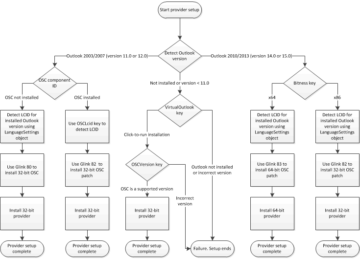

# <a name="installation-checklist"></a><span data-ttu-id="f8363-103">インストール チェックリスト</span><span class="sxs-lookup"><span data-stu-id="f8363-103">Installation checklist</span></span>

<span data-ttu-id="f8363-104">Outlook ソーシャル コネクタ (OSC) プロバイダーを正常にインストールするための前提条件について説明し、インストールが正常に動作する、プロバイダーのインストーラーを完了しなければならないことを確認します。</span><span class="sxs-lookup"><span data-stu-id="f8363-104">This topic describes prerequisites for successfully installing an Outlook Social Connector (OSC) provider, and the installation checks that your provider installer should complete to work correctly.</span></span>
  
## <a name="installation-overview"></a><span data-ttu-id="f8363-105">インストールの概要</span><span class="sxs-lookup"><span data-stu-id="f8363-105">Installation overview</span></span>

<span data-ttu-id="f8363-106">ユーザーは、サポートのバージョンの Outlook が存在し、OSC がインストールされ、クライアント コンピューターで有効になっている場合にのみ、OSC プロバイダーをインストールする必要があります。</span><span class="sxs-lookup"><span data-stu-id="f8363-106">Users should install OSC providers only if a supporting version of Outlook is present and the OSC is installed and enabled on the client computer.</span></span> <span data-ttu-id="f8363-107">サポートのバージョンの Outlook は、Office Outlook 2003、Office Outlook 2007、Outlook 2010、Outlook 2013 の (またはをインストール クライアント コンピューターで、Outlook 2010、Outlook 2013、クライアント コンピューター上でクイック実行で提供)。</span><span class="sxs-lookup"><span data-stu-id="f8363-107">Supporting versions of Outlook are Office Outlook 2003, Office Outlook 2007, Outlook 2010 and Outlook 2013 (installed on the client computer or, in the case of Outlook 2010 and Outlook 2013, delivered by Click-to-Run on the client computer).</span></span> <span data-ttu-id="f8363-108">インストールの成功を確実には、プロバイダー インストーラーする必要があります、次の操作。</span><span class="sxs-lookup"><span data-stu-id="f8363-108">To ensure a successful installation, your provider installer should do the following:</span></span>
  
- <span data-ttu-id="f8363-109">Outlook のサポートされているバージョンが存在するかどうかを確認します。</span><span class="sxs-lookup"><span data-stu-id="f8363-109">Verify whether a supported version of Outlook is present.</span></span>
    
- <span data-ttu-id="f8363-110">OSC がインストールされているかどうかを確認します。</span><span class="sxs-lookup"><span data-stu-id="f8363-110">Verify whether the OSC is installed.</span></span>
    
> [!NOTE]
> <span data-ttu-id="f8363-111">クイック実行は、Outlook 2010 (32 ビット) または Outlook 2013 (32 ビット) を実行できる仮想環境です。</span><span class="sxs-lookup"><span data-stu-id="f8363-111">Click-to-Run is a virtual environment in which Outlook 2010 (32-bit) or Outlook 2013 (32-bit) can run.</span></span> <span data-ttu-id="f8363-112">Outlook 2013 では、Windows レジストリの HKEY_LOCAL_MACHINE\Software\Microsoft\Office\15.0\Common\InstallRoot\Virtual\VirtualOutlook の VirtualOutlook キーが存在するかを確認します。</span><span class="sxs-lookup"><span data-stu-id="f8363-112">For Outlook 2013, verify if the VirtualOutlook key exists in HKEY_LOCAL_MACHINE\Software\Microsoft\Office\15.0\Common\InstallRoot\Virtual\VirtualOutlook of the Windows registry.</span></span> <span data-ttu-id="f8363-113">クライアント コンピューター上のクイック実行製品として Outlook を提供することに関する詳細については、 [Outlook がクイック実行の製品としてのコンピューターで利用可能である場合に確認する方法](http://blogs.msdn.com/b/officedevdocs/archive/2010/03/09/how-to-verify-if-outlook-is-available-on-a-computer-as-a-click-to-run-product.aspx)を参照してください。</span><span class="sxs-lookup"><span data-stu-id="f8363-113">For more information about delivering Outlook as a Click-to-Run product on a client computer, see [How to Verify if Outlook is Available on a Computer as a Click-to-Run Product](http://blogs.msdn.com/b/officedevdocs/archive/2010/03/09/how-to-verify-if-outlook-is-available-on-a-computer-as-a-click-to-run-product.aspx).</span></span> 
  
<span data-ttu-id="f8363-114">ユーザーは、ただし、プロバイダーをインストールする前に、OSC が有効になっていることを確認するのにはあります。</span><span class="sxs-lookup"><span data-stu-id="f8363-114">The user, however, has to ensure that the OSC is enabled before installing the provider.</span></span>
  
<span data-ttu-id="f8363-115">OSC プロバイダーを含む第三者は、OSC を再配布できません。</span><span class="sxs-lookup"><span data-stu-id="f8363-115">Third parties, including OSC providers, cannot redistribute the OSC.</span></span> <span data-ttu-id="f8363-116">ただし、OSC がインストールされていない場合、プロバイダー インストーラーを使用して g の該当するリンク、OSC をクライアント コンピューターにインストールします。</span><span class="sxs-lookup"><span data-stu-id="f8363-116">However, if the OSC is not installed, the provider installer can use appropriate g-links to install the OSC on the client computer.</span></span> <span data-ttu-id="f8363-117">G ・ リンクでは、特別に作成された URL のhttp://g.live.com、OSC をダウンロードするには、対応する web ページにユーザーを転送します。</span><span class="sxs-lookup"><span data-stu-id="f8363-117">A g-link is a specially constructed URL on http://g.live.com that forwards a user to a corresponding webpage to download the OSC.</span></span> <span data-ttu-id="f8363-118">OSC の g ・ リンクが設定されてhttp://g.live.com/0CR _LCID_/ _Glink_、 _LCID_と_Glink_ 、ロケール、バージョン、およびクライアント コンピューター上 Outlook のビット数を指定します。</span><span class="sxs-lookup"><span data-stu-id="f8363-118">An OSC g-link is formatted as http://g.live.com/0CR _LCID_/ _Glink_, where  _LCID_ and  _Glink_ specify the locale, version, and bitness of Outlook on the client computer.</span></span> <span data-ttu-id="f8363-119">各 g リンクは、実行可能ファイルをポイントし、指定された_LCID_と_Glink_の値に固有します。</span><span class="sxs-lookup"><span data-stu-id="f8363-119">Each g-link points to an executable and is specific to the specified  _LCID_ and  _Glink_ values.</span></span> 
  
<span data-ttu-id="f8363-120">たとえば、Outlook 2003 の OSC または LCID の 1033 (英語版) の Outlook 2007 の最新バージョンをインストールするのには g ・ リンクはとおりです。</span><span class="sxs-lookup"><span data-stu-id="f8363-120">For example, the g-link to install the latest version of the OSC for Outlook 2003 or Outlook 2007 for the LCID 1033 (US English) is as follows:</span></span>
  
http://g.live.com/0CR1033/80
  
<span data-ttu-id="f8363-121">_Glink_さまざまなバージョンと、Outlook のビット数の値とサポートされているロケールの_LCID_値についての詳細は、7 の「次の[インストール チェックリスト](#olosc_InstallationOverview_InstallationChecklist)を参照してください。</span><span class="sxs-lookup"><span data-stu-id="f8363-121">For details about  _Glink_ values for different versions and bitness of Outlook, and  _LCID_ values for supported locales, see #7 in the section [Installation Checklist](#olosc_InstallationOverview_InstallationChecklist) below.</span></span> 

<span data-ttu-id="f8363-122"><a name="olosc_InstallationOverview_InstallationChecklist"> </a></span><span class="sxs-lookup"><span data-stu-id="f8363-122"></span></span>

## <a name="installation-checklist"></a><span data-ttu-id="f8363-123">インストール チェックリスト</span><span class="sxs-lookup"><span data-stu-id="f8363-123">Installation checklist</span></span>

<span data-ttu-id="f8363-124">プロバイダーのセットアップ パッケージは、プロバイダーが正常にインストールされることを確認するのには、図 1 に示すように、一連のインストールのチェックを実行する必要があります。</span><span class="sxs-lookup"><span data-stu-id="f8363-124">The provider setup package should perform a series of installation checks, as shown in Figure 1, to ensure that the provider installs successfully.</span></span>
  
<span data-ttu-id="f8363-125">**図 1 です。プロバイダーのインストール ロジック**</span><span class="sxs-lookup"><span data-stu-id="f8363-125">**Figure 1. Provider installation logic**</span></span>


  
<span data-ttu-id="f8363-127">次の手順では、図 1 に記載されているインストールの確認について説明します。</span><span class="sxs-lookup"><span data-stu-id="f8363-127">The following procedure describes the installation checks outlined in Figure 1.</span></span>
  
1. <span data-ttu-id="f8363-128">前提条件として Outlook がインストールされているかどうかを検出またはとインストールされている、または存在、Outlook のバージョンが、OSC をサポートしているかどうかを決定します。</span><span class="sxs-lookup"><span data-stu-id="f8363-128">As a prerequisite, detect whether Outlook is installed or present, and if installed or present, determine whether the version of Outlook supports the OSC.</span></span> <span data-ttu-id="f8363-129">インストールされている Outlook のバージョンの検出の詳細については、 [Outlook のバージョンを確認して](http://msdn.microsoft.com/library/672fc380-a29b-4e99-9211-949fd5065723%28Office.15%29.aspx)参照してください。</span><span class="sxs-lookup"><span data-stu-id="f8363-129">For more information about detecting the installed version of Outlook, see [Check the Version of Outlook](http://msdn.microsoft.com/library/672fc380-a29b-4e99-9211-949fd5065723%28Office.15%29.aspx).</span></span>
    
   - <span data-ttu-id="f8363-130">インストールされているバージョンの Outlook が Outlook 2003 より前の場合は、プロバイダーのインストール手順を完了できません。</span><span class="sxs-lookup"><span data-stu-id="f8363-130">If the installed version of Outlook is earlier than Outlook 2003, the provider installation procedure cannot complete.</span></span> <span data-ttu-id="f8363-131">OSC プロバイダーをインストールするには、Outlook と作業を進める前に OSC のサポートされているバージョンを入手するのにはユーザーに通知します。</span><span class="sxs-lookup"><span data-stu-id="f8363-131">Inform the user to obtain a supported version of Outlook and the OSC before proceeding to install the OSC provider.</span></span>
    
   - <span data-ttu-id="f8363-132">Outlook がインストールされていない場合は、手順 2 に進みます。</span><span class="sxs-lookup"><span data-stu-id="f8363-132">If Outlook is not installed, proceed to step 2.</span></span>
    
   - <span data-ttu-id="f8363-133">Outlook 2003 または Outlook 2007 がインストールされている場合は、手順 3 に進みます。</span><span class="sxs-lookup"><span data-stu-id="f8363-133">If Outlook 2003 or Outlook 2007 is installed, proceed to step 3.</span></span> 
    
   - <span data-ttu-id="f8363-134">Outlook 2010 または Outlook 2013 をインストールする場合は、手順 4 に進みます。</span><span class="sxs-lookup"><span data-stu-id="f8363-134">If Outlook 2010 or Outlook 2013 is installed, proceed to step 4.</span></span>
    
2. <span data-ttu-id="f8363-135">**クライアント コンピューターに Outlook がインストールされていない場合は、この手順に進みます。**</span><span class="sxs-lookup"><span data-stu-id="f8363-135">**Proceed with this step if Outlook is not installed on the client computer:**</span></span>
    
   1. <span data-ttu-id="f8363-136">OSC が Outlook 2010 または Outlook 2013 のクイック実行のインストールの既定のコンポーネントとしてインストールされているかどうかを確認してください。</span><span class="sxs-lookup"><span data-stu-id="f8363-136">Check whether the OSC is installed as a default component of a Click-to-Run installation of Outlook 2010 or Outlook 2013.</span></span> <span data-ttu-id="f8363-137">調べて、`VirtualOutlook`キーを Windows レジストリに次の場所にします。</span><span class="sxs-lookup"><span data-stu-id="f8363-137">Examine the  `VirtualOutlook` key in the following location in the Windows registry:</span></span> 
      
      - <span data-ttu-id="f8363-138">Outlook 2010 では、`HKEY_LOCAL_MACHINE\Software\Microsoft\Office\14.0\Common\InstallRoot\Virtual\VirtualOutlook`</span><span class="sxs-lookup"><span data-stu-id="f8363-138">For Outlook 2010,  `HKEY_LOCAL_MACHINE\Software\Microsoft\Office\14.0\Common\InstallRoot\Virtual\VirtualOutlook`</span></span>
      
      - <span data-ttu-id="f8363-139">Outlook ソーシャル コネクタ 2013 年の`HKEY_LOCAL_MACHINE\Software\Microsoft\Office\15.0\Common\InstallRoot\Virtual\VirtualOutlook`</span><span class="sxs-lookup"><span data-stu-id="f8363-139">For Outlook Social Connector 2013,  `HKEY_LOCAL_MACHINE\Software\Microsoft\Office\15.0\Common\InstallRoot\Virtual\VirtualOutlook`</span></span>
      
      <span data-ttu-id="f8363-140">`VirtualOutlook`キーは、REG_SZ 値を次のようにロケール タグが含まれています"en-私たち"、インストールされている製品のです。</span><span class="sxs-lookup"><span data-stu-id="f8363-140">The  `VirtualOutlook` key is a REG_SZ value that contains the locale tag, such as "en-us", of the installed product.</span></span> 
      
   2. <span data-ttu-id="f8363-141">場合、`VirtualOutlook`キーが存在しない、Outlook は、クライアント コンピューター上に存在しない、およびプロバイダーのインストール手順を完了できません。</span><span class="sxs-lookup"><span data-stu-id="f8363-141">If the  `VirtualOutlook` key does not exist, Outlook is not present on the client computer, and the provider installation procedure cannot complete.</span></span> <span data-ttu-id="f8363-142">OSC プロバイダーをインストールするには、Outlook と作業を進める前に OSC のサポートされているバージョンを入手するのにはユーザーに通知します。</span><span class="sxs-lookup"><span data-stu-id="f8363-142">Inform the user to obtain a supported version of Outlook and the OSC before proceeding to install the OSC provider.</span></span> 
      
   3. <span data-ttu-id="f8363-143">場合、`VirtualOutlook`キーが存在して、クライアント コンピューターに Outlook がクイック実行で配信されました。</span><span class="sxs-lookup"><span data-stu-id="f8363-143">If the  `VirtualOutlook` key does exist, Outlook was delivered by Click-to-Run on the client computer.</span></span> <span data-ttu-id="f8363-144">OSC のタイプ ライブラリのインストールされているバージョンを調べることによってチェックに進んで、`OSCVersion`キーを Windows レジストリに次の場所。</span><span class="sxs-lookup"><span data-stu-id="f8363-144">Proceed to check the installed version of the OSC type library by examining the  `OSCVersion` key in the following location in the Windows registry:</span></span> 
      
      `HKEY_LOCAL_MACHINE\Software\Microsoft\Office\Outlook\SocialConnector\OSCVersion`
      
      <span data-ttu-id="f8363-145">値`OSCVersion`Socialprovider.dll (たとえば、「1.0」、「1.1」、または「15」) のタイプ ライブラリのバージョン番号を指定する文字列します。</span><span class="sxs-lookup"><span data-stu-id="f8363-145">The value of  `OSCVersion` is a string that specifies the type library version number of Socialprovider.dll (for example, "1.0", "1.1", or "15").</span></span> 
      
   4. <span data-ttu-id="f8363-146">場合`OSCVersion`「1.0」、「1.1」、または「15」には、OSC の適切なバージョンがインストールされています。</span><span class="sxs-lookup"><span data-stu-id="f8363-146">If  `OSCVersion` is "1.0", "1.1" or "15", an appropriate version of OSC is installed.</span></span> <span data-ttu-id="f8363-147">OSC の最新バージョンをインストールするために準備するのには現在の Outlook ユーザー インターフェイスのロケールを検索するのには 6 の手順に進みます。</span><span class="sxs-lookup"><span data-stu-id="f8363-147">Proceed to step 6 to find the current Outlook user interface locale to prepare for installing the latest version of the OSC.</span></span> 
      
   5. <span data-ttu-id="f8363-148">それ以外の場合、 `OSCVersion` 、予期される値が含まれていません。</span><span class="sxs-lookup"><span data-stu-id="f8363-148">Otherwise,  `OSCVersion` does not contain an expected value.</span></span> <span data-ttu-id="f8363-149">OSC の適切なバージョンをインストールするために準備するのには現在の Outlook ユーザー インターフェイスのロケールを検索するのには 6 の手順に進みます。</span><span class="sxs-lookup"><span data-stu-id="f8363-149">Proceed to step 6 to find the current Outlook user interface locale to prepare for installing an appropriate version of the OSC.</span></span> 
    
3. <span data-ttu-id="f8363-150">**Outlook 2003 または Outlook 2007 がクライアント コンピューターにインストールされている場合は、この手順に進みます。**</span><span class="sxs-lookup"><span data-stu-id="f8363-150">**Proceed with this step if Outlook 2003 or Outlook 2007 is installed on the client computer:**</span></span>
    
   1. <span data-ttu-id="f8363-151">インストーラーを記述することによって、OSC がインストールされているかどうかを確認して次の制限されたコンポーネントの ID の存在をテストするのにはカスタムの動作。</span><span class="sxs-lookup"><span data-stu-id="f8363-151">Verify whether the OSC is installed by writing an installer custom action to test for the existence of the following qualified component ID:</span></span>
      
      `{A3B82DA3-8AD9-4935-AEA8-54B754459483}`
      
      <span data-ttu-id="f8363-152">制限されたコンポーネントの ID は、単一レベルの間接指定のポインターのようなメソッドを提供する GUID です。</span><span class="sxs-lookup"><span data-stu-id="f8363-152">The qualified component ID is a GUID that provides a method of single-level indirection, similar to a pointer.</span></span> <span data-ttu-id="f8363-153">Windows インストーラーの詳細については、 [Windows インストーラーのドキュメントへのロードマップ](http://msdn.microsoft.com/library/_msi_roadmap_to_windows_installer_documentation.aspx)を参照してください。</span><span class="sxs-lookup"><span data-stu-id="f8363-153">For more information about Windows Installer, see [Roadmap to Windows Installer Documentation](http://msdn.microsoft.com/library/_msi_roadmap_to_windows_installer_documentation.aspx).</span></span>
      
   2. <span data-ttu-id="f8363-154">修飾された、指定したコンポーネントが存在する場合は、OSC のバージョンがインストールされています。</span><span class="sxs-lookup"><span data-stu-id="f8363-154">If the specified qualified component exists, a version of the OSC is installed.</span></span> <span data-ttu-id="f8363-155">OSC の最新バージョンをインストールするために準備するのには現在の Outlook ユーザー インターフェイスのロケールを検索するのには 5 の手順に進みます。</span><span class="sxs-lookup"><span data-stu-id="f8363-155">Proceed to step 5 to find the current Outlook user interface locale to prepare for installing the latest version of the OSC.</span></span>
      
   3. <span data-ttu-id="f8363-156">それ以外の場合、OSC はインストールされていません。</span><span class="sxs-lookup"><span data-stu-id="f8363-156">Otherwise, the OSC is not installed.</span></span> <span data-ttu-id="f8363-157">OSC の適切なバージョンをインストールするために準備するのには現在の Outlook ユーザー インターフェイスのロケールを検索するのには 6 の手順に進みます。</span><span class="sxs-lookup"><span data-stu-id="f8363-157">Proceed to step 6 to find the current Outlook user interface locale to prepare for installing an appropriate version of the OSC.</span></span>
      
4. <span data-ttu-id="f8363-158">**Outlook 2010 または Outlook 2013 は、クライアント コンピューターにインストールされている場合は、この手順に進みます。**</span><span class="sxs-lookup"><span data-stu-id="f8363-158">**Proceed with this step if Outlook 2010 or Outlook 2013 is installed on the client computer:**</span></span>
    
   1. <span data-ttu-id="f8363-159">調べることによってインストールされているバージョンの Outlook のビット数を決定する、`Bitness`キーを Windows レジストリに次の場所にします。</span><span class="sxs-lookup"><span data-stu-id="f8363-159">Determine the bitness of the installed version of Outlook by examining the  `Bitness` key in the following location in the Windows registry:</span></span> 
      
      - <span data-ttu-id="f8363-160">Outlook 2010 では、を確認します。`HKEY_LOCAL_MACHINE\SOFTWARE\Microsoft\Office\14.0\Outlook`</span><span class="sxs-lookup"><span data-stu-id="f8363-160">For Outlook 2010, look at  `HKEY_LOCAL_MACHINE\SOFTWARE\Microsoft\Office\14.0\Outlook`</span></span>
      
      - <span data-ttu-id="f8363-161">Outlook 2013 では、を確認します。`HKEY_LOCAL_MACHINE\SOFTWARE\Microsoft\Office\15.0\Outlook`</span><span class="sxs-lookup"><span data-stu-id="f8363-161">For Outlook 2013, look at  `HKEY_LOCAL_MACHINE\SOFTWARE\Microsoft\Office\15.0\Outlook`</span></span>
      
      <span data-ttu-id="f8363-162">`Bitness` 32 ビット Outlook、または 64 ビットの Outlook 用には、「x64」キーは、"x86"です。</span><span class="sxs-lookup"><span data-stu-id="f8363-162">The  `Bitness` key is "x86" for 32-bit Outlook, or "x64" for 64-bit Outlook.</span></span> 
      
   2. <span data-ttu-id="f8363-163">プロバイダーは、マネージ プロバイダーでは、ターゲット プラットフォームを指定する**任意の CPU**としてプロバイダー コンポーネントをコンパイルした場合は、手順 6、OSC の最新バージョンをインストールするために準備するのには現在の Outlook ユーザー インターフェイスのロケールを検索するに進みます。</span><span class="sxs-lookup"><span data-stu-id="f8363-163">If your provider is a managed provider, and you compiled the provider component specifying the target platform as **Any CPU**, proceed with step 6 to find the current Outlook user interface locale to prepare for installing the latest version of the OSC.</span></span> <span data-ttu-id="f8363-164">プロバイダーは、OSC の 32 ビットと 64 ビットの両方のバージョンで動作します。</span><span class="sxs-lookup"><span data-stu-id="f8363-164">Your provider will work on both 32-bit and 64-bit versions of the OSC.</span></span>
      
   3. <span data-ttu-id="f8363-165">プロバイダーがネイティブな COM コンポーネントの場合は、インストールされているバージョンの Outlook のビット数を確認してください。</span><span class="sxs-lookup"><span data-stu-id="f8363-165">If your provider is a native COM component, examine the bitness of the installed version of Outlook:</span></span>
      
      - <span data-ttu-id="f8363-166">インストールされている Outlook のバージョンが 32 ビットの場合は、インストール手順は、適切な OSC がインストールされていることを確認した後 (手順 8) で 32 ビットのプロバイダーをインストールする必要があります。</span><span class="sxs-lookup"><span data-stu-id="f8363-166">If the installed version of Outlook is 32-bit, your installation procedure will have to install a 32-bit provider (in step 8), after ensuring that an appropriate OSC is installed.</span></span>
      
      - <span data-ttu-id="f8363-167">それ以外の場合、インストールされている Outlook のバージョンは、64 ビットのインストール手順は、適切な OSC がインストールされていることを確認した後 (手順 8) での 64 ビット プロバイダーをインストールする必要があります。</span><span class="sxs-lookup"><span data-stu-id="f8363-167">Otherwise, the installed version of Outlook is 64-bit, and your installation procedure will have to install a 64-bit provider (in step 8), after ensuring that an appropriate OSC is installed.</span></span> 
      
   4. <span data-ttu-id="f8363-168">OSC の適切なバージョンをインストールするために準備するのには現在の Outlook ユーザー インターフェイスのロケールを検索するのには 6 の手順に進みます。</span><span class="sxs-lookup"><span data-stu-id="f8363-168">Proceed with step 6 to find the current Outlook user interface locale to prepare for installing an appropriate version of the OSC.</span></span>
    
5. <span data-ttu-id="f8363-169">**の OSC は、クライアント コンピューターにインストールされている Outlook 2003 または Outlook 2007 がインストールされている場合に、この手順に進みます:** 調べることによって現在の Outlook ユーザー インターフェイスのロケールを確認して、`OSCLcid`キーを Windows レジストリに次の場所にします。</span><span class="sxs-lookup"><span data-stu-id="f8363-169">**Proceed with this step if Outlook 2003 or Outlook 2007 is installed, and the OSC is installed on the client computer:** Check the current Outlook user interface locale by examining the  `OSCLcid` key in the following location in the Windows registry:</span></span> 
    
   `HKEY_LOCAL_MACHINE\Software\Microsoft\Office\Outlook\SocialConnector\OSCLcid`
    
   <span data-ttu-id="f8363-170">`OSCLcid`キーは、現在の Outlook ユーザー インターフェイスのロケールを表す、インターネット技術標準化委員会 (IETF) のロケール タグ ( [[RFC4646]](http://www.ietf.org/rfc/rfc4646.txt)と[[RFC4647]](http://www.ietf.org/rfc/rfc4647.txt)で定義されている) を指定する DWORD 値です。</span><span class="sxs-lookup"><span data-stu-id="f8363-170">The  `OSCLcid` key is a DWORD value that specifies the Internet Engineering Task Force (IETF) locale tag (defined by [[RFC4646]](http://www.ietf.org/rfc/rfc4646.txt) and [[RFC4647]](http://www.ietf.org/rfc/rfc4647.txt)), that represents the current Outlook user interface locale.</span></span> <span data-ttu-id="f8363-171">クライアント コンピューターに最新の OSC をインストールするのには 7 の手順に進みます。</span><span class="sxs-lookup"><span data-stu-id="f8363-171">Proceed with step 7 to install the latest OSC on the client computer.</span></span>
    
6. <span data-ttu-id="f8363-172">**Outlook 2003 または Outlook 2007 がインストールされているか、または Outlook 2010 または Outlook 2013 ありますが、最新の OSC が必ずしもクライアント コンピューターにインストールされていない場合は、この手順に進みます。**</span><span class="sxs-lookup"><span data-stu-id="f8363-172">**Proceed with this step if Outlook 2003 or Outlook 2007 is installed, or Outlook 2010 or Outlook 2013 is present, but the latest OSC is not necessarily installed on the client computer:**</span></span>
    
   <span data-ttu-id="f8363-173">**LanguageSettings**オブジェクトを使用すると、Outlook のユーザー インターフェイスのロケールの LCID を決定します。</span><span class="sxs-lookup"><span data-stu-id="f8363-173">Use the **LanguageSettings** object to determine the LCID of the Outlook user interface locale.</span></span> <span data-ttu-id="f8363-174">次の Visual Basic スクリプト版 (VBScript) コード スニペットでは、Outlook のユーザー インターフェイスのロケールの LCID を取得する方法を示します。</span><span class="sxs-lookup"><span data-stu-id="f8363-174">The following Visual Basic Scripting Edition (VBScript) code snippet demonstrates how to obtain the LCID of the Outlook user interface locale.</span></span> 
    
   ```vb
    Function GetOutlookUI_LCID()
        ' Declare variables.
        Dim msoLanguageIDUI, olApp
        msoLanguageIDUI = 2
        Set olApp = CreateObject("Outlook.Application")
        ' Return Outlook UI LCID.
        GetOutlookUI_LCID = olApp.LanguageSettings.LanguageID(msoLanguageIDUI)
    End Function
   ```

7. <span data-ttu-id="f8363-175">**インストーラーがインストールされているバージョンの Outlook での LCID には、最新の OSC が必ずしもクライアント コンピューターにインストールされていない場合は、この手順に進みます。**</span><span class="sxs-lookup"><span data-stu-id="f8363-175">**Proceed with this step if the installer has the LCID of the installed version of Outlook, but the latest OSC is not necessarily installed on the client computer:**</span></span>
    
   <span data-ttu-id="f8363-176">インストール パッケージ内に g ・ リンクのチェーン、OSC の最新バージョンがクライアント コンピューターにインストールされていることを確認します。</span><span class="sxs-lookup"><span data-stu-id="f8363-176">Chain a g-link into your installation package to ensure that the latest version of the OSC is installed on the client computer.</span></span> <span data-ttu-id="f8363-177">G リンクの形式は次のとおりです。</span><span class="sxs-lookup"><span data-stu-id="f8363-177">The g-link format is as follows:</span></span>
    
   <span data-ttu-id="f8363-178">http://g.live.com/0CR_LCID_/  _Glink_</span><span class="sxs-lookup"><span data-stu-id="f8363-178">http://g.live.com/0CR _LCID_/ _Glink_</span></span>
    
   <span data-ttu-id="f8363-179">サポートされている_LCID_値は、次の表 1 およびサポートされている_Glink_値の表 2 を参照してください。</span><span class="sxs-lookup"><span data-stu-id="f8363-179">Refer to Table 1 below for the supported  _LCID_ values, and Table 2 for the supported  _Glink_ values.</span></span> <span data-ttu-id="f8363-180">たとえば、32 ビット Outlook ソーシャル コネクタ 2013 (英語版) の 32 ビットの OSC の最新バージョンをインストールするのには g ・ リンクはとおりです。</span><span class="sxs-lookup"><span data-stu-id="f8363-180">For example, the g-link to install the latest version of the 32-bit OSC for 32-bit Outlook Social Connector 2013 (US English) is as follows:</span></span> 
    
   http://g.live.com/0CR1033/82
    
8. <span data-ttu-id="f8363-181">プロバイダーをインストールします。</span><span class="sxs-lookup"><span data-stu-id="f8363-181">Install the provider.</span></span> <span data-ttu-id="f8363-182">プロバイダーのインストール手順は、Windows レジストリの適切な場所にプログラム id (ProgID) を登録する必要があります。</span><span class="sxs-lookup"><span data-stu-id="f8363-182">The provider installation procedure must register the programmatic identifier (ProgID) in the appropriate Windows registry location.</span></span> <span data-ttu-id="f8363-183">詳細については、[プロバイダーを登録する](registering-a-provider.md)を参照してください。</span><span class="sxs-lookup"><span data-stu-id="f8363-183">For more information, see [Registering a Provider](registering-a-provider.md).</span></span> <span data-ttu-id="f8363-184">また、インストールされているプロバイダーのビット数は、クライアント コンピューター上に存在する Outlook のバージョンのビットと同じことを確認してください。</span><span class="sxs-lookup"><span data-stu-id="f8363-184">Also, be sure that the bitness of the provider to be installed is the same as the bitness of the version of Outlook present on the client computer.</span></span> <span data-ttu-id="f8363-185">64 ビットの Outlook 2013 がインストールされている場合、32 ビット Outlook 2013 が存在する場合は、32 ビット プロバイダーと 64 ビット プロバイダーをたとえば、インストールします。</span><span class="sxs-lookup"><span data-stu-id="f8363-185">For example, install a 32-bit provider if 32-bit Outlook 2013 is present, and a 64-bit provider if 64-bit Outlook 2013 is installed.</span></span> <span data-ttu-id="f8363-186">Outlook 2003 または 2007 の場合は、プロバイダーの 32 ビット バージョンのみが適用されます。</span><span class="sxs-lookup"><span data-stu-id="f8363-186">For Outlook 2003 or 2007, only the 32-bit version of your provider applies.</span></span> 
    
<span data-ttu-id="f8363-187">**表 1: サポートされているロケールと、OSC の 16 進数に対応する LCID 値**</span><span class="sxs-lookup"><span data-stu-id="f8363-187">**Table 1: Supported locale and corresponding LCID values in hexadecimal for the OSC**</span></span>
  
|<span data-ttu-id="f8363-188">**Locale**</span><span class="sxs-lookup"><span data-stu-id="f8363-188">**Locale**</span></span>|<span data-ttu-id="f8363-189">**LCID**</span><span class="sxs-lookup"><span data-stu-id="f8363-189">**LCID**</span></span>|
|:-----|:-----|
|<span data-ttu-id="f8363-190">ar-sa</span><span class="sxs-lookup"><span data-stu-id="f8363-190">ar-sa</span></span>  <br/> |<span data-ttu-id="f8363-191">1025</span><span class="sxs-lookup"><span data-stu-id="f8363-191">1025</span></span>  <br/> |
|<span data-ttu-id="f8363-192">bg-bg</span><span class="sxs-lookup"><span data-stu-id="f8363-192">bg-bg</span></span>  <br/> |<span data-ttu-id="f8363-193">1026</span><span class="sxs-lookup"><span data-stu-id="f8363-193">1026</span></span>  <br/> |
|<span data-ttu-id="f8363-194">ca es</span><span class="sxs-lookup"><span data-stu-id="f8363-194">ca-es</span></span>  <br/> |<span data-ttu-id="f8363-195">1027</span><span class="sxs-lookup"><span data-stu-id="f8363-195">1027</span></span>  <br/> |
|<span data-ttu-id="f8363-196">cs-cz</span><span class="sxs-lookup"><span data-stu-id="f8363-196">cs-cz</span></span>  <br/> |<span data-ttu-id="f8363-197">1029</span><span class="sxs-lookup"><span data-stu-id="f8363-197">1029</span></span>  <br/> |
|<span data-ttu-id="f8363-198">da-dk</span><span class="sxs-lookup"><span data-stu-id="f8363-198">da-dk</span></span>  <br/> |<span data-ttu-id="f8363-199">1030</span><span class="sxs-lookup"><span data-stu-id="f8363-199">1030</span></span>  <br/> |
|<span data-ttu-id="f8363-200">de-de</span><span class="sxs-lookup"><span data-stu-id="f8363-200">de-de</span></span>  <br/> |<span data-ttu-id="f8363-201">1031</span><span class="sxs-lookup"><span data-stu-id="f8363-201">1031</span></span>  <br/> |
|<span data-ttu-id="f8363-202">el-gr</span><span class="sxs-lookup"><span data-stu-id="f8363-202">el-gr</span></span>  <br/> |<span data-ttu-id="f8363-203">1032</span><span class="sxs-lookup"><span data-stu-id="f8363-203">1032</span></span>  <br/> |
|<span data-ttu-id="f8363-204">en-us</span><span class="sxs-lookup"><span data-stu-id="f8363-204">en-us</span></span>  <br/> |<span data-ttu-id="f8363-205">1033</span><span class="sxs-lookup"><span data-stu-id="f8363-205">1033</span></span>  <br/> |
|<span data-ttu-id="f8363-206">es-es</span><span class="sxs-lookup"><span data-stu-id="f8363-206">es-es</span></span>  <br/> |<span data-ttu-id="f8363-207">3082</span><span class="sxs-lookup"><span data-stu-id="f8363-207">3082</span></span>  <br/> |
|<span data-ttu-id="f8363-208">et-ee</span><span class="sxs-lookup"><span data-stu-id="f8363-208">et-ee</span></span>  <br/> |<span data-ttu-id="f8363-209">1061</span><span class="sxs-lookup"><span data-stu-id="f8363-209">1061</span></span>  <br/> |
|<span data-ttu-id="f8363-210">eu es</span><span class="sxs-lookup"><span data-stu-id="f8363-210">eu-es</span></span>  <br/> |<span data-ttu-id="f8363-211">1069</span><span class="sxs-lookup"><span data-stu-id="f8363-211">1069</span></span>  <br/> |
|<span data-ttu-id="f8363-212">fi-fi</span><span class="sxs-lookup"><span data-stu-id="f8363-212">fi-fi</span></span>  <br/> |<span data-ttu-id="f8363-213">1035</span><span class="sxs-lookup"><span data-stu-id="f8363-213">1035</span></span>  <br/> |
|<span data-ttu-id="f8363-214">fr-fr</span><span class="sxs-lookup"><span data-stu-id="f8363-214">fr-fr</span></span>  <br/> |<span data-ttu-id="f8363-215">1036</span><span class="sxs-lookup"><span data-stu-id="f8363-215">1036</span></span>  <br/> |
|<span data-ttu-id="f8363-216">gl es</span><span class="sxs-lookup"><span data-stu-id="f8363-216">gl-es</span></span>  <br/> |<span data-ttu-id="f8363-217">1110</span><span class="sxs-lookup"><span data-stu-id="f8363-217">1110</span></span>  <br/> |
|<span data-ttu-id="f8363-218">he-il</span><span class="sxs-lookup"><span data-stu-id="f8363-218">he-il</span></span>  <br/> |<span data-ttu-id="f8363-219">1037</span><span class="sxs-lookup"><span data-stu-id="f8363-219">1037</span></span>  <br/> |
|<span data-ttu-id="f8363-220">hi-in</span><span class="sxs-lookup"><span data-stu-id="f8363-220">hi-in</span></span>  <br/> |<span data-ttu-id="f8363-221">1081</span><span class="sxs-lookup"><span data-stu-id="f8363-221">1081</span></span>  <br/> |
|<span data-ttu-id="f8363-222">hr-hr</span><span class="sxs-lookup"><span data-stu-id="f8363-222">hr-hr</span></span>  <br/> |<span data-ttu-id="f8363-223">1050</span><span class="sxs-lookup"><span data-stu-id="f8363-223">1050</span></span>  <br/> |
|<span data-ttu-id="f8363-224">hu-hu</span><span class="sxs-lookup"><span data-stu-id="f8363-224">hu-hu</span></span>  <br/> |<span data-ttu-id="f8363-225">1038</span><span class="sxs-lookup"><span data-stu-id="f8363-225">1038</span></span>  <br/> |
|<span data-ttu-id="f8363-226">it-it</span><span class="sxs-lookup"><span data-stu-id="f8363-226">it-it</span></span>  <br/> |<span data-ttu-id="f8363-227">1040</span><span class="sxs-lookup"><span data-stu-id="f8363-227">1040</span></span>  <br/> |
|<span data-ttu-id="f8363-228">ja-jp</span><span class="sxs-lookup"><span data-stu-id="f8363-228">ja-jp</span></span>  <br/> |<span data-ttu-id="f8363-229">1041</span><span class="sxs-lookup"><span data-stu-id="f8363-229">1041</span></span>  <br/> |
|<span data-ttu-id="f8363-230">kk-kz</span><span class="sxs-lookup"><span data-stu-id="f8363-230">kk-kz</span></span>  <br/> |<span data-ttu-id="f8363-231">1087</span><span class="sxs-lookup"><span data-stu-id="f8363-231">1087</span></span>  <br/> |
|<span data-ttu-id="f8363-232">ko-kr</span><span class="sxs-lookup"><span data-stu-id="f8363-232">ko-kr</span></span>  <br/> |<span data-ttu-id="f8363-233">1042</span><span class="sxs-lookup"><span data-stu-id="f8363-233">1042</span></span>  <br/> |
|<span data-ttu-id="f8363-234">lt-lt</span><span class="sxs-lookup"><span data-stu-id="f8363-234">lt-lt</span></span>  <br/> |<span data-ttu-id="f8363-235">1063</span><span class="sxs-lookup"><span data-stu-id="f8363-235">1063</span></span>  <br/> |
|<span data-ttu-id="f8363-236">lv-lv</span><span class="sxs-lookup"><span data-stu-id="f8363-236">lv-lv</span></span>  <br/> |<span data-ttu-id="f8363-237">1062</span><span class="sxs-lookup"><span data-stu-id="f8363-237">1062</span></span>  <br/> |
|<span data-ttu-id="f8363-238">nb-no</span><span class="sxs-lookup"><span data-stu-id="f8363-238">nb-no</span></span>  <br/> |<span data-ttu-id="f8363-239">1044</span><span class="sxs-lookup"><span data-stu-id="f8363-239">1044</span></span>  <br/> |
|<span data-ttu-id="f8363-240">nl-nl</span><span class="sxs-lookup"><span data-stu-id="f8363-240">nl-nl</span></span>  <br/> |<span data-ttu-id="f8363-241">1043</span><span class="sxs-lookup"><span data-stu-id="f8363-241">1043</span></span>  <br/> |
|<span data-ttu-id="f8363-242">pl-pl</span><span class="sxs-lookup"><span data-stu-id="f8363-242">pl-pl</span></span>  <br/> |<span data-ttu-id="f8363-243">1045</span><span class="sxs-lookup"><span data-stu-id="f8363-243">1045</span></span>  <br/> |
|<span data-ttu-id="f8363-244">pt-br</span><span class="sxs-lookup"><span data-stu-id="f8363-244">pt-br</span></span>  <br/> |<span data-ttu-id="f8363-245">1046</span><span class="sxs-lookup"><span data-stu-id="f8363-245">1046</span></span>  <br/> |
|<span data-ttu-id="f8363-246">pt-pt</span><span class="sxs-lookup"><span data-stu-id="f8363-246">pt-pt</span></span>  <br/> |<span data-ttu-id="f8363-247">2070</span><span class="sxs-lookup"><span data-stu-id="f8363-247">2070</span></span>  <br/> |
|<span data-ttu-id="f8363-248">ro-ro</span><span class="sxs-lookup"><span data-stu-id="f8363-248">ro-ro</span></span>  <br/> |<span data-ttu-id="f8363-249">1048</span><span class="sxs-lookup"><span data-stu-id="f8363-249">1048</span></span>  <br/> |
|<span data-ttu-id="f8363-250">ru-ru</span><span class="sxs-lookup"><span data-stu-id="f8363-250">ru-ru</span></span>  <br/> |<span data-ttu-id="f8363-251">1049</span><span class="sxs-lookup"><span data-stu-id="f8363-251">1049</span></span>  <br/> |
|<span data-ttu-id="f8363-252">sk-sk</span><span class="sxs-lookup"><span data-stu-id="f8363-252">sk-sk</span></span>  <br/> |<span data-ttu-id="f8363-253">1051</span><span class="sxs-lookup"><span data-stu-id="f8363-253">1051</span></span>  <br/> |
|<span data-ttu-id="f8363-254">sl-si</span><span class="sxs-lookup"><span data-stu-id="f8363-254">sl-si</span></span>  <br/> |<span data-ttu-id="f8363-255">1060</span><span class="sxs-lookup"><span data-stu-id="f8363-255">1060</span></span>  <br/> |
|<span data-ttu-id="f8363-256">sr-アゼルバイジャン-cs</span><span class="sxs-lookup"><span data-stu-id="f8363-256">sr-cyrl-cs</span></span>  <br/> |<span data-ttu-id="f8363-257">3098</span><span class="sxs-lookup"><span data-stu-id="f8363-257">3098</span></span>  <br/> |
|<span data-ttu-id="f8363-258">sr-latn-cs</span><span class="sxs-lookup"><span data-stu-id="f8363-258">sr-latn-cs</span></span>  <br/> |<span data-ttu-id="f8363-259">2074</span><span class="sxs-lookup"><span data-stu-id="f8363-259">2074</span></span>  <br/> |
|<span data-ttu-id="f8363-260">sv-se</span><span class="sxs-lookup"><span data-stu-id="f8363-260">sv-se</span></span>  <br/> |<span data-ttu-id="f8363-261">1053</span><span class="sxs-lookup"><span data-stu-id="f8363-261">1053</span></span>  <br/> |
|<span data-ttu-id="f8363-262">th-th</span><span class="sxs-lookup"><span data-stu-id="f8363-262">th-th</span></span>  <br/> |<span data-ttu-id="f8363-263">1054</span><span class="sxs-lookup"><span data-stu-id="f8363-263">1054</span></span>  <br/> |
|<span data-ttu-id="f8363-264">tr-tr</span><span class="sxs-lookup"><span data-stu-id="f8363-264">tr-tr</span></span>  <br/> |<span data-ttu-id="f8363-265">1055</span><span class="sxs-lookup"><span data-stu-id="f8363-265">1055</span></span>  <br/> |
|<span data-ttu-id="f8363-266">uk-ua</span><span class="sxs-lookup"><span data-stu-id="f8363-266">uk-ua</span></span>  <br/> |<span data-ttu-id="f8363-267">1058</span><span class="sxs-lookup"><span data-stu-id="f8363-267">1058</span></span>  <br/> |
|<span data-ttu-id="f8363-268">zh-cn</span><span class="sxs-lookup"><span data-stu-id="f8363-268">zh-cn</span></span>  <br/> |<span data-ttu-id="f8363-269">2052</span><span class="sxs-lookup"><span data-stu-id="f8363-269">2052</span></span>  <br/> |
|<span data-ttu-id="f8363-270">zh-tw</span><span class="sxs-lookup"><span data-stu-id="f8363-270">zh-tw</span></span>  <br/> |<span data-ttu-id="f8363-271">1028</span><span class="sxs-lookup"><span data-stu-id="f8363-271">1028</span></span>  <br/> |
   
<span data-ttu-id="f8363-272">**OSC の Glink がサポートされている値を表 2:**</span><span class="sxs-lookup"><span data-stu-id="f8363-272">**Table 2: Supported Glink values for the OSC**</span></span>
  
|<span data-ttu-id="f8363-273">**Glink 値**</span><span class="sxs-lookup"><span data-stu-id="f8363-273">**Glink value**</span></span>|<span data-ttu-id="f8363-274">**�֐�**</span><span class="sxs-lookup"><span data-stu-id="f8363-274">**Function**</span></span>|
|:-----|:-----|
|<span data-ttu-id="f8363-275">80</span><span class="sxs-lookup"><span data-stu-id="f8363-275">80</span></span>  <br/> |<span data-ttu-id="f8363-276">OSC Outlook 2003 または Outlook 2007 用の最新バージョンをインストールします。</span><span class="sxs-lookup"><span data-stu-id="f8363-276">Installs the latest version of OSC for Outlook 2003 or Outlook 2007.</span></span>  <br/> |
|<span data-ttu-id="f8363-277">82</span><span class="sxs-lookup"><span data-stu-id="f8363-277">82</span></span>  <br/> |<span data-ttu-id="f8363-278">Outlook 2007、Outlook 2010 または Outlook ソーシャル コネクタ 2013 の 32 ビットの OSC の最新の修正プログラムをインストールします。</span><span class="sxs-lookup"><span data-stu-id="f8363-278">Installs the latest patch of 32-bit OSC for Outlook 2007, Outlook 2010, or Outlook Social Connector 2013.</span></span>  <br/> |
|<span data-ttu-id="f8363-279">83</span><span class="sxs-lookup"><span data-stu-id="f8363-279">83</span></span>  <br/> |<span data-ttu-id="f8363-280">Outlook 2010 または Outlook ソーシャル コネクタ 2013 の 64 ビットの OSC の最新の修正プログラムをインストールします。</span><span class="sxs-lookup"><span data-stu-id="f8363-280">Installs the latest patch of 64-bit OSC for Outlook 2010 or Outlook Social Connector 2013.</span></span>  <br/> |
   
## <a name="see-also"></a><span data-ttu-id="f8363-281">関連項目</span><span class="sxs-lookup"><span data-stu-id="f8363-281">See also</span></span>

- [<span data-ttu-id="f8363-282">プロバイダーを登録します。</span><span class="sxs-lookup"><span data-stu-id="f8363-282">Registering a Provider</span></span>](registering-a-provider.md) 
- [<span data-ttu-id="f8363-283">プロバイダーを開発する学習のためのクイック ステップ</span><span class="sxs-lookup"><span data-stu-id="f8363-283">Quick Steps for Learning to Develop a Provider</span></span>](quick-steps-for-learning-to-develop-a-provider.md)
- [<span data-ttu-id="f8363-284">プロバイダーを展開します。</span><span class="sxs-lookup"><span data-stu-id="f8363-284">Deploying a Provider</span></span>](deploying-a-provider.md)

