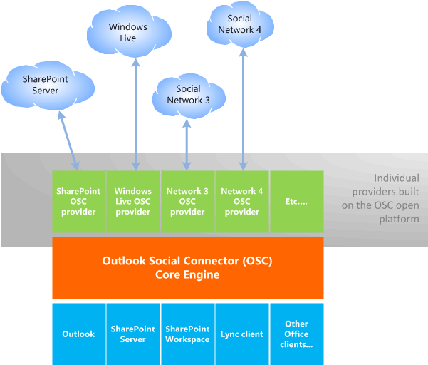

# OSC と Outlook およびソーシャル ネットワークとの関連付けRelating the OSC with Outlook and social networks

outlook Social Connector (.osc) は、同僚、友人、または関連付けられている個人の Office 連絡先カードと outlook のユーザーウィンドウの活動、状態、または写真の更新を表示することができます。The Outlook Social Connector (OSC) can display in the Office Contact Card and Outlook People Pane activities, status, or photo updates for a coworker, friend, or any person you are associated with. 既定では、このメッセージには、選択したユーザーから受信した Outlook メール、添付ファイル、会議出席依頼が表示されます。By default, the OSC displays the Outlook emails, attachments, and meeting requests received from a selected person. 選択したユーザーと Office ユーザーが sharepoint サイトで共同作業を行うと、その sharepoint サイトからのドキュメント更新やその他のサイトアクティビティも表示されます。If the selected person and the Office user collaborate on a SharePoint site, the OSC also displays document updates and other site activities from that SharePoint site. office ユーザーは、office ユーザーが関心を持っている関連付けのコンテキストに応じて、基幹業務アプリケーション、社内の web サイト、または LinkedIn などのさまざまな professional およびソーシャルネットワークサイトに対して、.osc プロバイダーをインストールすることができます。Facebook、Windows Live。Depending on the contexts of association that the Office user is interested in, the Office user can install OSC providers for line-of-business applications, internal corporate websites, or a variety of professional and social network sites, such as LinkedIn, Facebook, and Windows Live.
  
office クライアントアプリケーション間での機能の共有をサポートするために、.osc コアエンジンは office 共有コンポーネントの一部として実装され、People ウィンドウは Outlook アドインとして実装されます。To support sharing of functionality across Office client applications, the OSC core engine is implemented as part of an Office shared component, and the People Pane is implemented as an Outlook add-in. .osc を使用するには、Office ユーザーがそのクライアントコンピューターに outlook をインストールし、outlook をプロファイルを使用して構成している必要があります。このため、.osc は連絡先フォルダー内の連絡先をキャッシュできます。To use the OSC, an Office user must have installed Outlook on that client computer and configured Outlook with a profile, so that the OSC can cache contacts in a Contacts folder. 
  
.osc プロバイダーは、コンポーネントオブジェクトモデル (COM) DLL で、各ソーシャルネットワークの api とは無関係に、.osc がソーシャルネットワークデータにアクセスできるようにします。An OSC provider is a Component Object Model (COM) DLL that allows the OSC to access social network data in a way that is independent of the APIs of each social network. .osc プロバイダ DLL は、クライアントコンピューターにローカルにインストールする必要があります。An OSC provider DLL must be installed locally on a client computer. ソーシャルネットワークの .osc プロバイダーは、Outlook の一部である .osc をインターネット上のソーシャルネットワークに接続します。A social network's OSC provider connects the OSC, which is part of Outlook, with the social network on the Internet.
  
.osc プロバイダーは、.osc と通信するために、.osc プロバイダー拡張機能の一部として定義された一連のインターフェイスを実装する必要があります。An OSC provider must implement a set of interfaces, defined as part of the OSC provider extensibility, to communicate with the OSC. .osc プロバイダ拡張機能は、オープンプラットフォームとして使用できます。OSC provider extensibility is available as an open platform.
  
.osc のプロバイダアーキテクチャを使用すると、複数のプロバイダーが .osc コアエンジンと、フレンドやアクティビティなどのソーシャル情報を集約して動作するようになります。The provider architecture of the OSC enables multiple providers to work with the OSC core engine and aggregate social information such as friends and activities. 図1は、.osc プロバイダアーキテクチャを示しています。Figure 1 illustrates the OSC provider architecture.
  
**図1。Outlook Social Connector プロバイダーのアーキテクチャ****Figure 1. Outlook Social Connector provider architecture**

  
## 用語Terminology

この Outlook social Connector プロバイダーリファレンスでは、ソーシャルネットワークを使用して、次の種類のサイトを参照します。In this Outlook Social Connector Provider Reference, a social network is used to refer to the following types of sites: 
  
- SharePoint などのコラボレーションサイト。Collaborative sites such as SharePoint.
    
- Facebook や Windows Live などのソーシャルネットワークサイト。Social network sites such as Facebook and Windows Live.
    
- LinkedIn などのプロフェッショナルネットワークサイト。Professional network sites such as LinkedIn.
    
- ネットワークに使用されるその他の基幹業務アプリケーションまたは企業内部 web サイト。Other line-of-business applications or corporate internal websites used for networking.
    
friend という用語は、一般に、友人、家族、同僚、接続、および Office ユーザーが SharePoint などのコラボレーションコンテキストで関連付けられている場合や、ユーザーのソーシャルネットワークアカウントに追加されている場合に使用されます。The term friend is used generally to include friends, family, colleagues, connections, and anyone else an Office user is associated with in a collaborative context like SharePoint, or has added to the user's social network account. 友人以外のユーザーは、友人のアクティビティの更新で参照されていますが、Office ユーザーのソーシャルネットワークアカウントに追加されている友人ではありません。Non-friends are people referenced in friends' activity updates but are not friends who have been added to the Office user's social network account. 連絡先は、Outlook の連絡先フォルダー内のユーザーです。Contacts are people in an Outlook contact folder. 
  
## 関連項目See also

- [Outlook Social Connector プロバイダーの開発の概要 (英語)(機械翻訳)Getting Started with Developing an Outlook Social Connector Provider](getting-started-with-developing-an-outlook-social-connector-provider.md)

