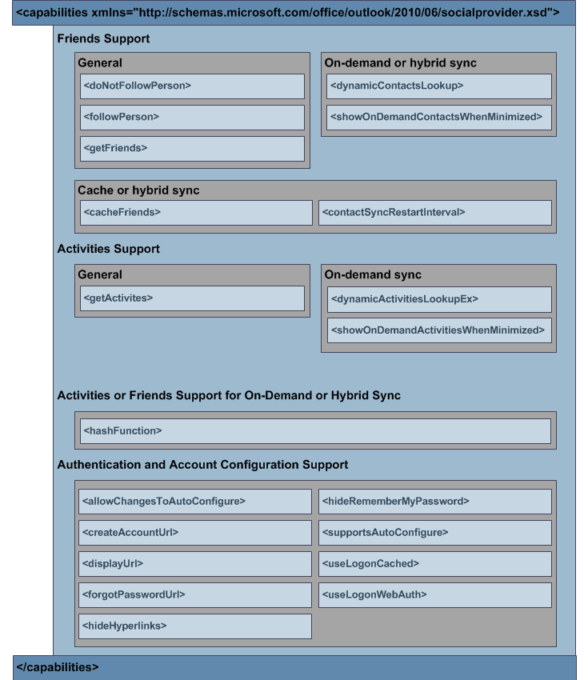

# 機能の XMLXML for capabilities

(OSC) プロバイダー XML スキーマの **capabilities** 要素を使用すると、OSC プロバイダーは機能を指定できます。The **capabilities** element in the (OSC) provider XML schema allows an OSC provider to specify its functionality. このような機能には、次の機能が含まれます。Such functionality includes the following: 
  
- プロバイダーがソーシャル ネットワークからのフレンドやアクティビティの取得、キャッシュ、または動的な参照をサポートするかどうか。Whether the provider supports getting, caching, or dynamically looking up friends and activities from the social network.
    
- OSC が特定のログオン ユーザー インターフェイスを表示する方法。How the OSC should display certain logon user interfaces.
    
- OSC がフォーム ベース認証を使用するか、ソーシャル ネットワークを自動的に構成し、ソーシャル ネットワーク上のユーザーにログオンするか。Whether the OSC should use forms-based authentication or automatically configure the social network and logs on the user on the social network.
    
機能の XML スキーマ **は、** プロバイダーがサポートする機能を OSC に識別するために重要です。The XML schema for **capabilities** is critical because it identifies to the OSC the functionality supported by the provider. OSC プロバイダーは、結果文字列を返す [ISocialProvider::GetCapabilities](isocialprovider-getcapabilities.md) メソッドを実装する  _必要_ があります。An OSC provider must implement the [ISocialProvider::GetCapabilities](isocialprovider-getcapabilities.md) method that returns a  _result_ string. OSC は **ISocialProvider::GetCapabilities** を呼び出して、結果文字列内の OSC プロバイダーの機能に関する情報を取得します。この情報は、capabilities 要素の XML スキーマ定義に準拠しています。  The OSC calls **ISocialProvider::GetCapabilities** to obtain information about the capabilities of the OSC provider in the  _result_ string, which complies with the XML schema definition for the **capabilities** element. この情報により、OSC から OSC プロバイダーへの後続の呼び出しが正しく動作します。This information enables subsequent calls from the OSC to the OSC provider to operate correctly. 
  
**ISocialProvider::GetCapabilities** メソッドの出力パラメーターとして OSC プロバイダーの機能を指定するには、OSC プロバイダー拡張 XML スキーマに準拠する必要があります。To specify capabilities of an OSC provider as an output parameter of the **ISocialProvider::GetCapabilities** method, you must conform to the OSC provider extensibility XML schema. 次の図は、機能 **XML 構造を** 示しています。The following figure shows the **capabilities** XML structure. 
  
**図 1. \<機能 \> XML 構造****Figure 1. \<capabilities\> XML structure**

  
capabilities 要素の子要素の詳細な説明については[、「Capabilities XML Elements」を参照してください](capabilities-xml-elements.md)。For detailed descriptions of child elements of the **capabilities** element, see [Capabilities XML Elements](capabilities-xml-elements.md). 機能 XML の例 **については、「Capabilities** [XML の例」を参照してください](capabilities-xml-example.md)。For an example of **capabilities** XML, see [Capabilities XML Example](capabilities-xml-example.md). OSC プロバイダー XML スキーマの完全な定義 (必須または省略可能な要素を含む) については、「ソーシャル コネクタ プロバイダー XML スキーマOutlook[を参照してください](outlook-social-connector-provider-xml-schema.md)。For a complete definition of the OSC provider XML schema, including which elements are required or optional, see [Outlook Social Connector Provider XML Schema](outlook-social-connector-provider-xml-schema.md).
  
## 関連項目See also

- [機能 XML の例Capabilities XML Example](capabilities-xml-example.md)  
- [フレンドとアクティビティの同期Synchronizing Friends and Activities](synchronizing-friends-and-activities.md)  
- [友人のための XMLXML for Friends](xml-for-friends.md)  
- [アクティビティの XMLXML for Activities](xml-for-activities.md)
- [OSC XML スキーマを使用したプロバイダーの開発Developing a Provider with the OSC XML Schema](developing-a-provider-with-the-osc-xml-schema.md)

