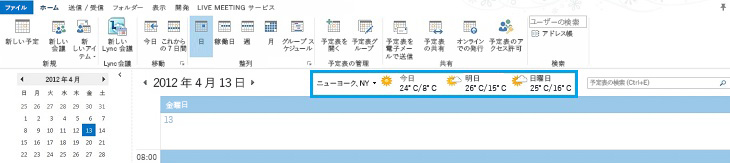
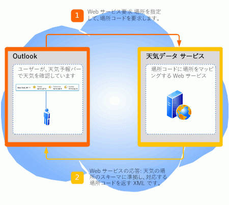
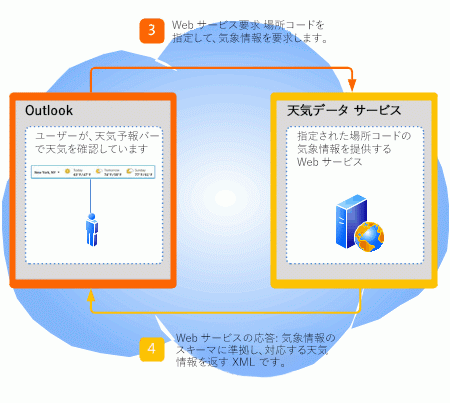

# <a name="extending-the-weather-bar-in-outlook"></a>Outlook の天気予報バーの拡張

Outlook 2013 で天気予報バー用サードパーティの天気予報 Web サービスをプラグインとして指定して、ユーザーの選択する場所の天気予報データを提供する方法について説明します。
  
## <a name="weather-bar-overview"></a>天気予報バーの概要
<a name="ol15_weatherbar_overview"> </a>

Outlook の天気予報バーには、地理上の場所における気象情報と予報が表示されます。ユーザーが 1 つまたは複数の場所を選択すると、予定表モジュールの天気予報バーの中に天気予報データが表示されます。図 1 は天気予報バーにニューヨークの向こう 3 日間の予報が表示されているところです。 
  
**図 1. Outlook の天気予報バー**


  
天気予報バーの設定値は、ユーザーのプロファイルと共に保存されます。Exchange のアカウントの場合のように、Outlook アカウントの種類に応じて、ユーザーが同じプロファイルでログオンするすべてのコンピューターにおいて設定値のローミングが可能な場合があります。あるいは、IMAP/POP のアカウントの場合のように、コンピューターごとにユーザーが設定値をカスタマイズすることも可能です。
  
既定では、Outlook では MSN Weather によって提供される天気予報データが使用されます。天気予報バーでは、Outlook との通信用に定義されているプロトコルに準拠するサードパーティ天気予報データ Web サービスがサポートされます。サードパーティ天気予報データ サービスがこのプロトコルをサポートする限り、天気予報バーに天気予報データを提供する天気予報データ サービスをユーザーが選ぶことが可能です。この記事では、Outlook の天気予報バーにサードパーティ天気予報サービスを統合するためのプロトコルについて説明します。
  
## <a name="weather-bar-protocol"></a>天気予報バー プロトコル
<a name="ol15_weatherbar_theprotocol"> </a>

ユーザーは、天気予報バーのために別の天気予報データ サービスを指定することができます。ただし、その天気予報データ サービスでは、Outlook と通信するための以下のプロトコルをサポートする Web サービスが実装されていなければなりません。
  
1. 気象データ サービスでは、Web サービスのベース URL がサポートされます。たとえば、Contoso Weather Web サービスのベース URL は http://service.contoso.com/data.aspx という具合です。
    
2. Web サービスにより、Outlook は、ベース URL に以下のパラメーターを付加して、場所コードを要求することが可能です。 
    
   - outputview = 検索: このパラメーターの場合、要求が場所の検索であることを示します。
    
   - weasearchstr_市区_町村: このパラメーターは、_市区町村_、対象のユーザーが (たとえば、London) の天気予報の場所を示します。
    
   - カルチャ_の LCID_を =: このパラメーターは、そのコンピューター上のユーザーに対してインストールされている Office のバージョンのカルチャを示します。 LCID 値は、「[[RFC4646] 言語特定のためのタグ](http://www.ietf.org/rfc/rfc4646.txt)」で定義されています。
    
   - src = outlook: このパラメーターの場合、Outlook が、サービスを要求するクライアント アプリケーションであることを示します。
    
   これらのパラメーターにより Outlook は、ユーザーが対象として指定する場所に関連する場所コードとして気象データ サービスでサポートされるものを検索します。Web サービスから Outlook に対して、「[Outlook Weather Location XML Schema](outlook-weather-location-xml-schema.md)」に準拠した XML の形式で場所コードが応答として返されるはずです。図 2 に、場所コードの Web サービス要求と応答についてまとめます。
    
   **図 2. 場所コードの Web サービス要求と応答**

   
  
3. さらに Web サービスにより Outlook は、以下のパラメーターを付加することにより、場所コードの予報情報を要求することができます。
    
   - wealocations_コード_: このパラメーターの_コード_は、Outlook は、手順 2 から取得し、ユーザーに興味を示している場所に対応する場所コードです。 
    
   - weadegreetype = _degreetype_: このパラメーターは、温度のメートル法またはインペリアル単位を使用するかどうかを指定します。 _degreetype_ に、摂氏の場合は c を指定し、華氏の場合は f を指定します。 このパラメーターは省略可能であり、Web サービス要求において必ずしも存在するとは限りません。
    
   - カルチャ_の LCID_を =: このパラメーターは、そのコンピューター上のユーザーに対してインストールされている Office のバージョンのカルチャを示します。 LCID 値は、「[[RFC4646] 言語特定のためのタグ](http://www.ietf.org/rfc/rfc4646.txt)」で定義されています。
    
   - src = outlook: このパラメーターの場合、Outlook が、サービスを要求するクライアント アプリケーションであることを示します。
    
   これらのパラメーターにより Outlook は、ステップ 2 で返される場所コードについて、天気予報データ サービスに対して予報を要求することができます。Web サービスからは、Outlook に対する応答として、「[Outlook Weather Information XML Schema](outlook-weather-information-xml-schema.md)」に準拠した XML の形式で、対応する気象データが返されます。図 3 に、指定された場所コードの天気予報データのための Web サービス要求と応答をまとめます。
    
   **図 3. 天気予報情報の Web サービス要求と応答**

   
  
## <a name="setting-the-weather-bar-to-use-a-weather-service"></a>天気予報サービスを使用するための天気予報バーの設定
<a name="ol15_weatherbar_setting"> </a>

管理者やパワー ユーザーは、 **WeatherServiceUrl** レジストリ キーを使用することにより、特定の天気予報サービスを使用するように天気予報バーをカスタマイズすることができます。たとえば、Contoso 天気予報サービスのベース URL が http://service.contoso.com/data.aspx だとすると、 **WeatherServiceUrl** キーをその URL に設定することができます。 
  
以下の表で、 **WeatherServiceUrl** キーについて説明します。 
  
|||
|:-----|:-----|
|**キー** <br/> |HKCU\Software\Microsoft\Office\15.0\Outlook\Options\Calendar  <br/> |
|**値の名前** <br/> |**WeatherServiceUrl** <br/> |
|**値の型** <br/> |REG_SZ  <br/> |
|**既定値** <br/> |EMPTY_STRING  <br/> |
|**説明** <br/> |天気予報データ サービスの URL  <br/> |
   
## <a name="dependent-conditions"></a>依存条件
<a name="ol15_weatherbar_dependentconditions"> </a>

既定では、Outlook 2013 に天気予報バーが表示されます。このセクションでは、ある場合に天気予報バーが表示されない理由について説明します。
  
### <a name="weather-bar-is-disabled"></a>天気予報バーがオフになっている

まず、[ **Outlook オプション**] ダイアログ ボックスの [ **予定表**] タブで、[ **予定表に天気予報を表示する**] がオンになっていることを確認します。 
  
また、管理者がグループ ポリシーを使用して、Windows レジストリの以下のキーを設定することにより、Outlook 2013 で天気予報バーをオフにしている可能性もあります。
  
|||
|:-----|:-----|
|**キー** <br/> |HKCU\Software\Microsoft\Office\15.0\Outlook\Options\Calendar  <br/> |
|**値の名前** <br/> |**DisableWeather** <br/> |
|**値の型** <br/> |REG_DWORD  <br/> |
|**既定値** <br/> |0  <br/> |
|**説明** <br/> |値 0 の場合、天気予報バーが有効になります。それ以外の値の場合、天気予報バーは無効になります。  <br/> |
   
天気予報バー機能がグループ ポリシーによってオフにされている場合、[ **予定表**] タブに [ **予定表に天気予報を表示する**] チェック ボックスは表示されません。この機能を再びオンにする場合は、管理者にお問い合わせください。 
  
### <a name="office-is-disconnected-from-the-internet"></a>Office がインターネットに接続されていない

Office がインターネットに接続可能であることを確認してください。Backstage ビューの [ **セキュリティ センター**] の [ **プライバシー オプション**] タブで、[ **Office のインターネット接続を許可します**] がオンになっていることを確認してください。 
  
ユーザーが Office の更新プログラムを受け取らないことを選択している場合も、天気予報バーがオフになっています。
  
管理者がグループ ポリシーを使用して Windows レジストリの以下のキーを設定することにより、天気予報バーを含むオンライン コンテンツをすべてオフにしている可能性もあります。
  
|||
|:-----|:-----|
|**キー** <br/> |HKCU\Software\Microsoft\Office\15.0\Common\Internet  <br/> |
|**値の名前** <br/> |**UseOnlineContent** <br/> |
|**値の型** <br/> |REG_DWORD  <br/> |
|**既定値** <br/> |2  <br/> |
|**説明** <br/> |値 2 の場合、天気予報バーが有効になります。それ以外の値の場合、天気予報バーは無効になります。  <br/> |
   
天気予報バー機能がグループ ポリシーによってオフにされている場合、[ **予定表**] タブに [ **予定表に天気予報を表示する**] チェック ボックスは表示されません。この機能を再びオンにする場合は、管理者にお問い合わせください。 
  
## <a name="weather-bar-example"></a>天気予報バーの例
<a name="ol15_weatherbar_example"> </a>

このセクションでは、Outlook との通信のための前述のプロトコルに準拠した Contoso Weather サービスの例を示します。ユーザーの選択する場所に対して、Outlook は、まず Contoso Weather からその場所の場所コードを取得します。次に、その場所コードを使用することにより、Contoso Weather サービスを呼び出して天気予報データを取得します。
  
### <a name="base-url"></a>ベース URL

Contoso Weather は、天気予報データ サービスのために以下のベース URL を提供しています。
  
http://service.contoso.com/data.aspx
  
### <a name="getting-a-location-code"></a>場所コードの取得

Outlook により、ベース URL に、上記のステップ 2 で説明されているパラメーターが付加され、それにより地理上の場所  _city_ の場所コードが取得されます。
  
http://service.contoso.com/data.aspx?outputview=search&amp;weasearchstr= _city_
  
例として、ユーザーが天気予報バーで [東京] を選択したとします。Outlook は、以下の URL を使用することにより、Contoso Weather から東京の場所コードを取得します。 
  
http://weather.service.contoso.com/data.aspx?outputview=search&amp;weasearchstr=tokyo
  
Contoso Weather は、以下の XML を応答として返し、東京の場所コードを提供します。この XML は、Outlook Weather Location XML Schema に準拠するものです。天気予報サービスから、複数の場所のデータが返されることも少なくありません (選択された場所が大都市の場合など)。この例の場合、東京に対する応答には 2 つの場所が含まれており、それぞれが [weather](weather-element-weatherdata-elementoutlook-weather-location-schema.md) 要素で囲まれています。対応する場所コードは、以下のとおりです。 
  
- wc:JAXX0085 ( **weatherlocationname** 属性が  `Tokyo, JPN` の場合)
    
- wc:10038604 ( **weatherlocationname** 属性が  `Shinjuku-ku, Tokyo, Japan` の場合)
    
```XML
<?xml version="1.0" ?>
<weatherdata>
  <weather weatherlocationcode="wc:JAXX0085" 
    weatherlocationname="Tokyo, JPN">
  </weather>
  <weather weatherlocationcode="wc:10038604" 
    weatherlocationname="Shinjuku-ku, JPN">
  </weather>
</weatherdata>

```

### <a name="getting-weather-information-for-a-location-code"></a>場所コードの天気予報情報の取得

場所の場所コードを取得したあと、Outlook は、ベース URL に、ステップ 3 で説明されているパラメーターを付加することによって、その場所コードの天気予報情報を取得します。
  
http://service.contoso.com/data.aspx?wealocations= _code_
  
例として、Contoso Weather から [東京] の場所コードとして Outlook が wc:JAXX0085 を得たとすると、Outlook は、以下の URL の中でその場所コードを使用することによって天気予報情報を取得します。
  
http://service.contoso.com/data.aspx?wealocations=wc:JAXX0085
  
Contoso Weather は、以下の XML を応答として返すことにより、東京の場所コードに対応する天気予報情報を提供します。この XML は、Outlook Weather Information XML Schema に準拠したものです。
  
```XML
<?xml version="1.0"?>
<weatherdata>
  <weather timezone="9" attribution="Data provided by Trey Research" 
    degreetype="F" imagerelativeurl="http://contoso.com/images/en-us/" 
    url="http://contoso.com/weather.aspx?eid=33568&amp;q=Tokyo-JPN" 
    weatherlocationname="Tokyo, JPN" 
    weatherlocationcode="wc:JAXX0085">
      <current winddisplay="9 mph NNW" windspeed="9" humidity="90" feelslike="44" 
        observationpoint="Tokyo" observationtime="06:00:00" 
        shortday="Sat" day="Saturday" date="2012-04-14" skytext="Rain" skycode="11" 
        temperature="48"/>
      <forecast shortday="Sat" day="Saturday" date="2012-04-14" precip="95" skytextday="Rain"
        skycodeday="11" high="55" low="47"/>
      <forecast shortday="Sun" day="Sunday" date="2012-04-15" precip="5" skytextday="Partly Cloudy" 
        skycodeday="30" high="65" low="43"/>
      <forecast shortday="Mon" day="Monday" date="2012-04-16" precip="5" skytextday="Partly Cloudy" 
        skycodeday="30" high="64" low="52"/>
      <forecast shortday="Tue" day="Tuesday" date="2012-04-17" precip="70" skytextday="Showers / Clear" 
        skycodeday="39" high="66" low="53"/>
      <forecast shortday="Wed" day="Wednesday" date="2012-04-18" precip="55" skytextday="Showers / Clear" 
        skycodeday="39" high="68" low="51"/>
  </weather>
</weatherdata>

```

### <a name="resetting-outlook-to-use-msn-weather"></a>MSN Weather を使用するように Outlook をリセットする

Outlook は既定で MSN Weather を使用することになっていますが、ユーザーが天気予報バーをカスタマイズして別の天気予報サービスを使用するようにした後、再び MSN Weather を使用する場合、ユーザーは、単に Windows レジストリの **WeatherServiceUrl** キーを削除することができます。このレジストリ キーを削除すると、Outlook がリセットされ、MSN Weather が使用されるようになります。 
  
## <a name="conclusion"></a>結論
<a name="ol15_weatherbar_conclusion"> </a>

Outlook 予定表の天気予報バーでは、指定された場所の天気予報を提供するため、既定値として MSN Weather が使用されます。ユーザーは、指定した場所の天気予報情報を表示できます。また、Outlook Weather Location XML Schema および Outlook Weather Information XML Schema をサポートし、Outlook とのシンプルな Web サービス プロトコルに準拠することにより、天気予報バーにサードパーティ天気予報データ サービスを統合することもできます。
  
## <a name="see-also"></a>関連項目

- [Outlook Weather Location XML Schema](outlook-weather-location-xml-schema.md)   
- [Outlook Weather Information XML Schema](outlook-weather-information-xml-schema.md)
    

