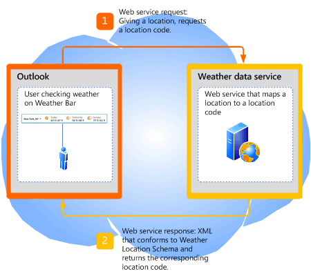

# <a name="extending-the-weather-bar-in-outlook"></a><span data-ttu-id="2a3d1-103">Outlook の天気予報バーの拡張</span><span class="sxs-lookup"><span data-stu-id="2a3d1-103">Extending the Weather Bar in Outlook</span></span>

<span data-ttu-id="2a3d1-104">Outlook 2013 で天気予報バー用サードパーティの天気予報 Web サービスをプラグインとして指定して、ユーザーの選択する場所の天気予報データを提供する方法について説明します。</span><span class="sxs-lookup"><span data-stu-id="2a3d1-104">Learn how to plug in a third-party weather web service for the Weather Bar in Outlook 2013, to provide weather conditions data for a user-chosen location.</span></span>
  
## <a name="weather-bar-overview"></a><span data-ttu-id="2a3d1-105">天気予報バーの概要</span><span class="sxs-lookup"><span data-stu-id="2a3d1-105">Weather Bar overview</span></span>
<span data-ttu-id="2a3d1-106"><a name="ol15_weatherbar_overview"> </a></span><span class="sxs-lookup"><span data-stu-id="2a3d1-106"></span></span>

<span data-ttu-id="2a3d1-p101">Outlook の天気予報バーには、地理上の場所における気象情報と予報が表示されます。ユーザーが 1 つまたは複数の場所を選択すると、予定表モジュールの天気予報バーの中に天気予報データが表示されます。図 1 は天気予報バーにニューヨークの向こう 3 日間の予報が表示されているところです。</span><span class="sxs-lookup"><span data-stu-id="2a3d1-p101">The Weather Bar in Outlook displays weather conditions and forecast for a geographic location. A user can choose one or multiple locations, and conveniently see weather data in the Weather Bar in the calendar module. Figure 1 shows the Weather Bar displaying a three-day forecast for New York, NY.</span></span> 
  
<span data-ttu-id="2a3d1-110">**図 1. Outlook の天気予報バー**</span><span class="sxs-lookup"><span data-stu-id="2a3d1-110">**Figure 1. Weather Bar in Outlook**</span></span>


  
<span data-ttu-id="2a3d1-p102">天気予報バーの設定値は、ユーザーのプロファイルと共に保存されます。Exchange のアカウントの場合のように、Outlook アカウントの種類に応じて、ユーザーが同じプロファイルでログオンするすべてのコンピューターにおいて設定値のローミングが可能な場合があります。あるいは、IMAP/POP のアカウントの場合のように、コンピューターごとにユーザーが設定値をカスタマイズすることも可能です。</span><span class="sxs-lookup"><span data-stu-id="2a3d1-p102">Settings for the Weather Bar are saved with the user's profile. Depending on the type of Outlook account, the settings may roam with the user on all computers that the user logs on to with the same profile, as in the case of Exchange accounts. Alternatively, the user can customize settings on each computer, as in the case of IMAP/POP accounts.</span></span>
  
<span data-ttu-id="2a3d1-p103">既定では、Outlook では MSN Weather によって提供される天気予報データが使用されます。天気予報バーでは、Outlook との通信用に定義されているプロトコルに準拠するサードパーティ天気予報データ Web サービスがサポートされます。サードパーティ天気予報データ サービスがこのプロトコルをサポートする限り、天気予報バーに天気予報データを提供する天気予報データ サービスをユーザーが選ぶことが可能です。この記事では、Outlook の天気予報バーにサードパーティ天気予報サービスを統合するためのプロトコルについて説明します。</span><span class="sxs-lookup"><span data-stu-id="2a3d1-p103">By default, Outlook uses weather data provided by MSN Weather. The Weather Bar supports third-party weather data web services that follow a defined protocol to communicate with Outlook. As long as a third-party weather data service supports this protocol, users can choose that weather data service to provide weather data in the Weather Bar. This article describes the protocol for third-party weather services to integrate with Outlook in the Weather Bar.</span></span>
  
## <a name="weather-bar-protocol"></a><span data-ttu-id="2a3d1-119">天気予報バー プロトコル</span><span class="sxs-lookup"><span data-stu-id="2a3d1-119">Weather Bar protocol</span></span>
<span data-ttu-id="2a3d1-120"><a name="ol15_weatherbar_theprotocol"> </a></span><span class="sxs-lookup"><span data-stu-id="2a3d1-120"></span></span>

<span data-ttu-id="2a3d1-121">ユーザーは、天気予報バーのために別の天気予報データ サービスを指定することができます。ただし、その天気予報データ サービスでは、Outlook と通信するための以下のプロトコルをサポートする Web サービスが実装されていなければなりません。</span><span class="sxs-lookup"><span data-stu-id="2a3d1-121">A user can specify a different weather data service for the Weather Bar, as long as that weather data service implements a web service that supports the following protocol to communicate with Outlook:</span></span>
  
1. <span data-ttu-id="2a3d1-p104">気象データ サービスでは、Web サービスのベース URL がサポートされます。たとえば、Contoso Weather Web サービスのベース URL は https://service.contoso.com/data.aspx という具合です。</span><span class="sxs-lookup"><span data-stu-id="2a3d1-p104">The weather data service supports a base URL to a web service. For example, a Contoso Weather web service can have a base URL of https://service.contoso.com/data.aspx.</span></span>
    
2. <span data-ttu-id="2a3d1-124">この Web サービスにより、Outlook が場所コードを要求するために次のパラメーターをベース URL に追加できるようになります。</span><span class="sxs-lookup"><span data-stu-id="2a3d1-124">The web service allows Outlook to append the following parameters to the base URL, to request a location code:</span></span> 
    
   - <span data-ttu-id="2a3d1-125">outputview=search: このパラメーターは、要求が場所の検索であることを示すものです。</span><span class="sxs-lookup"><span data-stu-id="2a3d1-125">outputview=search: This parameter indicates that the request is a location search.</span></span>
    
   - <span data-ttu-id="2a3d1-126">weasearchstr= _city_: このパラメーターは、ユーザーが天気予報を調べる対象となる場所 _city_ です (London など)。</span><span class="sxs-lookup"><span data-stu-id="2a3d1-126">weasearchstr= _city_: This parameter indicates the location,  _city_, for which the user wants a weather forecast (for example, London).</span></span>
    
   - <span data-ttu-id="2a3d1-127">culture= _LCID_: このパラメーターは、コンピューター上でそのユーザー用にインストールされている Office のバージョンのカルチャを示します。</span><span class="sxs-lookup"><span data-stu-id="2a3d1-127">culture= _LCID_: This parameter indicates the culture of the version of Office installed for the user on that computer.</span></span> <span data-ttu-id="2a3d1-128">LCID 値は「[[RFC4646] 言語を識別するタグ](https://www.ietf.org/rfc/rfc4646.txt)」で定義されています。</span><span class="sxs-lookup"><span data-stu-id="2a3d1-128">The LCID value is defined in [[RFC4646] Tags for Identifying Languages](https://www.ietf.org/rfc/rfc4646.txt)</span></span>
    
   - <span data-ttu-id="2a3d1-129">src=outlook: このパラメーターは、Outlook がサービス要求元クライアント アプリケーションであることを示します。</span><span class="sxs-lookup"><span data-stu-id="2a3d1-129">src=outlook: This parameter indicates that Outlook is the client application requesting the service.</span></span>
    
   <span data-ttu-id="2a3d1-p106">これらのパラメーターにより Outlook は、ユーザーが対象として指定する場所に関連する場所コードとして気象データ サービスでサポートされるものを検索します。Web サービスから Outlook に対して、「[Outlook Weather Location XML Schema](outlook-weather-location-xml-schema.md)」に準拠した XML の形式で場所コードが応答として返されるはずです。図 2 に、場所コードの Web サービス要求と応答についてまとめます。</span><span class="sxs-lookup"><span data-stu-id="2a3d1-p106">These parameters allow Outlook to take the location that the user is interested in and search for the associated location code as supported by the weather data service. The web service should respond to Outlook with a location code in XML that follows the [Outlook Weather Location XML Schema](outlook-weather-location-xml-schema.md). Figure 2 summarizes the web service request and response for a location code.</span></span>
    
   <span data-ttu-id="2a3d1-133">**図 2. 場所コードの Web サービス要求と応答**</span><span class="sxs-lookup"><span data-stu-id="2a3d1-133">**Figure 2. Web service request and response for a location code**</span></span>

   
  
3. <span data-ttu-id="2a3d1-135">またこの Web サービスにより、Outlook は場所コードの天気予報情報を要求するために次のパラメーターを追加できます。</span><span class="sxs-lookup"><span data-stu-id="2a3d1-135">The web service also allows Outlook to append the following parameters, to request forecast information for a location code:</span></span>
    
   - <span data-ttu-id="2a3d1-136">wealocations= _code_:このパラメーターの _code_ は、Outlook がステップ 2 で得た場所コードであり、それはユーザーが対象として指定した場所に対応するものです。</span><span class="sxs-lookup"><span data-stu-id="2a3d1-136">wealocations= _code_: _code_ in this parameter is a location code that Outlook obtains from Step 2, and that maps to the location that the user is interested in.</span></span> 
    
   - <span data-ttu-id="2a3d1-137">weadegreetype= _degreetype_: このパラメーターは、気温の測定単位として摂氏を使うか華氏を使うかを指定します。</span><span class="sxs-lookup"><span data-stu-id="2a3d1-137">weadegreetype= _degreetype_: This parameter specifies whether to use metric or imperial units of measurement for temperature.</span></span> <span data-ttu-id="2a3d1-138">_degreetype_ には、摂氏の場合は c を、華氏の場合は f を指定します。</span><span class="sxs-lookup"><span data-stu-id="2a3d1-138">Specify c for metric, f for imperial for  _degreetype_.</span></span> <span data-ttu-id="2a3d1-139">このパラメーターは省略可能であり、Web サービス要求に常に指定されているわけではありません。</span><span class="sxs-lookup"><span data-stu-id="2a3d1-139">This parameter is optional and does not always exist in the web service request.</span></span>
    
   - <span data-ttu-id="2a3d1-140">culture= _LCID_: このパラメーターは、コンピューター上でそのユーザー用にインストールされている Office のバージョンのカルチャを示します。</span><span class="sxs-lookup"><span data-stu-id="2a3d1-140">culture= _LCID_: This parameter indicates the culture of the version of Office installed for the user on that computer.</span></span> <span data-ttu-id="2a3d1-141">LCID 値は「[[RFC4646] 言語を識別するタグ](https://www.ietf.org/rfc/rfc4646.txt)」で定義されています。</span><span class="sxs-lookup"><span data-stu-id="2a3d1-141">The LCID value is defined in [[RFC4646] Tags for Identifying Languages](https://www.ietf.org/rfc/rfc4646.txt)</span></span>
    
   - <span data-ttu-id="2a3d1-142">src=outlook: このパラメーターは、Outlook がサービス要求元クライアント アプリケーションであることを示します。</span><span class="sxs-lookup"><span data-stu-id="2a3d1-142">src=outlook: This parameter indicates that Outlook is the client application requesting the service.</span></span>
    
   <span data-ttu-id="2a3d1-p109">これらのパラメーターにより Outlook は、ステップ 2 で返される場所コードについて、天気予報データ サービスに対して予報を要求することができます。Web サービスからは、Outlook に対する応答として、「[Outlook Weather Information XML Schema](outlook-weather-information-xml-schema.md)」に準拠した XML の形式で、対応する気象データが返されます。図 3 に、指定された場所コードの天気予報データのための Web サービス要求と応答をまとめます。</span><span class="sxs-lookup"><span data-stu-id="2a3d1-p109">These parameters allow Outlook to take the location code returned from Step 2 and request the weather data service for the forecast. The web service should respond to Outlook with the corresponding weather data in XML that follows the [Outlook Weather Information XML Schema](outlook-weather-information-xml-schema.md). Figure 3 summarizes the web service request and response for weather data given a location code.</span></span>
    
   <span data-ttu-id="2a3d1-146">**図 3. 天気予報情報の Web サービス要求と応答**</span><span class="sxs-lookup"><span data-stu-id="2a3d1-146">**Figure 3. Web service request and response for weather information**</span></span>

   
  
## <a name="setting-the-weather-bar-to-use-a-weather-service"></a><span data-ttu-id="2a3d1-148">天気予報サービスを使用するための天気予報バーの設定</span><span class="sxs-lookup"><span data-stu-id="2a3d1-148">Setting the Weather Bar to use a weather service</span></span>
<span data-ttu-id="2a3d1-149"><a name="ol15_weatherbar_setting"> </a></span><span class="sxs-lookup"><span data-stu-id="2a3d1-149"></span></span>

<span data-ttu-id="2a3d1-p110">管理者やパワー ユーザーは、 **WeatherServiceUrl** レジストリ キーを使用することにより、特定の天気予報サービスを使用するように天気予報バーをカスタマイズすることができます。たとえば、Contoso 天気予報サービスのベース URL が https://service.contoso.com/data.aspx だとすると、 **WeatherServiceUrl** キーをその URL に設定することができます。</span><span class="sxs-lookup"><span data-stu-id="2a3d1-p110">The administrator or power user can use the **WeatherServiceUrl** registry key to customize the Weather Bar to use a specific weather service. For example, if the base URL for a Contoso weather service is https://service.contoso.com/data.aspx, you can set the **WeatherServiceUrl** key to that URL.</span></span> 
  
<span data-ttu-id="2a3d1-152">以下の表で、 **WeatherServiceUrl** キーについて説明します。</span><span class="sxs-lookup"><span data-stu-id="2a3d1-152">The following table describes the **WeatherServiceUrl** key.</span></span> 
  
|||
|:-----|:-----|
|<span data-ttu-id="2a3d1-153">**Key**</span><span class="sxs-lookup"><span data-stu-id="2a3d1-153">**Key**</span></span> <br/> |<span data-ttu-id="2a3d1-154">HKCU\Software\Microsoft\Office\15.0\Outlook\Options\Calendar</span><span class="sxs-lookup"><span data-stu-id="2a3d1-154">HKCU\Software\Microsoft\Office\15.0\Outlook\Options\Calendar</span></span>  <br/> |
|<span data-ttu-id="2a3d1-155">**値の名前**</span><span class="sxs-lookup"><span data-stu-id="2a3d1-155">**Value name**</span></span> <br/> |<span data-ttu-id="2a3d1-156">**WeatherServiceUrl**</span><span class="sxs-lookup"><span data-stu-id="2a3d1-156">**WeatherServiceUrl**</span></span> <br/> |
|<span data-ttu-id="2a3d1-157">**値の種類**</span><span class="sxs-lookup"><span data-stu-id="2a3d1-157">**Value type**</span></span> <br/> |<span data-ttu-id="2a3d1-158">REG_SZ</span><span class="sxs-lookup"><span data-stu-id="2a3d1-158">REG_SZ</span></span>  <br/> |
|<span data-ttu-id="2a3d1-159">**既定値**</span><span class="sxs-lookup"><span data-stu-id="2a3d1-159">**Default value**</span></span> <br/> |<span data-ttu-id="2a3d1-160">EMPTY_STRING</span><span class="sxs-lookup"><span data-stu-id="2a3d1-160">EMPTY_STRING</span></span>  <br/> |
|<span data-ttu-id="2a3d1-161">**説明**</span><span class="sxs-lookup"><span data-stu-id="2a3d1-161">**Description**</span></span> <br/> |<span data-ttu-id="2a3d1-162">天気予報データ サービスの URL</span><span class="sxs-lookup"><span data-stu-id="2a3d1-162">URL to a weather data service.</span></span>  <br/> |
   
## <a name="dependent-conditions"></a><span data-ttu-id="2a3d1-163">依存条件</span><span class="sxs-lookup"><span data-stu-id="2a3d1-163">Dependent conditions</span></span>
<span data-ttu-id="2a3d1-164"><a name="ol15_weatherbar_dependentconditions"> </a></span><span class="sxs-lookup"><span data-stu-id="2a3d1-164"></span></span>

<span data-ttu-id="2a3d1-p111">既定では、Outlook 2013 に天気予報バーが表示されます。このセクションでは、ある場合に天気予報バーが表示されない理由について説明します。</span><span class="sxs-lookup"><span data-stu-id="2a3d1-p111">Outlook 2013 displays the Weather Bar by default. This section describes a few reasons why the Weather Bar might not be visible.</span></span>
  
### <a name="weather-bar-is-disabled"></a><span data-ttu-id="2a3d1-167">天気予報バーがオフになっている</span><span class="sxs-lookup"><span data-stu-id="2a3d1-167">Weather Bar is disabled</span></span>

<span data-ttu-id="2a3d1-168">まず、[ **Outlook オプション**] ダイアログ ボックスの [ **予定表**] タブで、[ **予定表に天気予報を表示する**] がオンになっていることを確認します。</span><span class="sxs-lookup"><span data-stu-id="2a3d1-168">First, verify that **Show weather on the calendar** is selected in the **Calendar** tab in the **Outlook Options** dialog box.</span></span> 
  
<span data-ttu-id="2a3d1-169">また、管理者がグループ ポリシーを使用して、Windows レジストリの以下のキーを設定することにより、Outlook 2013 で天気予報バーをオフにしている可能性もあります。</span><span class="sxs-lookup"><span data-stu-id="2a3d1-169">Note that an administrator can also use Group Policy to disable the Weather Bar in Outlook 2013 entirely by setting the following key in the Windows registry:</span></span>
  
|||
|:-----|:-----|
|<span data-ttu-id="2a3d1-170">**Key**</span><span class="sxs-lookup"><span data-stu-id="2a3d1-170">**Key**</span></span> <br/> |<span data-ttu-id="2a3d1-171">HKCU\Software\Microsoft\Office\15.0\Outlook\Options\Calendar</span><span class="sxs-lookup"><span data-stu-id="2a3d1-171">HKCU\Software\Microsoft\Office\15.0\Outlook\Options\Calendar</span></span>  <br/> |
|<span data-ttu-id="2a3d1-172">**値の名前**</span><span class="sxs-lookup"><span data-stu-id="2a3d1-172">**Value name**</span></span> <br/> |<span data-ttu-id="2a3d1-173">**DisableWeather**</span><span class="sxs-lookup"><span data-stu-id="2a3d1-173">**DisableWeather**</span></span> <br/> |
|<span data-ttu-id="2a3d1-174">**値の型**</span><span class="sxs-lookup"><span data-stu-id="2a3d1-174">**Value type**</span></span> <br/> |<span data-ttu-id="2a3d1-175">REG_DWORD</span><span class="sxs-lookup"><span data-stu-id="2a3d1-175">REG_DWORD</span></span>  <br/> |
|<span data-ttu-id="2a3d1-176">**既定値**</span><span class="sxs-lookup"><span data-stu-id="2a3d1-176">**Default value**</span></span> <br/> |<span data-ttu-id="2a3d1-177">.0</span><span class="sxs-lookup"><span data-stu-id="2a3d1-177">0</span></span>  <br/> |
|<span data-ttu-id="2a3d1-178">**説明**</span><span class="sxs-lookup"><span data-stu-id="2a3d1-178">**Description**</span></span> <br/> |<span data-ttu-id="2a3d1-179">値 0 の場合、天気予報バーが有効になります。それ以外の値の場合、天気予報バーは無効になります。</span><span class="sxs-lookup"><span data-stu-id="2a3d1-179">A value of 0 enables the Weather Bar; any other value disables the Weather Bar.</span></span>  <br/> |
   
<span data-ttu-id="2a3d1-p112">天気予報バー機能がグループ ポリシーによってオフにされている場合、[ **予定表**] タブに [ **予定表に天気予報を表示する**] チェック ボックスは表示されません。この機能を再びオンにする場合は、管理者にお問い合わせください。</span><span class="sxs-lookup"><span data-stu-id="2a3d1-p112">If the Weather Bar feature has been disabled by Group Policy, the **Calendar** tab does not include the **Show weather on the calendar** check box. Consult with the administrator to turn the feature back on.</span></span> 
  
### <a name="office-is-disconnected-from-the-internet"></a><span data-ttu-id="2a3d1-182">Office がインターネットに接続されていない</span><span class="sxs-lookup"><span data-stu-id="2a3d1-182">Office is disconnected from the Internet</span></span>

<span data-ttu-id="2a3d1-183">Office がインターネットに接続可能であることを確認してください。Backstage ビューの [ **セキュリティ センター**] の [ **プライバシー オプション**] タブで、[ **Office のインターネット接続を許可します**] がオンになっていることを確認してください。</span><span class="sxs-lookup"><span data-stu-id="2a3d1-183">Verify that Office is enabled to connect to the Internet—go to the **Privacy options** tab of the **Trust Center** in the Backstage view, and ensure that **Allow Office to connect to the Internet** is selected.</span></span> 
  
<span data-ttu-id="2a3d1-184">ユーザーが Office の更新プログラムを受け取らないことを選択している場合も、天気予報バーがオフになっています。</span><span class="sxs-lookup"><span data-stu-id="2a3d1-184">If the user has chosen to not receive updates for Office, the Weather Bar is also disabled.</span></span>
  
<span data-ttu-id="2a3d1-185">管理者がグループ ポリシーを使用して Windows レジストリの以下のキーを設定することにより、天気予報バーを含むオンライン コンテンツをすべてオフにしている可能性もあります。</span><span class="sxs-lookup"><span data-stu-id="2a3d1-185">An administrator can also use Group Policy to disable all online content, including the Weather Bar, by setting the following key in the Windows registry:</span></span>
  
|||
|:-----|:-----|
|<span data-ttu-id="2a3d1-186">**キー**</span><span class="sxs-lookup"><span data-stu-id="2a3d1-186">**Key**</span></span> <br/> |<span data-ttu-id="2a3d1-187">HKCU\Software\Microsoft\Office\15.0\Common\Internet</span><span class="sxs-lookup"><span data-stu-id="2a3d1-187">HKCU\Software\Microsoft\Office\15.0\Common\Internet</span></span>  <br/> |
|<span data-ttu-id="2a3d1-188">**値の名前**</span><span class="sxs-lookup"><span data-stu-id="2a3d1-188">**Value name**</span></span> <br/> |<span data-ttu-id="2a3d1-189">**UseOnlineContent**</span><span class="sxs-lookup"><span data-stu-id="2a3d1-189">**UseOnlineContent**</span></span> <br/> |
|<span data-ttu-id="2a3d1-190">**値の型**</span><span class="sxs-lookup"><span data-stu-id="2a3d1-190">**Value type**</span></span> <br/> |<span data-ttu-id="2a3d1-191">REG_DWORD</span><span class="sxs-lookup"><span data-stu-id="2a3d1-191">REG_DWORD</span></span>  <br/> |
|<span data-ttu-id="2a3d1-192">**既定値**</span><span class="sxs-lookup"><span data-stu-id="2a3d1-192">**Default value**</span></span> <br/> |<span data-ttu-id="2a3d1-193">pbm-2</span><span class="sxs-lookup"><span data-stu-id="2a3d1-193">2</span></span>  <br/> |
|<span data-ttu-id="2a3d1-194">**説明**</span><span class="sxs-lookup"><span data-stu-id="2a3d1-194">**Description**</span></span> <br/> |<span data-ttu-id="2a3d1-195">値 2 の場合、天気予報バーが有効になります。それ以外の値の場合、天気予報バーは無効になります。</span><span class="sxs-lookup"><span data-stu-id="2a3d1-195">A value of 2 enables the Weather Bar; any other value disables the Weather Bar.</span></span>  <br/> |
   
<span data-ttu-id="2a3d1-p113">天気予報バー機能がグループ ポリシーによってオフにされている場合、[ **予定表**] タブに [ **予定表に天気予報を表示する**] チェック ボックスは表示されません。この機能を再びオンにする場合は、管理者にお問い合わせください。</span><span class="sxs-lookup"><span data-stu-id="2a3d1-p113">If the Weather Bar feature has been disabled by Group Policy, the **Calendar** tab does not include the **Show weather on the calendar** check box. Consult with the administrator to turn the feature back on.</span></span> 
  
## <a name="weather-bar-example"></a><span data-ttu-id="2a3d1-198">天気予報バーの例</span><span class="sxs-lookup"><span data-stu-id="2a3d1-198">Weather Bar example</span></span>
<span data-ttu-id="2a3d1-199"><a name="ol15_weatherbar_example"> </a></span><span class="sxs-lookup"><span data-stu-id="2a3d1-199"></span></span>

<span data-ttu-id="2a3d1-p114">このセクションでは、Outlook との通信のための前述のプロトコルに準拠した Contoso Weather サービスの例を示します。ユーザーの選択する場所に対して、Outlook は、まず Contoso Weather からその場所の場所コードを取得します。次に、その場所コードを使用することにより、Contoso Weather サービスを呼び出して天気予報データを取得します。</span><span class="sxs-lookup"><span data-stu-id="2a3d1-p114">This section shows an example of a Contoso Weather service that follows the preceding protocol to communicate with Outlook. For any location that the user selects, Outlook first gets a location code for that location from Contoso Weather, then using that location code, calls the Contoso Weather service to get the weather data.</span></span>
  
### <a name="base-url"></a><span data-ttu-id="2a3d1-202">ベース URL</span><span class="sxs-lookup"><span data-stu-id="2a3d1-202">Base URL</span></span>

<span data-ttu-id="2a3d1-203">Contoso Weather は、天気予報データ サービスのために以下のベース URL を提供しています。</span><span class="sxs-lookup"><span data-stu-id="2a3d1-203">Contoso Weather provides the following base URL for their weather data service:</span></span>
  
https://service.contoso.com/data.aspx
  
### <a name="getting-a-location-code"></a><span data-ttu-id="2a3d1-204">場所コードの取得</span><span class="sxs-lookup"><span data-stu-id="2a3d1-204">Getting a location code</span></span>

<span data-ttu-id="2a3d1-205">Outlook により、ベース URL に、上記のステップ 2 で説明されているパラメーターが付加され、それにより地理上の場所  _city_ の場所コードが取得されます。</span><span class="sxs-lookup"><span data-stu-id="2a3d1-205">Outlook appends the parameters described in Step 2 above to the base URL to obtain the location code for a geographic location  _city_:</span></span>
  
<span data-ttu-id="2a3d1-206">https://service.contoso.com/data.aspx?outputview=search&amp;weasearchstr= _city_</span><span class="sxs-lookup"><span data-stu-id="2a3d1-206">https://service.contoso.com/data.aspx?outputview=search&amp;weasearchstr= _city_</span></span>
  
<span data-ttu-id="2a3d1-207">例として、ユーザーが天気予報バーで [東京] を選択したとします。Outlook は、以下の URL を使用することにより、Contoso Weather から東京の場所コードを取得します。</span><span class="sxs-lookup"><span data-stu-id="2a3d1-207">As an example, if the user has selected Tokyo in the Weather Bar, Outlook uses the following URL to obtain the location code for Tokyo from Contoso Weather:</span></span> 
  
<span data-ttu-id="2a3d1-208">https://weather.service.contoso.com/data.aspx?outputview=search&amp;weasearchstr=tokyo</span><span class="sxs-lookup"><span data-stu-id="2a3d1-208">https://weather.service.contoso.com/data.aspx?outputview=search&amp;weasearchstr=tokyo</span></span>
  
<span data-ttu-id="2a3d1-p115">Contoso Weather は、以下の XML を応答として返し、東京の場所コードを提供します。この XML は、Outlook Weather Location XML Schema に準拠するものです。天気予報サービスから、複数の場所のデータが返されることも少なくありません (選択された場所が大都市の場合など)。この例の場合、東京に対する応答には 2 つの場所が含まれており、それぞれが [weather](weather-element-weatherdata-elementoutlook-weather-location-schema.md) 要素で囲まれています。対応する場所コードは、以下のとおりです。</span><span class="sxs-lookup"><span data-stu-id="2a3d1-p115">Contoso Weather responds with the following XML to provide the location code for Tokyo. The XML conforms to the Outlook Weather Location XML Schema. Note that it is common for weather services to return data for more than one location (for example, if the selected location is a greater metropolitan area). In this example, the response for Tokyo includes two locations, each enclosed in a [weather](weather-element-weatherdata-elementoutlook-weather-location-schema.md) element. The corresponding location codes are as follows:</span></span> 
  
- <span data-ttu-id="2a3d1-214">wc:JAXX0085 ( **weatherlocationname** 属性が  `Tokyo, JPN` の場合)</span><span class="sxs-lookup"><span data-stu-id="2a3d1-214">wc:JAXX0085 for the **weatherlocationname** attribute being  `Tokyo, JPN`</span></span>
    
- <span data-ttu-id="2a3d1-215">wc:10038604 ( **weatherlocationname** 属性が  `Shinjuku-ku, Tokyo, Japan` の場合)</span><span class="sxs-lookup"><span data-stu-id="2a3d1-215">wc:10038604 for the **weatherlocationname** attribute being  `Shinjuku-ku, Tokyo, Japan`</span></span>
    
```XML
<?xml version="1.0" ?>
<weatherdata>
  <weather weatherlocationcode="wc:JAXX0085" 
    weatherlocationname="Tokyo, JPN">
  </weather>
  <weather weatherlocationcode="wc:10038604" 
    weatherlocationname="Shinjuku-ku, JPN">
  </weather>
</weatherdata>

```

### <a name="getting-weather-information-for-a-location-code"></a><span data-ttu-id="2a3d1-216">場所コードの天気予報情報の取得</span><span class="sxs-lookup"><span data-stu-id="2a3d1-216">Getting weather information for a location code</span></span>

<span data-ttu-id="2a3d1-217">場所の場所コードを取得したあと、Outlook は、ベース URL に、ステップ 3 で説明されているパラメーターを付加することによって、その場所コードの天気予報情報を取得します。</span><span class="sxs-lookup"><span data-stu-id="2a3d1-217">After obtaining the location code for a location, Outlook appends the parameters described in Step 3 above to the base URL to obtain weather information for that location code.</span></span>
  
<span data-ttu-id="2a3d1-218">https://service.contoso.com/data.aspx?wealocations= _code_</span><span class="sxs-lookup"><span data-stu-id="2a3d1-218">https://service.contoso.com/data.aspx?wealocations= _code_</span></span>
  
<span data-ttu-id="2a3d1-219">例として、Contoso Weather から [東京] の場所コードとして Outlook が wc:JAXX0085 を得たとすると、Outlook は、以下の URL の中でその場所コードを使用することによって天気予報情報を取得します。</span><span class="sxs-lookup"><span data-stu-id="2a3d1-219">As an example, if Outlook has obtained the location code wc:JAXX0085 from Contoso Weather for Tokyo, Outlook uses this location code in the following URL to get the weather information.</span></span>
  
https://service.contoso.com/data.aspx?wealocations=wc:JAXX0085
  
<span data-ttu-id="2a3d1-p116">Contoso Weather は、以下の XML を応答として返すことにより、東京の場所コードに対応する天気予報情報を提供します。この XML は、Outlook Weather Information XML Schema に準拠したものです。</span><span class="sxs-lookup"><span data-stu-id="2a3d1-p116">Contoso Weather responds with the following XML to provide the weather information for the location code for Tokyo. The XML conforms to the Outlook Weather Information XML Schema.</span></span>
  
```XML
<?xml version="1.0"?>
<weatherdata>
  <weather timezone="9" attribution="Data provided by Trey Research" 
    degreetype="F" imagerelativeurl="https://contoso.com/images/en-us/" 
    url="https://contoso.com/weather.aspx?eid=33568&amp;q=Tokyo-JPN" 
    weatherlocationname="Tokyo, JPN" 
    weatherlocationcode="wc:JAXX0085">
      <current winddisplay="9 mph NNW" windspeed="9" humidity="90" feelslike="44" 
        observationpoint="Tokyo" observationtime="06:00:00" 
        shortday="Sat" day="Saturday" date="2012-04-14" skytext="Rain" skycode="11" 
        temperature="48"/>
      <forecast shortday="Sat" day="Saturday" date="2012-04-14" precip="95" skytextday="Rain"
        skycodeday="11" high="55" low="47"/>
      <forecast shortday="Sun" day="Sunday" date="2012-04-15" precip="5" skytextday="Partly Cloudy" 
        skycodeday="30" high="65" low="43"/>
      <forecast shortday="Mon" day="Monday" date="2012-04-16" precip="5" skytextday="Partly Cloudy" 
        skycodeday="30" high="64" low="52"/>
      <forecast shortday="Tue" day="Tuesday" date="2012-04-17" precip="70" skytextday="Showers / Clear" 
        skycodeday="39" high="66" low="53"/>
      <forecast shortday="Wed" day="Wednesday" date="2012-04-18" precip="55" skytextday="Showers / Clear" 
        skycodeday="39" high="68" low="51"/>
  </weather>
</weatherdata>

```

### <a name="resetting-outlook-to-use-msn-weather"></a><span data-ttu-id="2a3d1-222">MSN Weather を使用するように Outlook をリセットする</span><span class="sxs-lookup"><span data-stu-id="2a3d1-222">Resetting Outlook to use MSN Weather</span></span>

<span data-ttu-id="2a3d1-p117">Outlook は既定で MSN Weather を使用することになっていますが、ユーザーが天気予報バーをカスタマイズして別の天気予報サービスを使用するようにした後、再び MSN Weather を使用する場合、ユーザーは、単に Windows レジストリの **WeatherServiceUrl** キーを削除することができます。このレジストリ キーを削除すると、Outlook がリセットされ、MSN Weather が使用されるようになります。</span><span class="sxs-lookup"><span data-stu-id="2a3d1-p117">Even though Outlook uses MSN Weather by default, if a user has customized the Weather Bar to use a different weather service and subsequently wants to use MSN Weather again, the user can simply delete the **WeatherServiceUrl** key in the Windows Registry. Deleting that registry key resets Outlook to use MSN Weather.</span></span> 
  
## <a name="conclusion"></a><span data-ttu-id="2a3d1-225">まとめ</span><span class="sxs-lookup"><span data-stu-id="2a3d1-225">Conclusion</span></span>
<span data-ttu-id="2a3d1-226"><a name="ol15_weatherbar_conclusion"> </a></span><span class="sxs-lookup"><span data-stu-id="2a3d1-226"></span></span>

<span data-ttu-id="2a3d1-p118">Outlook 予定表の天気予報バーでは、指定された場所の天気予報を提供するため、既定値として MSN Weather が使用されます。ユーザーは、指定した場所の天気予報情報を表示できます。また、Outlook Weather Location XML Schema および Outlook Weather Information XML Schema をサポートし、Outlook とのシンプルな Web サービス プロトコルに準拠することにより、天気予報バーにサードパーティ天気予報データ サービスを統合することもできます。</span><span class="sxs-lookup"><span data-stu-id="2a3d1-p118">The Weather Bar in the Outlook calendar uses MSN Weather by default to provide the weather forecast for a specified location. Users can conveniently see weather information for the locations they care about. Third-party weather data services can also integrate with the Weather Bar by supporting the Outlook Weather Location XML Schema and Outlook Weather Information XML Schema and following a simple web service protocol with Outlook.</span></span>
  
## <a name="see-also"></a><span data-ttu-id="2a3d1-230">関連項目</span><span class="sxs-lookup"><span data-stu-id="2a3d1-230">See also</span></span>

- [<span data-ttu-id="2a3d1-231">Outlook 天気予報の場所 XML スキーマ</span><span class="sxs-lookup"><span data-stu-id="2a3d1-231">Outlook Weather Location XML Schema</span></span>](outlook-weather-location-xml-schema.md)   
- [<span data-ttu-id="2a3d1-232">Outlook Weather Information XML Schema</span><span class="sxs-lookup"><span data-stu-id="2a3d1-232">Outlook Weather Information XML Schema</span></span>](outlook-weather-information-xml-schema.md)
    

