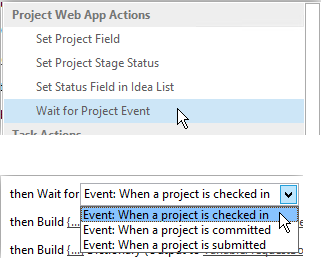
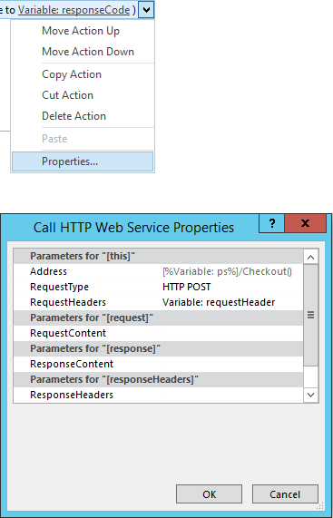
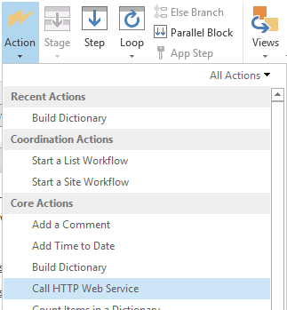
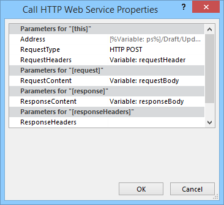

# Project Online でユーザー設定フィールドを一括更新し、ワークフローからプロジェクト サイトを作成する

お客様が project online を最大限に活用し、サービスの拡張性と柔軟性を向上させるために、project online のアプリとワークフローで使用できるクライアント側オブジェクトモデルに2つのメソッドを追加しました。
  
|||
|:-----|:-----|
|**UpdateCustomFields**   |プロジェクトユーザー設定フィールドを一括更新します。 Project Online の場合のみ。 REST API でのみ使用できます。    |
|**CreateProjectSite**   | プロジェクトサイトを作成します。 Project Online の場合のみ。 REST API、マネージクライアントオブジェクトモデル、および JavaScript クライアントオブジェクトモデルで使用できます。    |
   
これらの方法では、柔軟性が向上するだけでなく、プロジェクトをワークフローに保存して発行するときのパフォーマンスも大幅に向上しています。 この記事では、REST API のメソッドを使用する方法について説明し、ユーザー設定フィールドおよびプロジェクトサイトを作成するワークフローを一括で更新するワークフローを作成するための手順を示します。
  
> [!NOTE]
> sharepoint 2013 ワークフローから REST api を呼び出す方法の詳細については、「 [POST メソッドを使用してワークフローから sharepoint rest サービスを使用](https://mysharepointinsight.blogspot.com/2013/05/using-sharepoint-rest-services-from.mdl)する」および「sharepoint [Designer ワークフローから sharepoint 2013 rest api を呼び出す](https://sergeluca.wordpress.com/2013/04/09/calling-the-sharepoint-2013-rest-api-from-a-sharepoint-designer-workflow/)」を参照してください。 
  
## ワークフローからのプロジェクトユーザー設定フィールドの一括更新

以前は、ワークフローは一度に1つのユーザー設定フィールドしか更新できませんでした。 一度に1つのプロジェクトユーザー設定フィールドを更新すると、ユーザーがプロジェクト詳細ページ間を移行するときに、エンドユーザーの作業が遅くなる可能性があります。 各更新プログラムでは、[**プロジェクトフィールドの設定]** アクションを使用して、複数のユーザー設定フィールドを高待機時間の低帯域幅のネットワーク上で更新することによって、単純なオーバーヘッドが発生しました。 この問題を解決するには、 **UpdateCustomFields**メソッドを REST API に追加して、ユーザー設定フィールドを一括更新できるようにしました。 **UpdateCustomFields**を使用するには、更新するすべてのユーザー設定フィールドの名前と値を含むディクショナリを渡します。
  
REST メソッドは、次のエンドポイントにあります。
  
`https://<site-url>/_api/ProjectServer/Projects('<guid>')/Draft/UpdateCustomFields()`
  
> [!NOTE]
> 例の`<site-url>`プレースホルダーを、project Web App (PWA) サイトの URL、およびプロジェクト UID を含む`<guid>`プレースホルダーに置き換えます。 
  
このセクションでは、プロジェクトのユーザー設定フィールドを一括更新するワークフローを作成する方法について説明します。 ワークフローは、次の大まかな手順に従います。
  
- 更新するプロジェクトがチェックインされるまで待機する
    
- プロジェクトのすべてのユーザー設定フィールドの更新を定義するデータセットを構築する
    
- プロジェクトをチェックアウトする
    
- **UpdateCustomFields**を呼び出して、ユーザー設定フィールドの更新をプロジェクトに適用します。 
    
- 関連情報をワークフロー履歴リストに記録する (必要な場合)
    
- プロジェクトを発行する
    
- プロジェクトをチェックインする
    
最終的なエンドツーエンドのワークフローは、次のようになります。
  

  
### ユーザー設定フィールドを一括更新するワークフローを作成するには

1. 省略可能です。 ワークフロー全体で使用できる変数に、プロジェクトの完全な URL を格納します。
    
    
  
2. [**プロジェクトイベントの待機**] アクションをワークフローに追加し、[**プロジェクトのチェックイン時**] イベントを選択します。 
    
    
  
3. 「Create **dictionary** action」アクションを使用して、 **requestHeader**辞書を作成します。 このワークフローのすべての web サービス呼び出しに対して同じ要求ヘッダーを使用します。 
    
    
  
4. 次の2つの項目をディクショナリに追加します。
    
    |名前|型|値|
    |:-----|:-----|:-----|
    |Accept    |String    |application/json;odata = verbose    |
    |Content-Type    |String    |application/json;odata = verbose    |
   
    
  
5. 「**辞書を構築**する」アクションを使用して、 **requestbody**辞書を作成します。 この辞書には、適用するすべてのフィールドの更新が格納されます。 
    
    各ユーザー設定フィールドの更新では、フィールドの (1) メタデータ型、(2) キー、(3) 値、および (4) 値の型の4つの行が必要です。
    
    - **__ メタデータ/型**フィールドのメタデータ型。 このレコードは常に同じであり、次の値を使用します。 
    
       - Name: customfielddictionary (i)/__ metadata/type (ここで、 **i**は0から始まる辞書内の各ユーザー設定フィールドのインデックス) 
            
       - 型:String
            
       - 値: SP。KeyValue
    
       
  
    - **キー**ユーザー設定フィールドの内部名 (形式: *Custom_ce23fbf43fa0e411941000155d3c8201* 
    
       **InternalName**エンドポイントに移動することで、ユーザー設定フィールドの内部名を検索できます。`https://<site-url>/_api/ProjectServer/CustomFields('<guid>')/InternalName`
    
       ユーザー設定フィールドを手動で作成した場合、値はサイトごとに異なります。 複数のサイト間でワークフローを再利用することを計画している場合は、ユーザー設定フィールド id が正しいことを確認してください。
    
    - **値**ユーザー設定フィールドに割り当てる値を指定します。 参照テーブルにリンクされているユーザー設定フィールドの場合は、実際の参照テーブルの値の代わりに、参照テーブルのエントリの内部名を使用する必要があります。 
    
       参照テーブルエントリの内部名は、次のエンドポイントで確認できます。`https://<site-url>/_api/ProjectServer/CustomFields('<guid>')/LookupEntries('<guid>')/InternalName`
    
       複数の値を受け入れるように参照テーブルのユーザー設定フィールドが設定さ`;#`れている場合は、を使用して値を連結します (下記の辞書例を参照)。 
    
    - **ValueType**更新するユーザー設定フィールドの種類を示します。 
    
       - Text、Duration、Flag、および lookuptable フィールドの場合は、Edm を使用します。
    
       - 数値フィールドの場合は、edm を使用して、またはその他の OData 承認番号の種類を使用します。
    
       - 日付フィールドについては、Edm を使用します。
    
       次の辞書例では、3つのユーザー設定フィールドの更新を定義しています。 1つ目は、複数値の参照テーブルのユーザー設定フィールドで、2番目は数値フィールドで、3番目は日付フィールド用です。 **customfielddictionary**インデックスがどのようにインクリメントされるかに注目してください。 
    
       > [!NOTE]
       > これらの値は、説明のみを目的としています。 使用するキーと値のペアは、PWA のデータによって異なります。 
  
       |名前|型|値|
       |:-----|:-----|:-----|
       |customfielddictionary (0)/__ metadata/type    |String    |sp2.KeyValue    |
       |customfielddictionary (0)/キー    |String    |カスタム\_ce23fbf43fa0e411941000155d3c8201    |
       |customfielddictionary (0)/Value    |String    |Entry\_b9a2fd69279de411940f00155d3c8201; #Entry\_baa2fd69279de411940f00155d3c8201    |
       |customfielddictionary (0)/ValueType    |String    |Edm.String    |
       |customfielddictionary (1)/__ metadata/type    |String    |sp2.KeyValue    |
       |customfielddictionary (1)/キー    |String    |Custom_c7f114c97098e411940f00155d3c8201    |
       |customfielddictionary (1)/Value    |String    |90.5    |
       |customfielddictionary (1)/ValueType    |String    |Edm.Double    |
       |customfielddictionary (2)/__ metadata/type    |String    |sp2.KeyValue    |
       |customfielddictionary (2)/キー    |String    |Custom_c6fb67e0b9a1e411941000155d3c8201    |
       |customfielddictionary (2)/Value    |String    |2015-04-01t00:00: 00.0000000    |
       |customfielddictionary (2)/ValueType    |String    |Edm.DateTime    |
   
       
  
6. [ **HTTP Web サービスの呼び出し**] アクションを追加して、プロジェクトをチェックアウトします。 
    
    
  
7. web サービス呼び出しのプロパティを編集して、要求ヘッダーを指定します。 [**プロパティ**] ダイアログボックスを開くには、アクションを右クリックして [**プロパティ**] を選択します。
    
    
  
8. **UpdateCustomFields**メソッドを呼び出す**HTTP Web サービスの呼び出し**アクションを追加します。 
    
    
  
    web サービス`/Draft/` URL のセグメントをメモします。 完全な URL は次のようになります。`https://<site-url>/_api/ProjectServer/Projects('<guid>')/Draft/UpdateCustomFields()`
    
    
  
9. web サービス呼び出しのプロパティを編集して、作成した辞書に**RequestHeader**および**requestcontent**パラメーターをバインドします。 また、新しい変数を作成して、応答可能な**テント**を格納することもできます。
    
    
  
10. 省略可能です。 応答ディクショナリから読み取り、キュージョブの状態を確認し、ワークフロー履歴リストに情報を記録します。
    
    
  
11. web サービス呼び出しを**発行**エンドポイントに追加して、プロジェクトを発行します。 常に同じ要求ヘッダーを使用します。 
    
    
  
    
  
12. プロジェクトをチェックインするための、最後の web サービス呼び出しを**Checkin**エンドポイントに追加します。 
    
    
  
    

## ワークフローからプロジェクトサイトを作成する

各プロジェクトには、チームメンバーが共同作業を行ったり、ドキュメントを共有したり、問題を発生させたりできる、独自の専用の SharePoint サイトを含めることができます。 以前は、サイトは、最初に発行するとき、または project Professional のプロジェクトマネージャー、または管理者が PWA 設定で手動で作成することができます。または、無効にすることもできます。
  
プロジェクトサイトを作成するタイミングを選択できるように、 **createprojectsite**メソッドを追加しました。 これは、プロジェクト提案が最初の発行時ではなく、定義済みのワークフローの特定のステージに達したときに、サイトを自動的に作成する必要がある組織に特に便利です。 プロジェクトサイトの作成を延期すると、プロジェクトの作成のパフォーマンスが大幅に向上します。 
  
**前提条件:****createprojectsite**を使用できるようにするには、「 **PWA**設定 > * * 接続された SharePoint サイト * * > の**設定**で、 **[ユーザーに選択を許可する]** 設定を [プロジェクトサイトの作成] に設定する必要があります。
  
![PWA 設定で [ユーザーに選択を許可する]] を設定する(media/6c6c8175-eb10-431d-8056-cea55718fdb4.png "ユーザーが PWA 設定で選択できるようにする設定")
  
### プロジェクトサイトを作成するワークフローを作成するには

1. 既存のワークフローを作成または編集し、プロジェクトサイトを作成する手順を選択します。
    
2. 「Create **dictionary** action」アクションを使用して、 **requestHeader**辞書を作成します。 
    
    
  
3. 次の2つの項目をディクショナリに追加します。
    
    |名前|型|値|
    |:-----|:-----|:-----|
    |Accept    |String    |application/json;odata = verbose    |
    |Content-Type    |String    |application/json;odata = verbose    |
   
    
  
4. [ **HTTP Web サービスの呼び出し**] アクションを追加します。 **POST**を使用するように要求の種類を変更し、次の形式を使用して URL を設定します。
    
    `https://<site-url>/_api/ProjectServer/Projects('<guid>')/CreateProjectSite('New web name')`
    
    
  
    プロジェクトサイトの名前を文字列として**createprojectsite**メソッドに渡します。 プロジェクト名をサイト名として使用するには、空の文字列を渡します。 次に作成するプロジェクトサイトが機能するように、一意の名前を使用してください。 
    
5. web サービス呼び出しのプロパティを編集して、作成した辞書に**RequestHeader**パラメーターをバインドします。 
    
    
  
## 関連項目

- [Project のプログラミング タスク](project-programming-tasks.md)
- [Project 2013 のクライアント側オブジェクト モデル (CSOM)](client-side-object-model-csom-for-project-2013.md)
- [SharePoint 2013 のワークフロー](https://msdn.microsoft.com/library/e0602371-ae22-44be-8a7e-9e47e9f046d6%28Office.15%29.aspx)
    

