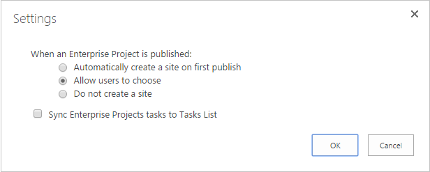

# Project Online でユーザー設定フィールドを一括更新し、ワークフローからプロジェクト サイトを作成する

お客様のオンライン プロジェクトを最大限に活用し、当社のサービスの拡張性と柔軟性を向上させるために、2 つの方法オンライン プロジェクトのアプリケーションとワークフローで使用できるクライアント側オブジェクト モデルに追加しました。
  
|||
|:-----|:-----|
|**UpdateCustomFields**   |一括では、プロジェクトのユーザー設定フィールドを更新します。 オンライン プロジェクトのみです。 REST API でのみ使用できます。    |
|**CreateProjectSite**   | プロジェクト サイトを作成します。 オンライン プロジェクトのみです。 REST API、マネージ クライアント オブジェクト モデル、および JavaScript クライアント オブジェクト モデルで使用できます。    |
   
高い柔軟性を提供し、これらのメソッドは、保存とワークフロー内でプロジェクトを発行するときに、大幅なパフォーマンス向上も提供します。 ここでは、REST API のメソッドを使用する方法について説明し、その一括更新のユーザー設定フィールドおよびプロジェクトのサイトを作成するワークフローは、ワークフローを作成する方法について説明します。
  
> [!NOTE]
> SharePoint 2013 ワークフローから REST Api を呼び出す方法の詳細については、 [POST メソッドを使用してワークフローからを使用して SharePoint の他のサービス](https://mysharepointinsight.blogspot.com/2013/05/using-sharepoint-rest-services-from.mdl)と[SharePoint ワークフロー デザイナーから SharePoint 2013 の Rest API の呼び出し](https://sergeluca.wordpress.com/2013/04/09/calling-the-sharepoint-2013-rest-api-from-a-sharepoint-designer-workflow/)を参照してください。 
  
## ワークフローの一括更新プロジェクトのユーザー設定フィールド

以前は、ワークフローは一度に 1 つのユーザー設定フィールドを更新する可能性がありますだけです。 1 つのプロジェクト ユーザー設定フィールドを更新する場合は、プロジェクト詳細ページ間でユーザーの移行とに不適切なエンド ユーザー エクスペリエンスを可能性があります。 各更新プログラムには、**プロジェクト フィールドの設定**アクションを使用して別のサーバー要求が必要な高レーテンシーの複数のユーザー設定フィールドを更新するには、低帯域幅ネットワークの結果、重要なオーバーヘッドです。 この問題を解決するには、REST API を一括することがユーザー設定フィールドを更新する**UpdateCustomFields**メソッドを追加しました。 **UpdateCustomFields**を使用するには、名前と、更新するすべてのユーザー設定フィールドの値を格納しているディクショナリを渡します。
  
残りの部分メソッドに次の端点にあります。
  
`https://<site-url>/_api/ProjectServer/Projects('<guid>')/Draft/UpdateCustomFields()`
  
> [!NOTE]
> 交換して、 `<site-url>` 、Project Web App (PWA) サイトの URL の例ではプレース ホルダーと、 `<guid>` 、プロジェクトの UID を持つプレース ホルダー。 
  
このセクションでは、プロジェクトのユーザー設定フィールドを一括で更新するワークフローを作成する方法について説明します。 ワークフローは、これらの大まかな手順を次に示します。
  
- プロジェクト チェック アウトを取得するのにを更新するまで待つ
    
- プロジェクト用に、ユーザー設定フィールドのすべての更新を定義するデータ セットを作成します。
    
- プロジェクトをチェック アウト
    
- プロジェクトにユーザー設定フィールドの更新プログラムを適用する**UpdateCustomFields**を呼び出す 
    
- (必要な場合)、ワークフロー履歴リストに関連する情報をログに記録します。
    
- プロジェクトを発行する
    
- プロジェクトをチェックインします。
    
最後に、エンド ・ ツー ・ エンドのワークフローは、次のようになります。
  

  
### 一括でユーザー設定フィールドを更新するワークフローを作成するには

1. 省略可能。 ワークフロー全体で使用できる変数には、プロジェクトの完全な URL を格納します。
    
    
  
2. **プロジェクト イベントを待機**アクションをワークフローに追加し、**プロジェクトをチェックインするとき**のイベントを選択します。 
    
    
  
3. **ディクショナリのビルド**アクションを使用して**requestHeader**辞書を作成します。 このワークフローで web サービスを呼び出すすべての同一の要求ヘッダーを使用します。 
    
    
  
4. 辞書には、次の 2 つの項目を追加します。
    
    |名前|種類|値|
    |:-----|:-----|:-----|
    |Accept    |String    |アプリケーションまたは json です。odata = 詳細    |
    |Content-Type    |String    |アプリケーションまたは json です。odata = 詳細    |
   
    
  
5. **ディクショナリのビルド**アクションを使用して**requestBody**辞書を作成します。 このディクショナリでは、適用するすべてのフィールドの更新を格納します。 
    
    各ユーザー設定フィールドの更新プログラムには、4 つの行が必要です: フィールドのメタデータ (1) 型、キー (2)、(3) の値、および (4) の値型です。
    
    - **__metadata/タイプ**フィールドのメタデータのタイプです。 このレコードは、常に同じと次の値を使用しています。 
    
       - 名: customFieldDictionary (i)/__metadata/タイプ ( **i**は 0 から始まる、ディクショナリ内の各ユーザー設定フィールドのインデックス) 
            
       - 型:String
            
       - 値: sp へKeyValue
    
       
  
    - **キー**形式で、ユーザー設定フィールドの内部名: *Custom_ce23fbf43fa0e411941000155d3c8201* 
    
       **InternalName**エンドポイントに移動すると、ユーザー設定フィールドの内部名をご覧ください。`https://<site-url>/_api/ProjectServer/CustomFields('<guid>')/InternalName`
    
       ユーザー設定フィールドを手動で作成した場合の値をサイトからサイトへと異なります。 複数のサイト間でワークフローを再利用する場合は、ユーザー設定フィールド Id が正しいことを確認します。
    
    - **値**ユーザー設定フィールドに割り当てる値です。 ルックアップ テーブルにリンクされているユーザー設定フィールド、実際の参照テーブルの値の代わりにルックアップ テーブルのエントリの内部名を使用する必要があります。 
    
       次のエンドポイントでは内部参照テーブルのエントリの名前をご覧ください。`https://<site-url>/_api/ProjectServer/CustomFields('<guid>')/LookupEntries('<guid>')/InternalName`
    
       ルックアップ テーブル カスタム フィールド セットに複数の値をそのまま使用、使用した場合`;#`に示すように次の例の辞書) の値を連結します。 
    
    - **値型**更新するにはユーザー設定フィールドの型。 
    
       - テキスト、期間、フラグ、および LookupTable のフィールドの Edm.String を使用して、
    
       - 数値フィールドは、「Edm.Int32、Edm.Double、またはその他の OData に受け入れられている数値型の使用」を使用していますください。
    
       - 日付フィールドでは、Edm.DateTime を使用して、
    
       下の辞書の例では、次の 3 つのユーザー設定フィールド用の更新プログラムを定義します。 複数値ルックアップ テーブルのカスタム フィールドは、最初、2 番目の数値型フィールドでは、日付フィールドには、3 つ目。 注方法**customFieldDictionary**インデックスの増分値です。 
    
       > [!NOTE]
       > これらの値は、例示目的でのみです。 使用するキーと値のペアは、PWA のデータによって異なります。 
  
       |名前|種類|値|
       |:-----|:-----|:-----|
       |customFieldDictionary (0)/__metadata/タイプ    |String    |SP へKeyValue    |
       |customFieldDictionary (0)/キー    |String    |カスタム\_ce23fbf43fa0e411941000155d3c8201    |
       |customFieldDictionary (0)/値    |String    |エントリ\_b9a2fd69279de411940f00155d3c8201; #Entry\_baa2fd69279de411940f00155d3c8201    |
       |customFieldDictionary (0) または値型    |String    |Edm.String    |
       |customFieldDictionary (1)/__metadata/タイプ    |String    |SP へKeyValue    |
       |customFieldDictionary (1)/キー    |String    |Custom_c7f114c97098e411940f00155d3c8201    |
       |customFieldDictionary (1) と値    |String    |90.5    |
       |customFieldDictionary (1) または値型    |String    |Edm.Double    |
       |customFieldDictionary (2)/__metadata/タイプ    |String    |SP へKeyValue    |
       |customFieldDictionary (2)/キー    |String    |Custom_c6fb67e0b9a1e411941000155d3c8201    |
       |customFieldDictionary (2) と値    |String    |2015-04-01T00:00:00.0000000    |
       |customFieldDictionary (2) または値型    |String    |Edm.DateTime    |
   
       
  
6. プロジェクトをチェック アウトするには、 **HTTP Web サービスを呼び出す**アクションを追加します。 
    
    
  
7. Web サービス呼び出しの要求ヘッダーを指定するのプロパティを編集します。 **プロパティ**] ダイアログ ボックスを開くには、アクションを右クリックして**プロパティ**を選択します。
    
    
  
8. **UpdateCustomFields**メソッドを呼び出して、 **HTTP Web サービスを呼び出す**アクションを追加します。 
    
    
  
    注、 `/Draft/` 、web サービスの URL のセグメントです。 完全な URL は、次のようになります。`https://<site-url>/_api/ProjectServer/Projects('<guid>')/Draft/UpdateCustomFields()`
    
    
  
9. 作成した辞書を**RequestHeader**と**RequestContent**のパラメーターをバインドする web サービスの呼び出しのプロパティを編集します。 **ResponseContent**を格納する新しい変数を作成することもできます。
    
    
  
10. 省略可能。 キュー ジョブの状態を確認し、ワークフローの履歴リストに情報をログに記録する応答のディクショナリから読み込まれます。
    
    
  
11. プロジェクトを発行する**発行**エンドポイントに web サービスの呼び出しを追加します。 常に同じ要求ヘッダーを使用します。 
    
    
  
    
  
12. プロジェクトをチェックインする**チェックイン**のエンドポイントに最終的な web サービス呼び出しを追加します。 
    
    
  
    

## ワークフローからのプロジェクト サイトを作成します。

すべてのプロジェクトは、チーム メンバーが共同作業を行うドキュメントを共有、問題を発生させるに表示され、それぞれ専用の SharePoint サイトを持つことができます。 以前は、サイトがのみを作成する自動的に発行または手動で Project Professional でプロジェクト マネージャーまたは管理者は、PWA での設定、またはそれらを無効にでした。
  
プロジェクト サイトを作成する場合に選択することができますので、 **CreateProjectSite**メソッドを追加しました。 これは、組織ユーザーが最初に発行するのではなく、プロジェクトの提案が、定義済みのワークフローの特定の段階に達すると自動的に自分のサイトを作成する場合に特に役立ちます。 プロジェクト サイトの作成を大幅に延期すると、プロジェクトの作成のパフォーマンスが向上します。 
  
**前提条件:****PWA の設定**でプロジェクト サイトの作成**を選択するユーザーを許可する**設定を設定する必要があります**CreateProjectSite**を使用する前に > * * 接続されている SharePoint サイト * * >**設定**します。
  

  
### プロジェクト サイトを作成するワークフローを作成するには

1. 作成または既存のワークフローを編集し、プロジェクト サイトを作成するステップを選択します。
    
2. **ディクショナリのビルド**アクションを使用して**requestHeader**辞書を作成します。 
    
    
  
3. 辞書には、次の 2 つの項目を追加します。
    
    |名前|種類|値|
    |:-----|:-----|:-----|
    |Accept    |String    |アプリケーションまたは json です。odata = 詳細    |
    |Content-Type    |String    |アプリケーションまたは json です。odata = 詳細    |
   
    
  
4. **HTTP Web サービスを呼び出す**アクションを追加します。 **POST**を使用する要求の種類を変更し、次の形式を使用して URL を設定します。
    
    `https://<site-url>/_api/ProjectServer/Projects('<guid>')/CreateProjectSite('New web name')`
    
    
  
    プロジェクト サイトの名前を**CreateProjectSite**メソッドに文字列として渡します。 サイト名としてプロジェクト名を使用するには、空の文字列を渡します。 作業は、次にプロジェクト サイトを作成するために一意の名前を使用することを確認します。 
    
5. 作成した辞書を**RequestHeader**パラメーターにバインドする web サービスの呼び出しのプロパティを編集します。 
    
    
  
## 関連項目

- [Project のプログラミング タスク](project-programming-tasks.md)
- [Project 2013 のクライアント側オブジェクト モデル (CSOM)](client-side-object-model-csom-for-project-2013.md)
- [Microsoft SharePoint 2010 SDK へようこそ](https://msdn.microsoft.com/library/e0602371-ae22-44be-8a7e-9e47e9f046d6%28Office.15%29.aspx)
    

