# Project Online でユーザー設定フィールドを一括更新し、ワークフローからプロジェクト サイトを作成する

Project Online を最大限に利用し、サービスの拡張性と柔軟性を向上させるために、Project Online アプリとワークフローで使用できる 2 つのメソッドをクライアント側オブジェクト モデルに追加しました。
  
|||
|:-----|:-----|
|**UpdateCustomFields**   |プロジェクトのユーザー設定フィールドを一括更新します。 このProject Onlineします。 REST API でのみ使用できます。    |
|**CreateProjectSite**   | サイトをProjectします。 このProject Onlineします。 REST API、マネージ クライアント オブジェクト モデル、JavaScript クライアント オブジェクト モデルで使用できます。    |
   
これらのメソッドは、柔軟性の向上に加えて、ワークフローでプロジェクトを保存および発行する際のパフォーマンスも大幅に向上します。 この記事では、REST API でメソッドを使用する方法について説明し、カスタム フィールドを一括更新するワークフローと、カスタム サイトを作成するワークフローを作成するProjectします。
  
> [!NOTE]
> SharePoint 2013 ワークフローから REST API を呼び出す方法の詳細については[、「POST](https://mysharepointinsight.blogspot.com/2013/05/using-sharepoint-rest-services-from.mdl)メソッドを使用してワークフローから SharePoint REST サービスを使用する」および「SharePoint Designer ワークフローから[SharePoint 2013 Rest API](https://sergeluca.wordpress.com/2013/04/09/calling-the-sharepoint-2013-rest-api-from-a-sharepoint-designer-workflow/)を呼び出す」を参照してください。 
  
## ワークフローからプロジェクトのユーザー設定フィールドを一括更新する

以前は、ワークフローで更新できるユーザー設定フィールドは一度に 1 つのみです。 プロジェクトのユーザー設定フィールドを 1 度に 1 つ更新すると、ユーザーが詳細ページ間で切り替わると、エンド Project低下する可能性があります。 各更新プログラムでは **、[Project フィールド** の設定] アクションを使用して個別のサーバー要求を要求し、高遅延で低帯域幅のネットワークで複数のユーザー設定フィールドを更新すると、簡単ではないオーバーヘッドが発生しました。 この問題を解決するために、カスタム フィールドを一括更新できる **UpdateCustomFields** メソッドを REST API に追加しました。 **UpdateCustomFields** を使用するには、更新するユーザー設定フィールドの名前と値を含む辞書を渡します。
  
REST メソッドは、次のエンドポイントで確認できます。
  
`https://<site-url>/_api/ProjectServer/Projects('<guid>')/Draft/UpdateCustomFields()`
  
> [!NOTE]
> 例のプレースホルダーを、プロジェクト UID Project Web App (PWA) サイトの URL に `<site-url>` `<guid>` 置き換えてください。 
  
このセクションでは、プロジェクトのユーザー設定フィールドを一括更新するワークフローを作成する方法について説明します。 ワークフローは、次の高レベルの手順に従います。
  
- 更新するプロジェクトがチェックインされるのを待つ
    
- プロジェクトのすべてのユーザー設定フィールド更新を定義するデータ セットを作成する
    
- プロジェクトをチェックアウトする
    
- **UpdateCustomFields を呼び** 出して、ユーザー設定フィールドの更新プログラムをプロジェクトに適用する 
    
- 関連情報をワークフロー履歴リストに記録する (必要な場合)
    
- プロジェクトを発行する
    
- プロジェクトをチェックインする
    
最終的なエンドツーエンドのワークフローは次のように表示されます。
  
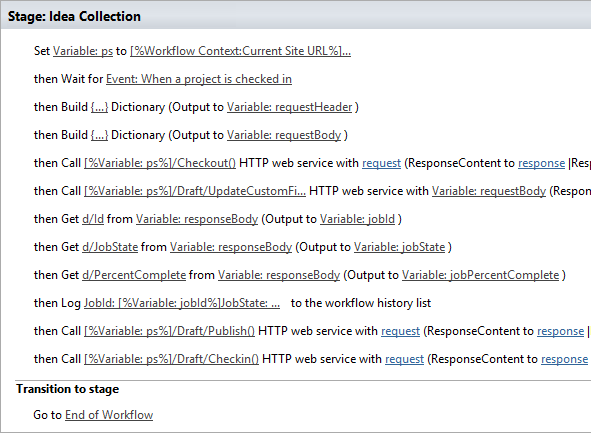
  
### ユーザー設定フィールドを一括更新するワークフローを作成するには

1. オプション。 プロジェクトの完全な URL を、ワークフロー全体で使用できる変数に格納します。
    
    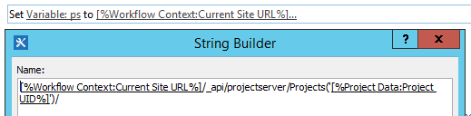
  
2. [イベント **の待機Project]** アクションをワークフローに追加し、[プロジェクトがチェックイン **された場合] イベントを選択** します。 
    
    ![[プロジェクトがチェックインされる]のを待つ] でプロジェクト(media/699aa9c7-b3c9-426e-a775-96993a13559c.png "がチェックインされるのを待つ")
  
3. [辞書の **作成] アクションを** 使用して **requestHeader ディクショナリを作成** します。 このワークフローのすべての Web サービス呼び出しに同じ要求ヘッダーを使用します。 
    
    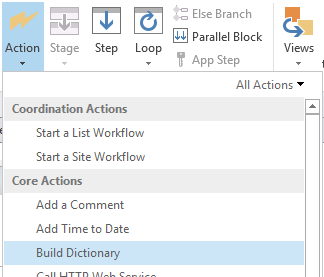
  
4. 辞書に次の 2 つの項目を追加します。
    
    |名前|型|値|
    |:-----|:-----|:-----|
    |Accept    |String    |application/json;odata=verbose    |
    |Content-Type    |文字列    |application/json;odata=verbose    |
   
    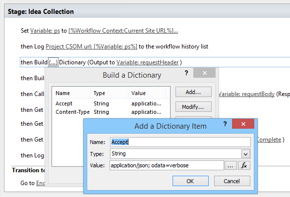
  
5. [辞書の **作成]** アクションを使用して **requestBody ディクショナリを作成** します。 この辞書には、適用するフィールド更新プログラムすべてが格納されます。 
    
    各ユーザー設定フィールドの更新には、フィールドの (1) メタデータ型、(2) キー、(3) 値、および (4) 値の種類の 4 つの行が必要です。
    
    - **__metadata/型** フィールドのメタデータ型。 このレコードは常に同じであり、次の値を使用します。 
    
       - 名前: customFieldDictionary(i)/__metadata/type (ここで **、i** は辞書内の各ユーザー設定フィールドのインデックスで、0 から始まる) 
            
       - 型:String
            
       - 値: SP。KeyValue
    
       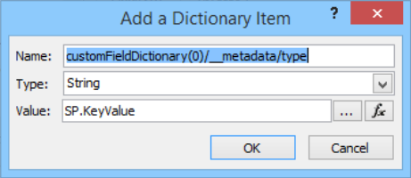
  
    - **キー** ユーザー設定フィールドの内部名 (*形式:* Custom_ce23fbf43fa0e411941000155d3c8201 
    
       カスタム フィールドの内部名を見つけるには、そのユーザー設定フィールドの **InternalName エンドポイントに移動** します。 `https://<site-url>/_api/ProjectServer/CustomFields('<guid>')/InternalName`
    
       ユーザー設定フィールドを手動で作成した場合、値はサイトごとに異なります。 複数のサイトでワークフローを再利用する場合は、ユーザー設定フィールドの ID が正しいか確認してください。
    
    - **値** ユーザー設定フィールドに割り当てる値。 参照テーブルにリンクされているユーザー設定フィールドの場合は、実際の参照テーブル値ではなく、参照テーブル エントリの内部名を使用する必要があります。 
    
       参照テーブル エントリの内部名は、次のエンドポイントで確認できます。 `https://<site-url>/_api/ProjectServer/CustomFields('<guid>')/LookupEntries('<guid>')/InternalName`
    
       複数の値を受け入れるルックアップ テーブルのユーザー設定フィールドが設定されている場合は、値を連結するために使用します (以下の辞書例に  `;#` 示すように)。 
    
    - **ValueType** 更新するユーザー設定フィールドの種類。 
    
       - テキスト、期間、フラグ、および LookupTable フィールドの場合は、Edm.String を使用します。
    
       - [数値] フィールドには、Edm.Int32、Edm.Double、または他の OData で受け入れられる数値の種類を使用します。
    
       - [日付] フィールドには、Edm.DateTime を使用します。
    
       次の辞書の例では、3 つのユーザー設定フィールドの更新プログラムを定義します。 1 つ目は複数値参照テーブルのユーザー設定フィールド、2 つ目は数値フィールド、3 つ目は日付フィールド用です。 **customFieldDictionary インデックスの** 増分方法に注意してください。 
    
       > [!NOTE]
       > これらの値は、説明のみを目的とします。 使用するキーと値の組み合PWAします。 
  
       |名前|型|値|
       |:-----|:-----|:-----|
       |customFieldDictionary(0)/__metadata/type    |String    |SP。KeyValue    |
       |customFieldDictionary(0)/Key    |String    |カスタム \_ ce23fbf43fa0e411941000155d3c8201    |
       |customFieldDictionary(0)/Value    |String    |エントリ \_ b9a2fd69279de411940f00155d3c8201;#Entry \_ baa2fd69279de411940f00155d3c8201    |
       |customFieldDictionary(0)/ValueType    |String    |Edm.String    |
       |customFieldDictionary(1)/__metadata/type    |String    |SP。KeyValue    |
       |customFieldDictionary(1)/Key    |String    |Custom_c7f114c97098e411940f00155d3c8201    |
       |customFieldDictionary(1)/Value    |String    |90.5    |
       |customFieldDictionary(1)/ValueType    |String    |Edm.Double    |
       |customFieldDictionary(2)/__metadata/type    |String    |SP。KeyValue    |
       |customFieldDictionary(2)/Key    |String    |Custom_c6fb67e0b9a1e411941000155d3c8201    |
       |customFieldDictionary(2)/Value    |String    |2015-04-01T00:00:00    |
       |customFieldDictionary(2)/ValueType    |String    |Edm.DateTime    |
   
       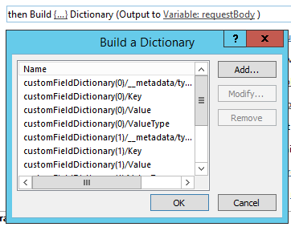
  
6. [HTTP **Web サービスの呼び出し] アクションを** 追加して、プロジェクトをチェックアウトします。 
    
    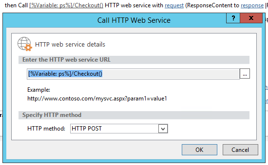
  
7. Web サービス呼び出しのプロパティを編集して、要求ヘッダーを指定します。 [プロパティ] **ダイアログ ボックスを** 開く場合は、アクションを右クリックし、[プロパティ] を **選択します**。
    
    ![Web サービス呼び出しプロパティで要求ヘッダーを指定]する Web サービス呼び出しプロパティ(media/d81e92b1-43df-42ad-9cd0-a693f93b164e.png "で要求ヘッダーを指定する")
  
8. **UpdateCustomFields** メソッドを呼び出す HTTP Web サービスの呼び出しアクションを追加します。  
    
    ![[HTTP Web サービスの呼び出し] アクションを作成](media/9a73a201-c035-41b4-8798-506ac48b90f8.png "する HTTP Web サービスの呼")び出しアクションを作成する
  
    Web サービス  `/Draft/` URL のセグメントに注意してください。 完全な URL は次のように表示されます。 `https://<site-url>/_api/ProjectServer/Projects('<guid>')/Draft/UpdateCustomFields()`
    
    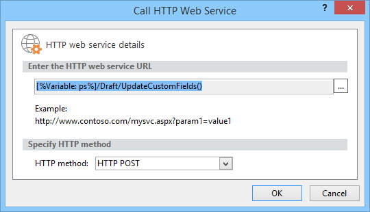
  
9. Web サービス呼び出しのプロパティを編集して **、RequestHeader** パラメーターと **RequestContent** パラメーターを作成した辞書にバインドします。 ResponseContent を格納する新しい **変数を作成できます**。
    
    ![辞書を要求ヘッダーとコンテンツに]バインドする 辞書を要求(media/f96bec92-138e-4eab-b1e7-1ab83d0428a5.png "ヘッダーとコンテンツにバインドする")
  
10. オプション。 応答辞書から読み取り、キュー ジョブの状態を確認し、ワークフロー履歴リストに情報を記録します。
    
    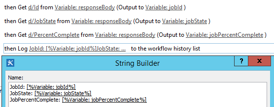
  
11. プロジェクトを発行する発行エンドポイントに Web サービス呼 **び** 出しを追加します。 常に同じ要求ヘッダーを使用します。 
    
    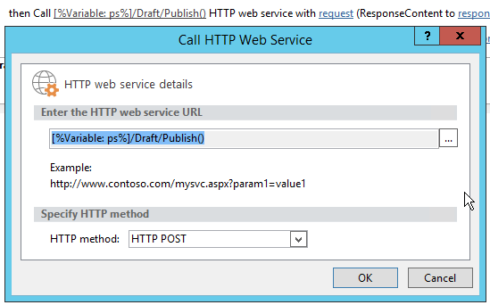
  
    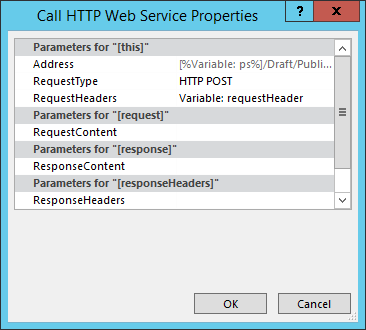
  
12. Checkin エンドポイントに最終的な Web サービス呼 **び出しを追加** して、プロジェクトをチェックインします。 
    
    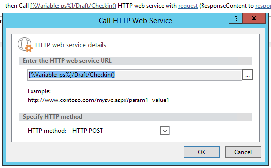
  
    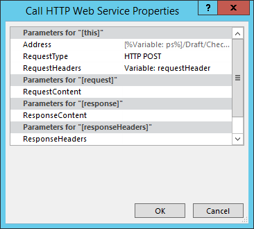

## ワークフローからProjectサイトを作成する

すべてのプロジェクトには、チーム メンバーが共同作業、ドキュメントSharePoint問題の発生など、独自の専用のサイトを用意できます。 以前は、Project Professional のプロジェクト マネージャーまたは PWA の設定で管理者が最初に発行または手動でサイトを自動的に作成するか、無効にすることもできます。
  
プロジェクト サイトを作成する場合を選択できるよう **、CreateProjectSite** メソッドが追加されました。 これは、プロジェクト提案が最初の発行ではなく、事前に定義されたワークフローの特定のステージに達したときにサイトを自動的に作成する組織にとって特に便利です。 プロジェクト サイトの作成を延期すると、プロジェクトの作成のパフォーマンスが大幅に向上します。 
  
**前提条件:****CreateProjectSite** を使用する前に **、PWA 設定**> ** Connected SharePoint Sites ** > 設定 でプロジェクト サイトの作成に対して [ユーザーに選択を許可する] 設定を設定する **必要があります**。
  
![[ユーザーの選択を許可する]]PWA設定(media/6c6c8175-eb10-431d-8056-cea55718fdb4.png "設定 設定")でユーザーが選択PWAする
  
### サイトを作成するワークフローをProjectするには

1. 既存のワークフローを作成または編集し、サイトを作成する手順をProjectします。
    
2. [辞書の **作成] アクションを** 使用して **requestHeader ディクショナリを作成** します。 
    
    
  
3. 辞書に次の 2 つの項目を追加します。
    
    |名前|型|値|
    |:-----|:-----|:-----|
    |Accept    |String    |application/json;odata=verbose    |
    |Content-Type    |文字列    |application/json;odata=verbose    |
   
    
  
4. [HTTP **Web サービスの呼び出し] アクションを追加** します。 POST を使用する要求 **の種類を** 変更し、次の形式で URL を設定します。
    
    `https://<site-url>/_api/ProjectServer/Projects('<guid>')/CreateProjectSite('New web name')`
    
    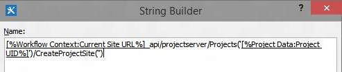
  
    サイトの名前を文字列Project **CreateProjectSite** メソッドに渡します。 プロジェクト名をサイト名として使用するには、空の文字列を渡します。 作成する次のプロジェクト サイトが機能するには、必ず一意の名前を使用してください。 
    
5. Web サービス呼び出しのプロパティを編集して **、RequestHeader** パラメーターを作成した辞書にバインドします。 
    
    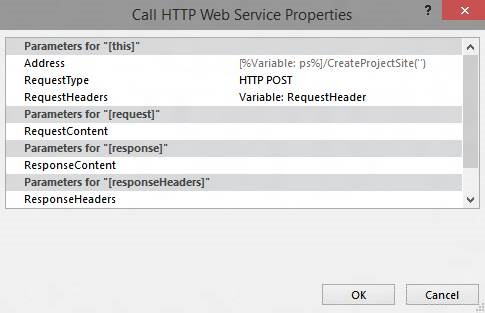
  
## 関連項目

- [Project のプログラミング タスク](project-programming-tasks.md)
- [Project 2013 のクライアント側オブジェクト モデル (CSOM)](client-side-object-model-csom-for-project-2013.md)
- [SharePoint 2013 のワークフロー](https://msdn.microsoft.com/library/e0602371-ae22-44be-8a7e-9e47e9f046d6%28Office.15%29.aspx)
    

