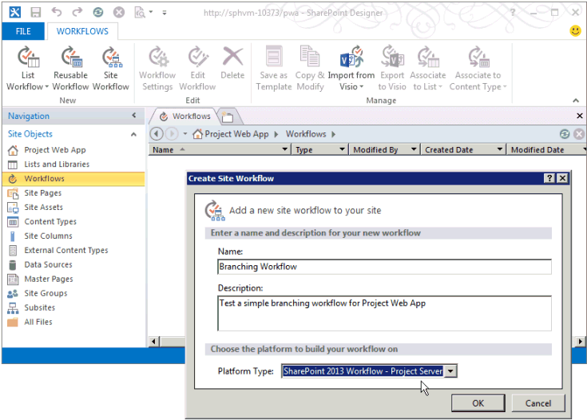

# 需要管理用の Project Server ワークフローの作成

この記事では、Designer 2013 で簡単なワークフローを作成するSharePoint説明します。 ワークフローを Visio 2013 にエクスポートして視覚化および編集したり、Visio 2013 を使用して Project Server 2013 ワークフローを設計し、SharePoint Designer 2013 にインポートして、Project Web App に発行することができます。 SharePoint ワークフロー プラットフォームと、Visio 2013 および SharePoint Designer 2013 を使用してワークフローを作成する方法の詳細については、SharePoint 2013 開発者向けドキュメントの[「SharePoint 2013](https://msdn.microsoft.com/library/jj163986%28office.15%29.aspx)のワークフロー」を参照してください。 
  
ワークフロー用の Project サーバーの準備の詳細については、「Start: Set up and configure SharePoint [2013」を参照ワークフロー マネージャー。](https://msdn.microsoft.com/library/jj163276%28office.15%29.aspx)

## 一般的なワークフローを作成する

次の手順を使用して、Project Designer 2013 を使用してサーバー 2013 SharePoint作成します。 ワークフローは、プロジェクト提案の需要管理を目的として設計されています。
  
詳細な手順については、「分岐ワークフローの [作成」セクションを参照](#pj15_CreateWorkflowSPD_Detailed) してください。 
  
### Project Server ワークフローを作成するには (一般的な手順)

1. 要件を決定し、ワークフローを設計します。フェーズおよびステージとして整理し、ワークフローが使用するユーザー設定フィールドを決定します。
    
2. このProject Web App、ワークフローに必要なエンティティを作成します。
    
    1. ワークフローの既存のフェーズを確認し、必要に応じてフェーズを作成します。
        
    2. ワークフローが使用するエンタープライズ ユーザー設定フィールドを作成します。ワークフローのステージで使用できるようにするには、ユーザー設定フィールドをワークフローで制御する必要があります。
        
    3. プロジェクトに関する情報を収集するためにワークフロー ステージが使用するプロジェクト詳細ページ (PDP) を編集または作成します。この例のステージでは、既定の PDP を編集して新しいユーザー設定フィールドを組み込みます。
        
    4. 必要なワークフロー ステージを作成し、各ワークフロー ステージを正しいフェーズと関連付けます。
    
3. [SharePoint デザイナー 2013 では、テキスト ベース デザイナーで宣言ステートメントを使用してワークフロー **を構築します**。
    
    > [!NOTE]
    > また、Visual Designer 2013 で visual **Designer** に切り替SharePoint、2013 から既存のワークフローをインポートVisioできます。 **テキストベース デザイナー** を使用する場合は以下の手順に従ってください。 
    > 
    > 1. サイトをProject Web Appし **、2013** ワークフロー - SharePoint Server ワークフロー プラットフォームを使用するサイト ワークフロー Project作成します。 
    > 2. ワークフローが使用するステージを追加します。
    > 3. 各ステージで必要なワークフローのステップ、条件、アクション、およびループを挿入します。
    > 4. ワークフローのエラーを調べて、ある場合は修正します。
    > 5. (省略可能)ビューを Visual **Designer に切り替** えるか、ワークフローを 2013 ファイルVisioエクスポートします。 Visio の表示を変更し、現在のワークフローに対する変更を保存できます。 デザイナー 2013 では、Visioファイルを編集してインポートSharePoint、他のワークフローを作成できます。
    > 6. ワークフローを発行します。 公開後、ワークフローはサイトのワークフローの一覧Project Web Appされます。
    
4. このProject Web App、プロジェクト提案の需要管理にワークフローを使用します。
    
    1. ワークフローを使用するエンタープライズ プロジェクト テンプレート (EPT) を作成します。
        
    2. [プロジェクト センター] ページで、ワークフローの EPT を使用するプロジェクトを作成し、ワークフローのステージに従います。
        
    3. ワークフローを詳細にテストします。
        
    4. 運用サーバーにワークフローを展開します。

## 分岐ワークフローを作成する

SharePoint Designer 2013 を使用して Project Server ワークフローを作成する前に、ワークフロー マネージャー クライアント 1.0 サービスが Project Server 2013 ワークフロー アクティビティを使用するように構成する必要があります。 ワークフロー マネージャー クライアント 1.0 を構成する方法については、「SharePoint Server 2013 開発者向けドキュメント」の[「SharePoint 2013](https://msdn.microsoft.com/library/jj163986%28office.15%29.aspx)のワークフロー」を参照してください。 
  
以下の詳細な手順には、「一般的なワークフローの作成」セクションと同 [じ手順が含](#pj15_CreateWorkflowSPD_General) まれています。 
  
### Project Server 分岐ワークフローを作成するには (詳細な手順)

#### 1. ワークフローを計画して設計します。

Project Server ワークフローは、需要管理プロセスの複数のステージおよびフェーズと統合できます。 ワークフローは複雑な場合があるので、ビジネス要件を理解し、注意深くワークフローを計画する必要があります。 簡単な例として、プロジェクト提案の予想コストを使用して、提案を受け入れるかどうかを決定する分岐ワークフローを設計します。 予想コストが 25,000 USD を超える場合は提案を拒否し、それ以外の場合は提案を受け入れてプロジェクトを作成します。
    
Visio 2013 および SharePoint Designer 2013 を使用して、Project Server 2013 のワークフローの設計と作成を支援することができるため、Project Server 2010 で可能なよりも簡単にワークフローを実験できます。 この記事のサンプル ワークフローデザインは、2010 SDK の分岐ワークフローの作成に関する記事Projectです。  Project Web App のテスト インスタンスを使用してリモート コンピューター上でテスト ワークフローを設計および作成できます。Project Server 2013 コンピューター上にワークフローを直接作成する必要はない。 
    
#### 2. ワークフローに必要なエンティティを作成します。

このProject Web App、使用可能なワークフロー フェーズとステージ、および使用可能なエンタープライズ ユーザー設定フィールドを確認します。 必要に応じて、次に示す手順で、ワークフローに必要なエンティティを作成します。
    
1. **ワークフロー フェーズ** 既定のインストールには、Project Web App、選択、計画、管理、完了の各フェーズが含まれます。 分岐ワークフローの例では、他のフェーズを作成する必要はありません。 
        
2. **Enterpriseユーザー設定フィールド** 分岐ワークフローには、ワークフロー制御されたプロジェクト コスト のユーザー設定フィールドが必要です。 ワークフローで制御されるユーザー設定フィールドの値は、ワークフローが使用する PDP で設定されます。 たとえば、Project Web App ページ **の右上** にある [設定] アイコンを選択し **、[PWA 設定]** を選択し、[カスタム フィールド] と **[** 参照テーブル] Enterprise を選択します。
        
   [プロジェクト] エンティティに対する「**提案のコスト**」という名前のユーザー設定フィールドを作成し、種類として [**コスト**] を選択します。 説明には「プロジェクト提案の見積もられたコスト」と入力します。 [**基本動作**] セクションでは、[**ワークフローによって制御される動作**] を選択します。
        
3. **Project詳細ページ** ワークフロー ステージで使用する PDP を編集または作成します。 たとえば、次の手順を実行します。 
        
    1. [サーバー設定] ページで [**プロジェクト詳細ページ**] を選択し、PDP として [**ProjectInformation**] を選択します。 
            
    2. リボンの [**ページ**] タブで、[**編集**] グループの [**ページの編集**] を選択します。
            
    3. [基本情報] Web パーツの上部右にある下矢印を選択し、[Web パーツの編集 **] を選択します**。 または、リボン **の [WEB パーツ**] タブの[プロパティ] グループで **、[Web** パーツのプロパティ] を選択してエディター パーツを表示します。 
            
    4. エディター パーツの [**表示されているプロジェクトのフィールド**] セクション (図 1 を参照) で、[**変更**] を選択します。
            
    5. [提案コスト **] ユーザー** 設定フィールドを追加し、[選択したフィールド] リストの [所有者] フィールドProject上に移動し **、[OK]** を選択します (図 1 を参照)。
      
    6. エディター パーツで [**OK**] をクリックし、リボンの [**ページ**] タブで [**編集**] グループの [**編集の終了**] を選択します。図 2 では、プロジェクトの情報 PDP に追加された **Proposal Cost** ユーザー設定フィールドを示します。 

    **図 1.PDP Projectフィールド Web パーツの編集**

    ![PDP Projectフィールド Web]パーツの編集 PDP Project(media/pj15_CreateWorkflowSPD_EditPDP.gif "フィールド Web パーツを編集する")

    **図 2. 提案のコスト ユーザー設定フィールドを含む編集後の PDP**

    ![編集した PDP には、[提案コスト] フィールドが含まれます]。編集された(media/pj15_CreateWorkflowSPD_EditedPDP.gif "PDP には [提案コスト] フィールドが含まれます。")
  
4. **ワークフロー ステージ** ワークフローの各フェーズに必要なステージを作成します。 [サーバーの設定] ページで [**ワークフロー ステージ**] を選択し、[**新しいワークフロー ステージ**] を選択します。 図 3 では、[ワークフロー ステージの追加] ページの一部を示します。
    
    **図 3. Project Web App でのワークフロー ステージの追加**

    
  
    分岐ワークフローの例では、表 1 に示す 4 つのステージを使用します。 [ワークフロー **ステージ設定ページProject** ページの [詳細ページの表示] セクション (図 3 に示されていない) では、値は省略可能です。[ワークフローの状態] ページで詳細を提供します。 たとえば、最初の提案の詳細 PDP にはユーザー入力が必要なので **、[Project** 詳細ページには注意が必要です] チェック ボックスをオンにし、[この PDP のプロジェクト名とコストを設定する] などの特定の説明を追加できます。
    
    図 4 では、[ワークフロー ステージ] ページで完成した 4 つのステージを示します。
    
    **表 1. 分岐ワークフローのステージ**

    |名前|説明|提出の説明|フェーズ|表示される PDP|ユーザー設定フィールド|
    |:-----|:-----|:-----|:-----|:-----|:-----|
    |初期段階の提案の詳細    |プロジェクト名とコストを設定します。    |提案としてプロジェクトを提出します。    |作成する    |プロジェクト情報    プロジェクトの詳細    |提案のコスト (必須)    |
    |プロジェクトの詳細    |提案されるプロジェクトの詳細を提供します。    |詳細を提出してプロジェクトを続行します。    |作成する    |プロジェクト情報    プロジェクトの詳細    |提案のコスト (読み取り専用)    |
    |自動的に却下    |提供された情報に基づいて提案を拒否します。    |   |作成する    |プロジェクト情報    |提案のコスト (読み取り専用)    |
    |実行    |提案を受け入れ、プロジェクト管理できる状態にします。    |   |管理    |プロジェクト情報    プロジェクトの詳細    |提案のコスト (読み取り専用)    |
   
    **図 4. Project Web App でのワークフロー ステージの一覧**

    ![[ワークフロー ステージの一覧] Project Web App]ワークフロー ステージの一(media/pj15_CreateWorkflowSPD_WorkflowStages.gif "覧Project Web App")
  
#### 3. デザイナーでワークフローをText-Basedします。

[SharePoint デザイナー 2013] で、デザイナーデザイナーで宣言ステートメントを使用してワークフローをText-Basedします。 オレンジ色の挿入行で入力を開始して、ワークフロー ロジックとステップの状況依存の自動補完ステートメントを取得したり、リボンの **[WORKFLOW]** タブの **[** 挿入] グループのコントロールを使用してロジックと手順を挿入できます。 
    
1. デザイナー 2013 のバックSharePointで、[サイトを開く]**を選択します**。 たとえば、 を開きます  `https://ServerName/pwa` 。 **ナビゲーション** ウィンドウで [**ワークフロー**] を選択します。 次に、リボンの [**ワークフロー**] タブで、[**新規**] グループの [**サイト ワークフロー**] を選択します。 この例では、ワークフローを「Branching Workflow」という名前にします。 [プラットフォームのSharePoint] ドロップダウン リストProject **2013** Workflow - Projectサーバーが選択されている必要があります (図 5 を参照)。 
    
    **図 5. Project Server サイト ワークフローの作成**

    
  
2. [**分岐ワークフロー**] タブを選択します。次に、リボンの [**ワークフロー**] タブで、[**管理**] グループの [**ビュー**] ドロップダウン リストの [**テキストベース デザイナー**] を選択します。点滅するオレンジ色の挿入行をビューに表示するには (図 6 を参照)、ビューの内部をクリックします。
    
    **図 6. ワークフロー用のテキストベース デザイナー ビューの使用**

    ![[デザイナー] Text-Basedの使用]デザイナー ビュー(media/pj15_CreateWorkflowSPD_TextBasedDesigner.gif "Text-Based使用する")
  
3. **テキストベース デザイナー** ビューで、ワークフローが使用するステージを追加します。リボンの [**ワークフロー**] タブで、[**挿入**] グループの  [**ステージ**] ドロップダウン リストにある [**作成**] の [**初期段階の提案の詳細**] を選択します。
    
    同様に、[**ステージ: 初期段階の提案の詳細**] ボックスの下にオレンジ色の挿入行を配置し、ワークフローが使用する他のステージとして [**プロジェクトの詳細**]、[**自動的に却下**]、および [**実行**] を追加します (図 7 を参照)。 
    
    **図 7. SharePoint デザイナーでのワークフローへのステージの追加**

    ![SPD でのワークフローへのステージの追加 SPD]のワークフローへのステージ(media/pj15_CreateWorkflowSPD_AddStageInSPD.gif "の追加")
  
4. 各ステージにワークフローのステップとロジックを追加します。 
    
    1. [**初期段階の提案の詳細**] ステージで、ステージ本体の先頭にオレンジ色の挿入行を配置します。リボンの [**挿入**] グループで [**アクション**] を選択し、[**Project Web App のアクション**] までスクロール ダウンして、[**プロジェクト イベントを待機**] を選択します。[**このプロジェクト イベント**] を選択し、ドロップダウン リストで [**イベント: プロジェクトが提出されるとき**] を選択します。 
    
    2. [**初期段階の提案の詳細**] ステージの [**ステージに移動**] セクションで、[**ある値と値が等しいかどうか**] を挿入します。ステートメントを入力するか、またはリボンの [**挿入**] グループの [**条件**] コントロールを使用します。 
    
    3. 最初の [**値**] コントロールを選択してから、[**fx**] を選択して、[**ワークフロー参照の定義**] ダイアログ ボックスを表示します (図 8 を参照)。[**データ ソース**] ドロップダウン リストで [**プロジェクト データ**] を選択します。[**ソースのフィールド**] ドロップダウン リストで、[**提案のコスト**] を選択します。
    
       **図 8. ワークフローでの参照値の定義**

       
  
    4. ステートメントを `If` 完了して、次の情報が表示Project:提案コストが **25000** より大きい場合
    
       > [!NOTE]
       > または、ワークフロー変数を作成して、その変数にユーザー設定フィールドの値を設定してから、変数と値を比較します。たとえば、リボンの [**ローカル変数**] ドロップダウン リストから、型が **Number** の **TotalCost** (スペースなし) という名前の変数を作成します。[**ワークフロー参照の定義**] ダイアログ ボックスで、データ ソースの [**ワークフローの変数とパラメーター**] を選択してから、フィールドとして [**Variable: TotalCost**] を選択します。**If** ステートメントが「**If Variable: TotalCost is greater than 25000**」になります。
  
    5. 分岐内にオレンジ色の挿入線を配置し、リボンの [挿入] グループの Action コントロールを使用してステージに移動 `If` を挿入します。    **ステージ** ドロップダウン コントロールを選択し、[**自動的に却下**] ステージを選択します。 
    
       同様に、ブランチ `Else` に [詳細に移動]**ステートメントProject挿入** します。 図 9 では、完成した **初期段階の提案の詳細** ステージを示します。 
    
       **図 9. 初期段階の提案の詳細ステージの完成したロジック**

       ![最初の提案の詳細の完了ロジック]最初の提案の(media/pj15_CreateWorkflowSPD_InitialStageLogic.gif "詳細の完了ロジック")
  
    6. **自動的に却下** ステージでは、ワークフローを一時停止して PDP に何らかのデータを表示するのでない限り、最初のセクションは空のままにします。[**ステージに移動**] セクションには遷移が含まれている必要があります。却下に続く他のステージはないため、ステートメントとして「Go to End of Workflow」と入力します。 
    
    7. **プロジェクトの詳細** ステージでは、[ステージに移動] セクションに「**実行に進む**」を追加します。データを追加したり、ワークフローを一時停止したりする必要がない限り、提出イベントを待つ必要はありません。 
    
    8. [**実行**] ステージでは、ワークフローを一時停止する必要がない限り、ステージのアクションのセクションは空のままにします。[**ステージに移動**] セクションで、[**ワークフローの末尾に進む**] を追加します。
    
5. リボンの [**保存**] グループで [**エラーの確認**] を選択して、ワークフローのエラーを調べます (図 10 を参照)。エラーを修正して [**保存**] を選択します。
    
    **図 10. SharePoint デザイナーでのワークフローのエラーの確認**

    
  
6. (オプション) リボンの [**管理**] グループで、[**ビュー**] ドロップダウン メニューの [**ビジュアル デザイナー**] を選択します。図 11 では、ビューを 50% に縮小表示しています。
    
    ビジュアル デザイナーを使用してワークフロー内のアイテムを編集できます。たとえば、[**ある値と値が等しいかどうか**] 条件を選択し、条件の左下にあるツール アイコンを選択して [**値**] を選択すると、[**プロパティ**] ダイアログ ボックスに比較条件が表示されます。 
    
    **図 11. ワークフロー用のビジュアル デザイナーの使用**

    ![ワークフローのVisioビューを]使用(media/pj15_CreateWorkflowSPD_SwitchView.gif "する ワークフローのVisioビューを使用する")
  
    ワークフローが Visual Designer ビューにある場合は、ワークフローを Visio 2013 (.vsdx) ファイルにバックアップとして保存するか、後で使用するために保存するには、[エクスポート] を選択して [Visio]**を選択します**。
    
7. ワークフローを発行します。 SharePoint Designer 2013 を使用してワークフローをアクティブな Project Web App サイトに発行すると、ワークフローは SharePoint サイトまたは Azure に登録され、Project Web App 内で新しい EPT で使用できます。

#### 4. ワークフローの EPT を作成し、ワークフローをテストします。

次Project Web App、ワークフローの EPT を作成し、プロジェクト提案を作成してワークフローをテストします。
    
1. [アプリケーションのPWA 設定] ページで **、[Enterprise Project]** を選択し、[テスト分岐ワークフロー] という名前の EPT を作成します。 [**新しいプロジェクトを SharePoint タスク リスト プロジェクトとして作成します**] チェック ボックスをオフにして、EPT によって作成されたプロジェクトのフル コントロールを Project Server が維持するようにします。 [**サイト ワークフローの関連付け**] ドロップダウン リストで [**分岐ワークフロー**] を選択し、ワークフローで表示される最初のページとして [**新しいプロジェクト ページ**] ドロップダウン リストで [**プロジェクト情報**] PDP を選択します。 
    
    **図 12. ワークフローへの EPT の追加**

    
  
    > [!NOTE]
    > エンタープライズ プロジェクトの種類のテーブルで、[**SharePoint タスク リスト プロジェクト**] 列の [**はい**] の値は、SharePoint タスク一覧を作成する EPT を参照しています。タスク一覧は Project Web App に表示されますが、SharePoint がプロジェクトの制御権を維持します。SharePoint タスクの一覧としてプロジェクトを管理する方法の詳細については、「[Project Server 2013 architecture](project-server-2013-architecture.md)」を参照してください。 
  
2. [プロジェクト] ページを開Project Web App、新しい EPT を使用してプロジェクトを作成します (図 13 を参照)。 [**分岐ワークフローのテスト**] は [**分岐ワークフロー**] と関連付けられているので、ワークフローの制御下でプロジェクトの作成が開始します。
    
    **図 13. 分岐ワークフローのテスト EPT でのプロジェクトの作成**

    ![EPT を使用してプロジェクトを作成する EPT]を使用して(media/pj15_CreateWorkflowSPD_NewProject.gif "プロジェクトを作成する")
  
3. ワークフローで [**プロジェクトの情報**] PDP が表示されたら、プロジェクトのフィールドにデータを追加します。 たとえば、提案コストの **値を** 30000 と入力します。 U.S. 英語バージョンの Project Server では、フィールドの表示が $30,000 に変わります (図 14 を参照)。
    
    **図 14. 編集後のプロジェクトの情報 PDP の使用**

    PDP を使用Project使用する
  
4. リボンの [**プロジェクト**] タブの [**プロジェクト**] グループで、[**保存**] を選択します。 Project Server は PDP 内のデータをプロジェクトに追加してから、[ワークフローの状態] ページを表示します (図 15 を参照)。ワークフローの状態図で初期段階の提案の詳細ステージの完全な説明を表示するには、ワークフロー ビジュアライゼーション ダイアグラム内のステージの上にポインターを移動します。
    
    [**すべてのワークフロー ステージ**] グリッドの緑色の矢印 は、初期段階の提案の詳細ステージが入力待ちであることを示しています。これは、初期段階の提案の詳細ステージでの提出イベントをワークフローが待っているためです。ワークフローが提出イベントを待っていない場合は、[**ページ**] グループの [**次へ**] を選択して次の PDP に進むことができます。 
    
    **図 15. 初期段階の提案の詳細ステージでの [ワークフローの状態] ページの使用**

    状態] ページ
  
    ワークフロー ビジュアライゼーション ダイアグラムに現在のステージが緑色で示されます。[**作成**] フェーズで、初期段階の提案の詳細ステージが現在のステージです。 
    
5. リボンで [**ワークフロー**] グループの [**提出**] を選択します。
    
    > [!TIP]
    > [**提出**] コントロールが無効な場合は、ページを最新表示に更新します。 
  
    [**提案のコスト**] の値が $25,000 USD より大きい場合、ワークフローは自動的に却下ステージに移動します。図 16 では、[**提出**] をもう一度選択したときの自動却下ステージの状態を示しています。[**提案のコスト**] が $25,000 USD 以下の場合は、ワークフローはプロジェクトの詳細ステージに移動します (図 17 を参照)。 
    
    **図 16. 自動却下ステージでワークフローが完了**

    ![[自動拒否] でワークフローが完了](media/pj15_CreateWorkflowSPD_AutomatedRejectionCompleted.gif "したワークフローは、[自動拒否] で完了します。")
  
    図 17 は、テスト **2 -** 分岐という名前のプロジェクト提案を含む別のテストを示しています。ここで、Project詳細ステージは Create フェーズで現在の状態です。 [管理] フェーズは淡い青色で表示されます。これは、フェーズがまだアクティブでなっていない状態を示します。
    
    **図 17. コストが $25,000 より少ない場合はワークフローはプロジェクトの詳細ステージへ続行**

    ![[詳細] ステージProjectの]ワークフローの(media/pj15_CreateWorkflowSPD_ProjectDetailsStage.gif "状態 (Project詳細ステージ)")
  
6. プロジェクトの詳細ステージに進む場合、既定ページに追加する追加はありません。[**提出**] を再度選択して実行ステージに進みます (図 18 を参照)。 
    
    **図 18. ワークフローは実行ステージで管理の準備完了**

    ![[実行] ステージの [実行] ステージ](media/pj15_CreateWorkflowSPD_ExecutionStage.gif "のワークフローの状態")
  
プロジェクトの詳細ステージではワークフローは提出イベントを待機しません。[プロジェクトの詳細] PDP に追加の必須フィールドがある場合は、Project Server はフィールドにデータが追加されるのを待ってから、実行ステージに進みます。分岐ワークフローで定義されているように、実行ステージも提出イベントを待機しません。実行ステージでは、プロジェクト マネージャーとしてプロジェクトを編集する、またはリボンの [**プロジェクト**] タブで [**閉じる**] を選択することができます。[**閉じる**] を選択した場合は、プロジェクトにチェックイン して、それを後で編集することも、プロジェクトをチェックアウトしたままにすることもできます。

[**分岐ワークフロー**] プロジェクトは比較テストが 1 つだけの簡単な例です。このワークフローには、需要管理の作成フェーズの 3 つのステージと、管理フェーズの 1 つのステージが含まれます。ワークフローを詳細にテストするには、ワークフローのすべての分岐をテストし、極端な値と標準的な値を使用して動作が意図したとおりかどうかを確認する必要があります。 

## Visio からワークフローをインポートする

ワークフローを変更するには、ワークフローで制御されるユーザー設定フィールドを作成または変更し、ワークフローのフェーズとステージを作成または変更します。 デザイナー 2013 SharePointを使用して、条件、アクション、ループ、およびステージを追加し、ワークフローを保存して再発行できます。 ワークフローのバックアップを再利用または保持するには、ワークフローを 2013 ファイルVisioできます。 
  
Visio 2013 でワークフローを作成または編集し、ファイルを SharePoint Designer 2013 にインポートして、Project Web App で使用Project Web App。 変更されていないワークフローを使用するには、Project Web Appインスタンスに、元のワークフロー インスタンスのワークフロー ステージプロパティと同じProject Web Appがあります。 ワークフローの作成に役立つ Visio の使用の詳細については[、「SharePoint Designer 2013 および Visio 2013](https://msdn.microsoft.com/library/jj163272%28office.15%29.aspx)のワークフロー開発」を参照してください。
  
> [!NOTE]
> Visio 2013 ファイルを Project Web App の別のインスタンスにインポートすると、ステージ名が同じでもステージの GUID は異なります。 ワークフローをインポートした後、ステージとアクションのプロパティを構成して、インスタンスに固有の値をProject Web Appがあります。 
> 
> Visio 2013 でワークフローを作成した場合、Visio は Project Web App に接続しないので、ステージとアクションには Project Web App インスタンスに固有のプロパティはありません。 デザイナー 2013 SharePointを Project Web Appに接続し、ワークフローを作成し、VSDX ファイルをインポートすると、アクティブなワークフローが上書きされます。 次に、Designer 2013 から取得した値と一致SharePointステージプロパティとアクション プロパティを構成するProject Web App。 
  
### Visio から SharePoint Designer にワークフローをインポートするには

1. 2013 Visio、単純なワークフローを作成します。 たとえば、次の手順を実行します。
    
   1. Visio を開いてから、ワークフローを作成します。新しいワークフローの [**カテゴリ**] ウィンドウを選択して、[**フローチャート**] を選択し、[**新規作成** ] ウィンドウで [**Microsoft SharePoint 2013 ワークフロー**] テンプレートを選択してから、[**作成**] を選択します。ワークフローが **Stage 1** という名前のステージ図形と一緒に表示されます。ワークフローには、開始コンポーネントと、ステージ図形の一部として入口図形と出口図形が含まれています。
    
      ポインターをステージ図形の上に移動して [**プロパティ**] アイコンを選択すると、選択肢が無効になります。 ワークフロー ダイアグラムを Designer 2013 にインポートした後で、ステージとアクションSharePoint設定できます。 
    
      > [!NOTE]
      >  使用すべき図形ステンシルは、フローチャート図形の一覧に含まれている次のものだけです。 
      > - **アクション - SharePoint 2013 ワークフロー**
      > - **コンポーネント - SharePoint 2013 ワークフロー**
      > - **条件 - SharePoint 2013 ワークフロー**
  
   2. [**図形**] ウィンドウで、[**クイック図形**] を選択してから、[**値の中に同じものがある場合**] という名前の条件図形をステージ図形の右側にドラッグします。 
    
   3. リボンの [**ホーム**] タブで、[**コネクタ**] ツールを選択してから、ステージ上の出口図形と条件図形を接続します (図 19 を参照)。 
    
      **図 19. Visio ワークフロー図でのステージ図形と条件図形の接続**

      ![[ワークフロー ダイアグラムの作成] Visio](media/pj15_CreateWorkflowSPD_NewVisioWorkflow.gif "ワークフロー ダイアグラムを作成するVisio")
  
   4. 2 つのステージ図形をさらに条件図形の右側にドラッグします。これらの図形に **Stage 2** と **Stage 3** という名前が付けられます。
    
   5. [**コネクタ**] ツールを使用して、条件図形の右側と **Stage 2** の入口図形を接続します。 [ポインター] **ツールを** 選択し、接続をダブルクリックして名前のテキスト ボックスを表示し、接続に [はい] という名前を付きます。
    
   6. 条件図形の下側と **Stage 3** の入口図形を接続します。[**ポインター**] ツールを使用して、接続を右クリックしてから、[**No**] を選択します。どちらの方法も接続に **Yes** または **No** という名前を付けるように機能します。
    
   7. [**図形]** ウィンドウで、[アクション **] - [SharePoint 2013 ワークフロー**]を選択し、[プロジェクトイベントの待機] アクションをステージ **1** の図形の中央にドラッグします (図 20 を参照)。 
    
      **図 20. Visio でのワークフローの完了**

      ![[ワークフローの完了] Visio](media/pj15_CreateWorkflowSPD_CompletedVisioWorkflow.gif "ワークフローの完了Visio")
  
   8. リボンの [**プロセス**] タブの [**図の検証**] グループで、[**図面のチェック**] を選択します。 すべてのエラーを修正してから、図面を保存します。 たとえば、ファイルに Test workflow from Visio.vsdx という名前を付けます。
    
      ワークフロー エラーの修正の詳細については、「トラブルシューティング SharePoint Server 2013 ワークフロー検証エラー (Visio [2013)」を参照](https://msdn.microsoft.com/library/jj163971%28v=office.15%29.aspx)してください。
    
2. [SharePoint デザイナー 2013] を開き、分岐ワークフロー Project Web App使用したサイト **と同じサイトを開** きます。 
    
3. [**ナビゲーション**] ウィンドウで、[**ワークフロー**] を選択してから、サイト ワークフローを作成します (リボンの [**ワークフロー**] タブで [**サイト ワークフロー**] を選択します)。 たとえば、ワークフローに Simple workflow from Visio という名前を付けます。
    
   [サイト **ワークフローの作成]** ダイアログ ボックスで、プラットフォームの種類が **2013 Workflow - SharePoint - [サーバー] Projectします**。 [**作成]** を選択しSharePoint新しい **ワークフローの [テキスト ベース デザイナー** ] ウィンドウが開きます。 
    
4. リボンの [**ワークフロー**] タブの [**管理**] グループで、[**ワークフロー設定**] を選択します。
    
5. リボンの [**ワークフロー** 設定] タブの [管理] グループで **、[Visio** からインポート] を選択し、以前に保存した **Visio.vsdx** ファイルからテスト ワークフローをインポートします。 **[Microsoft SharePoint デザイナー** ] ダイアログ ボックスは、インポートするダイアグラムにワークフロー プロパティが含まれていると警告し、現在のワークフローを上書きするかどうかを確認します。 [**はい] を選択します**。SharePointデザイナーは、ワークフロー ダイアグラムをインポートし、図形のステンシルを生成し、インポートされたワークフローを含む **Visual Designer** ウィンドウを表示します。 
    
6. ワークフロー内の各ステージ図形のプロパティを設定します。 たとえば、最初のステージ図形は、接続されているインスタンス内の有効なステージを表すので、ステージ **1**(無効) という名前Project Web Appします。 ステージを選択またはポイントすると、ステージ図形の左下にある[プロパティ] アイコンを選択して、[ステージのプロパティ]ダイアログ ボックスを表示できます (図 21 を参照)。 [最初 **の提案の詳細]** ステージ **を [Project]** ドロップダウン リストで選択し **、[OK] を選択します**。 SharePointデザイナーがステージの名前を変更します。
    
   **図 21. SharePoint Designer でのステージ プロパティの設定**

   
  
   2 つ目のステージに対して、[**プロジェクト ステージ**] プロパティを [**自動的に却下**] に設定します。3 つ目のステージに対して、[**プロジェクト ステージ**] プロパティを [**実行**] に設定します。
    
7. 同様に、[**プロジェクト イベントの待機**] アクションに対して、[**イベント名**] プロパティを [**イベント: プロジェクトの提出時**] に設定します。
    
8. 同様に、[**値の中に同じものがある場合**] 条件のプロパティを設定します。 たとえば、最初の [**値**] プロパティを [**プロジェクト データ: 提案のコスト**] に設定します。 [**演算子**] プロパティを [**次の値より小さい**] に設定します。 2 番目の Value プロパティ **を** 5000 に設定します。
    
9. ワークフローのエラーをチェックしてから、ワークフローを保存します。エラーがなければ、表示を [**テキストベース デザイナー**] に切り替えることができます (図 22 を参照)。 
    
   **図 22. テキストベース デザイナーでのインポートしたワークフローの表示**

   
  
10. ワークフローを発行します。ワークフローを保存しても発行しなければ、エンタープライズ プロジェクトの種類を作成するときに使用できません。
    
11. Project Web App の **Visio** からインポートされた簡易ワークフローをテストするには、ワークフローを使用する EPT を作成し、分岐ワークフローの例と同様に新しい EPT を使用するプロジェクト **を** 作成します。 ただし、この場合は、コストが 5,000 ドル未満のプロジェクトが拒否されます。 
    
この記事の作業では、SharePoint Designer 2013 を使用してワークフローが使用するステージ、条件、およびアクションを直接設定することで、簡単な分岐ワークフローを作成してテストしました。 また、2013 年に 2013 年を使用して、より簡単な分岐ワークフロー Visioしました。 Visio ワークフロー ダイアグラムを SharePoint Designer 2013 にインポートし、各ステージ、条件、およびアクションのプロパティを Project Web App との接続から設定します。
  
Visio 2013 と SharePoint Designer では、設計者、プロジェクト マネージャー、ワークフロー開発者、テスターが、Project Server 2013 および Project Online の異なるインストール用にワークフロー デザインを作成、共有、およびカスタマイズするための便利な方法を提供します。 SharePoint Designer が提供していない Project Server へのプログラムによるアクセスを必要とするワークフローの場合は、Visual Studio 2012 をクライアント側オブジェクト モデル (CSOM) と一緒に使用できます。
  
## 関連項目

- [Project Server 2013 のアーキテクチャ](project-server-2013-architecture.md)
- [スタート: 2013 年 2013 年SharePoint設定および構成ワークフロー マネージャー](https://msdn.microsoft.com/library/jj163276%28office.15%29.aspx)
- [SharePoint 2013 でワークフローをパッケージ化して展開する方法の概要](https://msdn.microsoft.com/library/jj819316%28office.15%29.aspx)
- [SharePoint 2013 のワークフロー](https://msdn.microsoft.com/library/jj163986%28office.15%29.aspx)
- [SharePoint Designer 2013 および Visio 2013 でのワークフロー開発](https://msdn.microsoft.com/library/jj163272%28office.15%29.aspx)
- [2013 SharePointの Server 2013 ワークフロー検証エラーのトラブルシューティングVisioする](https://msdn.microsoft.com/library/jj163971%28v=office.15%29.aspx)
- [ワークフローおよび需要管理](https://msdn.microsoft.com/library/cf7433a3-a531-4467-ac0c-df0c5d6881ae%28Office.15%29.aspx)

